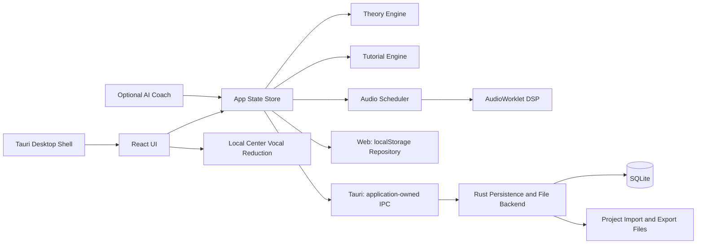

# 05. 技術アーキテクチャ

## 1. 推奨スタック

| 層 | MVP推奨 | 理由 | 代替 |
|---|---|---|---|
| Desktop Shell | Tauri 2 | 軽量、Rust連携、Windows/macOS対応 | Electron |
| UI | React 19 + TypeScript + Vite | AIコーディングで扱いやすい | Svelte, Vue |
| State | Zustand or Redux Toolkit | MIDI/編集状態を明示管理 | Jotai |
| Audio MVP | Web Audio API + AudioWorklet | MVPの音源/エフェクト実装が速い | Tone.js, Rust audio |
| Native Backend | Rust | Tauriとの親和性、ファイル/SQLite/レンダー処理 | Node sidecar |
| DB | SQLite | ローカル保存、移行管理、検索 | JSON only |
| Theory Engine | TypeScript package | UIと共有しやすい、単体テスト容易 | Rust crate |
| Rendering | Canvas 2D / WebGL | Piano Roll/Timelineに必要 | SVG |
| Test | Vitest + Playwright + Rust tests | ロジック/UI/Backendの分離検証 | Jest |

## 2. 構成案

```
compose-tutor-studio/
  apps/
    studio/                  # React + Vite renderer（Web/Tauri共通）
    desktop/                 # Tauri shell（UIを複製しない）
      src-tauri/
        src/
        capabilities/
        icons/
  packages/
    theory-engine/            # 音楽理論ロジック
    project-model/            # Project schema / validation
    midi-io/                  # MIDI import/export
    tutorial-engine/          # Lesson DSL / checker
    ui-kit/                   # 共通UI
  docs/
  tests/
```

## 3. アーキテクチャ図



## 4. パッケージ責務

### 4.1 theory-engine

責務:

- 音名とMIDI note変換
- スケール生成
- コード解析
- 度数判定
- コード機能判定
- 候補コード生成
- メロディ分析

非責務:

- UI描画
- 音声再生
- 保存形式

### 4.2 tutorial-engine

責務:

- Lesson DSL読み込み
- ユーザーイベントの受信
- Step達成判定と現在Project/UI状態の再照合
- Feedback生成
- 進捗保存用データ作成

Studio bridgeは採用済みProject参照を購読し、eventless編集、Undo/Redo、Project切替・読込をmicrotask単位でまとめて`TutorialEngine.reconcileProject`へ渡す。同期commit後のdomain AppEventを次stepへ再利用しない順序を保ち、lesson世代が変わった予約は無効化する。連続するstate-backed goalだけを最新状態で進め、最終stepの進捗を保存し、前stepのhintを消去する。

### 4.3 project-model

責務:

- Project schema定義
- Track/Clip/Note/Chord/Event型
- バージョン移行
- バリデーション

### 4.4 audio

責務:

- Transport
- Clock
- MIDI note scheduling
- Built-in synth/drum playback
- Basic effects
- Offline render
- Transient center-vocal reduction and PCM 16-bit WAV encode

## 5. データフロー

### 5.1 ノート追加

1. UIでノート追加
2. Storeで編集候補を作成
3. project-model/codecで保存可能な候補か検証
4. 検証成功時だけprojectへ採用し、Autosave queueへ追加
5. theory-engineで採用済みノートのスケール/コード関係を分析
6. 採用済みの値から `note.added` を発行し、tutorial-engineへ送信
7. Audio schedulerとUIに採用済みprojectを反映

対象なし、同値変更、検証拒否ではproject/history/revisionを変えず、教材イベントも発行しない。`note.moved`はpitchまたはstartが実際に変わった確定編集だけに使い、velocity/lengthだけの変更では発行しない。

Piano Rollの固定編集音域はMIDI 36〜84（C2〜C6）とする。現在clip内のこの音域にある全ノートを、水平viewport位置にかかわらずノートDOM・選択・Velocity Laneの共通入力集合にする。importされた音域外ノートはprojectとexportに保持するが、この集合には含めない。

### 5.1.1 Piano Roll gesture transaction

1. `pointerdown`で主ポインターID、対象clip、選択ノートの完全スナップショット、zoom/grid/scale設定を固定する
2. `pointermove`はReactのローカルプレビューだけを更新し、Store mutationを呼ばない
3. 複数移動は掴んだノートを基準に共通beat deltaとscale補正前の共通pitch deltaを算出し、グループ全体の開始・終了・音域境界でdeltaを制限する。Scale Snap有効時は最終音を個別にスケール内へ補正し、元の音程間隔維持よりスケール内化を優先する
4. 一致する`pointerup`で最終座標を再計算し、`commitNoteUpdates`または`duplicateNotesAt`を1回だけ呼ぶ
5. batch actionは全候補を先に検証し、1回のproject commitで履歴・revision・autosaveを進め、採用済み最終値のイベントだけを発行する
6. `pointercancel`、予期しない`lostpointercapture`、clip切替ではプレビューを捨てる。補償commitは行わない

Alt/Option複製は移動閾値と最終配置差分を満たすまで永続IDを作らない。ベロシティと長さだけの確定は`note.moved`を発行しない。

右端のダブルクリック追加は`clip.lengthBeats - durationBeats`を最大startとしてclampする。量子化の最近傍グリッドがこの最大startを越える場合は、その手前の最後の有効グリッドを採用し、batch全体を無効化しない。

キーボード編集も同じbatch actionを使う。非repeatのArrow/Shift+Arrow/PageUp/PageDownごとに候補を純粋計算し、`commitNoteUpdates`を最大1回呼ぶ。選択群の時間・音高・長さ・強さは共通deltaを境界内へ制限し、同値ならcommitしない。Scale Snapの上下移動は入力と同じ方向だけで次のスケール音を探索し、C2〜C6境界までに候補がなければ逆方向へ移動せずno-opにする。時間方向だけを要求した移動またはCmd/Ctrl+Dの共通beat deltaがclip境界で0になる場合は、Scale Snapによる音高差だけを生成せず、commit・ID生成とも行わない。Cmd/Ctrl+Aは現在clipの固定編集音域C2〜C6全体を水平viewport位置にかかわらず選択し、importされた音域外ノートは対象外とする。Cmd/Ctrl+Dは全配置検証後の`duplicateNotesAt`でIDを生成する。

`(any-pointer: coarse)`では、hybrid端末を含めてノートのpointer hit targetを最低24×24 CSS pxにする。固定編集音域内にノートがない空グリッドはpointer captureや`touch-action: none`でbrowser/WebViewのnative pan・scroll gestureを奪わない。Velocity Laneには固定編集音域内のノートだけを渡し、可視バーの値比例高を維持しながら透明な疑似要素だけを44px以上のhit領域にする。

ノートDOMは直接フォーカスするroving tabindex方式とし、常に固定編集音域内の実ノート1音だけを`tabIndex=0`にする。削除・複製後はpending focusをReact stateに保持し、ref mapで対象DOMを解決して`useLayoutEffect`で描画直後に次の音またはグリッドへフォーカスする。TransportのUndo/Redoボタンをクリックした場合、フォーカスはクリックしたボタンへ移り、Piano Rollはノートへ勝手に引き戻さない。無効になったroving IDだけを描画時に固定編集音域内の安全な音へフォールバックする。

### 5.2 コード変更

1. Chord Trackでコード変更
2. Chord parserで解析
3. 度数/機能/構成音を算出
4. Piano Roll overlay更新
5. Bass/Melody suggestions再計算
6. Lesson判定

### 5.3 MIDI import transaction

1. file sizeとSMF headerを検証し、Format 0 / 1をbounded parserで`ParsedMidiFile`へ変換する
2. noteを持つ`MTrk index × channel`を、MTrk index→channel昇順でgroup化する。noteのないconductor MTrkは除外する。parserの`hasExplicitName` provenanceを使い、非blankな明示FF 03名は`Track N`も保持し、欠落・blankで合成した名前だけをfile stem由来名へfallbackする
3. pitch / start / duration / velocityとtick 0のCC7 / CC10をProject候補へ写す。FF 59 key signatureもbounded IRへ収集するが、現在のtempo / 拍子map、そのcompatibility mirror、key / scaleは候補へ上書きせず、初期差と途中・複数変化を件数category付きwarningへ集約する
4. channel 9 groupは、全noteが対応GM 6 pitch、duration 0.25 beatと受け入れ先Projectのcompiled拍子map上の16 steps/bar位置からsource PPQで0.5 tick以内、lane / step重複なしを満たす時だけdrumへ変換する。可変拍子上でexactに表現できない音を近いstepへ移さず、1件でも条件を外れればgroup全体を元beat保持のinstrument noteへfallbackする
5. 全groupを既存Projectへ加えた単一候補を作り、project codecで1回だけvalidationする。成功した候補だけを`applyProjectChange`で1回commitする
6. commit成功後に限り、先頭の追加Track / Clipを選択し、Track種別に応じてPiano RollまたはDrum Editorへ移す。warningがあれば全件を返し、Project dialog内のresult cardを確認するまで自動dismissしない

parserはCPU / memory / event countを上限内に保ち、invalid UTF-8 fallback、duration 0、未完了Note On、孤立Note Offをraw event列ではなく種類別のbounded countとして返す。usable noteがある場合は該当eventを候補から除外してwarningを出し、usable noteがない場合は失敗にする。Program / Bank、marker、variable tempo / meter / key signature、初期key差、tick 0より後のchannel automation、C2〜C6外noteも明示的なwarning分類を持つ。

Project dialogはbrowser file readまたはnative picker / gateway開始からimport完了までbusy ownershipを持つ。`closeDisabled`で閉じるbutton / Escape / backdropを遮断し、dialog contentをdisabled fieldsetで包んでrename / tab / create / load / delete / importを同じ期間すべて停止する。resolve / rejectの`finally`で両lockを一括解放する。transaction開始時のproject ID / activationを固定し、file read / gateway例外、parse中のproject切替、codec拒否、Track上限を含むmapping拒否、commit拒否の全failure pathでMIDI transactionはProject / history / revision / autosave queue / selection / active viewを変更しない。UI errorは共通helperで曲・選択・表示が不変という保証をちょうど1回付ける。成功結果だけが`trackCount`、`noteCount`、全warningを返す。

drum Clipの表示小節数はdomain値を変更せず、Clip開始位置からcompiled拍子mapをたどって導出する。beat 0だけの固定mapでは`max(1, ceil(lengthBeats / beatsPerBar))`と一致する。cellは共通`drumStepToBeatOnTimeline`が返すbeatがclip終端未満の時だけ編集可能にし、partial final barの終端以降をdisabledにする。pattern適用も同じprojectorで全local barをたどり、clip外hitを生成しない。表示・pattern適用のためにClip lengthをpaddingしない。

高密度drum変換は`clipStartBeat + stepsPerBar`単位で`compileDrumStepProjector`を1回だけ作り、拍子境界のclip-local bar閾値を再利用する。compileは拍子map件数Mに対してO(M log M)以下、各step lookupはO(log M)以下とし、validation、schedule budget、ライブ/WAV event抽出、pattern適用、Drum Grid、MIDI入出力、Rust保存検証でeventごとのmap再走査を禁止する。validationはtempo / time-signature map、曲長、derived bar数の整合性を先に確定し、不正な外部入力ではprojectorをcompileしない。

### 5.4 MIDI export projection

- writerはStandard MIDI File Format 1を生成する。単一conductor MTrkにはtrack name、Projectのtempo / time signature map全event、chord開始tickのmarkerを置き、各instrument / drum Trackは独立MTrkへ出す。各mapの先頭eventはtick 0である
- 各part MTrkの最初のeventはtick 0のFF 21 MIDI Portとする。0-based melodic index `i`は`port=floor(i/15)`とchannel `[0..8, 10..15][i%15]`、0-based drum index `j`は`port=j`とchannel 9を使い、Project上限まで`port/channel` pairを一意に保つ。その後にtrack nameとCC7 / CC10をtick 0へ置く
- Projectの128 Track上限まで扱い、曲名・Track名・markerはUTF-8の実byte長4,096以下を必須とする。event budget、tick範囲、4,097 bytes以上のtextなどを検出した場合、部分的なSMFをcallerへ公開しない。MIDI note occurrenceの量子化可否を調べるallocation-free workもexport全体で累積し、event上限の半数を越える前に型付きで拒否する
- authored / realized note pitchは整数0〜127、note / drum velocityは整数1〜127、Track volumeは有限0〜2、panは有限-1〜1、drum laneは既知6種であることをwriter境界でも検証する。runtimeで壊れたProjectをclampせず、1件でも不正ならSMF全体を`invalid-project`として失敗にする
- chord realizationとport allocationの前に、Clip `trackId`と包含Track IDの一致、instrument↔MIDI / drum↔drum / audio↔audioの型対応、`notes` / `drumEvents` / `drum settings` / `audioAssetId`のpayload exclusivityを検証する。正しいautomation Clipとaudio Trackはlossy projectionとして許可するが、part MTrk / eventへ出力しない
- MIDI Clip noteはproject-modelの共通occurrence projectorを使う。`loop=true`では自然周期`max(start + duration)`、half-open clip終端、最終partial duration短縮をライブ/WAV/MIDIで共有する。MIDI writerは各occurrenceの絶対beatを個別にtickへ丸め、clip終端tickへ収まる正durationを表現できない断片を省略する。aliasはsource notesとinstance start / length / loopを組み合わせる
- part MTrkの全messageを組み立てた後、serialization前にNote Offを同tickのNote Onより先に並べる同じ規則でboundaryを走査する。channel/pitchがactiveな間の次Note OnはMIDI Note Offの対象instanceが曖昧なため`overlapping-note`でfail closedする。authored notesだけでなくlinked/loop occurrence、realized chord、drumを同じ検査へ通し、別part destinationとexact adjacencyは許可する
- MIDI codecの契約はnormalized projectionである。clip / loop / alias / preset / effects / mute / solo / groove / section / chord semanticsを含むProject集約のexact roundtripはproject-model codecと`.ctsproj.json`だけが担う
- drum MIDI writerはaudio occurrence resolverを呼ばず、保存済みstep / velocityを1回だけSMFへ写す。swing、probability、humanize、seed、mute / soloをbakeせず、drum `Clip.loop`も展開しない。このlossy境界はWAVおよびexactな`.ctsproj.json`と区別する

### 5.5 カラオケ作成transaction

1. browser `File`またはnative専用`file_open_audio` commandから、128 MiB以下のWAV / MP3 / M4A / AACを取得し、拡張子とcontainer構造、実byte長を検証する。native responseはbasenameとbytesだけで、絶対pathを含めない
2. containerのchannel metadataに加え、WAVのPCM / IEEE float32 frame数、MP3 / ADTS AACの宣言frame列とdecoder再同期候補、非fragmented AAC-LC M4Aのcodec設定・time-to-sample・sample count・chunk layout・`mdat` exact coverから、正規container時間とdecode allocation時間上限を分けて導出する。MP3は同一stream構成で前後に連続する再同期候補だけを数え、payload内の孤立したheader類似byte列による過大見積りを避ける。`AudioContext.decodeAudioData`前にbrowser presentation時間と正規container時間を300秒＋format / sample rate別のbounded codec padding以下、decode上限をcontainer＋2秒以下へ制限する。duration tableのないADTS AACはbrowser presentationの過大推定を許し、完全走査したframe列を正本にする。正規container / 再同期上限はdecode phaseと最大5分のoutput phaseを別々に積算した384 MiB working memoryへ使う。decode後に残ったcodec paddingだけはchannel dataのzero-copy prefix viewで300秒へ切り詰め、それ以外の超過、container内の時間・sample rate・sample数・offset不一致、ALAC / HE-AAC / fragmented MP4を拒否する。192 MiB output上限をdecode前後で検証し、左右差RMSが閾値未満のnear-monoはoutput allocation前に拒否する
3. chunk単位でMid / Sideへ変換し、presetの中央軽減率を適用する。2次Butterworth low-passで中央低域を保護し、peak超過時だけ全体を減衰する
4. chunk単位でPCM 16-bit WAVへencodeし、phase / progressをUIへ返す。各chunk間でevent loopへyieldし、AbortSignal / generation不一致なら一時結果を破棄する。Abort APIを持たない音源確認用Blob readと、decode用Blob read + `decodeAudioData`は別々のapp-scoped single-flight leaseで実settleまで追跡し、dialogを閉じた後の並行read / decodeとmemory budget迂回を禁止する
5. 元音源と生成WAVのobject URLをA/B previewで共有位置へ同期し、nativeは既存のatomic WAV export、Webはdownloadを使って`<source>_karaoke.wav`を保存する

このtransactionはtool-local stateだけを所有し、Project Store、history、revision、autosave、repositoryへdispatchしない。source変更、cancel、dialog unmountの全経路で世代を無効化し、追跡中のdecode jobがsettleした時点でobject URL、AudioBuffer、生成bytesへの参照を解放する。network APIは呼ばず、ML stem separationとは別機能である。

### 5.6 鼻歌transcription transaction

1. Vocal-cutと同じstrict source parser / native basename+bytes gatewayを使い、32 MiB、60秒、mono / stereo、256 MiB working memoryへ狭めてpreflightする
2. decode後PCMを非破壊で検証し、極性整合mix、anti-alias low-pass、8 kHz resample、50〜1,000 Hz pitch frame解析をchunked async pipelineで実行する。全sampleの有限性とPCM byte上限は解析signal確保前に検査する
3. pitch frameを無声区間、中央値、semitone hysteresisで単音note候補へまとめる。強い第2倍音はfundamental energyと倍周期scoreを併用してoctave候補を補正する
4. 候補修正、除外、target Clip、quantizeはReact local stateに保持する。確定時だけseconds→beats mappingとproject validationを行い、`replaceClipNotes`の単一changeで全notesを採用する

decode / analysis失敗、cancel、0件、512件超、mapping / commit拒否ではProject fingerprintを変えない。schema v3ではcompiled tempo mapの共通seconds↔beat resolverを使い、beat 0だけの固定mapも同じ経路で従来と同じ結果にする。

### 5.7 Track管理transaction（Batch 3部分）

1. UIはcommand引数だけを組み立て、追加・複製・改名・並べ替え・削除・preset変更の候補Projectをdomain actionで作る。production追加はinstrument / drumに限定し、0..project song endの空Clipを1つ持たせて先頭Master直前へ挿入する。Audio / Busの追加commandはAsset / routing完成まで公開しない
2. 複製はTrack ID、Clip ID、Note / DrumEvent ID、Effect IDをすべて新規発行し、先に作ったTrack内Clip ID mapで`aliasOf`を複製先へ張り替える。Master対象、外部Trackへのalias、dangling / chainを候補生成段階で拒否し、codec検証も省略しない
3. 改名はReact local draftで保持し、確定時だけtrimした値を渡す。schema v3では`Track.role`を教材 / 伴奏の正本にし、名前にかかわらず改名を許可してroleを保持する。学習role Trackの削除はdomain境界で保護し、一般Trackが予約名を使ってもroleを推測しない。複製先は`general`へ戻す
4. synth preset actionは`listSynthPresets()`が返すcanonical 4 keyだけを受理する。既存aliasの表示解決とProjectへの書換えを分離し、利用者の確定操作なしにlegacy値をmigrationしない
5. `commitProject`は候補全体をcanonical encode / validationし、採用時だけhistory、revision、autosaveとselection reconciliationを1回進める。128 Trackまたはcodec上限超過、stale ID、Master / 学習role保護、invalid name / preset、no-opではProject参照と全付随stateを変えない
6. playback schedule、AutomationLane、TrackGraphはsession開始時snapshotであるため、採用されたTrack / Clip構造、semantic role、tempo / 拍子map、曲長、preset、automation lane変更をcommit境界で停止し、有限な現在playheadを保持する。AutomationLaneが1件以上ある時のmixer / effect変更も停止する。次のplayが新snapshotからclock / topology / voice / AudioParam commandを再構築する。改名、mixerに無関係なevent編集、拒否、no-opでは予約済みautomationへ触れずsessionを停止しない

Track管理はschema v3 aggregate codecを正本にし、Undo/Redo、SQLite autosave、`.ctsproj.json`へroleを含めて保存する。Audio / Busのproduction追加は、metadata型の有無ではなく実binary asset / playback / routing境界が未完成であるため公開しない。

### 5.8 Project schema v3 aggregate boundary

- current schemaは3。v1のinert `aliasOf`を音を変えず除去するv1→v2と、role / musical-time map / AudioAsset metadata / AutomationLaneを加えるv2→v3を順にpure migrationする。
- `lengthBeats`、`tempoMap`、`timeSignatureMap`を時間の正本にし、`bpm` / `timeSignature` / `lengthBars`は旧consumer用mirrorとして検証する。project-modelはcompiled immutable indexからbeat↔seconds、bar↔beatを変換する。
- v2→v3は保存順で最初の正規化済みChord / Chords / コード、Bass、Melody instrument Trackだけを学習roleへ移す。TypeScriptとRustはECMAScript `String#trim`相当（BOMを含みNEXT LINEを含まない）を共有する。legacy audio参照は決定的な`unresolved` AudioAssetへ保持し、raw object全体の既存IDと衝突しないmigration IDを使う。
- AutomationLaneはnon-Master Trackのvolume / panだけを対象にし、point前はTrack scalar、point間はhold / linearで評価する。lookahead windowはhalf-openを保つが、曲末の最終windowだけexact end pointを含め、release / insert tailへ終値を維持する。beat-linearなlinear区間はtempo change beatごとに補間値commandへ分割し、seconds-linearなWeb Audio `linearRampToValueAtTime`と同じ曲線にする。同じbeatのlane point / tempo change / window endは1 commandへ決定的にまとめ、loop境界だけは前cycleの終値と次cycleのhold resetをこの順で残す。ライブとoffline WAVは同じcommand plannerとProject snapshotのtempo change列を使い、Master targetはTypeScript / Rust両境界で拒否する。
- `ready` AudioAssetはchecksumとdecode前metadata、Audio Clipはasset IDとframe単位のsource range / fade / gainを持つ。AutomationLaneはTrack volume / pan target、point、hold / linear補間を持ち、同じcommand resolverをlive schedulerとoffline WAVへ接続する。
- TypeScript codecとRust native persistence境界はcanonical schema v3 JSONを同じrequired-field / unknown-field / domain条件で受理・migrationする。nativeが扱うのは現在metadata snapshotまでである。

この境界は実音声binaryを保存・再生する機能ではない。application-owned assets directory、checksum検証付きfile transactionとProject JSON commitのrollback、Audio Clipのproduction配置・再生・trim / gain / fadeは次Batchで実装する。Automationはlive/offline schedulingまで実装済みだが、productionのlane editorとwrite/read UIは後続である。

## 6. Audio実装方針

### 6.1 MVP

- Web Audio APIのAudioContextを使用
- ステレオ中央定位ボーカル軽減はrenderer内のchunked pure DSPで行い、入力音源と結果を外部送信しない
- AudioWorkletで簡易シンセ/ドラムサンプラー/エフェクトを処理
- サンプルはライセンスクリアな最小セットのみ同梱
- 正確なスケジューリングは lookahead scheduler で実装
- transportは`stopped / starting / playing`を分離し、単調なrequest IDで非同期開始の世代を識別する。`playing`とチュートリアルの`transport.played`は、AudioContextが`running`かつscheduler開始済みの一致世代だけ確定する
- scheduler、track/effect graph、voice、メトロノームclick、position timerは1つの再生sessionが所有する。停止・失敗・中断は同じsessionを一括破棄する。自然終了だけはtransport-owned controlを先に止め、controllerが1つだけ所有するdraining sessionへgraphを一時移管する。古いPromiseやcallbackは現世代を変更できない
- 各Synth voiceは全oscillator、layer gain、filter、最終gainを、各Drum subvoiceはsourceと専用filter / gainを排他的に所有する。全sourceの`ended`後にhandlerを解除して各nodeをexactly onceでdisconnectし、共有Track input / noise buffer / Masterは切断しない。停止・中断・render失敗ではmanager `dispose`が`ended`を待たず同期解放し、以後のstale triggerを無視する
- Synthの同時発音queueと未解放voice集合は分離する。未来のschedule時刻によるqueueのreapはnodeを切断せず、実AudioContext時刻がsource stopを越えた場合だけ未配信`ended`のfallback cleanupを行う。これにより`currentTime=0`で全曲を先行予約するOfflineAudioContextを途中で無音化しない
- voice / subvoice生成はsource作成直後からtransactionとして所有し、途中のallocation / connect / start / stop失敗では同じnote / hitの全branchをrollbackする。初回schedule失敗は起動errorとして返し、interval中の失敗はschedulerを先に停止して1回だけsession interruptionへ渡すため、同じwindowを再試行しない
- Synthのvoice stealは既存の早いsource stopを遅いstopで置換せず、`cancelAndHoldAtTime`で予約済みADSR値を保持してから短くfadeする。未対応実装では保存したADSR curveから同時刻の値を補間し、`AudioParam.value`を未来時刻の正本にしない
- AudioContextの生成とmaster graph公開はトランザクション化し、`resume()`はsingle-flightとする。`suspended / interrupted / closed`は再生中断としてUIへ戻し、次のユーザー操作で安全に再試行する

### 6.1.1 Master / fader契約

- MVPで有効なMasterパラメータは`volume`だけとし、有限値を0.0〜2.0へ制限する。Master trackが複数あるprojectでは`project.tracks`配列の先頭にあるMasterだけを有効とし、後続Masterは音声へ影響させない。Master trackがないlegacy projectは1.0、`NaN` / `Infinity`など有効Masterの非有限値はfail-silentの0として解決する
- Masterの`pan` / `mute` / `solo`はschema互換用に保持しても音声処理へ接続せず、MVP UIにも公開しない
- ライブ再生とOfflineAudioContextによるWAV renderが共有する可聴処理topologyは、Track出力→Master gain→limiterだけとする。ライブだけがメトロノームをMaster入力へ加え、Master gain直後へpost-fader UI meterを接続する。offline WAVにはメトロノームclickとUI meter / analyserを作らず、両経路は同じMaster gain resolverを使って別経路でgainを重ねない
- graph初期化時とoffline renderでは、Trackのmute / solo、各Track volumeおよび有効Master volumeをsample 0から確定gainへ設定し、既定gain 1.0の漏れを許さない。10ms平滑化は、再生中にTrack volume / mute / soloまたは有効Master volumeを更新した時だけ使う

### 6.1.2 Live meter ownership / offline export

- per-track UI analyserとmeter registry entryはlive TrackGraph / accepted sessionが所有し、live TrackGraph構築時に登録する。構築が途中で失敗した時とgraph破棄時は、registryが同じanalyser identityを保持している場合だけcleanupする。古いgraphのcleanupは後から登録されたentryを削除しない
- Master UI analyserとmeter registry entryはsessionではなく、live AudioEngineのmaster bus / sourceとそのAudioContextが所有する。同じmaster sourceを使うaccepted session間では同一analyser / entryを再利用し、accepted sessionの置換だけでは削除しない。master source / contextの退役時に、registryが同じanalyser identityを保持する場合だけ削除する
- offline WAVはTrack→Master→limiterの可聴処理topologyを共有するが、per-track / MasterいずれのUI analyserやmeter registry entryも作成・登録・置換・削除しない。成功・失敗を問わずlive analyserのidentity、meter更新、transport state、再生sessionを変更しない
- 各offline renderは独立したSynth / Drum manager、TrackGraph、Master gain、limiterを所有し、WAV生成成功時も、render / encodeが失敗した時も、voice manager→TrackGraph→Masterの同じcleanup境界で全nodeと参照を一度だけ解放する

### 6.1.3 Shared drum realization plan

- Project flattenerは各raw drum eventのpayloadへ`trackId / clipId / eventId / lane / velocity / sourceStepIndex / clipEndBeat / stepsPerBar / beatsPerBar / probability / swing / humanizeVelocity / seed`を格納する。これらは再生開始時のProject snapshotだけから導出し、選択中clipやDrum Editor mountを介するmodule-global runtimeを正本にしない
- `probability`はDrumEvent値を優先し、未指定ならclip groove値、さらに未指定なら1を使う。`swing`とprobabilityは0〜1、`humanizeVelocity`は整数0〜127、seedは正のsafe integerとして解決する
- ライブschedulerとoffline WAV builderは同じ純粋な`resolveDrumOccurrence`境界を使う。swingは`sourceStepIndex`のclip-local parityから計算し、同時刻・同laneでも独立させるため、決定的saltへTrack / Clip / DrumEvent identityを含める。transport反復ではunwrapped `playheadBeat`もsaltへ含め、passごとに変化し得るが同じ開始条件では同じsequenceを返す
- resolverは`cts-drum-voice-v1` domain、保存済みseed、Track / Clip / DrumEvent identity、lane、source step、1e-6 beatへ丸めたunwrapped raw occurrenceから32-bit `voiceSeed`を作り、resolved payloadへだけ付与する。raw Project scheduleと永続schemaは`voiceSeed`を正本にせず、legacy payloadにも固定domainから決定的fallbackを補う
- drum sourceはversioned固定seed LCGで同じsample rateのnoise PCMを作る。`voiceSeed`とsubvoice saltを32-bit mixし、noise buffer末尾0.4秒を保護する整数sample-frame offsetへ変換する。clapの3 burstは個別saltを持ち、発音順に依存するPRNG stateを共有しない。全subvoice gainはsource stopと同じAudioParam時刻で明示的に0へ落とし、非決定なmain-thread `ended` callbackのdisconnectがfilter tailへ影響しないようにする。ライブsession / offline renderはAudioContextごとにbufferを遅延1回生成し、複数drum Trackへ共有する
- raw eventの`event.beat`に対して、反復後のclip終端は`clipEndBeat + (playheadBeat - event.beat)`で平行移動する。resolved onsetがこの終端以上ならdropし、partial clipやproject末尾のWAV tailへclip外hitを漏らさない
- MIDI Clip noteのschedule生成は、保存notesを直接1回だけ平坦化せず、project-modelのbounded visitorを使う。loop展開件数を`O(保存note数)`で飽和計数し、全体・密度preflight成功後だけoccurrenceを生成する。小数周期はscale-awareなhalf-open比較でclip終端上のghost onsetを除外する
- 再生開始時にraw scheduleをsnapshotし、各eventの`raw beat + deterministic swing delay`と元配列ordinalをimmutable beat indexへ1回だけ格納する。no-loop windowは実効onsetの2回のlower-boundと該当range走査だけを行い、resolver後の厳密なhalf-open guardを正本にする。これにより、前windowのraw位置から遅延したswing hitを1回だけ拾い、範囲外eventへのhash / PRNG / object生成を避ける
- transport loop indexは実効onsetをloop phaseへ正規化し、swingが越えた周期数を`passShift`として保持する。各unwrapped cycleで交差するphase rangeだけを二分探索し、浮動小数点のcycle-offset減算に対して検索境界だけを数ULP広げ、最終resolverで厳密に絞る。同一onsetは元ordinal順、`DueEvent.beat`はsource beatのままにする。現行のdrum `Clip.loop`自体はこのplanで反復展開しない。transport loopを有効化した時は、0..0、逆転、非有限など無効なboundsを`0..projectLengthBeats`へfallbackし、有限なboundsは曲内へclampする。starting / playing中のtoggleは新request generationへ移り、旧sessionをdisposeする

### 6.1.4 Shared resolved-event audio tail plan

- `planAudioTail(Project snapshot, resolvedEvents, startBeat, endBeat, sampleRate)`はライブ自然終了とWAV allocationの共通pure boundaryである。raw drum eventを再解決せず、すでにprobability / swing / range filterを適用した可聴occurrenceだけからTrack別の最終source endを求める。WAVは44,100Hz、ライブは実AudioContextのsample rateを渡す。WAVはsnapshotのmute / soloを正本とし、ライブはsession中に一度でもgraphへ入力したTrackを保守的に可聴扱いにする
- instrument source endは`onset + max(noteDurationSeconds, attack + decay) + release + 0.02s oscillator stop pad`とする。drum source stopはKick 0.35s、Snare 0.25s、Closed Hat 0.095s、Open Hat 0.37s、Clap 0.144s、Perc 0.28sをlaneごとに使う。runtime voiceとplannerは、各subvoice stopからlane最長寿命を導出する同じimmutable `voiceTiming`定数を参照し、可聴resolved eventが0件ならenabled effectsがあってもtail / fadeを作らない
- enabledなDelayはwet echoの振幅が0.001（-60 dB）以上である最後のechoまで含め、浮動小数点誤差があるexact thresholdも含める。enabledなReverbはruntime impulseと共有する固定peak 0.35、wet gain、squared decay envelopeの上限が同じthresholdへ達するまでを解析的に見積もる。連続insertのimpulse tailは保守的に加算する
- enabledなFilter / EQはruntime nodeへ設定する同じtype / frequency / Q / gainを共有resolverから得る。Web Audio 1.1のbiquad係数から最大pole半径を求め、36dBのstate headroomが振幅0.001へ減衰するframe数を算出する。neutral 0dB EQ stageは0、無効・非有限・不安定なstageは最大2秒でfail-closedし、Filter 1段とEQ 3段をinsert順に加算する。synth内部filterは後段ADSR Gainが0になるため別tailを加えない
- Web Audio 1.1 `DynamicsCompressorNode`は内部の固定0.006秒DelayNodeによるtail-timeを持つ。enabledなinsert Compressorはstageごとに6msを直列加算し、常設Master limiterの6msはTrack統合後に1回だけ加える
- source endとinsert tail、Master limiterから曲本体を超える`uncappedTailSeconds`を求め、0より大きい時だけ`50ms fade + 6ms limiter`以上を確保する。製品安全上の40秒hard capはlimiter込み出力へ適用する。WAVはTrack effects後のrender-owned output bus、liveはdrain generationだけがautomationを所有するengine Master gainを使い、`fadeEndSeconds = totalSeconds - 0.006`でfadeを終えてからlimiter outputだけをcleanup deadlineまで保持する。これはPCM silence scanではなく解析的な上限である
- WAVは`ceil(totalSeconds * 44,100)`の動的frame数と、`frames * 2ch * (Float32 4 bytes + PCM16 2 bytes)`の推定memoryを先に計算する。曲本体は最大300秒、tail込み推定memoryは192 MiB以下を必須とし、OfflineAudioContextより前に拒否する。300秒の曲本体と40秒tailはこのbudget内である
- schedule生成前の共通preflightはchecked/saturating加算を使う。`resolved-stored` projectionはlinked正本の保存payloadをinstanceごとに数え、MIDI Clip loopの派生音を増やさない。`audible` projectionは各MIDI instanceのloop展開後Note、linked Drum payload、派生Chord noteを数える。ライブは全体20,000件、全曲のnodeを一括所有するWAVは10,000件を上限とし、両者ともMIDI loop展開後・drum swing解決後onsetの任意0.75拍rolling windowを256件以下にする。transport loopはindex構築後・per-track Web Audio graph構築前に、完全周期数×phase件数と余り区間のcircular two-pointer scanからsteady-state最大密度を展開せず求め、同じ256件上限を適用する。超過は型付きに失敗し、UIはノート・ドラム・連動コピーを減らす案内を出す。WAVはOfflineAudioContextと部分fileを作らない
- Project走査から得るraw scheduleの順序は正本としない。ライブは各due windowを時刻順に処理し、WAVは確率・swing解決後の全eventをonset昇順でstable sortしてからvoiceを割り当てる。同一onsetの元順序を保ち、後位置の正本が先に格納されたlinked Clipや未整列Noteでも、未来のvoiceを先にsteal / stopしない
- live schedulerは開始時にindexを`O(N log N)`で1回構築し、no-loop tickを`O(log N + D)`、loop tickを`O(C log M + D)`で処理する（Dは候補件数、Cは交差周期数、Mはloop内event数）。20,000件fixtureの0.6拍×1,707 queryで候補走査合計20,000、lower-bound比較54,624以下を決定論的gateとし、production Chromiumでも100 linked instance由来20,000 eventの開始・位置更新・停止応答を検査する。上限引き上げには主要WebViewのCPU / GC / audio-dropout benchmarkを別途必須とする
- timer throttling、main-thread stall、端末sleep復帰で現在playheadがschedule frontierを追い越した場合、過去時刻の未schedule note / drum / metronomeを現在へ再演せずdropし、`max(frontier, current playhead)..lookahead horizon`だけを再開する。non-loopで曲末を飛び越えた時はmissed eventを鳴らさず、通常の1回だけの`onEnd`へ進む
- MIDI `Clip.loop`はschedule生成時にすでに共通note occurrenceへ展開され、このtail planは受け取った展開後durationを使う。drum `Clip.loop`は別の未展開契約である。同じapp build・同じWeb Audio engine/version・同じsample rateでは固定noise/offsetを含む同一Projectの再WAVを全bytes一致とするが、browser / OS / WebView / sample rateをまたぐWeb Audio DSPのbit identityは保証しない

### 6.1.5 Live natural-drain / play-at-end ownership

- non-loop schedulerの`onEnd`ではstoreをただちに`stopped`、`isPlaying=false`、`positionBeat=0`へ進める。同時にscheduler、position timer、metronome clickを停止するが、TrackGraph、voice、Master busとpost-fader Master analyserは、絶対project-end時刻にtail秒を加えたdeadlineまで接続したままにする。transport loop schedulerはwrap時に`onEnd`を持たず、drainを開始しない
- `PlaybackController`はactive sessionをちょうど1つのdraining slotへ移し、同期的な`finish()`が発生させるreentrant `stopped`通知をgenerationと1回限りのguardで識別する。drain完了callbackはslot identityが一致する場合だけdisposeし、古いcallbackはreplacement sessionへ作用しない
- drain末尾fadeは共有Master fader値を上書きせず、absolute cleanup deadlineの6ms前をfade endとしてautomationする。callbackがfade endより遅れた場合はMasterを即時0にし、cleanup deadlineより遅れた場合はtimerなしで完了する。いずれも現在時刻からtailを延長しない。新しい再生、手動停止、Project activation、context interruption、controller / bridge disposeはtimerとgraphを即時破棄し、pending fadeをcancelして現在ProjectのMaster gainを即時復元する
- 停止状態からの`play()`は、拍子分母を含む`projectLengthBeats`に対し現在位置が有限かつ`0 <= positionBeat < songEnd`なら保持し、負値、非有限、曲末以上、または利用不能な曲長では0へ正規化する。位置補正、`starting`への遷移、request ID増加、audio issue解除を1つのstore更新で行い、loop bounds、Project identity、history、save stateは変更しない。曲末startが失敗しても、次のplayは新generationで再び0から開始できる

### 6.2 v1以降

- Rust native audio engine検証
- CPAL等で低レイヤーI/O検証
- JUCE採用の比較検討
- プラグインホストはクラッシュ分離・ライセンス・署名が課題

## 7. 保存形式

### 7.1 現在の実装

- Project schemaのcurrent versionは3。v1の`aliasOf`はruntime上の意味を持たず各Clip自身のpayloadが再生されていたため、v1→v2 migrationでは`aliasOf`だけを削除して独立Clipとして保持する。v2→v3はrole、tempo/signature map、AudioAsset / Automation metadataを決定的に加え、固定tempoの音とlegacy audio参照を失わない。TypeScript codecとRust native metadata境界は`v1 → v2 → v3`を順に適用し、canonical v3を保存する。
- schema v3では`lengthBeats`とtempo / 拍子mapが正本で、`bpm` / `timeSignature` / `lengthBars`は検証対象のcompatibility mirrorである。Track roleは名前から独立した正本、AudioAssetは`ready` / `unresolved`のmetadata union、Automationはvolume / pan targetとpoint / interpolationを持つ。
- linked Clipのconsumerは共有`resolveClipContent`を使い、instanceのID / start / length / loopとsourceのnotes / drum payloadを合成する。編集はsourceへ、ライブ/WAV/MIDIの配置とdrum乱数identityはinstanceへ帰属させる。
- codec / Rust保存境界は、非Master Clipの保存済みNote / DrumEventをlinked instance解決後に数える`resolved-stored` projectionを200,000件以下に制限する。これは従来の200,000 raw-item envelopeを狭めない互換上限であり、v1はinertな`aliasOf`を辿らず各Clip自身のpayloadを数え、派生Chord noteは含めない。複製候補もcommit前に同じ上限を検査する。

- Web版とTauri版は同じ`ProjectRepository`境界を使う。
- Web版はlocalStorage repository。generation/head/recovery journalとWeb Locksで破損・競合時にfail closedする。
- Tauri版はRust所有のSQLite repository。`BEGIN IMMEDIATE`、stable operation ID、expected-head CAS、immutable canonical JSON generation、sticky tombstone、最低3 canonical世代で保存する。通常保存の2秒idle debounceとは別に、受理した最新revisionを即時のcrash draft transactionへstageする。
- crash draft receiptはSQLiteの`WAL` + `synchronous=FULL` transactionがcommitし、project/activation/revision/write IDとpayload bytesをrendererが照合した後だけ「保護済み」と表示する。起動時は因果関係が単一ならcanonical headへ復旧し、比較不能または複数activationなら`interrupted-save` branchとして全候補を残す。
- native pagehideはSQLite headを同期更新せず、WebView localStorageの専用emergency journalへ退避する。次回起動時に単一の因果候補だけをSQLiteへ再生し、比較不能なactivationは全て分岐として残す。
- async flushはcanonical保存後の一覧`list()` IPCを待った後、最新のactivation / revision / persistedRevision / coordinator dirty状態を再検証する。その待機中に次の編集が入った古いflushは成功を返さず、native closeは最新snapshotの検証済み同期recovery receiptを得た場合だけ終了へ進む。recoveryはcanonical `clean`とは区別したまま保護revisionを更新する。
- native closeは最初の非同期処理より前にStoreのproject mutation fenceを取得する。可逆なauthorization / flush / recovery失敗ではfenceとlifecycle ownershipを解放し、限定close command dispatch後は応答不明でも解放しない。
- repository初期化失敗は失敗したsingle-flight Promiseだけを解除し、保存の「再試行」から同一processで初期化を再実行する。失敗中にrevision 1以上の編集が作られた場合、再初期化で古い保存projectをactiveへ上書きせず、現在snapshotを保存して既存projectも保持する。
- 旧localStorageはexact raw snapshotをSQLiteへ先にbackupし、候補をstagingした後、source再検証と単一transactionで公開する。移行元bytesは自動削除しない。

### 7.2 デスクトップ永続化

MVPの正本はapp data directory内の`projects-v1.sqlite3`。Project集約はUI都合の正規化tableへ分解せず、`project-model` codecが生成したversioned canonical JSON snapshotとして保持する。ユーザーが持ち運ぶ交換形式は、codecで再検証する単一の`.ctsproj.json`ファイルであり、正本DBそのものやOS pathはrendererへ公開しない。

schema v3のAudioAsset metadataとAudio Clip frame payloadはcanonical JSONへ保存できるが、音声binaryはまだProject transactionの対象ではない。次Batchでapplication-owned assets directory、checksum検証、staging / atomic move / rollback / orphan recoveryをSQLite snapshot commitと組み合わせる。Audio Clipの実再生・配置・非破壊編集も同Batchの未実装範囲である。下記のper-song bundle案は未実装であり、現行の入出力形式ではない。

```text
MySong.ctsproj/       # future proposal
  project.sqlite
  assets/
  exports/
  metadata.json
```

### 7.3 互換性

- `schema_version` を持つ
- migrationを `src-tauri/migrations` に保存
- 新バージョンで開いた後も、必要なら旧形式エクスポートを提供

## 8. AI接続

### 8.1 AI Coachに送るデータ

デフォルト送信可能:

- BPM、キー、拍子
- コード進行
- MIDIノートの抽象情報
- ユーザー質問

デフォルト送信しない:

- 音声ファイル
- プロジェクト全体
- 個人名/パス情報
- 未公開作品の生音源

### 8.2 プロンプト方針

- 既存曲に似せる依頼は避ける
- 提案には理由を付ける
- 初心者モードでは専門用語を段階的に出す
- 出力はJSON schemaで受け、UI側で表示

## 9. セキュリティ

- production capabilityは`main`だけを明示選択し、application-owned persistence/file/close commands、端末全消去に必要なWebView browsing-data cleanup、close-event listen/unlistenだけを許可する。汎用fs/dialog/shell/opener権限は与えない
- `withGlobalTauri: false`、asset protocol無効、unused Tauri commands削除
- bundled originと固定Vite開発origin以外へのnavigation、新規WebViewをRustで拒否
- production CSPからlocalhost WebSocketを除外し、Vite HMRだけdev CSPで許可
- protected tag preflightはproduction / development security object、`main` capability全件、window / build / package identity、root / Studio / Desktopの全scripts・build tool依存・pnpm overrides、内部package manifest / export、Tauri bundle全体をexact allowlistで固定する。production commandはpackage名filterではなくworkspace実pathを使う。isolation patternを含む未知security key、重複workspace package、platform Tauri override / repository Cargo config、npmrc / pnpmfile、Studioからrepo rootまでにある自動探索PostCSS configを禁止し、`pnpm-workspace.yaml` / `pnpm-lock.yaml` / `vite.config.ts` / `build.rs`はregular fileかつ改行正規化SHA-256一致、`public/`はexact `_redirects`だけを許可する。依存installはlifecycle scriptを無効化し、各署名OS jobがsecret読込前にclean worktreeとrelease policyを再検証する
- 依存install後のrelease policy testは正規TOML parse結果からCargoのfeature・dependency・target・build targetをexact比較し、Studio / packagesのTS/JS source graph、relative import / export / require / dynamic importのroot境界、Vite config、単一source entry、Rustのsource graph / FFI / network APIを実repository上で検査する。`fetch` / XHR / WebSocket / EventSource / beacon / WebRTC / WebTransport / Worker、HTTP/STUN/TURN、protocol-relative URL / meta refresh、未許可Cargo target、source-root外`#[path]` / `include!`を拒否する
- Vite build直後は最終`dist`を明示的な`production` / `e2e` profileで再検査する。productionはHTMLを`index.html`と`index-<hash>.js`の1組だけ、E2Eは`index.html` / fatal fixtureと`app-<hash>.js` / `fatal-boundary-<hash>.js`の2組だけに限定し、参照entryの実在、exact `_redirects`、許可済みCSS / HTML / JS以外の出力、symlink / size境界、RTC・socket系primitive、protocol-relative / 未許可remote URLを検査する。通常Web build、Desktop smoke / bundle、3OS CI、signed macOS / Windows / Linux buildの各platform-specific出力で実行する
- bundle identifier `com.composetutor.studio` と `useHttpsScheme: true` はpackage/app data/origin互換性のため初回release前から固定
- 任意ファイルアクセスを制限
- 外部URL通信は明示的な設定時のみ
- LLM APIキーはOS Keychain相当へ保存
- プロジェクト内スクリプト実行は原則しない

## 10. CI/CD

- Web: typecheck、unit/integration、production build、Playwright Chromium E2E
- Desktop 3OS: rustfmt、clippy `-D warnings`、Rust test、unsigned production bundle（Linux AppImage / macOS app / Windows NSIS）build
- Desktop 3OS: test専用embedded WebDriverによる実WebView smoke
- Supply chain: pnpm audit、Linux RustSec audit、npm/Cargo/GitHub Actionsのweekly Dependabot更新
- Linux release: GStreamerを含むAppImageをbundleし、生成物の起動・音声smokeをrelease workflowで検証する
- stableなaggregate `test` jobだけをbranch protection/auto-mergeのrequired statusにする
- native-testは別target directoryへ生成し、production artifact pathを上書きしない
- schema migration test
- PR: OS/CPU別production executable size上限
- signed release: installer/package size上限

## 11. 技術的な未確定点

| 項目 | 状態 | 確認方法 |
|---|---|---|
| Web Audioのみで十分な遅延か | 要検証 | 主要OS/ブラウザWebViewで実測 |
| Tauri WebViewのWeb Audio差異 | macOS基本transport確認済み | Windows WebView2/Linux WebKitGTKは3OS CI、音質は実機release checklist |
| Drum event planのlive/WAV parity | 共通resolver実装済み | multi-clip、UI未mount、partial clip、loop occurrenceの回帰テスト |
| Drum PCM bit決定性 | source決定性・pinned Chromium再WAV全bytes一致を実装済み | 同一build/engine/sample rateの回帰E2Eを維持し、cross-engineは音響比較基準を別途定義 |
| Drum `Clip.loop` | 未展開 | drum pattern periodを仕様化してlive / WAV / MIDIの期待回数をE2E検証 |
| Transport loop generation | 全曲fallbackとactive restart実装済み | 0..0、song end、6/8、starting / playing切替、旧session cleanupを回帰テスト |
| Natural tail analytic ceiling | source/Filter/EQ/Delay/Reverb/Compressor/Master limiter共通plan・40秒cap実装済み | Chromium実DSPで80Hz/Q18 ringingが解析上限内、Compressorが6msである回帰を維持し、他engineでも測定 |
| Web Audio PCM bit identity | 未保証 | source PRNGのseed化とは別に、browser / WebView engine差を許容する音響比較基準を定義 |
| VST3 host | 将来検証 | SDKライセンス、クラッシュ分離、サンドボックス調査 |
| Stem separation | 将来検証 | ローカル/クラウドモデルの速度・品質・権利評価 |

デスクトップシェル、test隔離、署名前条件の詳細は`docs/12_desktop_shell.md`を参照する。
