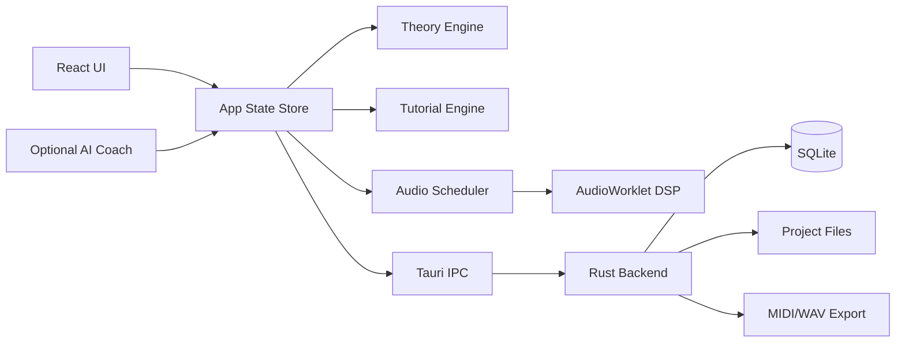

# 05. 技術アーキテクチャ

## 1. 推奨スタック

| 層 | MVP推奨 | 理由 | 代替 |
|---|---|---|---|
| Desktop Shell | Tauri 2 | 軽量、Rust連携、Windows/macOS対応 | Electron |
| UI | React 19 + TypeScript + Vite | AIコーディングで扱いやすい | Svelte, Vue |
| State | Zustand or Redux Toolkit | MIDI/編集状態を明示管理 | Jotai |
| Audio MVP | Web Audio API + AudioWorklet | MVPの音源/エフェクト実装が速い | Tone.js, Rust audio |
| Native Backend | Rust | Tauriとの親和性、ファイル/SQLite/レンダー処理 | Node sidecar |
| DB | SQLite | ローカル保存、移行管理、検索 | JSON only |
| Theory Engine | TypeScript package | UIと共有しやすい、単体テスト容易 | Rust crate |
| Rendering | Canvas 2D / WebGL | Piano Roll/Timelineに必要 | SVG |
| Test | Vitest + Playwright + Rust tests | ロジック/UI/Backendの分離検証 | Jest |

## 2. 構成案

```
compose-tutor-studio/
  apps/
    desktop/                 # Tauri + React
      src/
        app/
        features/
        components/
        audio/
        editor/
        learning/
        theory/
      src-tauri/
        src/
        migrations/
  packages/
    theory-engine/            # 音楽理論ロジック
    project-model/            # Project schema / validation
    midi-io/                  # MIDI import/export
    tutorial-engine/          # Lesson DSL / checker
    ui-kit/                   # 共通UI
  docs/
  tests/
```

## 3. アーキテクチャ図



## 4. パッケージ責務

### 4.1 theory-engine

責務:

- 音名とMIDI note変換
- スケール生成
- コード解析
- 度数判定
- コード機能判定
- 候補コード生成
- メロディ分析

非責務:

- UI描画
- 音声再生
- 保存形式

### 4.2 tutorial-engine

責務:

- Lesson DSL読み込み
- ユーザーイベントの受信
- Step達成判定
- Feedback生成
- 進捗保存用データ作成

### 4.3 project-model

責務:

- Project schema定義
- Track/Clip/Note/Chord/Event型
- バージョン移行
- バリデーション

### 4.4 audio

責務:

- Transport
- Clock
- MIDI note scheduling
- Built-in synth/drum playback
- Basic effects
- Offline render

## 5. データフロー

### 5.1 ノート追加

1. UIでノート追加
2. Storeに `note.added` dispatch
3. project-modelで検証
4. theory-engineでスケール/コード関係を分析
5. tutorial-engineへイベント送信
6. Audio schedulerに反映
7. Autosave queueへ追加

### 5.2 コード変更

1. Chord Trackでコード変更
2. Chord parserで解析
3. 度数/機能/構成音を算出
4. Piano Roll overlay更新
5. Bass/Melody suggestions再計算
6. Lesson判定

## 6. Audio実装方針

### 6.1 MVP

- Web Audio APIのAudioContextを使用
- AudioWorkletで簡易シンセ/ドラムサンプラー/エフェクトを処理
- サンプルはライセンスクリアな最小セットのみ同梱
- 正確なスケジューリングは lookahead scheduler で実装

### 6.2 v1以降

- Rust native audio engine検証
- CPAL等で低レイヤーI/O検証
- JUCE採用の比較検討
- プラグインホストはクラッシュ分離・ライセンス・署名が課題

## 7. 保存形式

### 7.1 MVP

SQLite + assets directory。

```
MySong.ctsproj/
  project.sqlite
  assets/
  exports/
  metadata.json
```

### 7.2 互換性

- `schema_version` を持つ
- migrationを `src-tauri/migrations` に保存
- 新バージョンで開いた後も、必要なら旧形式エクスポートを提供

## 8. AI接続

### 8.1 AI Coachに送るデータ

デフォルト送信可能:

- BPM、キー、拍子
- コード進行
- MIDIノートの抽象情報
- ユーザー質問

デフォルト送信しない:

- 音声ファイル
- プロジェクト全体
- 個人名/パス情報
- 未公開作品の生音源

### 8.2 プロンプト方針

- 既存曲に似せる依頼は避ける
- 提案には理由を付ける
- 初心者モードでは専門用語を段階的に出す
- 出力はJSON schemaで受け、UI側で表示

## 9. セキュリティ

- Tauri権限は最小化
- 任意ファイルアクセスを制限
- 外部URL通信は明示的な設定時のみ
- LLM APIキーはOS Keychain相当へ保存
- プロジェクト内スクリプト実行は原則しない

## 10. CI/CD

- lint
- typecheck
- unit test
- integration test
- Playwright smoke test
- desktop build smoke
- schema migration test
- package size check

## 11. 技術的な未確定点

| 項目 | 状態 | 確認方法 |
|---|---|---|
| Web Audioのみで十分な遅延か | 要検証 | 主要OS/ブラウザWebViewで実測 |
| Tauri WebViewのAudioWorklet差異 | 要検証 | Windows WebView2/macOS WKWebViewでサンプル実行 |
| WAV offline renderの精度 | 要検証 | 同一プロジェクトの再現性テスト |
| VST3 host | 将来検証 | SDKライセンス、クラッシュ分離、サンドボックス調査 |
| Stem separation | 将来検証 | ローカル/クラウドモデルの速度・品質・権利評価 |
