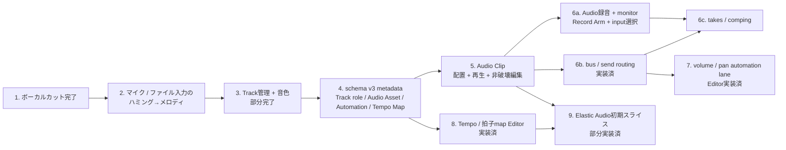

# 13. Pro DAW ギャップマトリクス

## 1. 比較条件

- 基準日: 2026-07-30
- 比較対象: Cubase Pro 15.0.30 / Logic Pro 12.3 / 現在の Compose Tutor Studio リポジトリ
- Cubase の根拠は Steinberg 公式 Cubase Pro 15.0 マニュアル、Logic Pro の根拠は Apple 公式 Logic Pro ユーザガイドだけを使用する。
- この表は「競合と同じ画面や全機能を複製する」計画ではない。初心者が曲を完成させる導線を保ちつつ、録音・編集・ミックス・書き出しを壊さず拡張するための差分台帳である。
- 現アプリの判定は、production UI から利用でき、保存・Undo・再生・書き出しの該当境界まで接続されているかを基準にする。単独の型、未接続コード、将来用フィールドだけでは「実装済」としない。

### ステータス

| 表記 | 判定 |
|---|---|
| 実装済 | 現行の対象範囲で end-to-end に利用でき、主要テストがある |
| 部分 | 基本機能または一時ツールはあるが、プロジェクト統合・高度編集・互換性のいずれかが不足 |
| 未実装 | production の利用導線がない。将来用の型や内部コードだけの場合も含む |

### 優先度

| 優先度 | 意味 |
|---|---|
| P0 | 次の土台。これがないとオーディオ制作または後続データモデルを安全に拡張できない |
| P1 | 制作・録音・ミックスを実用域へ引き上げる機能。P0 の安定後に追加する |
| P2 | 外部エコシステム、業務交換、高度な映像・空間音響。独立した技術検証と製品判断が必要 |

## 2. 機能ギャップ

| カテゴリ | Cubase Pro 15.0.30 / Logic Pro 12.3 の代表機能 | 現アプリ | 優先度 | 差分と採用方針 | 公式根拠 |
|---|---|---|---:|---|---|
| プロジェクト、履歴、素材管理 | 多数のトラック種別、素材参照、プロジェクト内の音声を前提に編集する | **部分**: current schema v10、SQLite自動保存、クラッシュ復旧、Undo/Redo、`.ctsproj.json` exact metadata / routing / Audio take / Automation Read / Audio Clip `audioWarp` / `formantMode` roundtripに加え、app-owned SHA-256 Audio Assetをnative content-addressed directory / Web IndexedDBへ保存する。nativeはstaging recovery、全retained generation / draftをrootにしたGC、端末全消去を持つ。portable binary bundle、素材browser、Web generation-aware GCはない | P0 | JSONとbinaryの分離を維持し、portable bundle / asset browserを独立設計する。競合の全交換形式を直ちに再現しない | [Cubase Pro Help](https://www.steinberg.help/r/cubase-pro/15.0/en), [Logic Pro project basics](https://support.apple.com/en-ie/guide/logicpro/lgcpe9cc47b2/mac) |
| トラック管理と音色 | Audio / MIDI / Instrument / Group / FX / Folder などを作成・削除・複製・並べ替えでき、音源やパッチを選べる。Logic は Track Stacks も持つ | **部分**: production UIからinstrument / drum、file由来Audio Track、空のstereo Busを追加し、non-masterの複製・並べ替え、一般Trackの削除・改名、canonical synth 4音色を扱える。schema v4のroleが学習意味の正本で、学習Trackも改名可能・削除保護、複製先はgeneralになる。Folder/Stack、freeze、track versionはない | P0 | role / 名前、Audio Asset、routingの整合性を維持し、Folder / Stackやfreezeは用途別の独立incrementにする | [Cubase Pro Help](https://www.steinberg.help/r/cubase-pro/15.0/en), [Logic Pro Track Stacks](https://support.apple.com/en-ca/guide/logicpro/lgcp9bc4b63d/mac) |
| MIDI / Drum 編集 | Piano Roll、controller lane、pitch bend、aftertouch、step input、複数 part 編集、expression map、詳細 quantize など | **部分**: ノート作成・移動・複製・長さ・velocity・量子化・scale snap、Drum Step Sequencer、MIDI import/export はある。CC lane、pitch bend、MPE/Note Expression、step/real-time MIDI 録音、高度 transform はない | P1 | 初心者向け編集を保ち、controller lane、sustain、pitch bend、入力記録を段階追加する。MPE / articulation / logical editor は後段 | [Cubase Key Editor](https://www.steinberg.help/r/cubase-pro/15.0/en/cubase_nuendo/topics/midi_editors/midi_editors_key_editor_r.html), [Cubase Scale Assistant](https://www.steinberg.help/r/cubase-pro/15.0/en/cubase_nuendo/topics/midi_editors/midi_editors_scales_in_key_editor_r.html), [Logic Pro User Guide](https://support.apple.com/guide/logicpro/welcome/mac) |
| コード、スケール、伴奏支援 | 両製品に Chord Track があり、Cubase は Chord Assistant、Logic は Chord Track と Session Players の連携を持つ | **部分**: Chord Track、機能和声表示、コード候補、scale guide、Bass/Melody Assistant、学習解説は実装済。音声/MIDIからのコード解析、演奏スタイル付き伴奏、コード追従オーディオはない | P1 | 現アプリの教育的な説明は維持する。先に Project/Audio 基盤を作り、その後にコード解析と編集可能な伴奏生成を足す | [Cubase Chord Track](https://www.steinberg.help/r/cubase-pro/15.0/en/cubase_nuendo/topics/chord_functions/chord_functions_chord_track_c.html), [Cubase Chord Assistant](https://www.steinberg.help/r/cubase-pro/15.0/en/cubase_nuendo/topics/chord_functions/chord_functions_chord_assistant_c.html), [Logic Pro chords](https://support.apple.com/en-ie/guide/logicpro/lgcp2633963f/mac), [Logic Pro Session Players](https://support.apple.com/en-ie/guide/logicpro/lgcpbf624405/mac) |
| セクション、非線形アレンジ | Cubase の Arranger Track は chain、repeat、live jump、flatten を持つ。Logic の Live Loops は cell/scene を同期再生し Tracks area へ記録できる | **部分**: section label、clip の独立/連動複製、transport loop はある。section 順序を再生する chain、scene/cell 起動、performance capture はない | P1 | section annotation を壊さず、最初に「セクション再生順と反復」を追加する。Live Loops 相当の即興 grid はその後 | [Cubase Arranger Track](https://www.steinberg.help/r/cubase-pro/15.0/en/cubase_nuendo/topics/arranger_track/arranger_track_c.html), [Logic Pro Live Loops](https://support.apple.com/guide/logicpro/live-loops-overview-lgcpf46ffc88/10.7/mac/11.0) |
| Tempo / 拍子 / musical time | Tempo Track、拍子イベント、tempo change、音声からの tempo 解析・追従を扱える。Logic は Smart Tempo を持つ | **部分（production map編集実装済み）**: schema v4でtempo / 拍子mapと`lengthBeats`が正本、固定値はlegacy mirrorである。共通変換をlive / WAV / MIDI / timeline、metronome、Piano Roll / Drum / Chord UIへ接続し、production Editorからevent追加・値 / 位置編集・削除、beat 0保護、Undo / Redo、保存を扱える。連続tempo ramp、audio follow / Smart Tempo、tempo automationはない | P1 | map編集と全consumerのvariable-map回帰を維持し、連続rampとSmart Tempo相当は独立したP1品質gateで評価する | [Cubase Tempo Track](https://www.steinberg.help/r/cubase-pro/15.0/en/cubase_nuendo/topics/editing_tempo_and_signature/editing_tempo_tempo_track_c.html), [Cubase Signature Track](https://www.steinberg.help/r/cubase-pro/15.0/en/cubase_nuendo/topics/tracks_about/tracks_about_signature_track_c.html), [Logic Pro tempo overview](https://support.apple.com/guide/logicpro/tempo-overview-lgcp3c2e8ef9/mac), [Logic Pro Smart Tempo](https://support.apple.com/guide/logicpro/smart-tempo-overview-lgcp9281e70c/10.7/mac/11.0) |
| Audio Asset / Audio Track | 音声をプロジェクトへ読み込み、region/event として配置・分割・trim・fade・crossfade・loop・gain 調整できる | **部分**: WAV / MP3 / M4A / AACの読込または最大60秒のマイク録音をlocalで48 kHz mono/stereo PCM16 WAVへ正規化し、app-owned content-addressed objectとして保存する。production UIから新規または既存Audio TrackへClipを配置し、move、左右trim、gain、fade、loop、split、独立duplicate、deleteができ、shared plannerでlive / WAVを一致させる。Elastic Audio Editor内には解析由来のbounded waveformもある。missing / changed表示もある。通常Arranger waveform、隣接Clip crossfade、loop中left trim / split、portable bundleはない | P0 | Batch 5の非破壊source rangeとasset integrityを回帰維持し、Arranger waveform / crossfade / persisted loop phaseは初期Elastic Audioとは分離した後続incrementにする | [Cubase Pro Help](https://www.steinberg.help/r/cubase-pro/15.0/en), [Logic Pro project basics](https://support.apple.com/en-ie/guide/logicpro/lgcpe9cc47b2/mac) |
| Audio 録音、take、comping | Audio/MIDI 録音、cycle take、punch、lane/take folder、comping、複数入力を扱える。LogicのQuick Swipe CompingはAudio take folder向けで、MIDI take folderでは利用できない。外部I/OではCubaseの`Measure Delay`、Logic ProのI/O Utility `Latency Detection (Ping)`が入出力間遅延を測定する | **部分（bounded Audio cycle / Auto Punch実装済み）**: 単一マイクの0.5〜60秒dry録音、Record Arm、shared-clock、推定 / 物理loopback実測 / 手動latency補正を持つ。明示loopを2〜128固定passで録るcycleに加え、loopとは独立したruntime-only in / out locatorとpre / post-rollを持つbounded Auto Punchを実装した。Auto Punchはpunch-in exact frameからcaptureし、対象Trackだけをhalf-open gateし、natural post-roll完走後にempty / spanning Clip / exact folderの3形へ非破壊採用する。Asset-first、pure domain replay、開始時snapshot / operationへのstrict CAS、1 Undo、failure atomicityを共有する。既存Clipの手動folder化、range paint、境界移動、未使用take削除、保存 / 再読込、live / WAV共通comp plannerもある。**残差**: Quick Punch、automatic input monitoring、cycleとの併用、disk streaming、arbitrary overlaps、input hot switch、multi-input、MIDI comping、named comps、flattenはない | P1 | bounded cycle / Auto Punch / 手動compのunit・component・E2E回帰を維持し、3OS実機gateと残差をそれぞれ独立gateにする | [Cubase recording lanes and takes](https://www.steinberg.help/r/cubase-pro/15.0/en/cubase_nuendo/topics/track_handling/track_handling_lanes_working_with_c.html), [Cubase assembling takes](https://www.steinberg.help/r/cubase-pro/15.0/en/cubase_nuendo/topics/track_handling/track_handling_assembling_operations_c.html), [Cubase Punch In and Punch Out](https://www.steinberg.help/r/cubase-pro/15.0/en/cubase_nuendo/topics/playback/playback_punch_in_and_punch_out_c.html), [Cubase Pre-Roll and Post-Roll](https://www.steinberg.help/r/cubase-pro/15.0/en/cubase_nuendo/topics/recording/recording_using_preroll_and_postroll_t.html), [Logic Pro record multiple takes](https://support.apple.com/guide/logicpro/record-multiple-audio-takes-lgcpb19806af/mac), [Logic Pro comping overview / Quick Swipe](https://support.apple.com/guide/logicpro/comping-overview-lgcp317d758e/mac), [Logic Pro pack existing regions](https://support.apple.com/guide/logicpro/pack-regions-into-take-folders-lgcpb194093e/mac), [Logic Pro Quick Punch / Autopunch](https://support.apple.com/guide/logicpro/punch-in-and-out-of-audio-recordings-lgcpb19bfd0d/mac) |
| Audio の time / pitch 編集 | Cubase は AudioWarp / VariAudio、Logic は Flex Time / Flex Pitch で timing と pitch を編集できる | **部分（初期スライス実装済み）**: 60秒以内のready・非loop Audio Clipにschema v10の非破壊timing marker、単音pitch region、`formantMode: off / preserve`を保存し、0.5〜2倍、±300 centのmanual編集、解析waveform / pitch trace、Undo / Redo、補正前 / 補正後A/B、live / full / selected Track WAV共通の`wsola-v1/dsp-2`派生PCMをproduction UIへ接続した。Worker generation cancel、128 MiB派生cache、384 MiB共有resource gateも持つ。**残差**: manual formant editing、vibrato編集、polyphonic pitch、unsupported rate / extreme shift品質、実声のライセンス済みブラインドA/BまたはMUSHRA、take folder / loop-cycle、phase-coherent multitrack、audio quantize / groove抽出、audio follow / Smart Tempoはない | P1 | 初期スライスをCubase / Logicの全time-pitch機能と数えない。off / preserveのconsumer parityを固定し、実声品質、formant編集、polyphonic、take / loop、multitrack phase、quantize / groove、Smart Tempoを用途別の独立gateにする | [Cubase AudioWarp](https://www.steinberg.help/r/cubase-pro/15.0/en/cubase_nuendo/topics/sample_editor_window/sample_editor_inspector_audiowarp_r.html), [Cubase VariAudio](https://www.steinberg.help/r/cubase-pro/15.0/en/cubase_nuendo/topics/sample_editor_variaudio/sample_editor_variaudio_c.html), [Logic Pro Flex overview](https://support.apple.com/guide/logicpro/flex-time-pitch-logic-pro-mac-audio-track-lgcp308143aa/mac), [Logic Pro Flex Pitch editing](https://support.apple.com/guide/logicpro/edit-pitch-and-timing-with-flex-pitch-lgcpc53e6bef/mac) |
| ハミング / 単音音声 → Melody MIDI | VariAudio と Flex Pitch は、解析済みの単音音声から MIDI note を生成できる | **部分**: 60秒以内のマイク直録りまたは録音済み単音fileをローカル解析し、bounded waveform / pitch trace上でsegmentのpitch、位置、境界、split / merge / 除外を候補専用Undo / Redo付きで手修正して、既存MIDI Clipへ1回の変更で配置できる。権限・device失敗時のfile fallbackとexact録音上限も実装済み。polyphonic transcription、formant補正、source audio修復はない | P0 | capture/file decode → bounded preview → transient segment編集 → tempo/grid quantize → NoteEvent確定を回帰維持する。次はpolyphonic対応ではなく実機精度と長い素材のUXを評価し、歌詞認識とAudio修復は分離する | [Cubase Extracting MIDI from Audio](https://www.steinberg.help/r/cubase-pro/15.0/en/cubase_nuendo/topics/sample_editor_variaudio/sample_editor_variaudio_midi_extract_from_audio_t.html), [Logic Pro Create MIDI from Flex Pitch Data](https://support.apple.com/guide/logicpro/create-midi-from-audio-recordings-lgcpe2fd1b83/mac) |
| ボーカルカット / Stem 分離 | 両製品は vocal、drums、bass、その他などを推定分離する Stem Separation を持つ | **部分**: ローカル Mid/Side 中央定位軽減、3 preset、A/B、PCM 16-bit WAV 書き出しはある。中央にない vocal や reverb は残り、中央の楽器も減る。ML stem 分離ではない | P0 | まず現方式の境界・5分上限・codec padding・cancel/recovery を完成させる。ML stem 分離は品質、モデル配布、端末負荷、権利を別評価して P1 で判断する | [Cubase Stem Separation](https://www.steinberg.help/r/cubase-pro/15.0/en/cubase_nuendo/topics/audio_functions/audio_functions_stem_separation_r.html), [Logic Pro Stem Splitter](https://support.apple.com/guide/logicpro/extract-vocal-instrumental-stems-stem-lgcp61bae908/mac) |
| Mixer、routing、bus/send | MixConsole/Mixer は insert、send、group/aux、output、VCA、side-chain、複数 routing、automation を扱う | **部分**: per-track volume/pan/mute/solo、meter、5種のinsert、Master gain/limiterに加え、stereo Bus、各non-Masterのmain output、pre/post-fader send / return、循環拒否、edge-aware solo、live/WAV共通DAG、non-Master volume / panとeffective Master output volume automation laneをproduction UIから扱える。VCA、side-chain、hardware I/O、send automationはない | P1 | schema v4 routingとvolume / pan laneの回帰を維持し、side-chain、VCAを独立して追加する。send automationはAutomationのtarget拡張、外部I/Oはdevice設計後に扱う | [Cubase MixConsole](https://www.steinberg.help/r/cubase-pro/15.0/en/cubase_nuendo/topics/mixconsole/mixconsole_c.html), [Logic Pro mixing overview](https://support.apple.com/guide/logicpro/mixing-overview-lgcpbc219818/mac), [Logic Pro channel strip types](https://support.apple.com/guide/logicpro/channel-strip-types-lgcpbc2192ea/10.7/mac/11.0) |
| Automation / modulation | Track/region automation、Read / Touch / Latch / Writeなどのmode、parameter curve、parameter groupのSuspend / Fill / Preview系workflowを持ち、mixやplug-in parameterを時間変化させられる | **部分（Track volume / pan＋Master output volumeのRead / Touch / Latch / Writeまで実装済み）**: production Editorからlane編集、lane Read / Bypass、Global / TrackまたはMaster Read、対応Track別Read / Touch / Latch / Writeを操作できる。Touchは接触区間＋100 ms return、Latchは最初の接触からパンチアウト、Writeは確認後にnon-Masterのpass全域volume / pan、effective Masterのoutput volumeを記録し、終了後Touchへ戻る。両Master faderはRead曲線とgesture値を同期表示する。pass中はProject不変、確定時だけ1 Undo / save revisionでcurveをcurrent schema v10へ保存し、live / full / selected Track WAVは同じeffective Read resolverを使う。mode、Armed / Writing、pass ownershipはruntime-onlyで再読込時Readへ戻る。**残差**: Master pan、later Master、insert / send / tempo、MIDI CC / LFO、Trim / Relative / Cross-Over / Fill、parameter group Suspend、複数loop pass、region automationはない | P1 | 現行passのfailure atomicity、live/WAV parity、3OS入力操作を回帰維持し、次はtarget拡張と高度modeを分離する。runtime modeを永続schemaへ混ぜない | [Cubase Automation Modes](https://www.steinberg.help/r/cubase-pro/15.0/en/cubase_nuendo/topics/automation/automation_automation_modes_c.html), [Cubase Touch](https://www.steinberg.help/r/cubase-pro/15.0/en/cubase_nuendo/topics/automation/automation_touch_c.html), [Cubase Auto-Latch](https://www.steinberg.help/r/cubase-pro/15.0/en/cubase_nuendo/topics/automation/automation_autolatch_c.html), [Cubase Read/Write](https://www.steinberg.help/r/cubase-pro/15.0/en/cubase_nuendo/topics/automation/automation_writeread_automation_c.html), [Logic Pro automation modes](https://support.apple.com/guide/logicpro/choose-automation-modes-lgcpb1a6ab26/mac), [Logic Pro live automation](https://support.apple.com/guide/logicpro/record-live-automation-lgcpb1a6c15d/mac) |
| 内蔵音源、effect、sample library | 多数の software instrument / sampler / effect、preset browser、multi-output、modulation を持つ | **部分**: 小規模な内蔵 subtractive synth/drum と5種の insert はある。Sampler、音源 browser、multi-output、modulator、convolution、専門的 metering はない | P1 | P0 では現在の preset を選択可能にする。Sampler と asset browser を Audio Asset 上へ追加し、音源数の競争より一貫した保存・再現性を優先する | [Cubase Pro Help](https://www.steinberg.help/r/cubase-pro/15.0/en), [Logic Pro User Guide](https://support.apple.com/guide/logicpro/welcome/mac) |
| Export、bounce、相互運用 | 複数 format、channel/stem、range、real-time/offline bounce、業務用交換形式を扱う | **部分**: project 全体のstereo WAVに加え、選択したinstrument / drum / Audio Trackを下流Bus、send、effects、automation、Master込みで単独WAVへ書き出せる。SMF Format 1 MIDIと`.ctsproj.json`もある。batch stem、Bus/Master stem、range、MP3/M4A、bit depth/sample rate選択、AAF/XML/MusicXMLはない | P1 | 選択Track WAVのlive/full parityを維持し、次にbatch・Bus/Master stemとformat optionを分離して追加する。AAF/XMLはP2の明示的な互換プロジェクトとして扱う | [Cubase Export Audio Mixdown](https://www.steinberg.help/r/cubase-pro/15.0/en/cubase_nuendo/topics/export_audio_mixdown/export_audio_mixdown_r.html), [Logic Pro bounce](https://support.apple.com/en-gb/guide/logicpro/lgcp785a41c3/mac), [Logic Pro sharing](https://support.apple.com/guide/logicpro/sharing-overview-lgcp5a70f0fc/10.7/mac/11.0) |
| 楽譜 | MIDI を譜面表示・入力・layout・印刷/出力できる | **未実装** | P2 | Piano Roll と NoteEvent が安定した後の別 editor とする。初期は閲覧と MusicXML export の価値を検証する | [Cubase Score Editor](https://www.steinberg.help/r/cubase-pro/cubasescore/15.0/en), [Logic Pro Score Editor](https://support.apple.com/guide/logicpro/score-editor-interface-lgcpc7885e0b/10.7/mac/11.0) |
| 外部 plug-in / controller | Cubase は VST、Logic は Audio Units をhostし、両製品とも MIDI/controller mapping を持つ | **未実装**: VST3/AU host、plug-in scan、sandbox/crash isolation、latency compensation、MIDI learn/control surface がない | P2 | 「内蔵 effect がある」ことを plugin host 実装済とは数えない。SDK/license、署名、scan隔離、state保存、latency、crash復旧の検証を独立して行う | [Cubase VST plug-ins](https://www.steinberg.help/r/cubase-pro/15.0/en/cubase_nuendo/topics/installing_and_managing_plugins/installing_and_managing_plugins_plugin_manager_installing_vst_plugins_c.html), [Cubase MIDI Remote](https://www.steinberg.help/r/cubase-pro/15.0/en/cubase_nuendo/topics/midi_remote/midi_remote_c.html), [Logic Pro Audio Units](https://support.apple.com/guide/logicpro/work-with-audio-units-in-logic-pro-for-mac-lgcp22a0dab0/mac), [Logic Pro controller assignments](https://support.apple.com/guide/logicpro/controller-assignments-overview-ctls71c31487/10.7/mac/11.0) |
| Surround / Spatial Audio / video sync | Surround/object routing、Dolby Atmos authoring/monitoring、映像・timecode と同期する制作機能を持つ | **未実装**: 現在の可聴経路と WAV は stereo 前提。object/bed、ADM、video track、timecode、external sync はない | P2 | stereo の録音・routing・automation が安定するまで着手しない。Atmos 対応を現在の実装済機能として表示しない | [Cubase Pro Help: Dolby Atmos and video](https://www.steinberg.help/r/cubase-pro/15.0/en), [Logic Pro Dolby Atmos plug-in](https://support.apple.com/en-mide/guide/logicpro/lgcp8e75f0b5/10.7/mac/11.0) |

## 3. 優先度別バックログ

### P0: 完了済み基盤と次の境界

1. **完了済み**: ボーカルカットの入力時間・codec padding・cancel/recovery・書き出し回帰を実装する。ML stem分離は別のP1製品判断とする。
2. **部分完了**: ハミング/単音音声をマイク直録りまたはfileから解析し、bounded waveform / pitch segmentを手修正してから Melody MIDI へ変換する。入力権限・上限・cancel・device loss・候補専用Undo / Redoのgateは実装済みで、polyphonic transcription、歌詞認識、入力した鼻歌そのものの修復は未完了である。Audio Clipの初期Elastic Audioとは別導線である。
3. **部分完了**: Track管理のinstrument / drum / file由来audio / stereo Bus追加、non-master整理、roleと名前を分離した改名・削除保護、内蔵synth音色選択を実装する。上限・全出力経路のrelease gateとFolder / Stackは未完了である。
4. **完了済み基盤**: Project schema v4としてTrack role、AudioAsset / Automation metadata、Tempo/Signature Map、audio routing、v1→v2→v3→v4 migration、native metadata境界を導入する。
5. **完了済み基盤**: application-owned audio binary repositoryを作り、schema v4を使うAudio Clip配置・再生・非破壊編集を実装する。
6. **部分完了**: 最大60秒・単一入力のAudio Track録音、dry保存、monitor opt-in、asset-first保存、単一Record Arm、入力device列挙 / exact選択、既存TrackへのClip追記、shared-clock伴奏同期、推定 / 物理loopback実測＋手動latency補正、close / mutation fenceを実装した。明示loopの2〜128固定passと、独立runtime locator / pre / post-roll、exact-frame capture、target-only gate、natural post-roll proof、3形の非破壊adoptionを持つbounded Auto Punchも実装済みである。実測は外部I/O cable専用のruntime校正であり一般録音wizardや複数I/O routingではない。3OS実機gate、Quick Punch、automatic input monitoring、cycle併用、disk streaming、arbitrary overlaps、multi-inputなどは未完了である。
7. **完了済みincrement**: non-Master Trackのvolume / panと最初のeffective Masterのoutput volume lane editor、beat snap、point追加・編集・削除・全消去、parameter-lane Read / Bypass、Global / TrackまたはMaster Read、Read / Touch / Latch / Write、1 pass = 1 Undo、保存、loop / tempo / live / full / selected Track WAV parityを接続する。modeとpass stateはruntime-onlyである。
8. **部分完了**: schema v10のmanual timing markerと単音pitch region、解析表示、`formantMode` off / preserve、`wsola-v1/dsp-2` Worker、A/B、Undo / Redo、保存、live / full / selected Track WAV共通派生PCMを接続する。manual formant / vibrato、polyphonic、unsupported rate / extreme shift品質、実声のライセンス済みブラインドA/BまたはMUSHRA、take folder / loop-cycle、phase-coherent multitrack、audio quantize / groove、Smart Tempoは未完了である。

### P1: 制作・録音・ミックス

- Quick Punch、automatic input monitoring、Auto Punchとcycleの併用、長時間disk streaming、arbitrary overlaps / input hot switch、multi-input、MIDI comp、named comps / flatten（bounded fixed-pass cycleとbounded Auto Punchの自動take folder化は完了）
- side-chain、VCA、hardware I/O routing
- controller lane、sustain/pitch bend、MIDI step/real-time recording
- Master pan / later Master、insert / send / tempo parameter automation、MIDI CC / LFO modulation、Trim / Relative / Cross-Over / Fill、parameter group Suspend、複数loop pass（non-Master volume / panとeffective Master output volumeのGlobal / TrackまたはMaster / lane Read、Read / Touch / Latch / Writeは完了）
- 連続tempo ramp、audio follow / Smart Tempo相当の段階的な解析（manual tempo mapと初期Elastic Audioは完了）
- Elastic Audio残差: manual formant編集、vibrato編集、polyphonic pitch、unsupported rate / extreme shift品質、実声のライセンス済みブラインドA/BまたはMUSHRA、take folder / loop-cycle、phase-coherent multitrack、audio quantize / groove抽出（manual timing、単音pitch correction、formant off / preserveは完了）
- section chain と非線形再生、performance の arrangement 化
- track/stem WAV、range、format option、loudness/peak 診断
- ML Stem Separation はローカルモデルの品質・配布サイズ・処理時間を満たす場合だけ採用

### P2: 外部・業務・空間制作

- VST3/AU host と plug-in sandbox/crash recovery/latency compensation
- control surface / MIDI learn / remote mapping
- Score Editor と MusicXML
- AAF/XML などの業務交換
- Surround / Dolby Atmos / ADM、video track、timecode/external sync

## 4. 短期実装バッチと依存関係

### Batch 1: ボーカルカット完了

- 対象: 現在のローカル Mid/Side 軽減方式。
- 完了境界: 対応 container の構造検証、exact 5分と codec padding の扱い、memory preflight、処理中 cancel、dialog 再開、A/B、PCM 16-bit stereo WAV。
- 非対象: vocal/drums/bass/other の ML 分離。

### Batch 2: マイク / ファイル入力のハミング → メロディ

- 単音のハミング・鼻歌・口笛を対象にし、polyphonic material は明示的に非対応とする。
- マイクは権限要求、3秒countdown、最大60秒のraw PCM capture、明示stop / cancel、device failure、file fallbackを持ち、録音を永続化しない。
- file decode → pitch/onset 推定 → confidence による除外 → tempo/grid quantize → preview → NoteEvent 確定を分離する。
- previewは最大512 waveform binと最大3,000 pitch frameに制限し、segmentのpitch / position / boundary、split / merge / removeをProject外のbounded historyで編集する。raw PCMは保持しない。
- 初回は既存 Melody MIDI Clip への挿入で成立させ、Batch 3のinstrument追加導入後は新規instrument TrackのMIDI Clipも選べるようにする。
- 確定までは Project/history/autosave を変更せず、確定を Undo 1回にまとめる。

### Batch 3: Track 管理 + 音色（部分完了、schema v4へ継承済み）

- Batch 3時点のinstrument / drumに加え、AudioはBatch 5、空のstereo BusとroutingはBatch 6bでproduction UIへ接続済みである。Folder / Stackは未提供として区別する。
- non-masterのduplicate / reorder、一般non-masterのdeleteとcanonical synth 4 presetをProject mutationとして検証する。duplicateは全nested IDを新規にしてTrack内aliasをremapし、Masterは全管理操作から保護する。
- renameはlocal draftから1 commitにまとめる。schema v4では学習role Trackも改名できてroleを保持し、削除だけを保護する。一般TrackはChords / Bass / Melodyという名前でも学習roleにならない。
- 128 Track上限とcodec拒否はatomicにし、成功だけをUndo 1回・自動保存1回として採用する。selectionを生存IDへreconcileし、採用されたtopology / preset変更はplayheadを保持して再生を停止する。
- Batch 3由来の残作業はFolder / Stackとrelease gateである。Audio binary / TrackはBatch 5、Bus routingはBatch 6bで接続した。

### Batch 4: schema v3 metadata foundation（実装済み）

- v2→v3 migration を pure/atomic にし、既存曲の音と固定 tempo を変えない。
- Track semantic roleをIDと独立して永続化し、既存の正規化済みChords / Bass / Melodyを決定的に移行する。欠落・重複roleを黙って推測せず、role再作成と一般Track化の規則を明示する。
- `AudioAsset`はready / unresolved metadataとchecksum fieldを持ち、Audio Clipはasset IDとframe単位の非破壊source range / fade / gainを参照する。legacy audio参照はunresolvedとして保持する。
- Automation metadataはtarget、point、interpolationを持ち、最初はvolume/panを対象にする。
- Tempo/Signature Mapはbeat-domainの正本、固定`bpm` / `timeSignature` / `lengthBars`はcompatibility mirrorとし、project-modelの単一変換境界を提供する。
- TypeScript codecとRust native境界はcanonical schema v3 metadataを検証・migration・保存する。

Batch 4ではmetadata/domain foundationに加え、Automationのlive/offline schedulingとtempo / 拍子mapのlive / WAV / MIDI / timeline接続まで実装した。application-owned assets directory、binary recovery / GC、Audio Clip playback / editingはBatch 5、volume / panのproduction lane editor、parameter-lane Read / Bypass、Global / Track Read、Read / Touch / Latch / WriteはBatch 7、tempo / 拍子mapのproduction EditorはBatch 8で接続済みである。Automation mode自体はruntime-onlyで、連続tempo ramp、audio follow、高度automation target / modeは後続へ残る。

### Batch 5: Audio Clip 配置 / 再生 / 非破壊編集（実装済み）

- 入力を48 kHz / 1〜2ch PCM16 WAVへ正規化し、128 MiB以下のSHA-256 objectとしてWeb IndexedDB / native app-owned directoryへ保存する。nativeはstaging recovery、generation-aware GC、erase-allを持つ。
- descriptorなしのsource inspectは`2 × source + decoded cache`を読込前に予約し、source read、decoded / resample Float32、PCM16 WAV、保存copyのphase peakを384 MiB以下に事前制限する。native pickerは最大response envelope + Blobを`openAudio`前から予約する。cancel後も実decode / resample jobのsettlementまでapp-wide import leaseを保持する。
- Batch 4の`AudioAsset` metadataを参照するAudio Track / Clipをproduction UIから追加し、配置、移動、左右trim、gain、fade、loop、split、独立duplicate、deleteを非破壊に保存する。
- live playbackとoffline WAVが同じasset resolver、source range、gain / fade / loop plannerを使い、missing / changed / unavailable / decode / resource-limitを型付きに拒否する。
- liveは実AudioContext rateでraw / hash copy / target decoded / active cacheのphase peakを384 MiB以下に事前制限する。WAVはoffline Float32 outputとPCM16 encoder / Blob / native ArrayBuffer / IPC copiesを含むphase peakを384 MiB以下にし、予約をWeb download handoffまたはnative file gateway settlementまで保持する。未使用decoded LRUはlive preflight前に解放する。
- import / Audio Asset付きlive startup / WAVはprocess-wide 384 MiBの原子的な予約台帳を共有し、同時処理も合算上限内に収める。
- playable Audio Clip regionと1 planning windowは各10,000件、WAVはMIDI / drum / chord eventとの合計10,000 source、offline asset working setは384 MiBを上限とする。region超過はlive graph前、window超過は当該windowを部分scheduleせずsession停止、WAV超過は`OfflineAudioContext`と部分file生成前に拒否する。
- binaryをProject採用前に保存し、Project CAS失敗時はmetadataをcommitしない。nativeは全retained generation / crash draftをrootにしてorphanを回収し、音声bytesを履歴snapshotへ重複コピーしない。
- Project JSON単体はbinaryを同梱しない。Web generation-aware GC、portable bundle、waveform / crossfade、loop中left trim / splitは既知の後続範囲である。

### Batch 6: 録音 / comping / bus-send（6a・6b・6c-1・6c-2・6c-3 bounded実装済み）

- 一つの巨大変更にはせず、`6a 録音とmonitor`、`6b bus/send`、`6c takes/comping` に分ける。
- 6aは最大60秒・単一入力・dry録音・monitor初期OFFに加え、Audio Trackだけの単一Record Armと、システム既定または列挙した入力deviceのexact選択を持つ。待機なしは新規Audio Track、待機中は既存Trackへ新規Clipを追加する。3秒後にapp-wide AudioContextの同じ将来frameへ伴奏とcaptureを同期し、asset-first保存と開始時snapshot / target / clockへのCASをUndo 1回で採用する。arm / device / latency preferenceはruntime-onlyでProjectへ保存しない。
- permission / device loss / clock不連続 / context世代変更 / cancelでは既存Project不変、disk fullはasset store失敗として採用せず、録音・保存中のproject switch / close / Project変更は明示的に拒否する。latencyはhost申告に基づく推定または外部I/Oの物理cable loopback実測を選び、手動offsetを併用できる。実測profileはexact input / Context generation / sample rateに限定したruntime-only値で、Project / history / assetへ保存しない。固定pass loop recordingは6c-2、bounded Auto Punchは6c-3で対応し、入力hot switch、Quick Punch、automatic input monitoring、cycle併用、disk streamingは後続境界として表示を分ける。
- bus/send はschema v4で実装済み。全non-Masterのmain output、sourceごと最大16のpre/post-fader send、全1,024 edge、stable DAG、循環のatomic拒否、live/offline共通graphを持つ。無効・gain 0のsendもcycle検査へ含める。
- MixerはBus追加、output選択、send追加 / 有効 / 送り量 / 前後 / 削除を公開する。gain / enabledは再生中に平滑更新し、topology変更はplayheadを保持して再生を止める。VCA、side-chain、hardware I/O、send automationは後続である。
- 6c-1は同一Audio Track / windowの既存非loop Clipをschema v5のtake folderへまとめ、元takeのasset / source windowを破壊せず、採用rangeだけをgapless compとして保存する。後から一致Clipを追加しても現在compを変えない。
- Editorの6つ目の「テイク編集」tabで仕上がりrow、take lane、range paint、exact range / boundary入力、未使用take削除を扱う。accepted 1 gesture = 1 Undo、active playback停止、保存 / 再読込、live / WAV共通plannerを持つ。
- 6c-2の限定範囲として明示loop-range UI、2〜128 fixed-pass cycle capture、exact Asset分割、自動take folder / first-full comp / atomic 1 Undoを実装済み。
- 6c-3の限定範囲としてcycleとは独立したruntime-only in / out locatorとpre / post-roll、可変tempo / latency込みのpunch-in exact frame、対象Trackだけのhalf-open gate、capture＋natural post-roll proofを実装済み。empty windowへのClip追加、1件のspanning Clipをoutside materialごと保つfolder化、exact folderへのtake追記だけを許し、Asset-firstのpure domain replay、strict CAS、1 Undo、failure atomicityを共有する。Auto Punch自体はProject fieldやschema versionを増やさず、current aggregateを再利用する。
- Quick Punch、automatic input monitoring、Auto Punchとcycleの併用、長時間disk streaming、arbitrary overlaps、input hot switch、multi-input、MIDI comp、named comps / flattenは独立gateに残す。

### Batch 7: Track volume / pan + Master output volume Automation lane Editor / Read / Touch / Latch / Write（実装済み）

- Editorの4つ目のtabとして、選択中のnon-Master Trackではvolume / pan、canonical Track順の先頭effective Masterではoutput volumeだけを扱うproduction laneを提供する。Track未選択、later Master、point 0件を明示し、Master panやlater Masterへ暗黙laneを作らない。
- beat snap、lane位置またはplayheadへのpoint追加、選択pointのbeat / value / outbound `hold | linear`編集、1件削除、lane全消去を提供する。volume / pan laneは独立し、最後のpoint削除または全消去では空laneを除去する。
- immutable domain mutationと開始時ProjectへのCASを通し、採用された1 gestureだけをUndo / save revision 1回にする。no-op、同beat衝突、範囲外、stale / busy / codec拒否はProject / history / playbackを変えない。
- lane変更はplayheadを保持してactive sessionを停止する。次のplay、transport loop、可変tempo、offline WAVはBatch 4の同一resolverを使い、Editor表示は最初のpoint前のTrack scalar、pointから次へのoutbound補間、最終値保持を表す。
- native point button、roving focus、削除後focus回復、inline alert / polite statusを持ち、320pxでは時間軸だけを内部横scrollさせる。
- laneが存在するときだけnativeのRead / Bypass controlを表示する。schema v6の`bypassed`を永続化し、Bypass中もpointを消さず編集可能にする。live / WAV共通plannerはBypass laneのautomation commandを0件にし、Track scalarを可聴値として使う。切替は1 gesture = 1 Undoで、active sessionとnatural drainを停止する。
- schema v7でTrack全体 / global Read、schema v8でeffective Master output volume / Readの保存、strict migration / codec / native境界、immutable action、live / full / selected Track WAV共通resolverを追加し、production controlへ接続した。
- Track別Read / Touch / Latch / Write、pointer / keyboard共通gesture、Touchの100 ms return、Latchのfirst-touch→punch-out、non-Master Writeの非接触volume / pan両targetとeffective Master Writeのvolume target、warning / transaction内Touch fallbackをruntime passとして実装した。pass中はProject不変、停止 / 自然終了 / seek / loop右端 / lifecycle境界で1 commit / Undo / revisionへ確定し、失敗時は部分curveを採用しない。確定不能時は理由と明示的な破棄・停止導線を出してpassを回復できる。
- mode、Armed / Writing、gesture / pass ownershipはProjectへ保存せずactivationでReadへ戻す。Master pan、later Master、insert / send / tempo automation、MIDI CC / LFO、Trim / Relative / Cross-Over / Fill、parameter group Suspend、複数loop passはそれぞれ独立した後続gateとする。

### Batch 8: Tempo / 拍子map Editor（実装済み）

- Editorの5つ目のtabにtempo / 拍子laneを同じmusical timelineで表示し、再生位置への追加、event選択、値 / 位置編集、非anchor削除を提供する。
- beat 0 anchor、BPM 20〜300、拍子1〜32 / 分母2・4・8・16、strict order、同beat、曲末未満、map上限、global ID、拍子segmentとProject終端の小節境界をimmutable domainで検査する。
- 先頭値の`bpm` / `timeSignature`と拍子変更後の`lengthBars` mirrorを同じ候補で更新し、開始時ProjectへのCASを通過した1操作だけをUndo / save revision 1回にする。
- accepted変更はplayheadを保持してactive sessionを停止し、次のlive / WAV / MIDI / metronome / timelineがBatch 4の共通musical-time compilerから再構築される。tempo / 拍子map entityは変えず、current schema v10へ保存する。
- native event control、keyboard操作、削除後focus、inline alert / polite statusを持ち、320pxでは時間軸だけを内部横scrollする。
- 連続tempo ramp、audio follow / Smart Tempo、tempo automationはこのBatchに含めず、独立したP1 gateとする。

### Batch 9: Elastic Audio timing / monophonic pitch（初期スライス実装済み）

- v8→v9はschemaVersionだけを更新し、canonical v9からready・非loop・60秒以内の直接Audio Clipへoptional `audioWarp`を保存する。timing markerは2〜128件、隣接40 ms以上、0.5〜2倍、pitch regionは最大128件、実効±300 centとする。
- Audio Clip Editorの「音声を整える」内に「タイミング」「単音ピッチ」を置く。manual point編集、端末内pitch解析、実waveform / pitch trace、region補正 / split / merge / delete / reset、Undo / Redo、保存 / 再読込をproduction UIへ接続する。
- `wsola-v1/dsp-2` requestはtempo map、source frame、target sample rateを整数frameへcompileし、checksum、編集値、formantModeをcontent-addressed cache keyへ含める。Worker generation / Abortで古い結果を拒否し、派生PCM 128 MiB、共有音声処理384 MiBをallocation前に制限する。
- live、全体WAV、選択Track WAVは同じ派生PCM / Audio Clip plannerを使う。A/Bは選択Clipのpitchだけをlive用snapshotで外し、timing、Project、history、revision、autosave、WAVを変えない。
- 初期スライスの完了はCubase AudioWarp / VariAudioやLogic Flex Time / Pitchとの全面同等を意味しない。formant off / preserveは実装済みだが、manual formant / vibrato、polyphonic pitch、unsupported rate / extreme shift品質、実声のライセンス済みブラインドA/BまたはMUSHRA、take folder / loop-cycle、phase-coherent multitrack、auto quantize / groove、Smart Tempoは独立した残差である。

## 5. 実装判断の原則

- Cubase/Logic の UI や用語をそのまま複製せず、「何ができるか」を初心者向けの操作へ翻訳する。
- 外部ネットワーク送信は追加しない。音声解析は原則ローカルで行い、外部サービスを導入する場合は別の明示的な製品判断にする。
- Audio/MIDI の transient 処理結果と、Project に永続する正本を区別する。
- live playback と offline export は同じ tempo、automation、routing resolver を使う。
- 高度な項目の型だけを先に追加して、利用可能であるように見せない。
- VST/AU、ML Stem Separation、Dolby Atmos、AAF は、最低限版と呼んで一括実装せず、それぞれ独立した品質・安全性・互換性 gate を持つ。

## 6. 完了条件チェックリスト

### 短期バッチ

- [x] Batch 1: 対応する通常音源、exact 5分、上限超過、cancel/reopen を含む unit/E2E/実ブラウザ検証が通る。
- [x] Batch 2: 単音 fixture で pitch/onset/休符/quantize が許容誤差内となり、preview から MIDI 確定を Undo 1回で戻せる。
- [ ] Batch 2: 無音、雑音、和音、多すぎるノート、上限超過を Project 無変更で説明付き拒否できる。
- [x] Batch 3 production導線（部分実装）: instrument / drum / Audio / Bus追加、non-master duplicate/reorder、一般Track delete/rename、schema v4の学習role Track改名・削除保護、canonical synth selectorを提供した。Folder / Stackは未提供として区別する。
- [ ] Batch 3検証gate: 127→128と追加/複製上限、候補だけがcodec拒否されるevent/string fixture、全構造commandのactive playback停止差、canonical 4 presetのlive/WAV/Undo/`.ctsproj.json`/SQLite一致、drum browser E2Eを完了する。
- [ ] Track CRUD後続境界: Folder / Stackが完了するまで全Track CRUDと表現しない。
- [x] Batch 4 metadata foundation: v2→v3 migration、Track role、AudioAsset / Automation metadata、Tempo/Signature Mapのexact roundtrip、壊れた入力拒否、native metadata境界を実装する。
- [x] Batch 4 consumer integration: variable tempo / 拍子でもlive / WAV / MIDI / timeline / metronome /主要editorが共通mapを使う。
- [x] Batch 5 implementation: 実binaryのchecksum付きcontent-addressed保存、native staging recovery / generation-aware orphan GC / erase-all、Web IndexedDBを実装する。
- [x] Batch 5 implementation: Audio Clipの配置・trim・gain・fade・loop・split・duplicate・deleteを非破壊にし、live/WAV/Undo/Redo/再読込で同じshared planを使う。
- [ ] Batch 5 release gate: 3OS candidateでnative import / restart / tamper / erase、browser keyboard E2E、live/WAV聴感を完了する。
- [x] Batch 6a初回実装: 最大60秒の既定単一入力録音をcanonical Assetへ保存し、新規Audio Track / ClipをUndo 1回で配置する。permission / device loss / cancel / resource競合 / project switch / close拒否で既存Projectを壊さない。
- [x] Batch 6a Record Arm / input選択: Audio Trackの単一runtime arm、system default / device列挙 / exact選択 / `devicechange`、既存Trackへのasset-first Clip追記をUndo 1回で実装する。Project切替 / target消失 / stale CASでは採用しない。
- [x] Batch 6a shared-clock / latency increment: app-wide AudioContext generation、future-frame arm ACK、absolute capture frame / sequence、exact-request stop、可変tempo配置、自動推定 / 手動offset、beat 0 source trimを実装する。
- [x] Batch 6a physical loopback implementation: 通常録音と分離した外部I/O校正wizard、Master経由の低level固定PRBS複数burst、同一future-frame capture、500 ms内のsample単位正規化相関、silence / clip / ambiguous / low-confidence / context-changeのfail closed、exact input / Context generation / sample rateだけに有効なruntime profile、実測値によるhost推定全体の置換を実装する。
- [ ] Batch 6a release gate: 3OS実deviceでpermission、system default / 明示device、device loss、Record Arm先への追記、disk full、monitor、close、再起動再生、shared-clock同期 / 推定latencyを確認する。物理loopback校正は各OSのinterface cableでframe誤差、安全な低出力、再校正案内、失敗時の旧profile保持を実機確認する。長時間streamingは別incrementである。
- [x] Batch 6b implementation: bus/send/既存volume-pan automationを含む live と offline WAV のtopologyとparameter planを共有し、cycle拒否、Undo/Redo、schema v4 / Rust境界を検証する。
- [x] Batch 6c-1 implementation: 既存Audio Clipのtake folder化、range comp、境界移動、未使用take削除、1 gesture = 1 Undo、schema v5 / Rust保存、live / WAV共通planner、MIDI境界validationを実装する。
- [x] Batch 7 implementation: selected non-Masterのvolume / panとeffective Masterのoutput volume lane editor、snap、point add / edit / delete / clear、outbound hold / linear、parameter-lane Read / Bypass、1 gesture = 1 Undo、schema v6で導入した`bypassed`のcurrent v10保存、session replacement、loop / tempo / live / full / selected Track WAV parityを実装する。
- [x] Batch 8 implementation: tempo / 拍子map editor、beat 0保護、event add / edit / move / delete、mirror同期、1操作 = 1 Undo、保存、session停止、320px内部scrollを実装する。
- [x] Batch 9 initial Elastic Audio: schema v10、manual timing point、単音pitch region / 解析表示、formant off / preserve、`wsola-v1/dsp-2` Worker / WSOLA / cache / resource gate、A/B、Undo / 保存、live / full / selected Track WAV共通派生PCMを実装する。
- [ ] Batch 9 residual: manual formant editing、vibrato editing、polyphonic pitch、unsupported rate / extreme shift品質、ライセンス済み実声のblind A/BまたはMUSHRA、take folder / loop-cycle、phase-coherent multitrack、audio quantize / groove extraction、audio follow / Smart Tempoを独立gateで設計・検証する。
- [x] Batch 7後続: parameter-lane Read / Bypassを実装し、Bypass中のpoint保持、Track scalar使用、live / WAV parity、Undo / 再読込を検証する。
- [x] Batch 7後続基盤: schema v7のTrack全体 / global Read保存、action、live / WAV共通判定を実装する。
- [x] Batch 7後続production導線: Track全体 / global Read controlとRead / Touch / Latch / Write、shared gesture、atomic pass確定、Write警告 / Touch fallbackを実装する。
- [x] Batch 7 Master output increment: schema v8で最初のeffective Masterのvolume lane / Read / Touch / Latch / Write、両Master fader表示、live / full / selected Track WAV、保存 / 再読込を接続する。
- [ ] Batch 7高度Automation残差: Master pan / later Master、insert / send / tempo automation、MIDI CC / LFO、Trim / Relative / Cross-Over / Fill、parameter group Suspend、複数loop passをtarget / modeごとの独立gateで設計・検証する。
- [x] Batch 6c-2 bounded increment: 明示loop-range UI、2〜128 fixed-pass cycle、正latency tail込み0.5〜60秒、各周exact Asset、自動take folder / first-full comp、manual / cancel / unmount / failure全破棄、1 Undoを実装する。
- [x] Batch 6c-3 bounded Auto Punch: runtime-only independent locator / pre / post-roll、exact frame＋latency、target-only gate、capture＋natural post-roll proof、empty / spanning / exact-folder非破壊adoption、asset-first domain replay、strict CAS、1 Undo、failure atomicityを実装する。
- [ ] Batch 6c residual / release gate: bounded cycle / Auto PunchをmacOS / Windows / Linuxの実入力で検証し、Quick Punch、automatic input monitoring、cycle併用、長時間disk streaming、arbitrary overlaps、input hot switch、multi-input、MIDI comp、named comps / flattenをそれぞれ独立gateで設計・検証する。
- [x] Selected Track WAV bounded increment: instrument / drum / Audioの単一選択を、downstream Bus・send・effects・automation込みでsolo bounceする。persisted mute/soloはbounce viewだけで無視し、full-mix PCM、Project、history、revisionを変更しない。
- [ ] Stem residual: batch、Bus/Master stem、range、bit depth、MP3/M4A、個別stem加算によるmix再構成保証は未実装。

### リリース判定

- [ ] 各機能に「実装済/部分/未実装」の表示と実際の導線の不一致がない。
- [ ] TypeScript strict、unit、component、Playwright、Rust、release preflight、desktop build がすべて成功する。
- [ ] 対応OSの実機で入力device、長時間再生/録音、休止復帰、保存復旧、WAV書き出しを確認する。
- [ ] 著作権のある sample asset や無許諾 ML model を同梱しない。
- [ ] P2 の VST/AU、Atmos、AAF、Score を、未検証のまま「プロ対応済」と表示しない。
