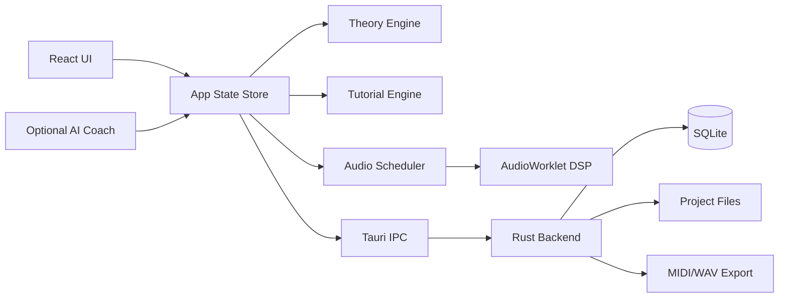

# Compose Tutor Studio 仕様書 v0.1.0

作成日: 2026-06-11


---

# 前提・仮定ログ

- 作成日: 2026-06-11
- 仕様バージョン: 0.1.0
- 仮称: Compose Tutor Studio
- 目的: Cubase Pro、Logic Pro、Ableton Live、FL Studio、Bitwig Studio などの強みを「教育統合型の作曲アプリ」として再設計する。
- 最重要方針: 初学者が 1 曲を完成させることを最優先にする。商用DAWの完全互換や全面的なプラグインホスト化は初期MVPから外す。
- 法務方針: 既存DAWの名称・UI・素材・プリセット・サンプル・マニュアル文言をコピーしない。機能アイデアを抽象化し、独自UI・独自チュートリアル・独自教材に落とし込む。
- 技術方針: MVP は Tauri + React + TypeScript + Web Audio / AudioWorklet を中心にし、低遅延・プラグインホスティング・高度なオーディオ編集は後続フェーズで JUCE / Rust native engine を検証する。
- AI方針: AIは「代作」ではなく、コード理論・作曲判断・練習問題・改善提案を説明するコーチとして扱う。
- 主要対象OS: Windows と macOS。Linux は将来対応候補。
- 主要成果物: 仕様書、AIコーディング指示ファイル、API/データモデル、ロードマップ、テスト計画、リスクメモ。


---

# 00. プロジェクトブリーフ

## 1. ゴール

Compose Tutor Studio は、作曲初心者が「DAWの操作」と「作曲理論」を同時に学びながら、短い曲を完成できるデスクトップアプリです。

一般的なDAWは高機能ですが、初心者にとっては以下が障壁になります。

- 何から始めればよいか分からない
- コード進行、スケール、メロディ、ベース、ドラムの関係が見えにくい
- 機能名は分かっても、作曲上の使いどころが分からない
- チュートリアルが操作説明に偏り、音楽的な判断理由まで教えてくれない

このアプリは、作曲ワークフローの中に教材を埋め込みます。ユーザーがノートを置く、コードを選ぶ、セクションを増やす、ミックスするたびに「なぜそうするのか」を短く説明し、必要な演習へ誘導します。

## 2. 主要コンセプト

| コンセプト | 内容 | 実装上の意味 |
|---|---|---|
| Guided DAW | 初心者を曲完成まで案内するDAW | 画面上に次の行動、理由、練習課題を表示する |
| Theory-aware Editor | 音楽理論を理解するエディタ | キー、スケール、コード、機能和声、テンション、ボイスリーディングを内部モデル化 |
| Action-based Tutorial | 操作に連動する教材 | ユーザーの編集内容からチュートリアル進行を判定 |
| Idea-to-Song | 断片を曲にする支援 | ループ、コード、ドラム、ベース、メロディをセクション構造へ展開 |
| Explainable AI Coach | 代作ではなく説明するAI | 提案の根拠、別案、練習問題を返す |

## 3. 競合DAWから抽象化して取り込む強み

| 参照DAW | 参考にする方向性 | 本アプリでの再設計 |
|---|---|---|
| Cubase Pro | Chord Track、Chord Pads、Scale Assistant、MixConsole | コード進行を中心に、初心者向けの和声説明を重ねる |
| Logic Pro | Chord ID、Chord Track、Session Players、Stem Splitter、Mastering Assistant、Step Sequencer、Live Loops | AI/自動支援の結果だけでなく、理由と編集ポイントを表示する |
| Ableton Live | Session/Arrangement 的な発想、MIDI Generators/Transformations、Keys and Scales | ループの試作から曲構成へ移行できる二段階ワークフロー |
| FL Studio | Pattern/Channel Rack 的なビート制作、Piano Roll、Loop Starter、Chord detection | パターン単位で始め、セクションへ展開する初心者導線 |
| Bitwig Studio | Automation Clips、Clip Aliases、Project-wide Key Signature、modulation | 反復構造と変化を初心者にも見える形で編集する |
| Studio One / Fender Studio Pro | テンプレート、単一画面ワークフロー、マスタリング導線 | 作曲開始テンプレートと完成チェックリストを強化する |

## 4. 成功指標

| 指標 | MVP目標 | 測定方法 |
|---|---:|---|
| 初回曲完成率 | 60%以上 | 初回起動から7日以内に8小節以上の曲を保存/書き出し |
| チュートリアル完了率 | 50%以上 | 基礎コース完了ユーザー割合 |
| 離脱ポイント | 重大離脱画面を3箇所以内に特定 | イベントログ分析 |
| 学習効果 | 事前/事後テストで20%以上改善 | コード/スケール理解テスト |
| 安定性 | クラッシュ率 1%未満 | ローカル診断ログ、クラッシュレポート |

## 5. 非ゴール

- Cubase Pro / Logic Pro / Ableton Live / FL Studio / Bitwig Studio のクローンを作ること
- 初期段階でプロ向け録音・ミキシング・マスタリング機能をすべて実装すること
- 既存曲を模倣する生成AI機能を売りにすること
- 商用サンプルやプリセットを無断同梱すること

## 6. MVPの一文定義

初心者が、テンポ・キー・コード進行・ドラム・ベース・メロディの関係を学びながら、8〜16小節のオリジナル曲を作成し、MIDI/WAVとして書き出せるデスクトップアプリ。


---

# 01. 製品要件定義 PRD

## 1. ペルソナ

### P1: 完全初心者

- DTMソフトを開いたことはあるが、何から始めるか分からない
- コード理論は断片的に知っている
- 目標は、SNSやYouTubeで使える短いBGMを作ること

必要な支援:

- 最短で音が出るテンプレート
- 次に何をすればよいかの表示
- 専門用語のインライン解説
- 「良い/悪い」ではなく「狙いに合っている/合っていない」という説明

### P2: ゲーム配信者・動画制作者

- 自分の動画・配信用にBGMやジングルを作りたい
- 既存BGMの権利問題を避けたい
- 完成までの速度を重視する

必要な支援:

- 15秒/30秒/60秒テンプレート
- ループ可能な構成
- 雰囲気プリセット: 明るい、緊張、チル、疾走感、レトロゲーム風など
- MIDI/WAV書き出し

### P3: 中級に進みたい学習者

- コード進行を使った作曲を学びたい
- メロディとコードの関係を理解したい
- 自分の作風を作りたい

必要な支援:

- 機能和声、借用和音、セカンダリードミナント等の段階的解説
- 自作進行の分析
- 代替コード提案
- メロディ添削

## 2. ユーザーストーリー

| ID | ユーザーストーリー | 優先度 | 受け入れ条件 |
|---|---|---:|---|
| US-001 | 初心者として、テンプレートから曲作りを始めたい | Must | 3クリック以内に音が鳴るプロジェクトを作れる |
| US-002 | 初心者として、コード進行を選ぶ理由を知りたい | Must | コード選択時に機能、響き、次の候補が表示される |
| US-003 | 初心者として、スケール外の音を避けたい | Must | ピアノロールでスケール内/外が視覚的に区別される |
| US-004 | 作曲者として、コードに合うベースを作りたい | Must | ルート/5度/経過音の候補を生成・説明できる |
| US-005 | 作曲者として、ドラムパターンを素早く作りたい | Must | 4/4基本パターンをステップシーケンサーで作れる |
| US-006 | 学習者として、課題を解く形で理論を覚えたい | Must | レッスン、演習、判定、解説、進捗保存ができる |
| US-007 | 動画制作者として、ループBGMを書き出したい | Must | MIDIとWAVをエクスポートできる |
| US-008 | 中級者として、借用和音を試したい | Should | モーダルインターチェンジ候補を提示できる |
| US-009 | ユーザーとして、AIに改善案を聞きたい | Should | プロジェクトのコード/メロディ情報から説明付き提案を返す |
| US-010 | 上級者として、外部VSTを使いたい | Could/Future | VST3 SDK/ライセンス確認後に実装判断 |

## 3. MVP機能範囲

### 3.1 Project

- 新規作成
- テンポ、キー、拍子、長さ
- ローカル保存/読み込み
- 自動保存
- プロジェクトテンプレート

### 3.2 Composition

- Chord Track: 小節単位のコードイベント
- Piano Roll: ノート入力、移動、長さ変更、ベロシティ
- Drum Step Sequencer: キック、スネア、ハイハット、クラップ等
- Bass Assistant: コードルート、5度、オクターブ、経過音候補
- Melody Assistant: コードトーン、アプローチノート、モチーフ反復の可視化
- Pattern/Clip: 1〜4小節単位の素材を組み合わせる

### 3.3 Learning

- 初回オンボーディング
- 基礎コース: 音名、半音/全音、メジャースケール、ダイアトニックコード
- 作曲コース: 8小節のコード進行、ドラム、ベース、メロディ、構成
- インライン解説
- 演習判定
- 復習キュー

### 3.4 Audio

- 内蔵シンプルシンセ
- 内蔵ドラム音源
- 音量、パン、ミュート、ソロ
- 簡易エフェクト: EQ/Filter、Delay、Reverb、Compressorの最小版
- WAVレンダリング

### 3.5 Export

- MIDI書き出し
- WAV書き出し
- プロジェクトJSON/SQLite保存

## 4. MVPから外す範囲

| 項目 | 理由 | 後続判断 |
|---|---|---|
| VST/AUホスト | SDK、ライセンス、安定性、クラッシュ分離が重い | v1.5以降で検証 |
| ASIO正式対応 | Windowsドライバ、SDK、ユーザー環境依存が大きい | 低遅延が必要になった段階で検証 |
| Stem separation 本実装 | MLモデル、処理速度、権利、品質評価が重い | 外部API/ローカルモデル比較後 |
| 自動マスタリング本実装 | 音質評価・責任範囲が大きい | まずはラウドネス/ピーク診断に限定 |
| 楽譜エディタ | 実装量が大きい | MIDI編集が安定後 |
| クラウド同期 | 個人情報・音源データ扱いが増える | ローカル完結後 |

## 5. 非機能要件

| 分類 | 要件 | MVP基準 |
|---|---|---|
| 性能 | 再生開始レスポンス | 100ms以内を目標。要実測 |
| 性能 | UI操作 | ノート移動/ズーム/スクロールで目視カクつきが少ない |
| 安定性 | 自動保存 | 編集後30秒以内、クラッシュ後復元 |
| 互換性 | OS | Windows/macOS 優先 |
| アクセシビリティ | キーボード操作 | 主要操作はショートカット対応 |
| プライバシー | ローカル保存 | デフォルトではプロジェクトを外部送信しない |
| 検証性 | テスト | theory engine は単体テスト必須、UIは主要フローE2E |

## 6. 完了の定義

- 初回ユーザーがテンプレートから曲を作り、保存し、再起動後に読み込める
- 8小節のコード進行に対して、ドラム、ベース、メロディを作成できる
- レッスンの開始、判定、完了、進捗保存ができる
- MIDI/WAVを書き出せる
- 主要ロジックにテストがある
- 既存DAWのUIコピーではなく、独自デザインである


---

# 02. 機能仕様

## 1. 機能一覧

| モジュール | 機能 | MVP | 説明 |
|---|---|---:|---|
| Project | 新規作成/保存/読み込み | Yes | SQLiteまたはJSONで保存。自動保存あり |
| Template | 作曲テンプレート | Yes | 8小節、16小節、BGM、ジングル等 |
| Chord Track | コードタイムライン | Yes | 小節単位でコードを置く。機能と候補を表示 |
| Chord Palette | コード候補 | Yes | ダイアトニック、代理、借用、セカンダリ候補 |
| Scale Assist | スケールガイド | Yes | スケール内外を可視化。スナップ可能 |
| Piano Roll | MIDI編集 | Yes | ノート作成、移動、複製、量子化、ベロシティ |
| Drum Sequencer | ステップ入力 | Yes | 16ステップ基本。後続で確率/スウィング |
| Clip Launcher | ループ試作 | Partial | MVPは簡易クリップ一覧。v1で非線形再生 |
| Arranger | セクション配置 | Yes | Intro/A/B/Chorus/Bridge/Outro ラベル |
| Mixer | 音量/パン/ミュート/ソロ | Yes | 各トラックに基本操作 |
| Effects | 基本エフェクト | Partial | Filter/Delay/Reverbを最小実装 |
| Tutorial | 操作連動チュートリアル | Yes | ユーザー操作をトリガーに進行 |
| Exercise | 理論演習 | Yes | コード判定、スケール判定、メロディ添削 |
| AI Coach | 説明付き改善提案 | Optional | APIキー設定時のみ。MVPではモック可 |
| Export | MIDI/WAV | Yes | MIDIは構造維持、WAVは簡易レンダー |
| Import | MIDI import | Should | v1候補 |
| Audio Track | Audio file配置 | Should | MVPでは再生のみ候補。編集は後続 |
| Stem Separation | パート分離 | Future | 外部API/ローカルモデル検証後 |
| Plugin Host | VST3/AU | Future | ライセンス/安定性確認後 |

## 2. Chord Track

### 2.1 目的

曲全体の和声設計を可視化し、初心者がコード進行を理解しながら編集できるようにする。

### 2.2 UI要素

- タイムライン上部にコードレーンを固定表示
- 各コードイベントは `小節範囲 / コード名 / 機能 / 色` を持つ
- クリック時に右パネルで以下を表示:
  - コード構成音
  - キー内での度数
  - 機能: Tonic / Subdominant / Dominant / Other
  - 次に進みやすい候補
  - 初心者向け説明

### 2.3 入力仕様

- コード名直接入力: `C`, `Am`, `Fmaj7`, `G7`, `Dm7/G` など
- パレット選択: I, ii, iii, IV, V, vi, viiø
- 候補生成: 現在キーと直前コードから候補表示
- 進行テンプレート: I-V-vi-IV、vi-IV-I-V、ii-V-I など

### 2.4 判定仕様

- コードの構成音をノート番号で管理
- キーに対する度数を算出
- ダイアトニック内/外を判定
- 借用和音・セカンダリードミナントはタグ付け
- 初心者モードでは複雑なタグを折りたたむ

### 2.5 受け入れ条件

- Cメジャーで `C - G - Am - F` を置いたとき、I - V - vi - IV と表示される
- `E7 -> Am` を置いたとき、Amに対するセカンダリードミナント候補として説明できる
- コード変更時、ベース/メロディガイドが更新される

## 3. Piano Roll

### 3.1 目的

MIDIノート編集と同時に、スケール・コード・メロディ作法を学べる画面にする。

### 3.2 表示

- 縦軸: ピッチ
- 横軸: 拍/小節
- ノート: 長方形
- コードトーン: 強調表示
- スケール内音: 通常表示
- スケール外音: 薄色/警告表示
- 解決先候補: ホバー時に表示

### 3.3 操作

- ダブルクリックでノート追加
- ドラッグで移動
- 端をドラッグで長さ変更
- Alt/Option + ドラッグで複製
- Qで量子化
- SでScale Snap切替
- CでChord Tone Highlight切替

### 3.4 学習連動

- スケール外音を置いた場合:
  - 初心者モード: 「これはキー外の音です。緊張感として使うか、近いスケール内音に移動できます。」と表示
  - 中級モード: アプローチノート、ブルーノート、クロマチック等の可能性を表示
- コードトーンに着地した場合:
  - 「安定した着地」として説明
- 連続跳躍が多い場合:
  - 「歌いやすさ」観点のアドバイスを表示

## 4. Drum Step Sequencer

### 4.1 目的

初学者がリズムの土台を早く作れるようにする。

### 4.2 MVP仕様

- 4/4、16ステップ
- レーン: Kick, Snare, Closed Hat, Open Hat, Clap, Perc
- ベロシティ: 3段階または0〜127
- Swing: 0〜60%
- Pattern length: 1/2/4小節

### 4.3 テンプレート

- Four on the floor
- 8-beat pop
- Hip-hop basic
- Game loop basic
- Lo-fi basic

### 4.4 学習連動

- キック: 拍の重心
- スネア/クラップ: 2拍目/4拍目のバックビート
- ハイハット: 細かい時間感覚
- スウィング: 偶数ステップの遅れ

## 5. Bass Assistant

### 5.1 目的

コード進行からベースラインを作る導線を提供する。

### 5.2 生成ルール MVP

| モード | 内容 |
|---|---|
| Root Only | 各コードのルートを拍頭に配置 |
| Root + Fifth | 1拍目ルート、3拍目5度 |
| Walking Simple | ルート、コードトーン、次コードへの経過音 |
| Octave Pulse | ルートとオクターブ反復 |

### 5.3 説明

生成結果には「なぜその音を置いたか」をノート単位で表示する。

例:

- Cコードの拍頭にC: ルート音なので安定する
- Gへ向かう直前にF#を置く: 半音上行でGへ強く進む経過音

## 6. Melody Assistant

### 6.1 目的

コードに合うメロディを作るためのガイドを出す。

### 6.2 MVP仕様

- コードトーン着地ガイド
- スケール内ランダム生成
- 反復モチーフ作成
- コール&レスポンスのテンプレート
- 音域チェック

### 6.3 評価ロジック

| 観点 | 判定例 |
|---|---|
| コード適合 | 強拍にコードトーンがあるか |
| 歌いやすさ | 跳躍が多すぎないか |
| 反復 | 似たリズム/音型があるか |
| 変化 | 完全反復だけで単調になっていないか |
| 解決 | 緊張音が次に解決しているか |

## 7. Arranger

### 7.1 目的

ループを曲構造へ展開する。

### 7.2 セクション

- Intro
- A / Verse
- B / Pre-Chorus
- Chorus
- Bridge
- Outro

### 7.3 操作

- セクションテンプレート追加
- クリップの複製/エイリアス
- セクションごとの密度調整
- ミュート/アンミュートによる展開作成

### 7.4 学習連動

- Intro: 要素を少なく始める
- A: メロディ/モチーフを提示
- Chorus: 音域、密度、コード変化で盛り上げる
- Outro: 要素を減らして終える

## 8. Mixer

### 8.1 MVP仕様

- Track volume
- Pan
- Mute/Solo
- Meter
- Master volume
- Basic effects slot

### 8.2 学習連動

- クリッピング時に警告
- ベースとキックの重なり説明
- リバーブ過多の警告
- 書き出し前チェックリスト

## 9. AI Coach

### 9.1 目的

作曲・理論・操作の質問に答え、プロジェクトに即した改善案を返す。

### 9.2 MVP仕様

- API接続なしでも動くルールベース助言を先に実装
- LLM接続はオプション設定
- 送信内容をユーザーに明示
- 音声ファイル送信はデフォルトOFF

### 9.3 禁止/制限

- 既存アーティストや特定曲の模倣を目的にした生成を主要導線にしない
- 著作権のある音源を学習/分離/再利用する機能は注意喚起を表示
- ユーザーのプロジェクトデータを無断送信しない

## 10. Export

### 10.1 MIDI

- Track別MIDI出力
- Tempo map
- Time signature
- Chord markers は独自メタまたは別JSONに保存

### 10.2 WAV

- 44.1kHz / 48kHz
- 16bit / 24bit は後続検討
- MVPは内部音源のみレンダー対象

### 10.3 Project Bundle

- `.ctsproj` 形式案: ZIPコンテナ
- `project.json`
- `assets/`
- `render/`
- `metadata.json`


---

# 03. チュートリアル・学習仕様

## 1. 基本方針

チュートリアルは「ツールの使い方」だけではなく、「なぜその操作が作曲上有効なのか」を教える。

本アプリの教材は、以下の3層で構成する。

| 層 | 内容 | 例 |
|---|---|---|
| 操作 | DAWの使い方 | ノートを置く、コードを変更する、書き出す |
| 理論 | 音楽理論 | メジャースケール、ダイアトニックコード、コード機能 |
| 作曲判断 | 曲作りの判断 | なぜサビで音を増やすか、なぜ強拍にコードトーンを置くか |

## 2. 学習コース構成

### Course 0: 最初の1曲

目的: 理論を細かく理解する前に、1曲を完成させる。

| Lesson | タイトル | 成果物 |
|---|---|---|
| 0-1 | テンプレートから音を鳴らす | 4小節ループ再生 |
| 0-2 | コード進行を選ぶ | 4コード進行 |
| 0-3 | ドラムを足す | 16ステップドラム |
| 0-4 | ベースを足す | ルート中心のベース |
| 0-5 | メロディを足す | 4小節メロディ |
| 0-6 | 8小節に展開する | A/A' 構成 |
| 0-7 | 音量を整える | クリップなしのミックス |
| 0-8 | 書き出す | MIDI/WAV |

### Course 1: 音とスケール

| Lesson | 内容 | 演習 |
|---|---|---|
| 1-1 | 音名とピアノロール | C, D, E を置く |
| 1-2 | 半音と全音 | Cメジャースケールを作る |
| 1-3 | メジャー/マイナー | CメジャーとAマイナーを比較 |
| 1-4 | スケール内/外 | スケール外音を見つける |
| 1-5 | フレーズ | 2小節モチーフを作る |

### Course 2: コード理論

| Lesson | 内容 | 演習 |
|---|---|---|
| 2-1 | 三和音 | C, F, G, Am を作る |
| 2-2 | ダイアトニックコード | I〜viiø を並べる |
| 2-3 | トニック/サブドミナント/ドミナント | 機能を分類する |
| 2-4 | 定番進行 | I-V-vi-IV を使う |
| 2-5 | 7thコード | maj7, m7, 7 を比較 |
| 2-6 | セカンダリードミナント | E7 -> Am を試す |
| 2-7 | 借用和音 | iv, bVII を試す |

### Course 3: 作曲実践

| Lesson | 内容 | 演習 |
|---|---|---|
| 3-1 | ドラムの役割 | キック/スネア/ハットを分けて作る |
| 3-2 | ベースの役割 | ルートと5度で支える |
| 3-3 | メロディの着地 | 強拍にコードトーンを置く |
| 3-4 | 反復と変化 | 2小節モチーフを変形 |
| 3-5 | セクション構成 | A/B/Chorus を作る |
| 3-6 | 盛り上げ | 密度、音域、音色を変える |
| 3-7 | 仕上げ | 音量、パン、空間系を整える |

## 3. Lessonデータ仕様

```json
{
  "id": "course2_lesson4",
  "title": "定番進行 I-V-vi-IV",
  "level": "beginner",
  "estimatedMinutes": 8,
  "goals": [
    "I-V-vi-IV の度数を説明できる",
    "Cメジャーで C-G-Am-F を配置できる",
    "各コードの機能を確認できる"
  ],
  "prerequisites": ["course2_lesson2"],
  "steps": [
    {
      "type": "explain",
      "body": "I-V-vi-IV は安定感と展開感を作りやすい進行です。"
    },
    {
      "type": "task",
      "action": "place_chord_progression",
      "target": ["C", "G", "Am", "F"],
      "bars": 4
    },
    {
      "type": "check",
      "checker": "chord_progression_equals",
      "expected": ["I", "V", "vi", "IV"]
    }
  ]
}
```

## 4. Tutorial Engine

### 4.1 イベント駆動

アプリ内の操作はイベントとして記録し、レッスン進行判定に使う。

| Event | Payload例 | 用途 |
|---|---|---|
| `project.created` | templateId, key, bpm | 初回導線 |
| `chord.added` | bar, chordSymbol, degree | コード課題判定 |
| `note.added` | pitch, start, duration, trackId | ピアノロール課題 |
| `scale_snap.enabled` | key, scale | 操作理解 |
| `clip.created` | type, bars | パターン作成課題 |
| `export.completed` | format | 最終課題 |

### 4.2 判定関数

- `hasChordProgression(project, degrees, startBar)`
- `hasNotesWithinScale(track, key, scale, ratio)`
- `hasDrumPattern(track, patternType)`
- `hasBassRootOnDownbeat(track, chordTrack, ratio)`
- `hasMelodyChordToneOnStrongBeat(track, chordTrack, ratio)`
- `hasExported(format)`

### 4.3 フィードバック設計

フィードバックは3段階で返す。

1. 結果: 成功/惜しい/要修正
2. 理由: どの条件が満たされたか
3. 次の一手: 具体的な編集指示

例:

> 惜しいです。1小節目と3小節目はコードトーンに着地していますが、2小節目の強拍がスケール外音です。Gコード上では G/B/D のどれかに着地すると安定します。

## 5. 学習UI

### 5.1 Learn Panel

右サイドバーに常時表示できる。

- 現在のレッスン
- 目標
- 現在の達成状況
- 次に押すボタン/編集する場所
- 用語説明
- ヒント

### 5.2 Inline Hint

エディタ上の該当箇所に吹き出し表示。

- ノート
- コードイベント
- トラックヘッダー
- ミキサー

### 5.3 Theory Inspector

選択中の音楽要素を分析する。

- ノート: 音名、度数、コードトーンか
- コード: 構成音、機能、テンション
- フレーズ: 音域、跳躍、反復、着地点

## 6. 難易度調整

| モード | 表示内容 |
|---|---|
| Beginner | 専門用語を避け、操作と結果を説明 |
| Standard | 度数、コード機能、スケールを表示 |
| Advanced | テンション、借用、代理、ボイスリーディングを表示 |

## 7. 進捗保存

- lesson status: not_started / in_progress / completed / skipped
- step progress
- score
- attempts
- lastFeedback
- nextReviewAt

## 8. カリキュラム拡張案

- EDM基礎
- Lo-fi Hip Hop基礎
- ゲームBGM基礎
- ボカロ/歌もの基礎
- シティポップ風コード進行
- ブルース/ジャズ入門
- ミックス入門
- 耳コピ入門


---

# 04. UI/UX仕様

## 1. 情報設計

アプリは「作る」「学ぶ」「整える」を同じ画面内で切り替えられる構造にする。

```
┌──────────────────────────────────────────────────────────────┐
│ Top Bar: Project / BPM / Key / Scale / Transport / Export     │
├───────────────┬──────────────────────────────────┬───────────┤
│ Track List    │ Timeline + Chord Track            │ Learn     │
│               │                                  │ /Theory   │
├───────────────┼──────────────────────────────────┤ Panel     │
│ Browser       │ Editor: Piano Roll / Drum / Clip  │           │
└───────────────┴──────────────────────────────────┴───────────┘
```

## 2. 主要画面

### 2.1 Start Screen

目的: 最初の1分で迷わせない。

要素:

- 新規作成
- テンプレートから作る
- 前回の続き
- チュートリアル開始
- サンプルプロジェクト

テンプレート:

| テンプレート | 初期設定 |
|---|---|
| 8小節BGM | 120 BPM, C Major, 4/4 |
| Lo-fi Loop | 82 BPM, A Minor, 4/4 |
| Game Jingle | 140 BPM, C Major, 4/4 |
| Rock Sketch | 128 BPM, E Minor, 4/4 |
| Blank | ユーザー指定 |

### 2.2 Main Studio

要素:

- Top Bar
- Track List
- Timeline
- Chord Track
- Clip/Pattern Lane
- Editor Pane
- Learn Panel

### 2.3 Piano Roll Editor

表示切替:

- Scale Highlight
- Chord Tone Highlight
- Ghost Notes
- Velocity Lane
- Theory Overlay

### 2.4 Chord Palette

タブ:

- Basic
- Diatonic
- Common Progressions
- Borrowed
- Dominant Motion
- Custom

### 2.5 Learn Mode

画面の主導権を教材が持つモード。

- 次の操作対象をハイライト
- 関係ない機能を薄くする Focus Mode
- 成功時に短い音/視覚フィードバック
- スキップ可能

## 3. ナビゲーション

| ショートカット | 動作 |
|---|---|
| Space | 再生/停止 |
| R | 録音/入力開始。MVPでは未実装でも予約 |
| B | Browser表示切替 |
| L | Learn Panel表示切替 |
| T | Theory Inspector表示切替 |
| C | Chord Palette表示 |
| S | Scale Snap切替 |
| Q | 選択ノート量子化 |
| Cmd/Ctrl+S | 保存 |
| Cmd/Ctrl+E | Export |

## 4. 初回導線

1. 起動
2. 「最初の1曲」テンプレートを選択
3. 再生ボタンを押す
4. コード進行を選ぶ
5. ドラムをオンにする
6. ベース生成を試す
7. メロディを2小節入力
8. 8小節に複製
9. 音量を整える
10. 書き出す

## 5. エラー/警告

| 状況 | 表示 |
|---|---|
| 音が出ない | Audio device、mute、master volume を順に確認するチェックリスト |
| 保存失敗 | ローカルパス、権限、空き容量を表示 |
| スケール外音 | 学習モードでは警告、通常モードでは情報表示 |
| クリッピング | Master meterを赤表示。下げる候補を提示 |
| LLM送信 | 送信されるデータを表示し、明示的同意を取る |

## 6. デザイン原則

- DAWらしい複雑さを一度に出さない
- 初心者モードでは1画面1目的にする
- 音楽理論は操作に紐づけて説明する
- 「正解」より「狙いに対する効果」を説明する
- 既存DAWのUI配置やアイコンをそのまま模倣しない

## 7. アクセシビリティ

- 主要操作にキーボードショートカット
- 色だけで状態を伝えない
- コード/スケールの色にはテキストラベルも付ける
- フォントサイズは設定可能
- チュートリアル音声読み上げ用テキストを保持


---

# 05. 技術アーキテクチャ

## 1. 推奨スタック

| 層 | MVP推奨 | 理由 | 代替 |
|---|---|---|---|
| Desktop Shell | Tauri 2 | 軽量、Rust連携、Windows/macOS対応 | Electron |
| UI | React 19 + TypeScript + Vite | AIコーディングで扱いやすい | Svelte, Vue |
| State | Zustand or Redux Toolkit | MIDI/編集状態を明示管理 | Jotai |
| Audio MVP | Web Audio API + AudioWorklet | MVPの音源/エフェクト実装が速い | Tone.js, Rust audio |
| Native Backend | Rust | Tauriとの親和性、ファイル/SQLite/レンダー処理 | Node sidecar |
| DB | SQLite | ローカル保存、移行管理、検索 | JSON only |
| Theory Engine | TypeScript package | UIと共有しやすい、単体テスト容易 | Rust crate |
| Rendering | Canvas 2D / WebGL | Piano Roll/Timelineに必要 | SVG |
| Test | Vitest + Playwright + Rust tests | ロジック/UI/Backendの分離検証 | Jest |

## 2. 構成案

```
compose-tutor-studio/
  apps/
    desktop/                 # Tauri + React
      src/
        app/
        features/
        components/
        audio/
        editor/
        learning/
        theory/
      src-tauri/
        src/
        migrations/
  packages/
    theory-engine/            # 音楽理論ロジック
    project-model/            # Project schema / validation
    midi-io/                  # MIDI import/export
    tutorial-engine/          # Lesson DSL / checker
    ui-kit/                   # 共通UI
  docs/
  tests/
```

## 3. アーキテクチャ図



## 4. パッケージ責務

### 4.1 theory-engine

責務:

- 音名とMIDI note変換
- スケール生成
- コード解析
- 度数判定
- コード機能判定
- 候補コード生成
- メロディ分析

非責務:

- UI描画
- 音声再生
- 保存形式

### 4.2 tutorial-engine

責務:

- Lesson DSL読み込み
- ユーザーイベントの受信
- Step達成判定
- Feedback生成
- 進捗保存用データ作成

### 4.3 project-model

責務:

- Project schema定義
- Track/Clip/Note/Chord/Event型
- バージョン移行
- バリデーション

### 4.4 audio

責務:

- Transport
- Clock
- MIDI note scheduling
- Built-in synth/drum playback
- Basic effects
- Offline render

## 5. データフロー

### 5.1 ノート追加

1. UIでノート追加
2. Storeに `note.added` dispatch
3. project-modelで検証
4. theory-engineでスケール/コード関係を分析
5. tutorial-engineへイベント送信
6. Audio schedulerに反映
7. Autosave queueへ追加

### 5.2 コード変更

1. Chord Trackでコード変更
2. Chord parserで解析
3. 度数/機能/構成音を算出
4. Piano Roll overlay更新
5. Bass/Melody suggestions再計算
6. Lesson判定

## 6. Audio実装方針

### 6.1 MVP

- Web Audio APIのAudioContextを使用
- AudioWorkletで簡易シンセ/ドラムサンプラー/エフェクトを処理
- サンプルはライセンスクリアな最小セットのみ同梱
- 正確なスケジューリングは lookahead scheduler で実装

### 6.2 v1以降

- Rust native audio engine検証
- CPAL等で低レイヤーI/O検証
- JUCE採用の比較検討
- プラグインホストはクラッシュ分離・ライセンス・署名が課題

## 7. 保存形式

### 7.1 MVP

SQLite + assets directory。

```
MySong.ctsproj/
  project.sqlite
  assets/
  exports/
  metadata.json
```

### 7.2 互換性

- `schema_version` を持つ
- migrationを `src-tauri/migrations` に保存
- 新バージョンで開いた後も、必要なら旧形式エクスポートを提供

## 8. AI接続

### 8.1 AI Coachに送るデータ

デフォルト送信可能:

- BPM、キー、拍子
- コード進行
- MIDIノートの抽象情報
- ユーザー質問

デフォルト送信しない:

- 音声ファイル
- プロジェクト全体
- 個人名/パス情報
- 未公開作品の生音源

### 8.2 プロンプト方針

- 既存曲に似せる依頼は避ける
- 提案には理由を付ける
- 初心者モードでは専門用語を段階的に出す
- 出力はJSON schemaで受け、UI側で表示

## 9. セキュリティ

- Tauri権限は最小化
- 任意ファイルアクセスを制限
- 外部URL通信は明示的な設定時のみ
- LLM APIキーはOS Keychain相当へ保存
- プロジェクト内スクリプト実行は原則しない

## 10. CI/CD

- lint
- typecheck
- unit test
- integration test
- Playwright smoke test
- desktop build smoke
- schema migration test
- package size check

## 11. 技術的な未確定点

| 項目 | 状態 | 確認方法 |
|---|---|---|
| Web Audioのみで十分な遅延か | 要検証 | 主要OS/ブラウザWebViewで実測 |
| Tauri WebViewのAudioWorklet差異 | 要検証 | Windows WebView2/macOS WKWebViewでサンプル実行 |
| WAV offline renderの精度 | 要検証 | 同一プロジェクトの再現性テスト |
| VST3 host | 将来検証 | SDKライセンス、クラッシュ分離、サンドボックス調査 |
| Stem separation | 将来検証 | ローカル/クラウドモデルの速度・品質・権利評価 |


---

# 06. データモデル

## 1. エンティティ概要

| Entity | 説明 |
|---|---|
| Project | 曲全体 |
| Track | MIDI/Drum/Audio/Bus/Master |
| Clip | タイムライン上の素材 |
| NoteEvent | MIDIノート |
| DrumEvent | ドラムステップ |
| ChordEvent | コードトラック上のコード |
| AutomationEvent | 音量/パン/パラメータ変化 |
| Lesson | 教材 |
| LessonStep | 教材の各ステップ |
| UserProgress | 学習進捗 |
| ExerciseAttempt | 演習履歴 |
| Asset | サンプル/音声/MIDI素材 |
| AppSetting | 設定 |

## 2. TypeScript型案

```ts
export type Project = {
  id: string;
  schemaVersion: number;
  title: string;
  bpm: number;
  timeSignature: [number, number];
  key: MusicalKey;
  scale: ScaleName;
  lengthBars: number;
  tracks: Track[];
  chordTrack: ChordEvent[];
  sections: Section[];
  createdAt: string;
  updatedAt: string;
};

export type Track = {
  id: string;
  name: string;
  type: 'instrument' | 'drum' | 'audio' | 'bus' | 'master';
  color?: string;
  clips: Clip[];
  volume: number;
  pan: number;
  mute: boolean;
  solo: boolean;
  instrument?: InstrumentConfig;
  effects: EffectConfig[];
};

export type Clip = {
  id: string;
  trackId: string;
  type: 'midi' | 'drum' | 'audio' | 'automation';
  startBeat: number;
  lengthBeats: number;
  loop: boolean;
  aliasOf?: string;
  notes?: NoteEvent[];
  drumEvents?: DrumEvent[];
  audioAssetId?: string;
};

export type NoteEvent = {
  id: string;
  pitch: number;
  startBeat: number;
  durationBeats: number;
  velocity: number;
};

export type ChordEvent = {
  id: string;
  startBeat: number;
  durationBeats: number;
  symbol: string;
  root: string;
  quality: string;
  notes: number[];
  degree?: string;
  function?: 'T' | 'SD' | 'D' | 'Other';
  tags?: string[];
};
```

## 3. SQLiteスキーマ案

```sql
CREATE TABLE projects (
  id TEXT PRIMARY KEY,
  schema_version INTEGER NOT NULL,
  title TEXT NOT NULL,
  bpm REAL NOT NULL,
  time_signature_num INTEGER NOT NULL,
  time_signature_den INTEGER NOT NULL,
  key_root TEXT NOT NULL,
  scale_name TEXT NOT NULL,
  length_bars INTEGER NOT NULL,
  created_at TEXT NOT NULL,
  updated_at TEXT NOT NULL
);

CREATE TABLE tracks (
  id TEXT PRIMARY KEY,
  project_id TEXT NOT NULL REFERENCES projects(id) ON DELETE CASCADE,
  name TEXT NOT NULL,
  type TEXT NOT NULL,
  color TEXT,
  volume REAL NOT NULL DEFAULT 1.0,
  pan REAL NOT NULL DEFAULT 0.0,
  mute INTEGER NOT NULL DEFAULT 0,
  solo INTEGER NOT NULL DEFAULT 0,
  instrument_json TEXT,
  sort_order INTEGER NOT NULL
);

CREATE TABLE clips (
  id TEXT PRIMARY KEY,
  project_id TEXT NOT NULL REFERENCES projects(id) ON DELETE CASCADE,
  track_id TEXT NOT NULL REFERENCES tracks(id) ON DELETE CASCADE,
  type TEXT NOT NULL,
  start_beat REAL NOT NULL,
  length_beats REAL NOT NULL,
  loop INTEGER NOT NULL DEFAULT 0,
  alias_of TEXT,
  audio_asset_id TEXT
);

CREATE TABLE note_events (
  id TEXT PRIMARY KEY,
  clip_id TEXT NOT NULL REFERENCES clips(id) ON DELETE CASCADE,
  pitch INTEGER NOT NULL,
  start_beat REAL NOT NULL,
  duration_beats REAL NOT NULL,
  velocity INTEGER NOT NULL
);

CREATE TABLE drum_events (
  id TEXT PRIMARY KEY,
  clip_id TEXT NOT NULL REFERENCES clips(id) ON DELETE CASCADE,
  lane TEXT NOT NULL,
  step_index INTEGER NOT NULL,
  velocity INTEGER NOT NULL
);

CREATE TABLE chord_events (
  id TEXT PRIMARY KEY,
  project_id TEXT NOT NULL REFERENCES projects(id) ON DELETE CASCADE,
  start_beat REAL NOT NULL,
  duration_beats REAL NOT NULL,
  symbol TEXT NOT NULL,
  root TEXT NOT NULL,
  quality TEXT NOT NULL,
  notes_json TEXT NOT NULL,
  degree TEXT,
  function TEXT,
  tags_json TEXT
);

CREATE TABLE lessons (
  id TEXT PRIMARY KEY,
  title TEXT NOT NULL,
  level TEXT NOT NULL,
  course_id TEXT NOT NULL,
  lesson_json TEXT NOT NULL
);

CREATE TABLE user_progress (
  id TEXT PRIMARY KEY,
  lesson_id TEXT NOT NULL,
  status TEXT NOT NULL,
  current_step INTEGER NOT NULL DEFAULT 0,
  score REAL,
  last_feedback TEXT,
  next_review_at TEXT,
  updated_at TEXT NOT NULL
);

CREATE TABLE exercise_attempts (
  id TEXT PRIMARY KEY,
  lesson_id TEXT NOT NULL,
  step_id TEXT NOT NULL,
  result TEXT NOT NULL,
  answer_json TEXT NOT NULL,
  feedback TEXT,
  created_at TEXT NOT NULL
);

CREATE TABLE assets (
  id TEXT PRIMARY KEY,
  project_id TEXT REFERENCES projects(id) ON DELETE CASCADE,
  type TEXT NOT NULL,
  file_path TEXT NOT NULL,
  original_name TEXT,
  license TEXT,
  metadata_json TEXT
);
```

## 4. バージョニング

- `schema_version` を必ず持つ
- 破壊的変更は migration を書く
- Lesson DSL も `lesson_schema_version` を持つ
- Export時に `app_version` と `created_with` を記録する

## 5. Validationルール

| 対象 | ルール |
|---|---|
| bpm | 20〜300 |
| time signature | 分母は 2/4/8/16 のいずれか |
| pitch | 0〜127 |
| velocity | 1〜127 |
| pan | -1.0〜1.0 |
| volume | 0.0〜2.0 |
| chord duration | 0より大きい |
| clip start | 0以上 |

## 6. Theory Engine入出力

### chord analyze

Input:

```json
{ "symbol": "G7", "key": "C", "scale": "major" }
```

Output:

```json
{
  "symbol": "G7",
  "root": "G",
  "quality": "dominant7",
  "notes": ["G", "B", "D", "F"],
  "degree": "V7",
  "function": "D",
  "explanation": "CメジャーではG7はV7で、Cへ解決しやすいドミナントです。"
}
```

### melody analysis

Input:

```json
{
  "key": "C",
  "scale": "major",
  "chords": [{"symbol": "C", "startBeat": 0, "durationBeats": 4}],
  "notes": [{"pitch": 64, "startBeat": 0, "durationBeats": 1}]
}
```

Output:

```json
{
  "score": 0.82,
  "findings": [
    {"type": "chord_tone", "severity": "info", "message": "1拍目のEはCコードの3度で安定します。"}
  ]
}
```


---

# 07. 開発計画とタスク分解

## 1. 開発フェーズ

| Phase | 目標 | 成果物 |
|---|---|---|
| P0: Prototype | 技術検証 | Tauri起動、音が鳴る、ノート表示 |
| P1: MVP Core | 曲作成の骨格 | Project、Chord Track、Piano Roll、Drum、保存 |
| P2: Learning MVP | 教材統合 | Lesson DSL、判定、Learn Panel |
| P3: Export MVP | 完成導線 | MIDI/WAV export、完成チェック |
| P4: Alpha | ユーザーテスト | 10名程度で初回曲完成率を計測 |
| P5: Beta | 安定化 | クラッシュ修正、UX改善、教材増加 |

## 2. 実装順序

### Milestone 0: リポジトリ作成

- Tauri + React + TypeScript scaffold
- pnpm workspace
- packages構成
- lint/typecheck/test
- CI設定
- CLAUDE.md / AGENTS.md配置

受け入れ条件:

- `pnpm install`
- `pnpm test`
- `pnpm dev`
- デスクトップ画面が起動する

### Milestone 1: Theory Engine

- note name parser
- scale builder
- chord parser
- chord degree analyzer
- chord suggestion MVP
- melody note relation analyzer

受け入れ条件:

- C major / A minor の基本テストが通る
- C, Dm, G7, Am, Fmaj7 の解析が通る
- I-V-vi-IV を度数表示できる

### Milestone 2: Project Model

- Project schema
- Track/Clip/Note/Chord types
- JSON validation
- SQLite migration
- save/load
- autosave queue

受け入れ条件:

- 保存→再起動→読み込みで同じプロジェクトになる
- schema migration testが通る

### Milestone 3: Timeline + Chord Track

- timeline grid
- chord event create/edit/delete
- chord palette
- theory inspector
- chord explanations

受け入れ条件:

- 4小節進行を作れる
- コード変更で度数/機能が更新される

### Milestone 4: Piano Roll

- grid rendering
- note create/move/resize/delete
- velocity lane
- scale highlight
- chord tone highlight
- quantize

受け入れ条件:

- 4小節メロディを入力できる
- scale snapが効く
- chord tone overlayが表示される

### Milestone 5: Audio Playback

- transport
- scheduler
- basic synth
- drum sampler
- metronome
- mixer volume/pan/mute/solo

受け入れ条件:

- コード、ベース、メロディ、ドラムを再生できる
- 再生位置カーソルが音と同期する

### Milestone 6: Tutorial Engine

- Lesson DSL
- event bus
- checker functions
- feedback renderer
- progress persistence
- Learn Panel

受け入れ条件:

- Course 0の8レッスンを完了できる
- 操作に応じてチェックが進む

### Milestone 7: Export

- MIDI writer
- WAV offline render
- export dialog
- export history

受け入れ条件:

- MIDIを他DAWで読み込める
- WAVを書き出して再生できる

## 3. タスクID体系

- `ARCH-xxx`: アーキテクチャ
- `THEORY-xxx`: 音楽理論
- `PROJECT-xxx`: 保存/モデル
- `UI-xxx`: UI
- `AUDIO-xxx`: 音声
- `LEARN-xxx`: 教材
- `EXPORT-xxx`: 書き出し
- `QA-xxx`: テスト
- `LEGAL-xxx`: 法務/ライセンス

## 4. 初回タスク例

| ID | タイトル | 依存 | 完了条件 |
|---|---|---|---|
| ARCH-001 | pnpm workspace作成 | none | apps/packages構成ができる |
| ARCH-002 | Tauri desktop scaffold | ARCH-001 | 画面起動 |
| THEORY-001 | pitch/note utility | ARCH-001 | note parser tests pass |
| THEORY-002 | scale builder | THEORY-001 | major/minor scale tests pass |
| THEORY-003 | chord parser | THEORY-001 | triad/seventh tests pass |
| PROJECT-001 | project schema | ARCH-001 | zod or equivalent validation tests pass |
| UI-001 | main layout | ARCH-002 | top/left/center/right layout |
| AUDIO-001 | transport store | ARCH-002 | play/stop state works |

## 5. Claude Code / Codex 分担案

| 作業 | 向くツール | 理由 |
|---|---|---|
| 仕様からコード骨格生成 | Claude Code / Codex | 大きな文脈を使った初期設計 |
| 小さな関数のTDD | Codex | テスト生成と修正ループ |
| 複数ファイルのリファクタ | Claude Code | コードベース全体の把握 |
| UI実装の差分レビュー | Codex | AGENTS.mdで規約を固定しやすい |
| ドキュメント更新 | Claude Code | CLAUDE.mdと仕様の整合確認 |

## 6. 開発ルール

- 変更前に必ず関連テストを確認
- theory-engine はTDD優先
- UIは状態と描画を分離
- 音声処理はリアルタイムスレッドに重い処理を入れない
- LLM接続はインターフェースを抽象化し、モックでテストできるようにする
- 生成AIに一度に巨大実装を依頼しない。1タスク1成果物に分ける

## 7. 最初の10プロンプト

1. `prompts/01_scaffold_repo.md`
2. `prompts/02_theory_engine.md`
3. `prompts/03_project_model.md`
4. `prompts/04_main_layout.md`
5. `prompts/05_chord_track.md`
6. `prompts/06_piano_roll.md`
7. `prompts/07_audio_mvp.md`
8. `prompts/08_tutorial_engine.md`
9. `prompts/09_export_midi_wav.md`
10. `prompts/10_test_and_refactor.md`


---

# 08. QA・テスト計画

## 1. テスト方針

音楽アプリは、一般的なUIバグに加えて、音楽理論・タイミング・保存互換性・音声出力の検証が必要です。

| 領域 | テスト種別 | 目的 |
|---|---|---|
| theory-engine | unit | コード/スケール/度数判定の正確性 |
| tutorial-engine | unit/integration | レッスン判定の再現性 |
| project-model | unit/migration | 保存/読み込み/移行の安全性 |
| UI | component/e2e | 主要操作フロー |
| audio | integration/golden | 再生イベント、レンダー結果 |
| export | integration | MIDI/WAVの読み出し可能性 |

## 2. Theory Engine テスト例

```ts
describe('analyzeChord', () => {
  it('analyzes G7 in C major as V7 dominant', () => {
    const result = analyzeChord({ symbol: 'G7', key: 'C', scale: 'major' });
    expect(result.degree).toBe('V7');
    expect(result.function).toBe('D');
    expect(result.notes).toEqual(['G', 'B', 'D', 'F']);
  });
});
```

## 3. Tutorial Engine テスト例

```ts
it('completes I-V-vi-IV lesson when user places C-G-Am-F in C major', () => {
  const lesson = loadLesson('course2_lesson4');
  const engine = createTutorialEngine(lesson);
  engine.dispatch(chordAdded('C', 0));
  engine.dispatch(chordAdded('G', 4));
  engine.dispatch(chordAdded('Am', 8));
  engine.dispatch(chordAdded('F', 12));
  expect(engine.currentStep.status).toBe('completed');
});
```

## 4. E2Eシナリオ

### E2E-001: 最初の1曲

1. アプリ起動
2. テンプレート「8小節BGM」選択
3. 再生
4. コード進行追加
5. ドラムパターン追加
6. ベース生成
7. メロディ入力
8. 保存
9. 再起動
10. 読み込み
11. MIDI export
12. WAV export

期待結果:

- エラーなし
- 書き出しファイルが存在
- プロジェクトのノート/コード数が保存前後で一致

## 5. 音声テスト

| テスト | 内容 |
|---|---|
| scheduler drift | 120 BPMで小節境界が期待値からズレないか |
| note on/off | note duration通りにoffされるか |
| mute/solo | 期待トラックだけ鳴るか |
| clipping warning | Masterが0dBFS超過時に警告するか |
| offline render | 同じプロジェクトから同じ長さのWAVが出るか |

## 6. パフォーマンステスト

| 条件 | 目標 |
|---|---|
| 16 tracks / 64 clips | UI操作が実用範囲 |
| 10,000 MIDI notes | Piano Rollのズーム/スクロールが破綻しない |
| 30分プロジェクト | 保存/読み込みが実用範囲 |
| レッスン100件 | Learn Panel検索が実用範囲 |

## 7. 回帰テスト対象

- 既存プロジェクト読み込み
- Lesson DSL schema
- Chord parser
- MIDI export
- Autosave recovery
- AI Coach mock response parsing

## 8. 手動QAチェックリスト

- 初心者が説明なしでStart Screenから再生まで到達できる
- Learn Panelを閉じても作業できる
- スケール外音の警告が邪魔すぎない
- 既存DAWのUI模倣に見えない
- 音が鳴らない時の原因表示が分かりやすい
- 書き出し前チェックリストが役に立つ


---

# 09. リスク・法務・ライセンスメモ

## 1. 重要リスク一覧

| リスク | 重大度 | 内容 | 対策 |
|---|---:|---|---|
| 既存DAWのUIコピー | High | Cubase/Logic等の画面配置・アイコン・文言を模倣すると法務リスク | 機能概念のみ参考にし、独自UI/文言にする |
| 商標の扱い | Medium | DAW名は商標である可能性が高い | 比較・調査文脈に限定し、製品内で優劣表示に使わない |
| サンプル音源ライセンス | High | 同梱音源の権利処理が必要 | CC0/自作/明示ライセンスのみ同梱 |
| VST/AUホスト | High | SDKライセンス、署名、クラッシュ分離が必要 | MVPでは外す。法務確認後に実装 |
| ASIO | Medium | SDK・配布条件・環境依存 | MVPでは標準オーディオAPI中心 |
| 生成AIと著作権 | High | 特定曲風・特定アーティスト風の模倣誘導 | UI/プロンプトで制限し、説明型コーチに寄せる |
| ユーザー音源の外部送信 | High | 未公開音源・個人情報の漏えい | デフォルト送信OFF、送信前プレビュー、同意必須 |
| Stem separation | Medium/High | 分離対象音源の権利問題 | 教育用/自作音源前提、注意文を表示 |
| 音声処理の性能 | Medium | Web Audioのみで遅延/負荷問題が出る可能性 | MVP後にRust/JUCE native engineを検証 |

## 2. 法務方針

- 既存DAW名は「参考調査」文脈でのみ使用する
- UI・アイコン・配色・マニュアル文言・プリセット名はコピーしない
- チュートリアル文は独自に作成する
- 同梱サンプルは自作またはライセンス明確な素材のみ
- AI生成物の利用条件を利用規約に明記する
- ユーザーがアップロード/読み込みした音源の権利はユーザー責任としつつ、アプリ側にも適切な注意喚起を入れる

## 3. プラグイン対応の判断基準

VST3/AU対応は魅力的だが、MVPでは外す。

実装前に確認すること:

- SDKライセンス
- 配布条件
- クラッシュ時のホスト保護
- プラグインスキャンの安全性
- サンドボックス化
- UI埋め込み
- ユーザーサポート負荷

## 4. AI機能の安全設計

### 許可する方向

- コード進行の一般理論説明
- ユーザー自身のプロジェクト改善案
- 初心者向け課題の生成
- 音楽用語の説明
- オリジナル曲の構成案

### 避ける方向

- 特定アーティスト/既存曲の模倣を主要機能にする
- 著作権のある音源からの再利用を促す
- ユーザーの未公開音源を無断送信する
- AI提案を「権利的に安全」と断定する

## 5. 表示すべき注意文案

### AI Coach送信前

> AI Coachに送信されるのは、現在のキー、BPM、コード進行、MIDIノート情報、あなたの質問です。音声ファイルは送信されません。送信内容を確認してから続行してください。

### Stem separation系機能追加時

> 分離・抽出した音源の利用には、元音源の権利が関係します。自作音源または利用許諾のある音源で使用してください。

### Export時

> 書き出した楽曲の権利確認はユーザー自身で行ってください。同梱素材を使う場合は、各素材のライセンス条件を確認してください。


---

# 10. 参考調査メモ

## 1. Claude Code 概要

- URL: https://code.claude.com/docs/ja/overview
- 仕様への反映: Claude Code はコードベース読解、ファイル編集、コマンド実行、開発ツール連携を行う agentic coding ツール。

## 2. Claude Code Memory / CLAUDE.md

- URL: https://code.claude.com/docs/ja/memory
- 仕様への反映: CLAUDE.md はプロジェクト等の永続指示として各セッション開始時に読まれる。

## 3. Codex AGENTS.md

- URL: https://developers.openai.com/codex/guides/agents-md
- 仕様への反映: Codex は作業前に AGENTS.md を読み、グローバル指示とプロジェクト固有指示を重ねられる。

## 4. Codex Best Practices

- URL: https://developers.openai.com/codex/learn/best-practices
- 仕様への反映: AGENTS.md が肥大化する場合は、タスク別 Markdown に分けることが推奨される。

## 5. Steinberg Cubase Pro 15 New Features

- URL: https://www.steinberg.help/r/cubase-pro/15.0/en/cubase_nuendo/topics/new_features/new_features.html
- 仕様への反映: Chord Track、Chord Pads、Scale Assistant、Sample Editor、VariAudio、MixConsole 等を参考機能として確認。

## 6. Apple Logic Pro

- URL: https://www.apple.com/logic-pro/
- 仕様への反映: Stem Splitter、Mastering Assistant、Chord ID、Chord Track、Session Players、Step Sequencer、Live Loops 等を参考機能として確認。

## 7. Ableton Live 12 All New Features

- URL: https://www.ableton.com/en/live/all-new-features/
- 仕様への反映: Stem Separation、MIDI Transformations、MIDI Generators、Keys and Scales、Link Audio 等を参考機能として確認。

## 8. Ableton Live 12 MIDI Tools Manual

- URL: https://www.ableton.com/en/live-manual/12/midi-tools/
- 仕様への反映: MIDI Tools は Transform / Generate パネルから使用し、scale-aware な生成・変換ができる。

## 9. Image-Line FL Studio 2026 Beta What's New

- URL: https://www.image-line.com/fl-studio-learning/fl-studio-beta-online-manual/html/basics_new.htm
- 仕様への反映: Remix a song、Chord detection、Audio Logger、Playlist audio clip controls 等を参考機能として確認。

## 10. Image-Line FL Studio 2025.2 News

- URL: https://www.image-line.com/news/fl-studio-2025-2
- 仕様への反映: Loop Starter、Fruity Slicer 2、Lifetime Free Updates 等を参考機能として確認。

## 11. Bitwig Studio 6

- URL: https://www.bitwig.com/stories/on-another-level-bitwig-studio-6-is-out-now-416/
- 仕様への反映: Automation Clips、Clip Aliases、Project-wide Key Signature、Note FX follows key 等を参考機能として確認。

## 12. Tauri 2.0 Stable Release

- URL: https://v2.tauri.app/blog/tauri-20/
- 仕様への反映: Tauri は Windows/macOS/Linux/モバイル向けの小型・高速なバイナリを作るフレームワーク。

## 13. React Versions

- URL: https://react.dev/versions
- 仕様への反映: React docs は最新メジャーバージョンのドキュメントを提供し、最新バージョンとして 19.2 を示していた。

## 14. MDN Web Audio API

- URL: https://developer.mozilla.org/en-US/docs/Web/API/Web_Audio_API
- 仕様への反映: Web Audio API は音源、エフェクト、可視化、空間効果等を扱うシステムを提供する。

## 15. MDN AudioWorklet

- URL: https://developer.mozilla.org/ja/docs/Web/API/AudioWorklet
- 仕様への反映: AudioWorklet は別スレッドでカスタム音声処理を実行し、低遅延処理に使える。

## 16. JUCE

- URL: https://juce.com/
- 仕様への反映: JUCE はクロスプラットフォームのオーディオアプリ/プラグイン開発フレームワーク。
## 調査からの設計判断

- Claude Code には `CLAUDE.md` を、Codex には `AGENTS.md` を用意する。どちらも仕様・開発ルール・テスト方針を短く保ち、詳細は `docs/` に分割する。
- 既存DAWの強みは「機能カテゴリ」として抽象化し、UIや文言は独自設計にする。
- Cubase/Logic/Ableton/FL/Bitwig の近年の方向性として、コード/スケール支援、MIDI生成/変換、ステム分離、AI/アシスタント、オートメーションやクリップ再利用の高度化が目立つ。ただしMVPでは実装負荷が小さく教育価値が高いコード/スケール/チュートリアルを優先する。
- Tauri + React + TypeScript はAIコーディングで分割実装しやすい。音声品質・遅延に問題が出た場合は、AudioWorkletからRust/JUCE系への移行を検討する。
