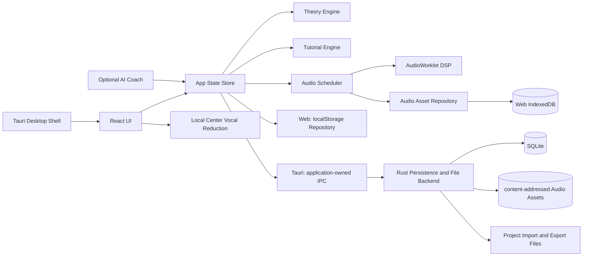

# Compose Tutor Studio 仕様書 v0.1.0

作成日: 2026-06-11

> 現行のCubase Pro / Logic Pro比較、実装済・部分・未実装の判定、Batch 3以降の依存roadmapの正本は`docs/13_pro_daw_gap_matrix.md`である。本書に含む`07. 開発計画とタスク分解`のMVP Phase / Milestoneは初期計画の履歴であり、現在の実装順序として使わない。

---

# 前提・仮定ログ

- 作成日: 2026-06-11
- 仕様バージョン: 0.1.0
- 仮称: Compose Tutor Studio
- 目的: Cubase Pro、Logic Pro、Ableton Live、FL Studio、Bitwig Studio などの強みを「教育統合型の作曲アプリ」として再設計する。
- 最重要方針: 初学者が 1 曲を完成させることを最優先にする。商用DAWの完全互換や全面的なプラグインホスト化は初期MVPから外す。
- 法務方針: 既存DAWの名称・UI・素材・プリセット・サンプル・マニュアル文言をコピーしない。機能アイデアを抽象化し、独自UI・独自チュートリアル・独自教材に落とし込む。
- 技術方針: MVP は Tauri + React + TypeScript + Web Audio / AudioWorklet を中心にし、低遅延・プラグインホスティング・高度なオーディオ編集は後続フェーズで JUCE / Rust native engine を検証する。
- AI方針: AIは「代作」ではなく、コード理論・作曲判断・練習問題・改善提案を説明するコーチとして扱う。
- 主要対象OS: Windows と macOS。Linux は将来対応候補。
- 主要成果物: 仕様書、AIコーディング指示ファイル、API/データモデル、ロードマップ、テスト計画、リスクメモ。

---

# 00. プロジェクトブリーフ

## 1. ゴール

Compose Tutor Studio は、作曲初心者が「DAWの操作」と「作曲理論」を同時に学びながら、短い曲を完成できるデスクトップアプリです。

一般的なDAWは高機能ですが、初心者にとっては以下が障壁になります。

- 何から始めればよいか分からない
- コード進行、スケール、メロディ、ベース、ドラムの関係が見えにくい
- 機能名は分かっても、作曲上の使いどころが分からない
- チュートリアルが操作説明に偏り、音楽的な判断理由まで教えてくれない

このアプリは、作曲ワークフローの中に教材を埋め込みます。ユーザーがノートを置く、コードを選ぶ、セクションを増やす、ミックスするたびに「なぜそうするのか」を短く説明し、必要な演習へ誘導します。

## 2. 主要コンセプト

| コンセプト | 内容 | 実装上の意味 |
|---|---|---|
| Guided DAW | 初心者を曲完成まで案内するDAW | 画面上に次の行動、理由、練習課題を表示する |
| Theory-aware Editor | 音楽理論を理解するエディタ | キー、スケール、コード、機能和声、テンション、ボイスリーディングを内部モデル化 |
| Action-based Tutorial | 操作に連動する教材 | ユーザーの編集内容からチュートリアル進行を判定 |
| Idea-to-Song | 断片を曲にする支援 | ループ、コード、ドラム、ベース、メロディをセクション構造へ展開 |
| Explainable AI Coach | 代作ではなく説明するAI | 提案の根拠、別案、練習問題を返す |

## 3. 競合DAWから抽象化して取り込む強み

| 参照DAW | 参考にする方向性 | 本アプリでの再設計 |
|---|---|---|
| Cubase Pro | Chord Track、Chord Pads、Scale Assistant、MixConsole | コード進行を中心に、初心者向けの和声説明を重ねる |
| Logic Pro | Chord ID、Chord Track、Session Players、Stem Splitter、Mastering Assistant、Step Sequencer、Live Loops | AI/自動支援の結果だけでなく、理由と編集ポイントを表示する |
| Ableton Live | Session/Arrangement 的な発想、MIDI Generators/Transformations、Keys and Scales | ループの試作から曲構成へ移行できる二段階ワークフロー |
| FL Studio | Pattern/Channel Rack 的なビート制作、Piano Roll、Loop Starter、Chord detection | パターン単位で始め、セクションへ展開する初心者導線 |
| Bitwig Studio | Automation Clips、Clip Aliases、Project-wide Key Signature、modulation | 反復構造と変化を初心者にも見える形で編集する |
| Studio One / Fender Studio Pro | テンプレート、単一画面ワークフロー、マスタリング導線 | 作曲開始テンプレートと完成チェックリストを強化する |

## 4. 成功指標

| 指標 | MVP目標 | 測定方法 |
|---|---:|---|
| 初回曲完成率 | 60%以上 | 初回起動から7日以内に8小節以上の曲を保存/書き出し |
| チュートリアル完了率 | 50%以上 | 基礎コース完了ユーザー割合 |
| 離脱ポイント | 重大離脱画面を3箇所以内に特定 | イベントログ分析 |
| 学習効果 | 事前/事後テストで20%以上改善 | コード/スケール理解テスト |
| 安定性 | クラッシュ率 1%未満 | ローカル診断ログ、クラッシュレポート |

## 5. 非ゴール

- Cubase Pro / Logic Pro / Ableton Live / FL Studio / Bitwig Studio のクローンを作ること
- 初期段階でプロ向け録音・ミキシング・マスタリング機能をすべて実装すること
- 既存曲を模倣する生成AI機能を売りにすること
- 商用サンプルやプリセットを無断同梱すること

## 6. MVPの一文定義

初心者が、テンポ・キー・コード進行・ドラム・ベース・メロディの関係を学びながら、8〜16小節のオリジナル曲を作成し、MIDI/WAVとして書き出せるデスクトップアプリ。

---

# 01. 製品要件定義 PRD

## 1. ペルソナ

### P1: 完全初心者

- DTMソフトを開いたことはあるが、何から始めるか分からない
- コード理論は断片的に知っている
- 目標は、SNSやYouTubeで使える短いBGMを作ること

必要な支援:

- 最短で音が出るテンプレート
- 次に何をすればよいかの表示
- 専門用語のインライン解説
- 「良い/悪い」ではなく「狙いに合っている/合っていない」という説明

### P2: ゲーム配信者・動画制作者

- 自分の動画・配信用にBGMやジングルを作りたい
- 既存BGMの権利問題を避けたい
- 完成までの速度を重視する

必要な支援:

- 15秒/30秒/60秒テンプレート
- ループ可能な構成
- 雰囲気プリセット: 明るい、緊張、チル、疾走感、レトロゲーム風など
- MIDI/WAV書き出し

### P3: 中級に進みたい学習者

- コード進行を使った作曲を学びたい
- メロディとコードの関係を理解したい
- 自分の作風を作りたい

必要な支援:

- 機能和声、借用和音、セカンダリードミナント等の段階的解説
- 自作進行の分析
- 代替コード提案
- メロディ添削

## 2. ユーザーストーリー

| ID | ユーザーストーリー | 優先度 | 受け入れ条件 |
|---|---|---:|---|
| US-001 | 初心者として、テンプレートから曲作りを始めたい | Must | 3クリック以内に音が鳴るプロジェクトを作れる |
| US-002 | 初心者として、コード進行を選ぶ理由を知りたい | Must | コード選択時に機能、響き、次の候補が表示される |
| US-003 | 初心者として、スケール外の音を避けたい | Must | ピアノロールでスケール内/外が視覚的に区別される |
| US-004 | 作曲者として、コードに合うベースを作りたい | Must | ルート/5度/経過音の候補を生成・説明できる |
| US-005 | 作曲者として、ドラムパターンを素早く作りたい | Must | 4/4基本パターンをステップシーケンサーで作れる |
| US-006 | 学習者として、課題を解く形で理論を覚えたい | Must | レッスン、演習、判定、解説、進捗保存ができる |
| US-007 | 動画制作者として、ループBGMを書き出したい | Must | MIDIとWAVをエクスポートできる |
| US-008 | 中級者として、借用和音を試したい | Should | モーダルインターチェンジ候補を提示できる |
| US-009 | ユーザーとして、AIに改善案を聞きたい | Should | プロジェクトのコード/メロディ情報から説明付き提案を返す |
| US-010 | 上級者として、外部VSTを使いたい | Could/Future | VST3 SDK/ライセンス確認後に実装判断 |
| US-011 | 動画制作者・学習者として、利用許諾のある既存曲からカラオケ練習用音源を作りたい | Should | 対応するステレオ音源を端末内で中央定位軽減し、A/B試聴後にWAVを書き出せる |
| US-012 | 作曲者として、曲に楽器・ドラム・音源・Busを足して音色と経路を整えたい | Must | production UIから安全に追加・複製・並べ替え・一般Track削除を行い、内蔵音色、main output、pre/post-fader sendを選んで保存・Undo・再生・WAVへ反映できる。schema v4では学習role Trackも改名できてroleを保持し、削除だけを保護する |
| US-013 | 作曲者として、手元の音声を曲へ置いて非破壊編集したい | Must | WAV / MP3 / M4A / AACをAudio Trackへ読み込み、移動、左右trim、gain、fade、loop、split、独立複製、削除をUndo/Redoでき、live再生・WAV・再読込で同じ範囲を使う |
| US-014 | 作曲者として、マイク入力を新規または既存のAudio Trackへ録音したい | Must | Audio Trackを1件だけ録音待機にでき、システム既定または列挙された入力を選び、最大60秒のdry録音を現在playheadから新しいClipとしてasset-firstで採用できる。成功はUndo 1回、失敗・cancelはProject不変とする |
| US-015 | 作曲者として、同じ区間を複数回録った素材から良い部分をつないで仕上げたい | Must | 同一Audio Track・同一時間窓の既存Clipを非破壊take folderへまとめ、複数範囲を別takeへ切り替え、境界調整・未使用take削除・Undo/Redo・保存/再読込・live/WAVで同じcompを使える |

## 3. MVP機能範囲

### 3.1 Project

- 新規作成
- テンポ、キー、拍子、長さ
- ローカル保存/読み込み
- 自動保存
- プロジェクトテンプレート

### 3.2 Composition

- Chord Track: 小節単位のコードイベント
- Piano Roll: ノート入力、移動、長さ変更、ベロシティ
- Drum Step Sequencer: キック、スネア、ハイハット、クラップ等
- Bass Assistant: コードルート、5度、オクターブ、経過音候補
- Melody Assistant: コードトーン、アプローチノート、モチーフ反復の可視化
- Pattern/Clip: 1〜4小節単位の素材を組み合わせる
- Track管理（部分実装）: instrument / drum / stereo Bus追加、音源fileからのAudio Track追加、non-master複製・並べ替え、一般non-master削除、内蔵synth 4音色の選択。schema v4の`Track.role`を学習上の正本にし、学習role Trackも名前を変更できる。学習roleの削除は保護し、一般TrackはChords / Bass / Melodyという名前でもroleを推測しない。Folder / Stackは後続とする
- Audio Clip: app-ownedな48 kHz mono/stereo PCM 16-bit WAVへ正規化し、移動、trim、gain、fade、loop、split、独立複製、削除を非破壊に行う。loop中は位相fieldがまだないためleft trimとsplitを無効にする
- Audio Take Comp: 同一Audio Track・同一時間窓の既存非loop Clipをschema v5のtake folderへまとめるほか、明示loopの2〜128固定passとbounded Auto Punchの録音takeを自動take folder化する。Auto Punchはempty / spanning Clip / exact folderの3形だけを非破壊採用し、生成全体を1 gesture = 1 Undoで保存する

### 3.3 Learning

- 初回オンボーディング
- 基礎コース: 音名、半音/全音、メジャースケール、ダイアトニックコード
- 作曲コース: 8小節のコード進行、ドラム、ベース、メロディ、構成
- インライン解説
- 演習判定
- 復習キュー

### 3.4 Audio

- 内蔵シンプルシンセ
- 内蔵ドラム音源
- 音量、パン、ミュート、ソロ
- 簡易エフェクト: EQ/Filter、Delay、Reverb、Compressorの最小版
- WAVレンダリング
- app-owned Audio Assetのlive再生とoffline WAV取り込み。Project単体JSONには音声binaryを同梱せず、欠落・変更・storage不可を音声素材ごとに表示する
- 最大60秒の単一マイク入力録音。録音待機なしでは新規Audio Track、録音待機中の既存Audio Trackでは同Trackへ新しいAudio Clipを追加する。録音待機と入力device選択はruntime-onlyでProjectへ保存しない
- 録音待機中のAudio Trackへ、loopとは独立したin / out locatorとpre / post-rollを使うbounded Auto Punch。punch-in exact frameから対象Trackの既存再生だけをgateし、natural post-roll完走後にasset-firstで採用する。monitorは自動切替せず明示opt-inを維持する
- WAV/MP3/M4A/AACのステレオ音源を使う、ローカル完結の中央定位ボーカル軽減
- stereo Bus、各non-Masterのmain output、pre/post-fader send / return。循環は候補Project採用前に拒否し、live再生とoffline WAVで同じrouting graphを使う

### 3.5 Export

- MIDI書き出し
- WAV書き出し
- ボーカル軽減後のカラオケ用PCM 16-bit WAV書き出し
- プロジェクトJSON/SQLite保存

## 4. MVPから外す範囲

| 項目 | 理由 | 後続判断 |
|---|---|---|
| VST/AUホスト | SDK、ライセンス、安定性、クラッシュ分離が重い | v1.5以降で検証 |
| ASIO正式対応 | Windowsドライバ、SDK、ユーザー環境依存が大きい | 低遅延が必要になった段階で検証 |
| Stem separation 本実装 | MLモデル、処理速度、権利、品質評価が重い | 外部API/ローカルモデル比較後 |
| 自動マスタリング本実装 | 音質評価・責任範囲が大きい | まずはラウドネス/ピーク診断に限定 |
| 楽譜エディタ | 実装量が大きい | MIDI編集が安定後 |
| クラウド同期 | 個人情報・音源データ扱いが増える | ローカル完結後 |
| VCA / side-chain / hardware I/O routing | stereo Busとpre/post-fader sendまでは利用可能だが、制御グループ、side-chain入力、外部入出力は対象外 | 基本routingとautomation UIが安定してから独立Batchで追加 |
| Quick Punch / 高度な録音・comp | 単一入力の伴奏同期録音、物理loopback実測校正、既存Clipの手動take folder化、bounded fixed-pass cycleとAuto Punchの自動take生成までは持つ。Quick Punch、automatic input monitoring、Auto Punchとcycleの併用、disk streaming、arbitrary overlaps、input hot switch、multi-input、MIDI comp、named comps / flattenは持たない | bounded cycle / Auto Punchを3OS実機で検証し、残差を独立gateで追加する |

## 5. 非機能要件

| 分類 | 要件 | MVP基準 |
|---|---|---|
| 性能 | 再生開始レスポンス | 100ms以内を目標。要実測 |
| 性能 | UI操作 | ノート移動/ズーム/スクロールで目視カクつきが少ない |
| 安定性 | 自動保存 | 編集後30秒以内。デスクトップ版は編集受付後1秒未満を目標にクラッシュ保護ACKを表示し、ACK済み内容をOS強制終了後に復元 |
| 安定性 | 音声開始/中断 | 開始完了前は再生中と表示せず、失敗・出力中断後も編集を保持して再試行できる |
| 安定性 | Audio Asset | 1 object 128 MiB以下、canonical 48 kHz / 1〜2 channel PCM16 WAV、SHA-256と実byte lengthを保存・読込・再生前に照合する。decode済みcacheは256 MiB以下 |
| 互換性 | OS | Windows/macOS 優先 |
| アクセシビリティ | キーボード操作 | 主要操作はショートカット対応。単一文字キーは対応コントロールへのフォーカス中だけ有効にする |
| プライバシー | ローカル保存 | デフォルトではプロジェクトを外部送信しない |
| プライバシー | カラオケ作成 | 読み込んだ音源と生成音源を外部送信せず、Projectへ保存しない |
| 検証性 | テスト | theory engine は単体テスト必須、UIは主要フローE2E |

## 6. 完了の定義

- 初回ユーザーがテンプレートから曲を作り、保存し、再起動後に読み込める
- 8小節のコード進行に対して、ドラム、ベース、メロディを作成できる
- レッスンの開始、判定、完了、進捗保存ができる
- MIDI/WAVを書き出せる
- 利用許諾のあるステレオ音源から、ローカル処理でカラオケ用WAVを作成できる
- instrument / drum / Audio / Bus Trackの管理と音色・routing変更が、Master保護、schema v4学習roleの改名時維持・削除保護、128 Track上限、Undo/Redo、自動保存、再読込、再生で一貫する
- Audio Trackへ取り込んだ音声を非破壊編集でき、live再生とWAVが同じsource range / gain / fade / loopを使う。欠落・変更されたbinaryは別素材へ黙って置換せず、Project metadataを保持して説明する
- システム既定または選択した単一マイクから、新規または録音待機中の既存Audio Trackへ録音できる。録音待機と入力deviceはProject保存・履歴を汚さず、採用したAsset / ClipだけをUndo 1回で戻せる
- 既存Audio Clipを非破壊take folderへまとめ、2つ以上の範囲を別takeへ切り替え、境界・未使用takeを編集できる。Undo/Redo、保存・再読込、live/WAVが同じgapless compを使う
- 主要ロジックにテストがある
- 既存DAWのUIコピーではなく、独自デザインである

---

# 02. 機能仕様

## 1. 機能一覧

| モジュール | 機能 | MVP | 説明 |
|---|---|---:|---|
| Project | 新規作成/保存/読み込み | Yes | WebはlocalStorage repository、Tauriはapplication-owned SQLiteへ自動保存。Project集約をexact roundtripできる交換形式は`.ctsproj.json`だけ |
| Template | 作曲テンプレート | Yes | 8小節、16小節、BGM、ジングル等 |
| Chord Track | コードタイムライン | Yes | 小節単位でコードを置く。機能と候補を表示 |
| Chord Palette | コード候補 | Yes | ダイアトニック、代理、借用、セカンダリ候補 |
| Scale Assist | スケールガイド | Yes | スケール内外を可視化。スナップ可能 |
| Piano Roll | MIDI編集 | Yes | ノート作成、移動、複製、量子化、ベロシティ |
| Drum Sequencer | ステップ入力 | Yes | 16ステップ基本。後続で確率/スウィング |
| Clip Launcher | ループ試作 | Partial | MVPは簡易クリップ一覧。v1で非線形再生 |
| Arranger | セクション配置 | Yes | Intro/A/B/Chorus/Bridge/Outro ラベル |
| Mixer | 音量/パン/ミュート/ソロ/routing | Yes | 各トラックの基本操作、stereo Bus、main output、pre/post-fader sendを扱う |
| Automation | Track音量/パンの時間変化 | Yes | 選択中のnon-Master Trackについて、beat snap付きlane editorでpointの追加・編集・削除・全消去とhold / linear補間を保存する |
| Effects | 基本エフェクト | Partial | Filter/Delay/Reverbを最小実装 |
| Tutorial | 操作・状態連動チュートリアル | Yes | 確定操作イベントと採用済みProject/UI状態を再照合して進行 |
| Exercise | 理論演習 | Yes | コード判定、スケール判定、メロディ添削 |
| AI Coach | 説明付き改善提案 | Optional | APIキー設定時のみ。MVPではモック可 |
| Export | MIDI/WAV | Yes | MIDIはFormat 1の正規化projection、WAVは簡易レンダー |
| Import | MIDI import | Yes | `.mid` / `.midi`を検証し、MTrkとchannelに応じた複数トラックを現在の曲へ追加する |
| Vocal Cut | カラオケ作成 | Yes | ステレオ中央定位をローカル軽減し、A/B試聴後にPCM 16-bit WAVへ書き出す。ML stem分離ではない |
| Track Management | Track追加・整理・音色 | Partial | production UIはinstrument / drum / stereo Busと音源fileからのAudio Trackを追加し、non-masterの複製・並べ替え、一般Trackの削除・改名、synth 4音色を扱う。schema v4では学習role Trackも改名可能でroleを保持し、削除だけを保護する。Folder / Stackは未実装 |
| Audio Track | Audio file配置 / マイク録音 | Yes | fileまたは最大60秒の単一マイク入力をapp-owned 48 kHz mono/stereo PCM16 WAVへ正規化し、content-addressed保存、既存Audio TrackへのClip追記、非破壊編集、live/WAV再生、欠落・変更診断を行う。Project JSON単体にはbinaryを同梱しない |
| Audio Take Comp | 既存Audio Clip、固定pass、Auto Punch録音からテイク編集 | Yes | 同一Track・同一時間窓のClipを手動でまとめるか、明示loopを完走した2〜128 passまたはbounded Auto Punchの録音から自動take folderを作り、採用takeをlive/WAVへ反映する。Quick Punch / cycle併用 / MIDI compingは未実装 |
| Stem Separation | パート分離 | Future | 外部API/ローカルモデル検証後 |
| Plugin Host | VST3/AU | Future | ライセンス/安定性確認後 |

## 2. Chord Track

### 2.1 目的

曲全体の和声設計を可視化し、初心者がコード進行を理解しながら編集できるようにする。

### 2.2 UI要素

- タイムライン上部にコードレーンを固定表示
- 各コードイベントは `小節範囲 / コード名 / 機能 / 色` を持つ
- クリック時に右パネルで以下を表示:
  - コード構成音
  - キー内での度数
  - 機能: Tonic / Subdominant / Dominant / Other
  - 次に進みやすい候補
  - 初心者向け説明

### 2.3 入力仕様

- コード名直接入力: `C`, `Am`, `Fmaj7`, `G7`, `Dm7/G` など
- パレット選択: I, ii, iii, IV, V, vi, viiø
- 候補生成: 現在キーと直前コードから候補表示
- 進行テンプレート: I-V-vi-IV、vi-IV-I-V、ii-V-I など
- コードグリッドは `←` / `→` / `Home` / `End` で小節を選び、`Enter` / `Space` でその小節に追加できる
- コードイベントはクリック・タップまたは `Enter` / `Space` / `F2` で編集できる
- 編集ポップオーバーで開始小節と長さを数値入力でき、ドラッグ・リサイズのキーボード代替とする
- `Escape` または外側操作で閉じられ、適用・閉じる後は起点のコードへフォーカスを戻す
- コード削除後は次、前、グリッドの優先順で論理的なフォーカス先を選ぶ

### 2.4 判定仕様

- コードの構成音をノート番号で管理
- キーに対する度数を算出
- ダイアトニック内/外を判定
- 借用和音・セカンダリードミナントはタグ付け
- 初心者モードでは複雑なタグを折りたたむ

### 2.5 受け入れ条件

- Cメジャーで `C - G - Am - F` を置いたとき、I - V - vi - IV と表示される
- `E7 -> Am` を置いたとき、Amに対するセカンダリードミナント候補として説明できる
- コード変更時、ベース/メロディガイドが更新される
- 8小節の各コードにポインターとキーボードの両方で到達でき、横ズーム時も選択小節が表示範囲に入る
- 不正なコード名は保存せず、入力と関連付けた回復可能なエラーとして読み上げる

## 3. Piano Roll

### 3.1 目的

MIDIノート編集と同時に、スケール・コード・メロディ作法を学べる画面にする。

### 3.2 表示

- 縦軸: ピッチ
- 固定編集音域: C2〜C6。importされた音域外ノートはprojectとexportに保持するが、Piano Rollのノート表示・選択・Velocity Lane編集の対象外とする
- 横軸: 拍/小節
- ノート: 長方形
- コードトーン: 強調表示
- スケール内音: 通常表示
- スケール外音: 薄色/警告表示
- 解決先候補: ホバー時に表示

### 3.3 操作

- ダブルクリックでノート追加
- ドラッグで移動
- 端をドラッグで長さ変更
- Alt/Option + ドラッグで複製
- 「選択ノートをクオンタイズ」ボタンにフォーカス中のQで量子化
- 「スケールスナップ」ボタンにフォーカス中のSで切替
- 「コードトーン」ボタンにフォーカス中のCでChord Tone Highlight切替
- ノート移動・長さ・ベロシティのドラッグ中はローカルプレビューだけを表示し、主ポインターの`pointerup`で最終値を1回だけ確定する。1ジェスチャーはUndo 1回で全体を戻せる
- クリップ右端への追加はノート全体が収まる最後の開始位置へ置き、量子化の最近傍グリッドが終端を越える場合は最後の有効グリッドへ戻す
- `pointercancel`または予期しないpointer capture喪失では、プレビューを破棄し、project・履歴・revision・保存・教材イベントを変更しない
- 複数ノート移動は掴んだノートを基準に共通デルタを使い、クリップ・音域境界でも相対タイミングを維持する
- Scale Snap有効時も、上下方向に次のスケール音がC2〜C6内にない操作と、時間方向だけを要求した移動・複製がclip境界でbeat delta 0になる操作はno-opにする。直交方向の音高補正だけを確定しない
- Alt/Option複製は3px以上移動し、最終位置または音高が変わった`pointerup`で初めてIDを生成する。未確定コピーは実ノートとは別のゴースト表示にする
- 固定編集音域内のノートはトグルボタンとして音名・開始・長さ・強さ・スケール内外・選択状態を読み上げ、そのうち1音だけをTab順に入れる。Home/EndとShift+PageUp/PageDownで前後の音へフォーカス移動する
- coarse pointerではノートのpointer hit targetを最低24×24 CSS pxにする。Velocity Laneは固定編集音域内のノートだけを描画し、値比例の可視高を保ったまま透明な44px以上のhit領域を持つ
- ノート上の矢印キーは選択群を移動し、Shift+左右矢印は長さ、PageUp/PageDownは強さを変更する。非repeatの1 keydownを1 batchとして確定し、Undo 1回で戻す
- Enterは単独選択、Spaceは選択切替、Cmd/Ctrl+Aは現在clipの固定編集音域C2〜C6全体（水平viewport外を含む）を選択し、importされた音域外ノートは対象外とする。Cmd/Ctrl+Dは1グリッド先へ複製してコピーへフォーカスし、Delete/Backspaceは削除して次・前・空グリッドへフォーカスを戻す
- 固定編集音域内にノートがない空グリッドでは、グリッド自体をTab順に入れ、矢印/Home/Endで入力位置を動かし、Enter/Spaceでノートを追加してその音へフォーカスする。coarse pointerの空グリッドはbrowser/WebViewのnative pan・scroll gestureを妨げない

### 3.4 学習連動

- スケール外音を置いた場合:
  - 初心者モード: 「これはキー外の音です。緊張感として使うか、近いスケール内音に移動できます。」と表示
  - 中級モード: アプローチノート、ブルーノート、クロマチック等の可能性を表示
- コードトーンに着地した場合:
  - 「安定した着地」として説明
- 連続跳躍が多い場合:
  - 「歌いやすさ」観点のアドバイスを表示

## 4. Drum Step Sequencer

### 4.1 目的

初学者がリズムの土台を早く作れるようにする。

### 4.2 MVP仕様

- 4/4、16ステップ
- レーン: Kick, Snare, Closed Hat, Open Hat, Clap, Perc
- ベロシティ: 3段階または0〜127
- Swing: 0〜100%（永続値0〜1）
- 全体probability: 0〜100%。DrumEventに個別probabilityがある場合はclip全体値より優先する
- velocity humanize: 0〜127。正のseedとevent identityから決定的に解決する
- Pattern length: 1/2/4小節
- clipが小節途中で終わる場合も`ceil(lengthBeats / beatsPerBar)`小節を表示する。最終partial barではstep開始beatがclip終端より前のcellだけを編集可能にし、終端以降はdisabledにする。clip長やeventを表示都合でpaddingしない
- Projectから作る再生用raw scheduleは、各hitにTrack / Clip / DrumEvent identity、元の`stepIndex`、clip終端、`stepsPerBar`、拍子由来の`beatsPerBar`、velocity、実効probability、swing、humanize、seedを自己完結して持つ。この値は再生開始時のProject snapshotから導出し、選択中clip、Drum Editorの表示有無、以前開いたprojectのUI状態へ依存しない
- ライブ再生とWAV書き出しは同じ純粋なoccurrence resolverを使う。swing対象はproject絶対beatではなくclip内の元step parityで決め、乱数saltはTrack / Clip / DrumEvent identityとunwrapped occurrence beatから作る。同じProject・seed・再生開始位置・loop regionなら、hitの採否、onset、velocityのevent planを再現できる
- resolverは、version tag、保存済みseed、Track / Clip / DrumEvent identity、lane、元step、1e-6 beatへ丸めたunwrapped raw occurrenceから32-bit `voiceSeed`を導出する。`voiceSeed`は再生用resolved payloadだけに持つ一時値で、Project / SQLite / project exportへ永続化しない
- swing後のonsetが、そのoccurrenceへ平行移動したclip終端以上ならhitを鳴らさない。no-loop schedulerはswing最大遅延分だけraw event探索を手前へ広げ、隣接するhalf-open window間で遅延hitを欠落・重複させない

### 4.3 テンプレート

- Four on the floor
- 8-beat pop
- Hip-hop basic
- Game loop basic
- Lo-fi basic

### 4.4 学習連動

- キック: 拍の重心
- スネア/クラップ: 2拍目/4拍目のバックビート
- ハイハット: 細かい時間感覚
- スウィング: 偶数ステップの遅れ

### 4.5 Loop / determinism境界

- drum `Clip.loop`はProjectへ保存されるが、現行のライブ再生、WAV、drum MIDI projectionではpatternを反復展開しない。反復が必要なdrum clipは、現時点では必要範囲のDrumEventを明示的に持つ
- transportの「ループ」を初めて有効にした時、0..0など無効なboundsは`0..songEnd`の全曲loopへ正規化する。`songEnd`は拍子分母を含むquarter-note beat長で計算し、現在位置は曲内へclampする。停止中のtoggleは再生を開始せず、starting / playing中のtoggleはrequest generationを更新して旧sessionを破棄し、新しいloop設定で同じ位置から開始し直す。Project / historyは変更しない
- 内蔵drum voiceは`Math.random`を使わない。versioned固定seedから同じsample rateのnoise bufferを生成し、`voiceSeed`とkick / snare / hat / clap burst別saltから整数sample-frameの再生offsetを決める。1つのAudioContext内ではnoise bufferを遅延生成して全drum Trackで共有する
- 同じapp build・同じWeb Audio engine/version・同じsample rateによる同一ProjectのWAV再書き出しは、pinned Chromium E2EでWAV全bytesの一致を必須とする。ライブAudioContextとoffline WAV、異なるbrowser / OS / WebView / sample rate間のPCM bit identityは保証しない

## 5. Bass Assistant

### 5.1 目的

コード進行からベースラインを作る導線を提供する。

### 5.2 生成ルール MVP

| モード | 内容 |
|---|---|
| Root Only | 各コードのルートを拍頭に配置 |
| Root + Fifth | 1拍目ルート、3拍目5度 |
| Walking Simple | ルート、コードトーン、次コードへの経過音 |
| Octave Pulse | ルートとオクターブ反復 |

### 5.3 説明

生成結果には「なぜその音を置いたか」をノート単位で表示する。

例:

- Cコードの拍頭にC: ルート音なので安定する
- Gへ向かう直前にF#を置く: 半音上行でGへ強く進む経過音

## 6. Melody Assistant

### 6.1 目的

コードに合うメロディを作るためのガイドを出す。

### 6.2 MVP仕様

- コードトーン着地ガイド
- スケール内ランダム生成
- 反復モチーフ作成
- コール&レスポンスのテンプレート
- 音域チェック

### 6.3 評価ロジック

| 観点 | 判定例 |
|---|---|
| コード適合 | 強拍にコードトーンがあるか |
| 歌いやすさ | 跳躍が多すぎないか |
| 反復 | 似たリズム/音型があるか |
| 変化 | 完全反復だけで単調になっていないか |
| 解決 | 緊張音が次に解決しているか |

## 7. Arranger

### 7.1 目的

ループを曲構造へ展開する。

### 7.2 セクション

- Intro
- A / Verse
- B / Pre-Chorus
- Chorus
- Bridge
- Outro

### 7.3 操作

- セクションテンプレート追加
- クリップの複製/エイリアス
- セクションごとの密度調整
- ミュート/アンミュートによる展開作成

独立複製はClipと全Note / DrumEventへ新しいIDを発行し、その後の編集を分離する。連動複製はMIDI / Drumだけを対象に、同じTrack・type・長さの正本Clipを`aliasOf`で直接参照する。素材payloadは正本だけが所有し、連動Clipは配置、長さ、loop、参照IDだけを持つ。自己参照、別Track / type、dangling、alias chain、payload重複は拒否する。連動Clipを編集した場合も1回のcommitで正本を書き換え、全配置の表示・ライブ再生・WAV・MIDIへ同じ内容を反映する。連動解除は現在の素材を新しいevent IDでatomicに複製し、Clip IDと配置を保ったまま独立化する。

ArrangerはTrack lane上のClipを選択し、開始位置と長さ、右隣への独立/連動複製、連動解除を操作できる。MIDI Clipには「素材をクリップ末尾まで繰り返す」checkboxを表示し、正本/aliasを問わず選択したtimeline instanceの`loop`だけを変更する。素材は正本と共有してもloop設定は各配置へ帰属し、Undo/Redoで往復できる。初期実装では連動Clipの長さは正本と一致し、正本に連動先がある間の単独resizeを拒否する。配置範囲はProject内のhalf-open区間に収め、重なりは既存の加算再生を維持する。

Audio ClipはMIDI / Drumの`aliasOf`を使わず、同じimmutable AudioAsset bytesを参照する独立Clipとして扱う。移動、左右trim、clip gain、frame単位fade、loop、split、独立複製、削除を操作でき、各確定はUndo 1回にする。非loopのtrimはtempo map上の経過秒を48 kHz source frameへ変換してrate 1.0のsource rangeとtimeline windowを同期する。loopのright trimは外側の反復窓だけを変える。loop phaseを永続化するfieldがない間は、loop中のleft trimとsplitを型付きに拒否する。

複製後に解決される保存済みNote / DrumEvent payloadが200,000件を越える場合、操作はProject / history / selectionを変えず拒否し、ノート・ドラム・コピーを減らす案内を表示する。この永続予算ではMIDI Clip loopの派生音を増やさない。ライブはMIDI Clip loopの展開後Noteと派生Chord noteを含む実効scheduleを20,000件以下、WAVは全曲を一括scheduleするため10,000件以下に制限する。両者とも展開後onsetの0.75拍rolling window内を256件以下に検査する。transport loopは反復後のsteady-state密度も同じ上限で再検査し、超過時はper-track Web Audio graph / event nodeを作らず型付きに拒否する。WAV超過時はOfflineAudioContextと部分fileを作らない。

### 7.4 学習連動

- Intro: 要素を少なく始める
- A: メロディ/モチーフを提示
- Chorus: 音域、密度、コード変化で盛り上げる
- Outro: 要素を減らして終える

### 7.5 Track管理、stereo Bus、内蔵音色（schema v4、部分実装）

- productionの追加UIは`instrument` / `drum` / `bus`に加え、音源fileを選んだ時だけ`audio`を作成する。instrument / drumの新規Trackには0拍から曲末までを覆う空のMIDI / Drum Clipを1つ作り、Audio Trackには正規化済みasset全rangeを参照するAudio Clipを1つ作る。BusはClipとinstrumentを持たない空のstereo returnとして作る。配列先頭のMasterがあればその直前、Masterがないlegacy Projectでは末尾へ挿入し、新規non-Masterのmain outputはMasterとする。instrumentは`softPad`を既定音色、drumは内蔵drum kitを既定とし、作成後は新しいTrack / Clipを選択する
- Mixerの「経路」は各non-Masterにexact 1件のmain output（Masterまたは既存Bus）と、sourceごと最大16件のsendを表示する。16件到達後は追加controlを閉じて上限を説明する。sendは既存Busだけをtargetにし、`pre-fader`はsource音量・insert前、`post-fader`はsource音量・insert・pan後をtapする。gainはlinear 0..2、enabledはliveで10ms平滑更新し、main output / target / position / add / removeはgraph再構築のためactive playbackを停止する
- outputとsendを合わせたgraphは無効・gain 0のsendも含めて常に非循環でなければならない。同じsource→Busの重複send、main outputと同じBusへのsend、自分自身、Master発のedgeを候補採用前に拒否する。循環拒否時はProject / history / revision / autosave / playbackを変更しない
- 複製・並べ替えの対象はnon-master Track、削除の対象は後述の学習Trackを除く一般non-master Trackとする。Masterは改名、複製、並べ替え、削除、音色選択の全対象から外し、legacy Projectに複数のMasterがあってもUIのTrack管理操作でそのidentityや相対順を変えない
- Track複製ではTrack、全Clip、全Note / DrumEvent、全Effectへfresh IDを発行する。複製元Track内の`aliasOf`は旧Clip ID→新Clip IDの対応で複製先内へ張り替え、元Track参照やdangling参照を残さない。main outputと複製元がsourceであるsendも値として複製し、send IDをProject全体でfreshにするが、複製元Busへのincoming output / sendは複製しない。音量、pan、mute / solo、instrument、effect parameter、配置と素材内容は値として複製し、複製先roleは`general`にする
- Track削除では自身のmain outputとsource / targetいずれかが自身であるsendを同じtransactionで除去する。Bus削除ではそのBusへmain outputを向けていた生存TrackだけをMasterへ戻し、途中のdangling routeをProject / historyへ公開しない
- synth音色のproduction選択肢はcanonicalな`softPad` / `brightPluck` / `warmBass` / `brightLead`の4つとする。既存aliasは表示時に対応するcanonical音色へ解決しても、選択操作までは保存値を書き換えない。drum kit選択はこのBatchの対象外とする
- schema v4では`Track.role`が教材と伴奏支援の正本であり、runtimeで名前から推測しない。学習role Trackもlocal draftから改名でき、確定後もroleを保持する。一般Trackが`Chords` / `Bass` / `Melody`を名乗っても学習roleにはならない。学習role Trackの削除はdomain境界で保護し、trim後の有効名を明示確定した時だけ1回のProject changeとしてcommitする
- instrument TrackのInspectorでは`general` / Chords / Bass / Melody roleを選べる。同じ学習roleを別Trackへ割り当てた場合は旧ownerを`general`へ戻し、候補Project全体を1 commandとして検証・採用する
- 各commandは候補Project全体をcanonical codec / validationへ1回通し、128 Track上限、Clip / event予算、文字列上限などに違反する場合はProject、history、revision、autosave queue、選択、再生sessionを変えずatomicに拒否する。no-opも履歴や保存を進めない
- 採用された追加・複製・並べ替え・削除、role変更またはpreset変更は、再生開始時snapshotとの不一致を避けるためactive playbackを停止する。ただしplayhead beatは保持し、次の再生が採用済みProjectからschedule / graphを再構築する。改名だけでは再生を停止しない
- 採用されたcommandはUndo 1回ぶんの履歴、revision 1回、自動保存1回として扱う。追加・複製は新しいTrack / Clip、並べ替えは同じID、削除は生存する隣接Trackとその先頭Clip（なければselection null）へ選択をreconcileし、Undo/Redoと再読込後も存在しないIDを選択へ残さない

### 7.6 Audio Track import / Asset / playback

- 入力はWAV / MP3 / M4A / AACをlocalで構造検査し、最大128 MiB、decode後1〜2 channel、decode PCM推定256 MiB以下を`decodeAudioData`前に要求する。hostが要求した48 kHzを採用しない場合は実AudioContext sample rateで再計算する
- import全体は384 MiBのphase peak上限を持つ。descriptor未確定のWeb入力はBlob全読込inspect前に`2 × source + retained decoded cache`を予約し、descriptor取得後にdecode plannerへ原子的にresizeする。decodeを`2 × source + decoded Float32`、canonicalizeを`source + decoded Float32 + 必要時の48 kHz resample Float32 + PCM16 WAV`、保存を`source + decoded Float32 + 8 × PCM16 WAV`としてsafe integerで事前合算し、いずれかのphaseが超える入力はdecode前に拒否する。保存の8倍係数はWeb dedupeの明示5copyとnative IPC body clone / read-backを上回る保守的envelopeである。app-wide leaseはcancel後も実decode / resample jobがsettleするまで残し、2件目のimportをbusy拒否する
- import、Audio Asset付きlive開始、WAV書き出しは同じprocess-wide 384 MiB予約台帳を使う。各reserve / resize / releaseはJavaScriptの同期run-to-completion内で原子的に行い、既存予約とのchecked合計が上限を越える後発処理はresolver / decode / `OfflineAudioContext`前に拒否する。native Audio Track pickerはIPC response size確定前に`2 × 最大envelope + retained decoded cache`を保守的に予約し、Blob生成後はextra response envelopeだけを保持した同じJavaScript turnでdescriptor付きimportを開始する。importはplanner peakとcacheを別予約で引き継ぎ、picker cancel / gateway失敗 / unmount / import settlementの全経路でselection予約を冪等解放する。import本体は実decode rateで予約を拡縮し、cancel後の実job settleまで保持する。live開始はdecoded cache lease取得まで保持する。WAVはencode成功時に予約をBlob leaseへ移譲し、Webではobject URLをrevokeするdownload handoff、nativeでは`Blob.arrayBuffer()`とfile gateway IPCのsaved / cancelled / error settlementまで保持して、全経路の`finally`で冪等解放する
- decode結果はduration / frame / sample rateを再検証し、48,000 Hz、元の1〜2 channel、PCM 16-bit WAVへ正規化する。canonical objectは128 MiB以下とし、lowercase SHA-256と実byte lengthをidentityにする。同一bytesは保存objectをdeduplicateしても、Project上のAudioAsset / Track / Clip identityとUndo履歴は独立させる
- Webは専用IndexedDB object store、Tauriはapp data内`audio-assets-v1/sha256/<checksum>`を使う。Tauriは`.staging/<checksum>.tmp`へprivate write・fsync・再読込検証後にrenameし、起動時にvalid stagingをroll forward、破損stagingを削除する。Project save / crash draftは全`ready` assetの実byte lengthとSHA-256をSQLite transaction前に再検証する
- importはsource検査・decode・canonicalize・asset保存をProject外で行い、開始時Project snapshotがまだcurrentの場合だけAudioAsset metadata、Audio Track、Audio Clipを1回のcompare-and-swap history changeとして採用する。cancel、decode / storage失敗、stale Project、codec拒否ではProject / history / revision / selectionを変えない。binary保存後の拒否で生じたorphanは安全であり、native起動時GCが全retained generation / branch / crash draftから到達可能なchecksumを集めて回収する。future / corrupt payloadが1件でもあれば削除を中止する
- Audio Clipの新規作成、移動、右端trim、複製でclip終端が現在の曲末を越える場合は、その位置で有効な拍子mapを使って次の小節境界まで`Project.lengthBeats`を自動延長し、互換mirrorも同じcommand内で更新する。256小節または8,192拍を越える場合はProject、history、selection、再生sessionを変えずatomicに拒否する
- liveとoffline WAVは共通のAudio Clip window plannerを使い、seek途中、transport loop、Clip loop、variable tempo、source frame range、gain、fadeを同じhalf-open windowへ解決する。Audio Trackはsynth voiceを作らず、decoded AudioBufferをTrack graphへrate 1.0で接続する。再生前に対象assetを全件preflightし、途中までgraph / WAVを作った状態で欠落を発見しない
- raw objectのchecksum / length検証とdecode cacheを共有し、raw preflightとdecoded PCMは各256 MiB以下に制限する。missing / changed / unavailable / decode / resource超過は型付きに分類し、Track / Clip単位の説明と再読み込み手段を表示する。metadataを自動的に`unresolved`へ書き換えたり、同名の別fileへ黙って置換したりしない
- liveは実AudioContext sample rate確定後、resolver I/OとTrack graph生成前に未使用decoded LRUを解放し、active / in-flight cacheだけを保持量へ数える。resolve/hash phaseは`raw合計 + 2 × 最大raw + retained decoded`、decode phaseは`raw合計 + 最大raw decode copy + target-rate decoded合計 + retained decoded`をchecked加算し、大きい方が384 MiBを越えるProjectを型付きで拒否する
- `.ctsproj.json`はschema v5 metadata、audio take folder、audio routingのexact交換形式だがAudioAsset binaryを同梱しない。単体JSONを別端末・別profileで開く場合は、対応binaryが既に同じcontent-addressed repositoryに存在する時だけreadyとして採用し、それ以外は既存Projectを変更せず非同梱を説明する。per-song bundleは引き続き将来案である

### 7.7 Audio Track録音 / Record Arm

- Track ListとInspectorの`R`は既存Audio Trackだけを対象にし、同時に1件だけを録音待機にする。同じTrackの再操作で解除し、別Audio Trackの操作で録音先を切り替える。録音待機IDはruntime-onlyでProject / history / revision / autosave / SQLite / `.ctsproj.json`へ保存しない。Project切替では解除し、Track削除やUndo / Redoで対象が存在しなくなった時も解除する
- transportの録音buttonは録音先を表示する。通常録音は、録音待機がなければ新規Audio Track、待機中ならその既存Audio Trackへ新しいAudio Clipを追加する。開始操作でProject snapshot、現在playhead、録音先を同じ所有handleへ固定し、既存の再生があれば停止する。3秒countdown後、app-wide AudioContext上の同じ将来render frameをWorkletへarmしてから、そのplayheadをanchorに伴奏再生とcaptureを同時開始する。再生中に任意位置で切り替えるQuick Punchではなく、固定区間は下記のbounded Auto Punchで扱う
- dialogは`システム既定`に加え、`enumerateDevices()`で得た`audioinput`を選択肢にする。空labelには順番付きの代替名を表示し、同一device IDは1件にまとめる。選択IDはrenderer sessionのruntime-only preferenceでありProjectへ保存しない。明示選択時は`getUserMedia`へ`deviceId: { exact: id }`を渡し、未選択時はhost既定を使う
- `devicechange`では待機中の一覧を再列挙する。権限前のprivacy制約でも一覧へ現れない場合があるため、選択済みdeviceを確認できない時は警告しつつ開始操作は残し、凍結したIDをexact指定する。実際に取得できなければtyped errorでProjectを変えず、別入力またはシステム既定を案内する。1 takeの入力IDは開始時に固定し、録音中のhot switchは行わない
- captureは3秒countdown、最大60秒、1〜2 channel、dry録音、monitor初期OFFと明示opt-inを維持する。capture開始前に共有384 MiB予約とrecording tokenを同期取得し、asset上限、既存TrackのClip上限または新規Track上限を検査する。Workletはabsolute context frameとsequenceをchunkへ付け、arm frame途中のrender quantumも正確にsliceし、欠落・重複・世代変更をfail closedにする。借用したapp AudioContextはcapture側でcloseしない
- 録音位置補正はruntime-onlyの`自動（推定） / 実測校正 / 自動なし`と整数-500〜+500 msの手動offsetを持つ。正値は早め、負値は遅らせる。推定値はinput track、`baseLatency`、`outputLatency`、Master limiter look-aheadの申告値・既知値を合算する。`実測校正`は選択中のexact input ID、現在のAudioContext generation / sample rateに一致する成功profileだけを使い、その`latencyFrames`でhost推定、base / output / input latency、limiter look-aheadの合計を置き換えてから手動offsetだけを加算する。profile不一致時に推定値へ黙ってfallbackしない。capture first frameを可変tempo mapでbeatへ変換し、曲頭より前になる時はstartBeatを0にclampしてcanonical assetの`sourceStartFrame / sourceFrameCount`を非破壊trimする
- 実測校正は通常の録音wizardとは分け、オーディオinterfaceの出力を選択入力へケーブル接続する外部I/O校正として案内する。スピーカーからマイクへの空中loopbackは禁止し、app monitorに加えてinterface / driver mixerのDirect Monitor・hardware Loopback・同一outputへのreturnもOFFにするよう開始前に明示する。開始時はtransport表示がstoppedでも保持中のnatural drain graphを同期disposeし、Master automationをProject値へ戻してからprobeを準備する。probe振幅は固定の低levelとし、排他中だけapp-wide AudioContextのMaster gainを既知unityへ正規化してfinallyで元値へ戻す。固定PRBSをMaster / limiter経由で複数burst送出し、同じ将来render frameから選択入力をcaptureする。各burstは最大500 msの整数sample lagを正規化相関し、silence、clipping、同率または近接peakによる曖昧さ、低confidence、context generation / sample rate変化をfail closedにする
- 実測校正はopaqueなIDを固定できる明示選択済み入力だけで開始でき、`システム既定`では開始させない。校正成功時だけ`inputDeviceId / contextGeneration / sampleRate / latencyFrames / confidence`のprofileをrenderer runtimeへ置き換える。Project / history / revision / asset / autosave / SQLite / `.ctsproj.json`には保存しない。app lifetimeの`devicechange`購読はdialog表示や録音phaseにかかわらずfuture profileを破棄する。入力選択または校正中の`devicechange`では進行中校正も中止し、以前の入力へ戻しても自動再利用しない。通常takeは開始時policyをimmutableに所有し、bind前のprofile破棄はfail closed、bind後の変更は現在takeを変えず次回以降だけ無効化する。一般録音は引き続き`システム既定`を利用できる。Web Audioから安定した出力identityを取得できないため、出力deviceまたはdriver / buffer設定変更後は再校正するよう明示する。通常のcancelまたは解析失敗は直前のprofileを上書きしない
- raw PCMを48 kHz PCM16 WAVへ正規化し、bytesとchecksum receiptをrepositoryへ確定してからだけProjectへ採用する。既存TrackではそのTrackのvolume / pan / effects / routingを保ったままAsset metadataと補正済みsource rangeのClipを追記し、新規TrackではTrack / routing / Clipを作る。どちらも開始時snapshotへのexact CAS、Undo 1回、revision 1回として扱う
- loop OFFはone-shot、明示loop ONは2〜128 fixed-pass cycleとして開始前に凍結する。cycleは1本の連続local captureを各周exact Assetへ分割し、pass順take、first-full comp、folderを1 Undoで作る。permission / device loss / context世代変更 / clock不連続 / arm失敗 / manual stop / cancel / unmount / store失敗 / stale snapshot / target消失 / revoked tokenでは全passを破棄し、Project / history / selectionを変更しない
- bounded Auto PunchはRecord Arm済みの既存Audio Trackだけを対象とし、loop / cycleとは独立したruntime-only `punchIn / punchOut / preRoll / postRoll`を開始時に凍結する。pre-roll開始から有限再生し、共有clockのpunch-in exact frameでcaptureを開始する。可変tempoの累積frame丸めと正 / 負latencyを反映してexact punch長へ正規化し、対象Trackの既存再生だけをhalf-open `[punchIn, punchOut)`でmuteする。他Trackと対象Trackの区間外audibilityは変えず、automatic input monitoringは行わない
- capture完了とnatural post-roll完走の両proofが揃った時だけ、empty windowへのClip、1件のspanning Clipをoutside materialごと保つfolder、同じexact windowの既存folderへのtake追記のいずれかへ採用する。Asset bytesを先に保存し、pure domain mutationのcanonical replay、開始時snapshot / operationへのstrict CASを通った成功だけを1 Undoでcommitする。partial / multiple overlap、manual stop / cancel / interruption、permission / device / clock / context / store / replay / CAS失敗ではProject / history / selectionを変更しない。Project schema v5、migration、OpenAPIは変更しない
- Quick Punch、automatic input monitoring、Auto Punchとcycleの併用、入力hot switch、長時間disk streaming、arbitrary overlaps、multi-inputは未実装である

### 7.8 Tempo / 拍子map Editor

- Editorの「テンポ / 拍子」tabは既存schema v4の`tempoMap`と`timeSignatureMap`を同じmusical timeline上で編集する。tempoは20〜300 BPM、拍子は分子1〜32・分母2 / 4 / 8 / 16で、beat 0の先頭eventは位置固定かつ削除不可だが値は編集できる
- tempo eventは曲末未満の任意beat、拍子eventは曲末未満かつ直前segmentから見た小節境界だけへ新規追加・移動できる。同じmapの同beat重複、範囲外、後続拍子eventまたは曲末を小節途中にする候補をatomicに拒否する。canonical schema v4で既に`beat === lengthBeats`にある終端eventは互換入力として、位置を据え置いた値編集 / no-op、曲内への移動、削除だけを許し、新規追加または曲内eventの終端への移動は許さない
- mapはbeat昇順とProject全体のglobal ID一意性を保つ。先頭tempo / 拍子の編集時は`bpm` / `timeSignature` mirrorを同じcommandで更新し、拍子map変更時は`lengthBeats`を正本として`lengthBars` mirrorを再計算する。schema versionは増やさない
- add / update / move / deleteはsourceとcandidateのcanonical codecを通過した時だけ開始時Project参照へcompare-and-swapする。採用された1操作はProject変更・Undo・save revision各1回、no-op / stale / busy / invalid候補はProject、history、selection、transportを変えない
- active playback中の採用はsession snapshotを停止して有限なplayheadを保持する。次の再生、metronome、live / WAV / MIDI、Arranger / Piano Roll / Drum / Chord timelineは保存済みmapを既存の共通musical-time compilerから読む
- 320px幅ではdocument全体を横overflowさせず時間軸だけを内部scrollする。eventはnative controlで選択・keyboard操作でき、anchor保護、入力error、成功、再生停止を日本語のalert / statusで伝える。連続tempo ramp、audio follow / Smart Tempo、tempo automationはこのincrementに含めない

### 7.9 Audio Take / Comp Editor

- 同じAudio Trackにあり、`startBeat / lengthBeats`が一致する非loop Audio Clipを2件以上選べる時、Audio Clip Editorから「テイクにまとめる」を実行する。選択Clipと同じ時間窓の候補を自動検出し、ready asset、source coverage、上限を満たすものだけをschema v5のAudio Take Folderへ変換する
- group後は元ClipをArrangerに重ねて表示せず、1つのtake folder objectとして表示・選択する。初期の「仕上がり」は先頭take全rangeで、後から一致Clipを追加しても現在の仕上がりは変えない
- Editorの6つ目の「テイク編集」tabは「仕上がり」rowとtake laneを同一時間軸へ表示する。laneの範囲を選ぶと、そのtakeを採用するpreviewをcomponent内だけで示し、pointerupで1 Project change / Undo 1回へ確定する。Escape / pointer cancelはProjectとhistoryを変えない
- keyboard / precise操作として、選択take、開始beat、終了beatをlabel付きnative controlで入力して範囲採用できる。comp境界は数値入力で移動でき、隣接rangeの最小長とfolder exact coverを維持する
- compで使っていないtakeだけを削除でき、最低2 takeを残す。削除後は存在するtakeへfocusを戻す。assetがmissing / changed / unavailableのfolder、録音 / 保存operation中、stale selectionではcontrolをdisabledにして理由を表示する
- accepted grouping / take追加 / range paint / boundary移動 / 未使用take削除はactive playbackを停止し、有限なplayheadを保持する。次のlive再生とoffline WAVは同じpure plannerを使い、選択takeだけと0〜50 msの中心crossfadeを鳴らす
- 保存・再読込・Undo / Redoはfolder / take / comp segment ID、immutable source window、fade / gain、crossfade、gapless compを保持する。MIDIへAudioを出力しないが、壊れたtake参照を黙って無視せずMIDI export自体を`invalid-project`で拒否する
- 320px幅ではdocument全体を横overflowさせず、take timelineだけを内部横scrollする。操作対象はnative button / inputと明確なfocus indicatorを持ち、44px相当のpointer targetを維持する
- 固定pass Audio cycle recordingとbounded Auto Punchは自動生成folderとして同じEditorを使う。Quick Punch、automatic input monitoring、cycle併用、disk streaming、arbitrary overlaps、MIDI take / comp、multi-input、named comps、flatten / bounceは対応済みと表示しない

## 8. Mixer

### 8.1 MVP仕様

- Track volume
- Pan
- Mute/Solo
- Meter
- Master volume（MVPで有効なMaster操作はこれだけ。0.0〜2.0）
- Basic effects slot
- non-Masterのmain output（Master / Bus）
- stereo Busとpre/post-fader send / return（有効、送り量、送り先、削除）

Masterの`pan` / `mute` / `solo`は将来互換用の予約フィールドであり、MVPでは音声へ適用せずUIにも表示しない。Master trackを持たないlegacy projectはunity gain（1.0）として再生・WAV書き出しし、Master volumeが非有限値なら音声境界でfail-silent（gain 0）にする。

ライブのTrack出力とWAV PCMは同じstable routing DAGとMaster gainをlimiter直前で一度だけ適用する。Bus soloは関係する上流・下流edgeだけを開き、上流sourceの無関係なMaster直通edgeを漏らさない。ライブ専用のメトロノームもMaster faderを通し、ライブのMaster meterはpost-fader信号を表示する。WAVにはメトロノームclickとUI meter / analyserを含めない。Trackのmute / solo、各Track volume、Master volumeは、再生開始時およびoffline renderではsample 0から確定値を使い、再生中に値を変更した場合だけ10msで平滑化する。

schema v4のAutomationLaneはnon-Master Trackのvolume / panだけを対象にし、Track scalarを最初のpointまでのbase valueとしてhold / linear補間をライブとWAVへ同じbeat→time変換で適用する。各pointの`interpolation`はそのpointから次のpointまでの出力方向の意味を持ち、`hold`は現在値を保ち、`linear`は次の値までbeat上で直線変化する。最終pointの値は曲末後のrelease / effect tailまで保持する。

Editorの「オートメーション」tabは選択中のnon-Master Trackへ結び付き、音量またはパン、beat snapを選んでlane上または現在の再生位置へpointを追加できる。選択pointはbeat、値、次のpointまでの変化方法を編集し、1件削除または確認後のlane全消去を行える。Inspectorは実際に変更したfieldだけをpatchし、beat snapはbeat自体を確定した時だけ適用するため、無編集blurと値だけの編集ではimport済みoff-grid beatの精度を変えない。音量は0〜2、パンは-1〜1、beatは0〜曲末で、同じlaneの同beat重複を採用しない。laneがなければ最初の追加時に作り、最後のpoint削除または全消去ではlane自体を除去する。追加・確定編集・削除・全消去はそれぞれ1 gestureをProject変更1回、Undo 1回、自動保存revision 1回として採用し、no-opまたは拒否では履歴を増やさない。保存・再読込後もvolume / panの独立laneとpoint ID、beat、value、interpolationを保つ。

AutomationLaneは再生session snapshotであり、lane編集はactive playbackを停止して有限なplayheadを保持し、次のplayで再構築する。laneが1件以上ある状態でのmixer / effect編集も同じ扱いである。改名・ノート編集などmixerに無関係なProject変更では、予約済みAudioParam automationをcancelしない。transport loopと可変tempoでも既存の共通resolverを使うため、ライブ再生とoffline WAVは同じ曲線になる。

現行Editorはautomationを常時読み出して適用し、利用者が一時的に無効化するread / bypass modeを持たない。再生操作から値を書き込むwrite / touch / latch、Master、insert / send / tempo parameter、MIDI CCやLFOなどのmodulationは未実装であり、対応済みと表示しない。

### 8.2 学習連動

- クリッピング時に警告
- ベースとキックの重なり説明
- リバーブ過多の警告
- 書き出し前チェックリスト

### 8.3 再生終端と自然テール

- 停止中に再生を要求した時、現在位置が有限かつ`0 <= positionBeat < songEnd`ならその位置を保つ。負値、非有限値、曲末と同じ位置、曲末より後では、拍子分母を含むquarter-note beat長から求めた`0`へ同じstate更新内で巻き戻してから再生を開始する。この補正はloop bounds、Project、Undo/Redo history、save stateを変更しない
- transport loopなしで曲末へ達した時は、transportをただちに停止して位置を0へ戻し、メトロノームと位置更新も止める。一方、最後の音、Filter / EQのIIR state、Delay / Reverb、Compressorのlook-aheadは、controllerが所有する1つだけのdraining sessionで自然に減衰させる。drain中もpost-fader Master meterは残響を表示する
- 最終50ms fadeはMaster limiterより前で完了し、その後もWeb Audio規格の固定6ms look-ahead分だけgraph / offline renderを保持する。40秒hard capはこの6msを含む出力全体へ適用し、短いtailでもfadeを曲本体へ食い込ませない
- 新しい再生、手動停止、Project切替、AudioContextの`suspended / interrupted / closed`は残っているdrainを即時に破棄する。破棄時は末尾fadeのMaster gain automationをcancelし、現在のMaster volumeを復元する。transport loopのwrapではdrainを開始しない
- 自然テールは`Clip.loop`の反復仕様とは別のone-shot終端契約であり、現行のdrum `Clip.loop`未展開を変更しない

## 9. AI Coach

### 9.1 目的

作曲・理論・操作の質問に答え、プロジェクトに即した改善案を返す。

### 9.2 MVP仕様

- API接続なしでも動くルールベース助言を先に実装
- LLM接続はオプション設定
- 送信内容をユーザーに明示
- 音声ファイル送信はデフォルトOFF

### 9.3 禁止/制限

- 既存アーティストや特定曲の模倣を目的にした生成を主要導線にしない
- 著作権のある音源を学習/分離/再利用する機能は注意喚起を表示
- ユーザーのプロジェクトデータを無断送信しない

## 10. Export

### 10.1 MIDI

- Standard MIDI File Format 1で出力する。先頭の単一conductor MTrkに曲名、Projectの全tempo / time signature map event、各コード開始tickのchord markerを置く。各mapの先頭eventはtick 0になる
- export対象のinstrument / drum Trackごとに独立したpart MTrkを作る。各part MTrkの先頭eventはtick 0のFF 21 MIDI Portとし、その後にtick 0のtrack name、CC7 volume、CC10 panを置く。ProjectのTrack上限は128であり、128音楽トラックでもこの対応を変えない
- 0-based melodic index `i`には`port = floor(i / 15)`とchannel `[0..8, 10..15][i % 15]`、0-based drum index `j`には`port = j`とchannel 9（MIDI Channel 10）を割り当てる。Project上限まで全partの`port / channel` pairを一意にし、channel再利用時もCC7 / CC10を別destinationとして分離する
- 曲名・track name・markerはUTF-8の実byte列で各4,096 bytes以下とする。4,097 bytes以上は途中までのfileを返さずexport全体を拒否する
- authored note / realized chord / drumのpitchとvelocity、Track volume / pan、drum laneをSMF data byteへ変換する前に検証する。整数範囲外、非有限値、不明laneをclampや不正byteへ変換せず、部分fileを返さずexport全体を失敗にする
- MIDI Clipの`loop=true`はライブ/WAVと同じ共通projectionでbakeする。自然周期`P = max(note.startBeat + note.durationBeats)`を使い、`note.startBeat + kP < clip.lengthBeats`の各開始だけを出力する。最終partial noteはclip終端で短縮し、量子化後に正の1 tickをclip内へ収められない断片は越境させず省略する。aliasは正本notesとinstance側のstart / length / loopを組み合わせる
- 各part MTrkは量子化後の全authored / linked / loop-expanded / realized / drum noteを同一channel・pitchごとに検査する。前のNote Offより早い同pitch Note OnはMIDI上で終了対象を識別できないため、無警告で音価を変換せず`overlapping-note`として全体を拒否する。同じtickのNote Off→Note Onという隣接は許可し、UIは同じ音程の重なりを短くするか統合する案内を出す
- MIDIはpitch / start / duration / velocity、先頭volume / pan、tempo / meter event、chord symbol markerを相互運用向けに正規化する形式である。audio / automation、map event ID、clip境界、loop / alias、音源preset、effects、mute / solo、groove、section、chordの機能・構成音などProject固有の意味をexactには復元しない
- drum MIDIはライブ/WAVのoccurrence resolverを通さず、保存されたstep位置とvelocityをnormalized projectionとして1回出力する。swing、probability、humanize、seed、mute / soloを演奏結果としてbakeせず、drum `Clip.loop`も展開しない。実際に聞こえる演奏を共有する場合はWAVを使う

### 10.2 WAV

- MVPは44.1kHz stereo
- MVPはPCM 16-bit。24-bitとsample rate選択は後続検討
- 内蔵instrument / drumとAudio Trackをレンダー対象にし、Audio Clipはliveと同じshared planner、source range、gain、fade、loopを使う
- ライブ自然終了とWAVは、resolved eventとAudio Clip regionから同じ`planAudioTail`を使う。instrumentはノート長とpreset ADSR、oscillator停止padを、drumは各laneの実source停止時刻を、Audio Trackはtrim / loop後の可聴source終端を使う。source終端をrouting DAG順に伝播し、main / post-fader sendではsource Track insert、到達BusごとにBus insertのtail-timeを加える。pre-fader sendはsource fader / insert / panを迂回して送るためsource insert tailをそのedgeへ持ち込まず、到達後のBus insertは加える。常設Master limiterは全体へ1回だけ加え、可聴sourceがないrenderにはeffectsやlimiterだけを理由とするtailを追加しない
- enabledなDelay / Reverbは振幅0.001（-60 dB）以上の最後の出力まで含め、exact thresholdも含む。Filterと3段EQはWeb Audio 1.1係数の最大pole半径から36dBのstate headroomを持って-60dB到達時刻を求め、無効・不安定な係数は1 stage最大2秒でfail-closedする。各Compressorは規格固定6ms look-aheadを直列加算し、Master limiter分は全体へ1回だけ加える
- 異常または多段のinsert chainはMaster limiter 6msを含むtail全体を40秒でhard capする。tailがある時はlimiter前のpost-effect出力を最後50msでfadeし、`fadeEndSeconds`から`totalSeconds`まではlimiter出力だけを保持する
- ブラウザ版は曲本体を5分までとし、tail込みの動的frame数を`OfflineAudioContext`生成前に計算する。render固有のstereo Float32 offline buffer + `44 + frames × 2ch × PCM16 2 bytes` encoder bufferを192 MiB未満とする。end-to-end予約では同じPCM16 bytesをencoder、Blob snapshot、native ArrayBuffer、IPC bodyの4copyとして保守的に数え、Float32 outputとの合計を384 MiB以下にする。曲本体5分と最大40秒tailは両上限内で許可し、超過はallocation前に初心者向けエラーを表示する
- schema上は最大131,072 Clipを保存できるが、再生session / WAV snapshotがcompileするplayable Audio Clip regionと1 planning windowのAudio source occurrenceは各10,000件までとする。liveのregion超過はTrack graph生成前に拒否し、各planning window超過はそのwindowのsourceを1件もscheduleせずsessionを中断する。後続windowで初めて超過した場合、それ以前のwindowは再生済みになり得る。WAVはMIDI / drum / chordのresolved eventとAudio source occurrenceの合計も10,000件までとし、全曲plan超過時は`OfflineAudioContext`生成前に型付きで拒否する
- WAVのAudio Asset working setはoffline Float32 output、PCM16 encoder / Blob / native ArrayBuffer / IPC copies、raw object、decode copy、decoded AudioBuffer、retained decode cacheを合算して384 MiB以下とし、個別上限内でも合計超過ならpartial WAVを作らない
- drum hitの採否・onset・velocityと32-bit `voiceSeed`はライブ再生と同じProject由来resolverで決める。固定seed noise PCMとsample-frame offsetもライブ/WAVで同じ実装を使う。transport loopとメトロノームはWAVへ含めない
- 各drum subvoice gainはsource stopと同じAudioParam時刻で0にし、main-threadの`ended` cleanupがfilter tailを切る時刻にPCMを依存させない
- テール長はPCMをsilence scanする値ではなく、source / effectパラメータから保守的に導出する。40秒capへ達する病的な多段insertは最後50msでfadeする。同じapp buildのpinned Chromiumでは同一Projectの再WAV書き出しを全bytes一致とし、seedだけ変えたfixtureではevent planを保ったままPCMが変わることを確認する。browser / OS / WebView / sample rateが異なるWeb Audio実装間のPCM bit identityは保証しない

### 10.3 Project Bundle（将来案、MVP未実装）

- 下記は持ち運び可能なbinary同梱形式として検討する研究案であり、現行MVPの保存・入出力形式ではない。app-owned repositoryにAudio Assetを保存できることと、bundleとして同梱できることを混同しない
- `project.sqlite`
- `assets/`
- `exports/`
- `metadata.json`

## 11. MIDI Import

### 11.1 加算読み込み

- Format 0 / 1を受け付け、現在のProjectを置換せず、noteを持つ各`MTrk index × channel`を1つの追加Track候補にする。noteのないconductor MTrkは候補へ含めない
- 候補順はMTrk index、同じMTrk内ではchannel番号の昇順とする。非blankな明示FF 03名は`Track N`も含めてそのまま基底名に使う。FF 03が欠落またはblankでparserが合成した`Track N`だけをfile stem由来名へfallbackし、複数channelの識別子と既存名を含む衝突時の`(2)`、`(3)`を決定的に付ける
- noteのpitch / start / duration / velocityを保持する。各channelのtick 0にあるCC7 `c`は`volume = 2c / 127`、CC10は`c = 64`をcenter 0、それ以外を`pan = 2c / 127 - 1`へ変換し、欠落時はunity / centerにする。同じcontrollerが複数ある場合は最後のtick 0値を使う
- 現在のtempo / 拍子map、そのcompatibility mirror、key / scaleは変更しない。FF 59 key signatureを含むMIDIの初期値との差、途中または複数のtempo / meter / key signature、marker、Program / Bank、tick 0より後のvolume / pan / Program変更は、失われる内容と件数を区別したwarningとして通知する
- invalid UTF-8のtextは決定的な互換decodeへfallbackしてwarningを出す。duration 0のnote、未完了Note On、孤立Note Offは、usable noteが1音以上ある場合にだけ追加対象から除外し、種類別の件数をbounded summary warningで通知する。usable noteがない場合とその他の不正noteは全体を拒否する。C2〜C6外のnoteはProjectと再exportに保持し、Piano Rollで見えない件数をwarningに含める

### 11.2 Channel 10のdrum判定

channel 9の1候補は、全noteが次の条件をすべて満たす場合だけ16-step drum clipへ変換する。

- GM pitchがKick 36、Perc 37、Snare 38、Clap 39、Closed Hat 42、Open Hat 46の6種だけ
- durationが0.25 beatをsource PPQで表す位置から0.5 tick以内
- 受け入れ先Projectの該当beatで有効な拍子map上で、各小節を16分割したstep位置からsource PPQで0.5 tick以内
- 同一lane / stepの重複がない

1音でも条件を外れる場合、その`MTrk index × channel`候補全体をpitchと元beatを保持したinstrument MIDI Trackとして追加し、fallback warningを出す。可変拍子上で16-stepへexactに表現できない音を近いstepへ移動せず、変換可能な音だけを部分的にdrumへ移さない。

### 11.3 atomic commitと結果

- 全候補を1つのProject候補へ追加し、project codecで1回検証してから1回だけcommitする。既存Trackを含む128 Track上限、clip / event / timeline上限のいずれかを超えた場合は全体を拒否する
- browser file read、native picker / gateway、parse、map、codec validation、commitのどこで失敗または例外になっても、Project、history、revision、save queue、選択、active viewを読み込み開始前から変更しない。失敗表示には曲・選択・表示が不変である保証を必ず含める
- file read / native gateway / importのpending中はProject dialog全体をoperation lockし、rename、tab切替、新規作成、load / delete、再importと、X / Escape / backdropによるdismissをすべて無効にする。成功・失敗のsettle後に一括unlockする
- 成功時は`Nトラック・M音を追加しました`と複数形で件数を通知し、先頭の追加Track / Clipを選択する。先頭がdrumならDrum Editor、それ以外はPiano Rollへ移動する
- warningが1件以上ある成功ではProject dialogを自動で閉じず、件数と全warningをresult cardへ表示する。利用者が確認して「閉じて編集を続ける」を選ぶまでcardを保持する
- MIDIをexport後に再importして比較する対象は上記のnormalized projectionであり、Project全体のexact roundtripではない。exactな再編集には`.ctsproj.json`を使う

## 12. カラオケ作成（中央定位ボーカル軽減）

### 12.1 入力とpreflight

- 端末内のWAV / MP3 / M4A / AACを読み込み、拡張子だけでなく各container構造とchannel metadataも検証する。M4Aはsample tableを完全検証できる非fragmented AAC-LCに限定し、ALAC / HE-AAC / fragmented MP4は安全側に拒否する。入力は128 MiB以下、decode前にexact stereoかつ5分以下、生成WAVは192 MiB以下、入力Blob / decode用bytes / decoder scratch / stereo PCM / WAV二重保持を含む推定working memoryは384 MiB以下を必須とし、mono、多channel、左右差がほぼないnear-monoは処理前に拒否する
- 5分 / memory preflightは再生metadataだけを信用しない。WAVはPCM / IEEE float32の`fmt`と`data`、MP3 / ADTS AACは宣言frame列とdecoderが再同期し得るbounded header候補、M4AはAAC-LC codec設定、`mdhd` / `stts` / sample count / chunk offset / `mdat`の一致から時間上限を導出する。MP3 payload内の孤立したheader類似byte列は数えず、同一構成で連続する再同期候補だけをdecode上限へ加える。`decodeAudioData`前にbrowser presentation時間と正規container時間が300秒＋format / sample rate由来のbounded codec padding以下、decode時間上限が正規container時間＋2秒以下であることを要求する。duration tableを持たずbrowserが過大推定し得るADTS AACだけは、完全走査した正規frame列をpresentation時間より優先する
- memoryはdecode phase（入力保持＋decode時間上限のPCM＋decoder余裕）と、最大5分だけが到達できるoutput phase（入力保持＋stereo PCM＋WAV二重保持）を別々に見積もり、大きい方を384 MiB以下にする。decode後の実frame時間が300秒を超える場合、上記codec padding以内だけをzero-copy prefix viewで300秒へ切り詰め、それ以外はoutput allocation前に拒否する
- native版のpicker / I/Oは専用Rust commandと限定permissionで、128 MiB、拡張子、主要container構造を予備検証し、絶対pathをrendererへ返さない。受け取ったbytesはrendererの厳格parserでも必ず再検証し、Web版と同じ最終size / structure条件を適用する
- codec対応はOS / browser / WebViewに依存し得るため、container検証成功とdecode成功を分けて案内する

### 12.2 DSPとpreset

- 左右からMid / Sideを導出し、中央定位成分を減衰してSideを残す。低域は低域保護filterから戻し、中央のbass / kickが過度に消えるのを抑える
- presetは「自然」=中央75%軽減・150Hz以下を保護、「標準」=90%・120Hz以下、「強め」=100%・100Hz以下の3種とする
- 出力peakが1を超える場合だけ全体を減衰し、上向きnormalizeはしない。decode用AudioContextは44.1 kHzを要求し、端末が対応しない場合だけそのcontextのsample rateへfallbackする。最終出力はdecode後sample rate / 2 channelのPCM 16-bit WAVとする

### 12.3 UIと処理lifecycle

- Top Barの「カラオケ」から専用dialogを開き、音源選択、preset、作成、元音源 / カラオケのA/B preview、WAV保存を1つの導線で行う。A/B切替は同じ再生位置を維持する
- decode、解析、中央定位軽減、WAV encodeのphaseと進捗を表示する。長いloopはchunk化してevent loopへ制御を戻し、利用者は処理をcancelできる。処理中は閉じる、Escape、backdrop dismissと競合操作をlockし、cancel受付後はdialogを閉じられる状態へ戻す
- `decodeAudioData`とBlob全量read自体にAbort APIがないため、音源確認jobとdecode jobをそれぞれapp-scoped single-flight leaseで実settleまで追跡する。その間はdialogを閉じても同種jobの再開始を禁止し、source変更、再実行、cancel、dialog終了時は古いgenerationを無効化して、実job settle後にpreviewのobject URLと一時bufferを解放する
- background jobの開始から30秒を超えてもsettleしない場合はleaseを強制解除せず、作曲内容を保存してからWeb版を再読み込み、デスクトップ版を再起動する復旧案内をlive statusで表示する。settle時も、現在sourceがあるかに応じて「再作成可能」または「音源を選び直す」を通知する

### 12.4 Project境界と制限

- 読み込んだ音源、preset、進捗、decode済みPCM、生成WAVはtool-localな一時状態であり、Project / history / revision / autosave / SQLite / `.ctsproj.json`を変更しない。音源と処理結果は外部送信しない
- これはMLによるvocal stem分離ではない。中央に定位した声へ効きやすい一方、左右へ広がる声やreverbは残り、中央の楽器も弱くなり得る。Stem separation本実装はFutureのままとする
- 利用前とWAV保存前に、自作音源または利用許諾のある音源だけを使用する注意を表示する

## 13. 鼻歌からメロディ

### 13.1 入力とローカル解析

- Assistantからマイクで直接録音するか、録音済みのWAV / MP3 / 非fragmented AAC-LC M4A / ADTS AACを選び、外部送信せず端末内だけで単音メロディを解析する。どちらも60秒、mono / stereo、解析を含む推定working memory 256 MiB、fileは32 MiBを上限とする
- マイク導線は利用者の明示操作から権限要求、3秒カウント、録音、停止、解析の順に進める。再生中なら録音dialogを開く前にtransportを停止し、monitor出力は常に無音、0.5秒未満は拒否、60秒でexact frame停止する。許可拒否、deviceなし・使用中・切断、非対応環境を区別し、録音済みfileを常にfallbackとして残す
- raw PCMはAudioWorkletからbounded chunkで受け取り、録音中はchunk列、最終連続PCM、runtime overheadのworst-case peakとしてshared audio resource ledgerへ208 MiBを予約する。録音PCM、入力level、権限待ち、countdownはtransientで、録音終了後の解析予約へ所有権を渡し、Projectや永続storageへ保存しない
- source parser、browser presentation時間、format / sample rate別codec padding、decoder再同期上限をdecode前に検査する。presentation / containerは60秒＋許容padding以内とし、ADTS AACのbrowser過大推定だけは完全走査したframe列を優先する。decode後に残る許容paddingだけをzero-copyで60秒へ切り詰める
- 全source sampleの有限性とPCM 256 MiB上限を解析用配列の確保前に検査する。逆相channelを極性整合してmixし、8極low-passで8 kHz化前のaliasingを抑え、50〜1,000 Hzの正規化自己相関、RMS / periodicity gate、中央値、semitone hysteresis、無声区間分割から`startSeconds / durationSeconds / midi / confidence`を得る。同じ解析passから最大512 binのwaveform min/maxと最大3,000件のpitch frameだけを表示用に返し、raw PCMやAudioBufferは保持しない
- validation、極性整合、mix、pitch解析はbounded chunkごとにevent loopへyieldし、AbortSignalとgenerationで古い結果を破棄する。検出数が0または512超ならProjectを変更せず具体的に案内する

### 13.2 確認とProject反映

- 検出後にbounded waveform、pitch trace、半音guide、stable IDを持つ音符segmentを同じ時間軸へ表示する。選択segmentは確定前にpitch、開始、終了、位置を修正でき、分割、次segmentとの結合、候補除外、候補編集専用Undo / Redo / resetを行える。反映先MIDI Clipと1/16、1/8、1/4、補正なしを選ぶ
- segmentは開始時刻順の重ならないhalf-open区間とし、gapを許可する。長さは60 ms以上、MIDIは整数0〜127、confidenceは0〜1、最大512件に制限し、不正操作は候補全体を変更せず理由を表示する
- 秒位置は確定時点のcompiled tempo mapでclip-local quarter-note beatへ変換する。beat 0だけの固定mapも同じ経路で従来の固定BPM計算と一致する。量子化で同時刻へ畳み込まれた単音候補はconfidenceが高い1件だけを残し、clip終端でdurationをclampする
- 「メロディクリップへ反映」の明示操作まではProject / history / revision / autosaveを変更しない。確定は対象clipの既存notesを置換する1回のProject changeとし、Undo 1回で全体を戻す。成功後は対象Track / ClipとPiano Rollを選択する
- 入力は単音のマイク録音または録音済みfileを対象とする。表示と編集はMIDI化前のtransient候補だけに作用し、元音声を破壊編集しない。polyphonic transcription、歌詞認識、formant補正、AudioWarp / VariAudio / Flex Pitch相当の音声修復は未対応としてUIとgap matrixに明示する

---

# 03. チュートリアル・学習仕様

## 1. 基本方針

チュートリアルは「ツールの使い方」だけではなく、「なぜその操作が作曲上有効なのか」を教える。

本アプリの教材は、以下の3層で構成する。

| 層 | 内容 | 例 |
|---|---|---|
| 操作 | DAWの使い方 | ノートを置く、コードを変更する、書き出す |
| 理論 | 音楽理論 | メジャースケール、ダイアトニックコード、コード機能 |
| 作曲判断 | 曲作りの判断 | なぜサビで音を増やすか、なぜ強拍にコードトーンを置くか |

## 2. 学習コース構成

### Course 0: 最初の1曲

目的: 理論を細かく理解する前に、1曲を完成させる。

| Lesson | タイトル | 成果物 |
|---|---|---|
| 0-1 | テンプレートから音を鳴らす | 4小節ループ再生 |
| 0-2 | コード進行を選ぶ | 4コード進行 |
| 0-3 | ドラムを足す | 16ステップドラム |
| 0-4 | ベースを足す | ルート中心のベース |
| 0-5 | メロディを足す | 4小節メロディ |
| 0-6 | 8小節に展開する | A/A' 構成 |
| 0-7 | 音量を整える | クリップなしのミックス |
| 0-8 | 書き出す | MIDI/WAV |

### Course 1: 音とスケール

| Lesson | 内容 | 演習 |
|---|---|---|
| 1-1 | 音名とピアノロール | C, D, E を置く |
| 1-2 | 半音と全音 | Cメジャースケールを作る |
| 1-3 | メジャー/マイナー | CメジャーとAマイナーを比較 |
| 1-4 | スケール内/外 | スケール外音を見つける |
| 1-5 | フレーズ | 2小節モチーフを作る |

### Course 2: コード理論

| Lesson | 内容 | 演習 |
|---|---|---|
| 2-1 | 三和音 | C, F, G, Am を作る |
| 2-2 | ダイアトニックコード | I〜viiø を並べる |
| 2-3 | トニック/サブドミナント/ドミナント | 機能を分類する |
| 2-4 | 定番進行 | I-V-vi-IV を使う |
| 2-5 | 7thコード | maj7, m7, 7 を比較 |
| 2-6 | セカンダリードミナント | E7 -> Am を試す |
| 2-7 | 借用和音 | iv, bVII を試す |

### Course 3: 作曲実践

| Lesson | 内容 | 演習 |
|---|---|---|
| 3-1 | ドラムの役割 | キック/スネア/ハットを分けて作る |
| 3-2 | ベースの役割 | ルートと5度で支える |
| 3-3 | メロディの着地 | 強拍にコードトーンを置く |
| 3-4 | 反復と変化 | 2小節モチーフを変形 |
| 3-5 | セクション構成 | A/B/Chorus を作る |
| 3-6 | 盛り上げ | 密度、音域、音色を変える |
| 3-7 | 仕上げ | 音量、パン、空間系を整える |

## 3. Lessonデータ仕様

```json
{
  "id": "course2_lesson4",
  "title": "定番進行 I-V-vi-IV",
  "level": "beginner",
  "estimatedMinutes": 8,
  "goals": [
    "I-V-vi-IV の度数を説明できる",
    "Cメジャーで C-G-Am-F を配置できる",
    "各コードの機能を確認できる"
  ],
  "prerequisites": ["course2_lesson2"],
  "steps": [
    {
      "type": "explain",
      "body": "I-V-vi-IV は安定感と展開感を作りやすい進行です。"
    },
    {
      "type": "task",
      "action": "place_chord_progression",
      "target": ["C", "G", "Am", "F"],
      "bars": 4
    },
    {
      "type": "check",
      "checker": "chord_progression_equals",
      "expected": ["I", "V", "vi", "IV"]
    }
  ]
}
```

## 4. Tutorial Engine

### 4.1 イベント駆動

レッスン目標は、確定操作を表すAppEventと、Storeへ採用済みのProject/UI状態の2経路で評価する。

| Event | Payload例 | 用途 |
|---|---|---|
| `project.created` | templateId, key, bpm | 初回導線 |
| `chord.added` | bar, chordSymbol, degree | コード課題判定 |
| `note.added` | pitch, startBeat, durationBeats, trackId | ピアノロール課題 |
| `scale_snap.enabled` | key, scale | 操作理解 |
| `clip.created` | type, bars, trackId | パターン作成課題 |
| `export.midi` / `export.wav` | format | 最終課題 |

プロジェクト編集を表すイベントは、候補が検証を通りStoreへ採用された後に、採用済みの値から発行する。対象が存在しない操作、同値変更、保存可能範囲を外れて拒否された候補では発行しない。生成IDを持つ`effect.added`等は、そのIDが採用済みProjectに実在することも確認する。これにより、画面に反映されなかった操作で教材だけが進む状態を禁止する。

状態を条件にする目標は、操作を見逃して到達不能にならないよう次の契約にする。

- `kind: "project"`はレッスン開始・再開、採用済みProject参照の更新（イベントを伴わない編集、Undo/Redo、Project切替・読込を含む）、および直前手順の完了直後に、最新の確定Projectで再照合する
- 1つの状態目標が成立したら、次も状態目標（Project predicateまたは現在有効な`scale_snap.enabled`）である間だけ同じ最新状態で順に再照合し、最初の未成立目標・通常イベント目標・演習目標で止める
- 同じ同期的なcommitでProject更新とpost-commit AppEventが生じる場合、そのEventは操作時点の手順にだけ適用し、直後の手順へ再利用しない。Project再照合は同一ターン内でまとめ、レッスンの中断・再開始時には古い予約を無効化する
- 状態再照合はAppEvent busへ人工イベントを再配信しない。成立して進んだ最終stepと進捗を即時反映・保存し、表示中だった前stepのhintを消去する
- 値を指定する目標は完全一致で判定する。Cメジャーの`scale_snap.enabled`は`key: "C"`かつ`scale: "major"`で、スナップが現在オンのときだけ成立する
- `noteCountAtLeast`と`drumLaneActive`は各timeline Clip instanceの解決済みpayloadを数える。正本と各valid direct aliasは配置ごとに1回数え、dangling/unresolved aliasは0件とする。`Clip.loop`の反復は教材上の編集event数を増やさない

### 4.2 判定DSL

- Project predicate: `chordCountAtLeast`、`progressionEquals`、`drumLaneActive`、`noteCountAtLeast`、`hasSection`、`bpmInRange`、`trackVolumeInRange`
- Event goal: `AppEventType`、任意の一致条件（`swingAtLeast`だけは下限判定）、必要event数
- Exercise goal: 選択、並べ替え、音名・コード等の回答を採点し、正解時だけ進行

### 4.3 フィードバック設計

フィードバックは3段階で返す。

1. 結果: 成功/惜しい/要修正
2. 理由: どの条件が満たされたか
3. 次の一手: 具体的な編集指示

例:

> 惜しいです。1小節目と3小節目はコードトーンに着地していますが、2小節目の強拍がスケール外音です。Gコード上では G/B/D のどれかに着地すると安定します。

## 5. 学習UI

### 5.1 Learn Panel

右サイドバーに常時表示できる。

- 現在のレッスン
- 目標
- 現在の達成状況
- 次に押すボタン/編集する場所
- 用語説明
- ヒント

### 5.2 Inline Hint

エディタ上の該当箇所に吹き出し表示。

- ノート
- コードイベント
- トラックヘッダー
- ミキサー

### 5.3 Theory Inspector

選択中の音楽要素を分析する。

- ノート: 音名、度数、コードトーンか
- コード: 構成音、機能、テンション
- フレーズ: 音域、跳躍、反復、着地点

## 6. 難易度調整

| モード | 表示内容 |
|---|---|
| Beginner | 専門用語を避け、操作と結果を説明 |
| Standard | 度数、コード機能、スケールを表示 |
| Advanced | テンション、借用、代理、ボイスリーディングを表示 |

## 7. 進捗保存

- lesson status: not_started / in_progress / completed / skipped
- step progress
- score
- attempts
- lastFeedback
- nextReviewAt

## 8. カリキュラム拡張案

- EDM基礎
- Lo-fi Hip Hop基礎
- ゲームBGM基礎
- ボカロ/歌もの基礎
- シティポップ風コード進行
- ブルース/ジャズ入門
- ミックス入門
- 耳コピ入門

---

# 04. UI/UX仕様

## 1. 情報設計

アプリは「作る」「学ぶ」「整える」を同じ画面内で切り替えられる構造にする。

```
┌──────────────────────────────────────────────────────────────┐
│ Top Bar: Project / BPM / Key / Scale / Transport             │
│          Export / カラオケ                                   │
├───────────────┬──────────────────────────────────┬───────────┤
│ Track List    │ Timeline + Chord Track            │ Learn     │
│               │                                  │ /Theory   │
├───────────────┼──────────────────────────────────┤ Panel     │
│ Browser       │ Editor: Piano Roll / Drum / Clip  │           │
│               │         / Automation              │           │
└───────────────┴──────────────────────────────────┴───────────┘
```

## 2. 主要画面

### 2.1 Start Screen

目的: 最初の1分で迷わせない。

要素:

- 新規作成
- テンプレートから作る
- 前回の続き
- チュートリアル開始
- サンプルプロジェクト

テンプレート:

| テンプレート | 初期設定 |
|---|---|
| 8小節BGM | 120 BPM, C Major, 4/4 |
| Lo-fi Loop | 82 BPM, A Minor, 4/4 |
| Game Jingle | 140 BPM, C Major, 4/4 |
| Rock Sketch | 128 BPM, E Minor, 4/4 |
| Blank | ユーザー指定 |

### 2.2 Main Studio

要素:

- Top Bar
- Track List
- Timeline
- Chord Track
- Clip/Pattern Lane
- Editor Pane
- Learn Panel

Track Listの管理UI:

- 見出しの「追加」からdialogを開き、楽器 / ドラム / オーディオ / Bus、名前、楽器の場合は4つの内蔵音色を選ぶ。楽器 / ドラム作成後は全曲長の空Clip、オーディオ作成後はasset全rangeのAudio Clipを選択してArrangerへ移す。BusはClipを作らず選択する
- オーディオ選択時はWeb file inputまたはnative pickerでWAV / MP3 / M4A / AACを選ぶ。「端末内で48 kHz PCM 16-bit WAVへ変換し、Project JSON単体には音声を含めない」ことを選択前から表示する。読込・decode・resample・encode・保存中はdialogを`aria-busy`にし、競合操作を無効化しつつcancelを提供する
- Bus Trackは「複数トラックの音をまとめて同じ音量・エフェクトで調整する」空のstereo Busとして選べる。追加時はClipを作らずMasterへ直接つなぎ、作成後にMixerの「経路」からmain output / send先へ選べることを説明する
- 各non-MasterのMixer stripにはkeyboard操作可能な「経路」disclosureを置く。出力先はMasterまたはBus、sendは有効、送り量、フェーダー前 / 後、削除をsource Track名とtarget Bus名入りlabelで読み上げる。同名Busには保存順のordinalを付けてoptionと各controlを区別する。「前」は音量・効果の前、「後」は音量・効果・パンの後というplain-language説明を常に同じ領域に置く
- 循環、重複send、main outputと同じBusへのsendは変更を採用せず、音が同じ経路を回るため接続できないこととProjectが未変更であることをtoastで伝える。topology変更で再生を止めた時はplayheadを保持したことも通知する
- 選択したnon-master Trackに、名前の確定、音色選択、複製、上へ / 下への操作をまとめ、一般Trackには削除も表示する。Masterにはこれらを表示せず、schema v4の学習`role`を持つTrackは名前に関係なく削除を保護する理由を表示する
- 名前入力はlocal draftとし、入力途中にUndo / autosaveを増やさない。「名前を保存」または同等の明示確定でtrim済み名称を1回commitし、失敗時はdraftと再試行手段を残す
- 一般Trackの削除は対象名を含む確認dialogを経由する。Chords / Bass / Melodyには削除buttonを表示せず、domain commandを直接呼ばれても拒否する。成功後は生存する隣接Trackへ、追加・複製後は新Trackへfocusを移し、並べ替え後は同じTrackの操作にfocusを保つ。dialogをcancelした場合は起点buttonへ戻す
- commandの成功はpolite status、codec / 128 Track上限 / Master保護などの拒否はalertで理由を通知する。採用された構造・音色変更が再生を停止した時は、再生位置を保持したことと再度再生できることを知らせる

### 2.3 Piano Roll Editor

表示切替:

- Scale Highlight
- Chord Tone Highlight
- Ghost Notes
- Velocity Lane
- Theory Overlay
- 固定編集音域はC2〜C6。importされた音域外ノートはprojectとexportに保持するが、ノート表示・選択・Velocity Laneには出さない

編集ジェスチャー:

- ノート移動・長さ変更・ベロシティ変更はドラッグ中にプレビューし、主ポインターを離した時だけ1操作として確定する
- クリップ右端のダブルクリックは、現在のグリッド長を収められる最後の位置へノートを追加する。末尾量子化も終端を越えず、最後の有効グリッドへ置く
- キャンセルまたはpointer capture喪失時は、表示を確定済み状態へ戻す。保存中表示や教材成功通知を出さない
- Alt/Optionドラッグ中の複製候補は破線ゴーストで示し、実ノートとして選択・件数計上しない。クリックだけ、3px未満、原点へ戻した操作では複製しない
- 複数選択移動は境界でノート同士を潰さず、選択内の相対タイミングを維持する
- Scale Snap有効時も、上下方向に次のスケール音がC2〜C6内にない操作と、時間方向だけの移動・複製がclip境界でbeat delta 0になる操作はno-opにし、音高だけを補正しない
- 固定編集音域内にノートがある場合はアクティブな1音だけをTab順へ入れ、選択の内側線とキーボードフォーカスの外側線を形で区別する。固定編集音域内にノートがない場合は入力グリッドをTab順へ入れる
- 読み上げ名には音名、開始、長さ、強さ、スケール内外、選択状態を含め、キー操作の結果だけをpolite live statusで通知する
- coarse pointerではノートのpointer hit targetを最低24×24 CSS pxにする。Velocity Laneは固定編集音域内のノートだけを表示し、ベロシティの可視高を値どおりに保ったまま透明hit領域だけを44px以上へ広げる
- 固定編集音域内にノートがない空グリッドは、coarse pointerのnative pan・scroll gestureを妨げない
- キーボード操作は矢印=移動、Shift+左右=長さ、PageUp/PageDown=強さ、Shift+PageUp/PageDown=前後の音へフォーカス、Enter/Space=選択、Cmd/Ctrl+A=現在clipの固定編集音域C2〜C6全体（水平viewport外を含み、importされた音域外ノートは除く）を選択、Cmd/Ctrl+D=複製、Delete=削除、Escape=入力位置へ戻る

#### 2.3.1 Arranger Clip編集

- 選択Clipの開始・長さ、独立コピー、連動コピー、連動解除を1つの編集panelへまとめ、操作結果または拒否理由を`status` / `alert`で通知する
- MIDI Clipだけに「素材をクリップ末尾まで繰り返す」checkboxを表示する。native checkboxのchecked状態をProjectの`loop`と一致させ、キーボード・読み上げ操作を保つ
- 連動コピーでもcheckboxは選択instanceだけを変更する。「このクリップだけ」と明示し、正本の素材や別配置のloopまで変わったと誤解させない。変更はUndo/Redo可能にする
- 独立/連動コピーまたは連動解除をkeyboardで実行して起点buttonが消える場合は、成功後の対象Clip buttonへフォーカスを移す。loop checkboxはSpace操作後もフォーカスを保ち、transportのSpace shortcutを起動しない
- 成功`status`は採用済みProject上の対象Clip IDと期待状態へ結び付ける。UndoやProject切替で成立しなくなった通知は除去し、後のRedoで古い成功通知を再表示・再読み上げしない
- Drum Clipには同checkboxを表示しない。drum `Clip.loop`は現行再生で未展開のため、利用できない操作を示唆しない

Audio Clipを選択した場合は、通常Clip panelの代わりに音声素材名・状態と次の非破壊操作をまとめて表示する。

- 配置、左端、右端はmap-awareな小節番号、gainは-96〜+24 dB、fade in / outはミリ秒で入力し、確定時にframeへ変換する。入力途中はlocal draftに留め、Enterまたはフォーカス移動で1回だけcommitする
- loop checkbox、分割位置、「右へ独立コピー」、削除確認をkeyboardで操作できるようにする。Audio Clipのコピーはimmutable bytesだけを共有し、編集値は常に独立することを補足する
- loop中は左端trimとsplitをdisabledにし、source loop phaseをまだ保存していない理由を説明する。右端trimは反復の外側窓として利用できる
- `ready` metadataでも実binaryがmissing / changed / unavailableならClip上とpanel内で色以外の状態文を表示し、素材を必要とする配置 / trim / gain / fade / loop / split / duplicate controlを無効にする。削除は利用可能にし、最後の参照なら現行ProjectのAudioAsset metadataも安全に外す。保存場所の確認または元の環境で開く案内を出す

#### 2.3.2 Section編集

- Section blockは`aria-expanded`と、開いている編集regionへの`aria-controls`を持つdisclosureにする
- keyboardで開いた直後は「セクション名」へフォーカスし、種類、開始、長さ、削除、閉じるの順にTabだけで到達できるようにする
- 閉じる場合は起点Sectionへ戻す。削除した場合は次、前、「＋ セクションを追加」の優先順で、DOMに残る操作へフォーカスを移す

#### 2.3.3 Drum Grid

- 6 lane×1小節のstep matrixは`grid` / `row` / `rowheader` / `gridcell`で行列関係を公開し、編集buttonは常に有効cell 1件だけをTab順へ入れる
- 矢印キーで前後step / lane、Home / Endで表示中小節の先頭 / 末尾へ移り、Enter / Spaceで強→中→弱→オフを切り替える。partial最終小節では無効cellへ移動しない
- 小節切替buttonは`aria-pressed`を持ち、gridと各cellの読み上げ名に現在小節を含める。同じlane / stepでも小節1と小節2を区別できるようにする

#### 2.3.4 Automation Lane Editor

- Editorの4つ目のARIA tabを「オートメーション」とし、選択中のTrackを編集対象にする。Track未選択では選択案内、Master選択では非対応理由、point 0件ではTrack scalarが全区間に使われることと最初の追加方法を表示し、暗黙にTrackやlaneを作らない
- non-Master Trackでは音量 / パンのtargetとbeat snapを選べる。lane上の位置または現在の再生位置へpointを追加し、音量laneとパンlaneは独立して保存する。snapは入力位置の確定時だけに使い、Projectへ別設定として保存しない
- laneの折れ線は、最初のpoint前が現在のTrack scalar、各pointの「値を保つ / なめらかに変化」がそのpointから次のpointへの出力方向、最終point後が最終値保持であることを形と説明文の両方で示す。hold区間は段差、linear区間は斜線で描き、色だけに依存しない
- pointは最低44×44 CSS pxのnative buttonとし、parameter名、順番、beat、値、次のpointまでの変化方法をaccessible nameに含める。選択pointだけをroving tab stopにし、削除後は次、前、lane追加操作の順でfocusを回復する
- 選択pointのInspectorではbeat、値、次までの変化方法をlabel付きnative controlで編集し、Delete / Backspaceによる1件削除と確認付きのlane全消去を提供する。同一beat、曲外、値範囲外、stale selectionはProjectを変更せずinline alertで具体的な修正を案内し、成功はpolite statusで通知する
- local draftまたはpointer previewは確定前にProject / history / revisionを変えない。Enter / blur / pointerupなど1 gestureの確定をProject変更1回、Undo 1回にまとめ、no-opでは履歴・保存通知を増やさない
- Inspectorはfieldごとのdirty状態を持ち、無編集blurではcommandを発行しない。値だけの確定はbeatをpatchせず、beat snapはbeat fieldの確定時だけに適用する。表示用の丸め値を未変更fieldへ書き戻さず、off-grid / 高精度beatを保持する
- lane編集でactive playbackが停止した場合は、再生位置を保持して次回再生から新しいcurveを使うことを通知する。保存・再読込、Undo / Redo、transport loop、可変tempo、offline WAVで同じlaneを使う
- 最大20,000 pointの正当なlaneでもnative point controlはviewportと選択pointを合わせて最大400件、curveは意味を保った最大3本のSVG pathへまとめる。30 Hzの再生位置購読はplayheadだけへ隔離し、lane全体を再renderしない。keyboardでviewport外を選択した場合もそのpointをrenderしてfocus / scrollを回復する
- 320px幅ではdocument全体を横overflowさせず、時間軸だけをlane内部で横scrollさせる。target、snap、追加、Inspector、削除、全消去は折り返して読める状態を保ち、hover、focus-visible、selected、disabled、errorを色以外でも区別する
- 現行のlaneは常時再生へ適用される。read / bypass、write / touch / latch記録、Master、insert / send / tempo automation、MIDI CC / LFO modulationを利用可能に見せるcontrolや状態名は表示しない

#### 2.3.5 Tempo / 拍子map Editor

- Editorの5つ目のARIA tabを「テンポ / 拍子」とし、tempo laneと拍子laneを同じ小節目盛り・playhead・内部横scroll領域に並べる。固定tempoだけの初期Projectでもbeat 0 anchorを明示し、空に見せない
- 「再生位置に追加」はtempoを現在beatへ、拍子を現在位置を含む小節の開始境界へ置く。同beatに既存eventがある場合は黙って上書きせず、そのeventを選択して編集方法を案内する
- eventは最低44×44 CSS pxのnative buttonとし、種類、順番、小節 / 拍、値、先頭anchorかどうかをaccessible nameに含める。矢印キーで前後event、Home / Endで先頭 / 末尾へ移り、削除後は次、前、追加buttonの順にfocusを回復する
- 選択eventのInspectorはbeat、BPMまたは分子 / 分母をlabel付きcontrolで編集する。beat 0は位置と削除をdisabledにし、値の編集は残す。小節境界、範囲、衝突、Project末尾整合の拒否理由をinline alert、成功と再生停止をpolite statusで通知する
- local draftやfocus変更ではProjectを変えず、確定したadd / edit / move / deleteだけを1 gesture = 1 Undoにする。Undo / Redoと保存・再読込後もevent ID、位置、値、compatibility mirrorを保つ
- 320px幅ではtoolbar / Inspectorを折り返し、document横overflowを出さず時間軸だけを内部scrollする。連続tempo ramp、audio follow / Smart Tempo、tempo automationを利用可能に見せるcontrolは置かない

### 2.4 Chord Palette

タブ:

- Basic
- Diatonic
- Common Progressions
- Borrowed
- Dominant Motion
- Custom

### 2.5 Learn Mode

画面の主導権を教材が持つモード。

- 次の操作対象をハイライト
- 関係ない機能を薄くする Focus Mode
- 成功時に短い音/視覚フィードバック
- スキップ可能

### 2.6 Mixer / Master

- Mixerは常時操作可能なdisclosureを持ち、buttonの`aria-expanded` / `aria-controls`と実際の表示状態を一致させる。展開・収納後もbuttonへkeyboard focusを保持する
- desktop幅（901px以上）かつ高さ700px以下では、Tauri最小windowでも中央編集面を残すためMixerを初期収納する。利用者が操作するまではviewport変化へ追従し、手動操作後はその選択をsession中保持する
- 低いdesktop windowでMixerを展開した場合は高さを160px以下に抑え、Mixer内部をscroll可能にする。Piano Roll本体は編集領域内で最低240pxのcontent heightを保ち、狭い残り領域ではEditor側をscrollして入力面を0pxにしない
- Track ListとMixerはTrackのvolume / pan / mute / soloについて同じproject stateを読み書きし、片方の変更をもう片方へ即時反映する
- Track ListとMixerのM/Sボタンは可視文字だけをaccessible nameにせず、`${Track名} ミュート` / `${Track名} ソロ`を持つtoggle buttonにする。`aria-pressed`を両surfaceで同じ状態へ同期し、Masterには表示しない
- 同じ種類のinsert effectを複数追加した場合はTrack名・効果名・同種内の連番をgroup、parameter、削除buttonのaccessible nameへ含め、各controlを一意にする
- MasterでMVP中に表示・操作するのは0.0〜2.0のvolumeだけとし、将来互換用のMaster `pan` / `mute` / `solo`はUIへ表示しない
- Master trackを持たないlegacy projectはvolume 1.0として扱う。非有限のMaster volumeを検出した場合は音を出さず、破損値を有効な音量として表示しない
- メトロノームはMaster volumeに追従し、Master meterはpost-faderの実出力レベルを表示する
- Track Listで変更したcanonical synth音色は保存済みProjectを正本とし、次のライブ再生とWAV書き出しで同じ音色を使う。Masterとdrum Trackにはsynth音色selectorを表示しない

### 2.7 Project / MIDI交換

- Project menuでは、`.ctsproj.json`を「曲をexactに再編集する形式」、MIDIを「他アプリとの音符中心の交換形式」と説明する。MIDIへclip / loop / alias / preset / effects / mute / solo / groove / section / chord semanticsの完全復元を示唆しない
- MIDI書き出しで量子化後の同一Track・同一音程が重なる場合はfile dialog / browser downloadへ進まず、「同じ音程のノートが重なっているためMIDIを書き出せません。重なりを短くするか、1つのノートにまとめてください。」とerror alertで案内する
- MIDI importは現在の曲へ加算し、BPM / 拍子 / key / scaleを変更しない。完了statusは単数のTrack名ではなく、`Nトラック・M音を追加しました`を読み上げる
- 成功後は先頭の追加Track / Clipを選択し、drumならDrum Editor、instrumentならPiano Rollを表示する。C2〜C6外のnoteは保持するが画面外であることを件数付きで知らせる
- browserのfile readまたはnative picker / gatewayからimport完了までProject dialogを`aria-busy`にし、内部fieldsetをdisabledにする。rename、tab切替、新規作成、load / delete、再importを含む全Project操作と、閉じるbutton、Escape、backdropのdismiss経路を同時に無効化し、resolve / reject後に同時unlockする
- warningはtempo / meter / FF 59 key / scale差と途中変化、marker、Program / Bank、後続automation、drum fallback、invalid UTF-8、duration 0、未完了Note On、孤立Note Off、画面外noteを区別する。toastには概要と残件数を出し、warningがある成功ではdialogを開いたまま、件数・全warning・明示的な「閉じて編集を続ける」をresult cardへ表示する。raw eventを無制限に列挙しない
- file read、gateway、parse、mapping、validation、commitのいずれが失敗・例外になっても追加件数を成功通知せず、読み込み前の曲・選択・Editor表示を保つ。errorには`MIDI読み込みによる曲・選択・表示の変更はありません。`を必ず1回だけ付け、再試行可能な原因を続ける

### 2.8 Drum Editor

- 選択したdrum Clipを優先して表示し、選択がない場合だけ先頭のdrum Clipへfallbackする
- 表示小節はClip開始位置から`timeSignatureMap`をたどって導出する。beat 0だけの固定mapでは`max(1, ceil(clip.lengthBeats / beatsPerBar))`と一致する。小節途中で終わるimported clipでも最終partial barを表示し、map-awareなstep開始beatがclip終端より前のcellだけを編集可能にする。終端と同じまたは後のcellはdisabledにして範囲外と読み上げる
- 表示のためにclip length、stepsPerBar、DrumEventをpaddingまたは丸めない

### 2.9 カラオケ作成（ボーカルカット）

- Top Barの常時表示buttonは可視ラベルを「カラオケ」、accessible nameを「カラオケ用音源を作る」とし、Exportの隣に置く。dialog見出しは「カラオケ作成（ボーカルカット）」とする
- dialogは「音源を選ぶ」→3つの軽減presetから選ぶ→「ボーカルカットを作成」→元音源 / カラオケを同じ位置でA/B試聴→WAV保存の順で迷わず進める。選択file名、形式、容量、長さ、処理結果の適合情報を表示する
- 処理phaseと実進捗を`aria-live`で通知し、cancelを用意する。処理中はdialogを`aria-busy`にし、閉じるbutton、Escape、backdrop dismiss、音源 / preset変更、再実行を一括で無効化する
- cancel後もAbort不能な端末処理が残る間は、dialogを閉じられる一方で音源選択 / 再実行をdisabledにする。30秒を超えた場合は保存後の再読み込み / 再起動を案内し、完了時は再作成可能か音源再選択が必要かをlive statusで通知する
- 結果見出しへfocusを移し、A/B切替と保存をkeyboardだけで操作できる。最小375×667でも横overflowを作らず、内容はdialog内で縦scrollできる
- 「端末内だけで処理」「ML分離ではない品質限界」「自作または利用許諾のある音源のみ」の3点を作成前から明示する

### 2.10 鼻歌からメロディ

- Assistant内に「鼻歌からメロディ」を置き、主操作を「マイクで鼻歌を録音」、fallbackを「録音済みファイルを選ぶ」とする。「端末内」「単音限定」「録音は保存しない」「fileは32 MB・両入力60秒」を開始前から表示する
- 録音dialogは説明と明示的な開始buttonを初期focusにし、許可待ち→3秒countdown→録音中→終了処理をstatusで示す。録音中は経過時間、入力level meter、終了して解析、破棄をkeyboardで操作でき、暗黙dismissは無効にする。許可拒否やdevice失敗後は再試行とfile fallbackを同じdialogに残す
- file確認、decode、sample検証、channel極性整合、mix、pitch解析を総合progressと`aria-live`で通知し、解析中はcancelを表示する
- 成功時はbounded waveform概要とpitch laneを同じ時間軸で表示し、pitch traceと半音guideは装飾、stable IDを持つ音符segmentはnative buttonとする。低confidenceは色に加えて破線で区別し、時間軸だけを内部横scrollさせて320 px幅でもdocumentを横overflowさせない
- segment群はroving tab stopを1件だけ持つ。Home / EndとPageUp / PageDownで候補選択、上下で半音移動、左右で50 ms移動、Alt+左右で10 ms微調整、Shift+左右で終端変更、Delete / Backspaceで除外する。Cmd/Ctrl+ZとCmd/Ctrl+Shift+Zは候補編集専用Undo / Redoとし、ProjectのUndoへ伝播させない
- 選択segmentの音名、MIDI、confidence、開始、終了をlabel付きcontrolで示し、半音変更、分割、次との結合、除外、候補編集のUndo / Redo / resetをkeyboardだけで操作できる。不正な境界や最小長はinline alert、成功操作は専用のpolite live statusで通知する
- 反映buttonの直前に既存notesを置き換えることとUndo対応を明示する。解析成功時は候補結果へfocusを移し、確定後はPiano Rollへ移動して反映件数をlive statusとtoastで通知する

### 2.11 Audio Track録音

- Audio Trackだけに`R`の録音待機buttonを表示し、Track ListとInspectorの両方で同じ単一選択を`aria-pressed`、文字、形で示す。computed nameは`${Track名} 録音待機`とし、色だけに依存しない。Project操作または録音中は切替をdisabledにする
- transportの録音buttonには、通常レイアウトで待機中のTrack名または`新規Track`を可視表示し、accessible name / titleでも録音先を伝える。最小高のcompact layoutでは編集領域を守るため補助表示だけを省略し、`R`の状態とaccessible name / titleは維持する。録音待機なしでは新規Audio Track、待機中ではその既存Trackへ新しいClipを追加する
- 録音dialogは開始前に録音先と入力deviceを表示する。入力は`システム既定`を常に選べ、列挙済みdeviceのlabelが空なら`マイク N`を使う。`devicechange`後に選択済み入力が見つからなければalertと選び直しを表示し、一覧取得不可でもシステム既定による再試行を残す
- 録音開始後は録音先と入力deviceを固定し、終了または破棄まで変更controlを表示しない。3秒後に伴奏と録音を同じaudio clockで開始し、録音中は色だけでなく「録音中・伴奏再生中」と表示する。開始前に`実測 / 自動（推定） / 自動なし`と-500〜+500 msの手動offsetを選べるようにし、正値=早め、負値=遅め、推定値は実測校正ではないことを常時説明する。実測optionは現在の明示入力に一致する成功profileがある時だけ表示し、不一致時は黙って録音を続けず再校正を案内する。Quick Punch、Auto Punchとcycleの併用、device hot switchを対応済みと示唆しない
- Auto PunchはRecord Arm済みAudio Trackがある時だけ有効にし、loopとは独立した有効toggle、in / out locator、pre / post-rollをlabel付きnative controlで表示する。empty / spanning Clip / exact folder以外は開始前にdisabled reasonを示す。進行中はpre-roll、録音中、post-rollを文字とlive statusで区別し、natural post-roll完走前に成功表示やProject採用を行わない。target gateとmonitor opt-inを別controlとして説明し、入力を自動monitorしない
- 実測校正は通常録音とは別wizardで、明示選択した入力IDがある時だけ開ける。`システム既定`ではbuttonをdisabledにし、通常録音は既定入力のまま使えることと、校正には接続先の明示選択が必要な理由を表示する。wizardはスピーカーをOFFにしてinterface出力から選択入力へ物理cableを接続すること、入出力levelを低くすること、開放スピーカーとマイクでは実行しないこと、app monitorに加えてinterface / driver mixerのDirect Monitor・hardware Loopback・同一outputへのreturnもOFFにすること、出力 / driver / buffer変更後は再校正することを開始前に示す
- 校正中は3秒countdown、測定状態、入力level、取消をstatus / meterで示し暗黙dismissを無効にする。instructions / running / success / errorの各表示切替では、消えるbuttonにfocusを残さず新stepのprimary actionへ移す。成功時はmsとsample数を表示し、Projectや測定PCMを保存しない。通常のcancel / silence / clipping / ambiguity / low confidenceでは以前のprofileを維持する。入力選択または`devicechange`では進行中の校正を中止して旧profileも破棄し、推定へ戻ったことを明示する

### 2.12 Audio Take / Comp Editor

- 同一Audio Track・同一時間窓のAudio Clipを選択したAudio Clip Editorに「テイクにまとめる」を表示する。対象候補は自動検出し、2件未満、loop、素材problem、録音 / 保存中はbuttonをdisabledにして理由を同じpanelで説明する
- group成功後はArranger上の重なった元Clipを1つのtake folder blockへ置き換え、folderを選択してEditorの6つ目のtab「テイク編集」を開く。blockは「テイク N件」と仕上がり範囲を文字でも示し、通常Audio Clipと形・ラベルの両方で区別する
- Editorは最上段に「仕上がり」、続けてtake laneを縦に並べる。各laneはtake名と採用状態を持ち、選択範囲は色だけでなくoutline / pattern / accessible nameでも区別する。既存DAWのlane配置や専用tool iconを模倣せず、「この範囲を使う」という初心者向け動詞を使う
- pointer drag中は仕上がりrowだけをlocal previewし、pointerupで1回確定する。Escape / pointer cancelではpreviewを破棄する。精密操作はtake、開始beat、終了beatのlabel付きinputと「この範囲を使う」buttonを同じformに置く
- comp境界を選択すると左右のtake名と境界beatを表示し、native number inputで移動できる。採用中でないtakeだけに削除buttonを出し、確認後の削除でfocus対象が消えた時は次のtake、なければ前のtakeへ戻す
- accepted操作が再生を止めた場合は「仕上がりを更新したため、再生位置を保って停止しました」をpolite statusで伝える。errorはProjectが変更されなかったこと、素材problemは対象素材名、busyは録音 / 保存終了後に再試行できることをalertで伝える
- 320px幅ではtablistやdocumentを横overflowさせず、takeのmusical timelineだけを内部scrollする。lane、form、境界、削除はnative control、明確なfocus ring、44px相当のpointer targetを持つ。pointer精度をkeyboard利用の前提にしない
- UIにはfixed-pass Audio cycleとbounded Auto Punchのexact-window操作だけを出す。Quick Punch、automatic input monitoring、cycle併用、disk streaming、arbitrary overlaps、MIDI comping、named comps、flattenを示すcontrolや予約labelを出さない

## 3. ナビゲーション

| ショートカット | 状態 | 動作 |
|---|---|---|
| Space | 実装済み | 再生/停止（input・button・ローカル操作要素にフォーカスがある場合を除く） |
| C | 実装済み | コードトーンボタンにフォーカス中、表示を切替 |
| S | 実装済み | スケールスナップボタンにフォーカス中、切替 |
| Q | 実装済み | クオンタイズボタンにフォーカス中、選択ノートを量子化 |
| Cmd/Ctrl+S | 実装済み | 保存 |
| R | 現行未実装（予約） | 録音/入力開始 |
| B | 現行未実装（予定） | Browser表示切替 |
| L | 現行未実装（予定） | Learn Panel表示切替 |
| T | 現行未実装（予定） | Theory Inspector表示切替 |
| Cmd/Ctrl+E | 現行未実装（予定） | Export |

Chord Track のコンテキスト内操作:

| ショートカット | 動作 |
|---|---|
| ← / → / Home / End | 追加対象の小節を移動 |
| Enter / Space（グリッド） | 選択中の小節にコードを追加 |
| Enter / Space / F2（コード） | コード編集を開く |
| Escape | コード編集を閉じて起点へ戻る |

## 4. 初回導線

1. 起動
2. 「最初の1曲」テンプレートを選択
3. 再生ボタンを押す
4. コード進行を選ぶ
5. ドラムをオンにする
6. ベース生成を試す
7. メロディを2小節入力
8. 8小節に複製
9. 音量を整える
10. 書き出す

## 5. エラー/警告

| 状況 | 表示 |
|---|---|
| 音が出ない | Audio device、mute、master volume を順に確認するチェックリスト |
| 保存失敗 | pathは表示せず、権限・空き容量・再試行/別名保存を確認する初心者向け案内を表示 |
| Native編集の保護中 | `未保存の変更を保護中です。`。まだ強制終了耐性を約束しない |
| Native編集の保護済み | 現在revisionのSQLite commit receiptを照合した場合だけ`未保存の変更は保護済みです。自動保存を待っています。` |
| Native編集の保護失敗 | assertive statusで、強制終了から保護できないことと、再試行または緊急書き出しを案内する |
| 緊急バックアップ | canonical codecで再読込可能と検証できたprojectだけを`.ctsproj.json`として出す。nativeはOS pickerの保存結果、Webはdownload開始だけを通知し、invalid/cancel/失敗を成功と表示しない |
| MIDI読み込み中 | Project dialogをbusyにし、内部の全Project操作とX / Escape / backdropをdisabledにする。file read / native gateway / importの完了前に別project操作や背後の編集へ戻れないようにする |
| MIDI読み込み成功 | `Nトラック・M音を追加しました`。warningがあればdialog内のresult cardへ種類別の概要、件数、全warning、確認後に閉じる導線を続ける |
| MIDI読み込みの一部非対応 | 現在のBPM / 拍子 / key / scaleを維持したこと、FF 59を含む差異・除外・fallback・保持内容を件数category付きwarningにし、Project全体をexactに戻すには`.ctsproj.json`を案内する |
| MIDI読み込み失敗 | 全failure pathで`MIDI読み込みによる曲・選択・表示の変更はありません。`を一度だけ伝え、上限、破損、対応形式、再試行を初心者向けに案内する |
| Audio Track読み込み中 | dialogを`aria-busy`にし、検査 / decode / resample / encode / 保存の進捗とcancelを表示する。別Track追加、閉じる、再importを競合させない |
| Audio Track入力が非対応 | WAV / MP3 / M4A / AAC、128 MiB以下、1〜2 channel、canonical output 128 MiB以下、decode PCM 256 MiB以下、source / decode / resample / WAV / 保存copyを含むphase peak 384 MiB以下という条件と、端末codecでdecodeできなかった可能性を分けて案内する。失敗時は曲・履歴・選択が不変であることを伝える |
| Audio Track録音の開始前 | transportとTrack追加の両方から開ける。Track追加は常に新規Track、transportはAudio Trackの`R`が1件だけ待機中なら既存Trackへ新しいClip、待機なしなら新規Trackとして現在playheadへ配置する。システム既定または列挙済み入力を選び、最大60秒、3秒countdown、dry録音、開始時の再生停止、端末内処理を説明する。入力monitorは初期OFFで、ON時はヘッドホン推奨を常時表示する |
| Audio Track録音中 | `録音中`を色以外の文字でも示し、経過時間、入力level meter、44px以上の`録音を終了して保存` / `録音を破棄`をkeyboard操作可能にする。録音・保存中のX / Escape / backdrop、Project切替、window closeは安全に拒否する |
| Audio Track録音失敗 | permission拒否、マイクなし / 使用中 / 切断、短すぎる録音、memory上限、WAV変換、素材保存を区別し、再試行方法と`プロジェクトは変更されていません`を表示する。保存cancel後のlate resultを採用しない |
| Audio Assetが見つからない / 変更された | 素材名と`見つかりません` / `内容が変わっています` / `保存場所を利用できません`をClipと編集panelに表示する。別fileへ黙って置換せず、元のprofile / 端末で開き直すよう案内する。保存場所を利用できない場合はstorage / 権限を確認して再読込する。配置と編集metadataは保持し、素材を必要とする編集controlを無効にするが、最後の参照を安全に外せる削除は利用可能にする |
| テイク編集の対象不足 / 不一致 | 同じAudio Track・同じ開始位置・同じ長さの非loop Clipが2件以上必要であることを説明し、既存Clipや履歴を変更しない |
| テイク素材が見つからない / 変更された | folderと該当takeを保持し、範囲採用・境界移動・take追加を無効にする。別素材へ黙って差し替えず、元の端末 / profileでの再読込を案内する |
| テイク編集中の競合 | 録音または保存operation中はgroup / take追加 / comp確定 / 削除を無効にし、処理完了後に再試行できることを表示する。pointer previewはProject変更前に破棄する |
| Project JSONへ音声がない | `.ctsproj.json`は音声binaryを同梱しないことをimport前に説明し、対応objectがlocal repositoryにない場合は現在のProjectを置換しない |
| カラオケ音源が非対応 | WAV / MP3 / M4A / AAC、128 MiB以下、5分以下、stereoという条件と、端末codecでdecodeできなかった可能性を分けて案内する |
| カラオケ音源がmono / near-mono | stereo中央定位の差分を利用する処理であることを説明し、左右に広がりのあるstereo音源を案内する |
| ボーカル軽減の品質 | 声が残る場合や中央の楽器も弱くなる場合があることを失敗扱いにせず、preset比較とA/B試聴を案内する |
| スケール外音 | 学習モードでは警告、通常モードでは情報表示 |
| クリッピング | Master meterを赤表示。下げる候補を提示 |
| LLM送信 | 送信されるデータを表示し、明示的同意を取る |

## 6. デザイン原則

- DAWらしい複雑さを一度に出さない
- 初心者モードでは1画面1目的にする
- 音楽理論は操作に紐づけて説明する
- 「正解」より「狙いに対する効果」を説明する
- 既存DAWのUI配置やアイコンをそのまま模倣しない

## 7. アクセシビリティ

- 主要操作にキーボードショートカット
- 色だけで状態を伝えない
- コード/スケールの色にはテキストラベルも付ける
- フォントサイズは設定可能
- チュートリアル音声読み上げ用テキストを保持
- 中央編集面は`main`、Mixerは名前付き`region`として公開し、ページに重複する`contentinfo` landmarkを作らない
- Track選択、ベース生成mode、小節切替は`aria-pressed`、現在読み込まれている保存Projectは`aria-current`で、見た目と同じ選択状態を公開する

### 7.1 スケールスナップ

- 新規プロジェクトではオフを初期値にし、利用者が明示的に有効化する
- コントロール名は教材と同じ「スケールスナップ」に統一する
- オンの場合は、オンにした後に追加（複製を含む）または移動した音だけを現在のキー／スケール内へ補正する。既存の音を一括変更しない
- 上下方向に次のスケール音が固定編集音域C2〜C6内にない場合は逆方向へ移動せずno-opにする。時間方向だけの移動・複製がclip境界でbeat delta 0になる場合も、音高だけを補正せずno-opにする
- トグルは `aria-pressed` と `aria-keyshortcuts="S"` を持ち、オン／オフと効果を読み上げ可能な状態テキストで通知する
- 単一文字ショートカットは対応コントロールへフォーカスがある間だけ有効にする。無効化・再割当なしで画面全体へ適用しない
- `Cmd/Ctrl+S` の保存操作と混同せず、スケールスナップへフォーカス中の修飾キーなし `S` だけを切替に使う

---

# 05. 技術アーキテクチャ

## 1. 推奨スタック

| 層 | MVP推奨 | 理由 | 代替 |
|---|---|---|---|
| Desktop Shell | Tauri 2 | 軽量、Rust連携、Windows/macOS対応 | Electron |
| UI | React 19 + TypeScript + Vite | AIコーディングで扱いやすい | Svelte, Vue |
| State | Zustand or Redux Toolkit | MIDI/編集状態を明示管理 | Jotai |
| Audio MVP | Web Audio API + AudioWorklet | MVPの音源/エフェクト実装が速い | Tone.js, Rust audio |
| Native Backend | Rust | Tauriとの親和性、ファイル/SQLite/レンダー処理 | Node sidecar |
| DB | SQLite | ローカル保存、移行管理、検索 | JSON only |
| Theory Engine | TypeScript package | UIと共有しやすい、単体テスト容易 | Rust crate |
| Rendering | Canvas 2D / WebGL | Piano Roll/Timelineに必要 | SVG |
| Test | Vitest + Playwright + Rust tests | ロジック/UI/Backendの分離検証 | Jest |

## 2. 構成案

```
compose-tutor-studio/
  apps/
    studio/                  # React + Vite renderer（Web/Tauri共通）
    desktop/                 # Tauri shell（UIを複製しない）
      src-tauri/
        src/
        capabilities/
        icons/
  packages/
    theory-engine/            # 音楽理論ロジック
    project-model/            # Project schema / validation
    midi-io/                  # MIDI import/export
    tutorial-engine/          # Lesson DSL / checker
    ui-kit/                   # 共通UI
  docs/
  tests/
```

## 3. アーキテクチャ図



## 4. パッケージ責務

### 4.1 theory-engine

責務:

- 音名とMIDI note変換
- スケール生成
- コード解析
- 度数判定
- コード機能判定
- 候補コード生成
- メロディ分析

非責務:

- UI描画
- 音声再生
- 保存形式

### 4.2 tutorial-engine

責務:

- Lesson DSL読み込み
- ユーザーイベントの受信
- Step達成判定と現在Project/UI状態の再照合
- Feedback生成
- 進捗保存用データ作成

Studio bridgeは採用済みProject参照を購読し、eventless編集、Undo/Redo、Project切替・読込をmicrotask単位でまとめて`TutorialEngine.reconcileProject`へ渡す。同期commit後のdomain AppEventを次stepへ再利用しない順序を保ち、lesson世代が変わった予約は無効化する。連続するstate-backed goalだけを最新状態で進め、最終stepの進捗を保存し、前stepのhintを消去する。

### 4.3 project-model

責務:

- Project schema定義
- Track/Clip/Note/Chord/Event型
- バージョン移行
- バリデーション
- AutomationLaneのimmutable add / update / remove / clear mutation

### 4.4 audio

責務:

- Transport
- Clock
- MIDI note scheduling
- Built-in synth/drum playback
- Basic effects
- Offline render
- Audio Assetのchecksum付きresolve / decode cacheとAudio Clip window plan
- Transient center-vocal reduction and PCM 16-bit WAV encode

## 5. データフロー

### 5.1 ノート追加

1. UIでノート追加
2. Storeで編集候補を作成
3. project-model/codecで保存可能な候補か検証
4. 検証成功時だけprojectへ採用し、Autosave queueへ追加
5. theory-engineで採用済みノートのスケール/コード関係を分析
6. 採用済みの値から `note.added` を発行し、tutorial-engineへ送信
7. Audio schedulerとUIに採用済みprojectを反映

対象なし、同値変更、検証拒否ではproject/history/revisionを変えず、教材イベントも発行しない。`note.moved`はpitchまたはstartが実際に変わった確定編集だけに使い、velocity/lengthだけの変更では発行しない。

Piano Rollの固定編集音域はMIDI 36〜84（C2〜C6）とする。現在clip内のこの音域にある全ノートを、水平viewport位置にかかわらずノートDOM・選択・Velocity Laneの共通入力集合にする。importされた音域外ノートはprojectとexportに保持するが、この集合には含めない。

### 5.1.1 Piano Roll gesture transaction

1. `pointerdown`で主ポインターID、対象clip、選択ノートの完全スナップショット、zoom/grid/scale設定を固定する
2. `pointermove`はReactのローカルプレビューだけを更新し、Store mutationを呼ばない
3. 複数移動は掴んだノートを基準に共通beat deltaとscale補正前の共通pitch deltaを算出し、グループ全体の開始・終了・音域境界でdeltaを制限する。Scale Snap有効時は最終音を個別にスケール内へ補正し、元の音程間隔維持よりスケール内化を優先する
4. 一致する`pointerup`で最終座標を再計算し、`commitNoteUpdates`または`duplicateNotesAt`を1回だけ呼ぶ
5. batch actionは全候補を先に検証し、1回のproject commitで履歴・revision・autosaveを進め、採用済み最終値のイベントだけを発行する
6. `pointercancel`、予期しない`lostpointercapture`、clip切替ではプレビューを捨てる。補償commitは行わない

Alt/Option複製は移動閾値と最終配置差分を満たすまで永続IDを作らない。ベロシティと長さだけの確定は`note.moved`を発行しない。

右端のダブルクリック追加は`clip.lengthBeats - durationBeats`を最大startとしてclampする。量子化の最近傍グリッドがこの最大startを越える場合は、その手前の最後の有効グリッドを採用し、batch全体を無効化しない。

キーボード編集も同じbatch actionを使う。非repeatのArrow/Shift+Arrow/PageUp/PageDownごとに候補を純粋計算し、`commitNoteUpdates`を最大1回呼ぶ。選択群の時間・音高・長さ・強さは共通deltaを境界内へ制限し、同値ならcommitしない。Scale Snapの上下移動は入力と同じ方向だけで次のスケール音を探索し、C2〜C6境界までに候補がなければ逆方向へ移動せずno-opにする。時間方向だけを要求した移動またはCmd/Ctrl+Dの共通beat deltaがclip境界で0になる場合は、Scale Snapによる音高差だけを生成せず、commit・ID生成とも行わない。Cmd/Ctrl+Aは現在clipの固定編集音域C2〜C6全体を水平viewport位置にかかわらず選択し、importされた音域外ノートは対象外とする。Cmd/Ctrl+Dは全配置検証後の`duplicateNotesAt`でIDを生成する。

`(any-pointer: coarse)`では、hybrid端末を含めてノートのpointer hit targetを最低24×24 CSS pxにする。固定編集音域内にノートがない空グリッドはpointer captureや`touch-action: none`でbrowser/WebViewのnative pan・scroll gestureを奪わない。Velocity Laneには固定編集音域内のノートだけを渡し、可視バーの値比例高を維持しながら透明な疑似要素だけを44px以上のhit領域にする。

ノートDOMは直接フォーカスするroving tabindex方式とし、常に固定編集音域内の実ノート1音だけを`tabIndex=0`にする。削除・複製後はpending focusをReact stateに保持し、ref mapで対象DOMを解決して`useLayoutEffect`で描画直後に次の音またはグリッドへフォーカスする。TransportのUndo/Redoボタンをクリックした場合、フォーカスはクリックしたボタンへ移り、Piano Rollはノートへ勝手に引き戻さない。無効になったroving IDだけを描画時に固定編集音域内の安全な音へフォールバックする。

### 5.2 コード変更

1. Chord Trackでコード変更
2. Chord parserで解析
3. 度数/機能/構成音を算出
4. Piano Roll overlay更新
5. Bass/Melody suggestions再計算
6. Lesson判定

### 5.3 MIDI import transaction

1. file sizeとSMF headerを検証し、Format 0 / 1をbounded parserで`ParsedMidiFile`へ変換する
2. noteを持つ`MTrk index × channel`を、MTrk index→channel昇順でgroup化する。noteのないconductor MTrkは除外する。parserの`hasExplicitName` provenanceを使い、非blankな明示FF 03名は`Track N`も保持し、欠落・blankで合成した名前だけをfile stem由来名へfallbackする
3. pitch / start / duration / velocityとtick 0のCC7 / CC10をProject候補へ写す。FF 59 key signatureもbounded IRへ収集するが、現在のtempo / 拍子map、そのcompatibility mirror、key / scaleは候補へ上書きせず、初期差と途中・複数変化を件数category付きwarningへ集約する
4. channel 9 groupは、全noteが対応GM 6 pitch、duration 0.25 beatと受け入れ先Projectのcompiled拍子map上の16 steps/bar位置からsource PPQで0.5 tick以内、lane / step重複なしを満たす時だけdrumへ変換する。可変拍子上でexactに表現できない音を近いstepへ移さず、1件でも条件を外れればgroup全体を元beat保持のinstrument noteへfallbackする
5. 全groupを既存Projectへ加えた単一候補を作り、project codecで1回だけvalidationする。成功した候補だけを`applyProjectChange`で1回commitする
6. commit成功後に限り、先頭の追加Track / Clipを選択し、Track種別に応じてPiano RollまたはDrum Editorへ移す。warningがあれば全件を返し、Project dialog内のresult cardを確認するまで自動dismissしない

parserはCPU / memory / event countを上限内に保ち、invalid UTF-8 fallback、duration 0、未完了Note On、孤立Note Offをraw event列ではなく種類別のbounded countとして返す。usable noteがある場合は該当eventを候補から除外してwarningを出し、usable noteがない場合は失敗にする。Program / Bank、marker、variable tempo / meter / key signature、初期key差、tick 0より後のchannel automation、C2〜C6外noteも明示的なwarning分類を持つ。

Project dialogはbrowser file readまたはnative picker / gateway開始からimport完了までbusy ownershipを持つ。`closeDisabled`で閉じるbutton / Escape / backdropを遮断し、dialog contentをdisabled fieldsetで包んでrename / tab / create / load / delete / importを同じ期間すべて停止する。resolve / rejectの`finally`で両lockを一括解放する。transaction開始時のproject ID / activationを固定し、file read / gateway例外、parse中のproject切替、codec拒否、Track上限を含むmapping拒否、commit拒否の全failure pathでMIDI transactionはProject / history / revision / autosave queue / selection / active viewを変更しない。UI errorは共通helperで曲・選択・表示が不変という保証をちょうど1回付ける。成功結果だけが`trackCount`、`noteCount`、全warningを返す。

drum Clipの表示小節数はdomain値を変更せず、Clip開始位置からcompiled拍子mapをたどって導出する。beat 0だけの固定mapでは`max(1, ceil(lengthBeats / beatsPerBar))`と一致する。cellは共通`drumStepToBeatOnTimeline`が返すbeatがclip終端未満の時だけ編集可能にし、partial final barの終端以降をdisabledにする。pattern適用も同じprojectorで全local barをたどり、clip外hitを生成しない。表示・pattern適用のためにClip lengthをpaddingしない。

高密度drum変換は`clipStartBeat + stepsPerBar`単位で`compileDrumStepProjector`を1回だけ作り、拍子境界のclip-local bar閾値を再利用する。compileは拍子map件数Mに対してO(M log M)以下、各step lookupはO(log M)以下とし、validation、schedule budget、ライブ/WAV event抽出、pattern適用、Drum Grid、MIDI入出力、Rust保存検証でeventごとのmap再走査を禁止する。validationはtempo / time-signature map、曲長、derived bar数の整合性を先に確定し、不正な外部入力ではprojectorをcompileしない。

### 5.4 MIDI export projection

- writerはStandard MIDI File Format 1を生成する。単一conductor MTrkにはtrack name、Projectのtempo / time signature map全event、chord開始tickのmarkerを置き、各instrument / drum Trackは独立MTrkへ出す。各mapの先頭eventはtick 0である
- 各part MTrkの最初のeventはtick 0のFF 21 MIDI Portとする。0-based melodic index `i`は`port=floor(i/15)`とchannel `[0..8, 10..15][i%15]`、0-based drum index `j`は`port=j`とchannel 9を使い、Project上限まで`port/channel` pairを一意に保つ。その後にtrack nameとCC7 / CC10をtick 0へ置く
- Projectの128 Track上限まで扱い、曲名・Track名・markerはUTF-8の実byte長4,096以下を必須とする。event budget、tick範囲、4,097 bytes以上のtextなどを検出した場合、部分的なSMFをcallerへ公開しない。MIDI note occurrenceの量子化可否を調べるallocation-free workもexport全体で累積し、event上限の半数を越える前に型付きで拒否する
- authored / realized note pitchは整数0〜127、note / drum velocityは整数1〜127、Track volumeは有限0〜2、panは有限-1〜1、drum laneは既知6種であることをwriter境界でも検証する。runtimeで壊れたProjectをclampせず、1件でも不正ならSMF全体を`invalid-project`として失敗にする
- chord realizationとport allocationの前に、Clip `trackId`と包含Track IDの一致、instrument↔MIDI / drum↔drum / audio↔audioの型対応、`notes` / `drumEvents` / `drum settings` / `audioAssetId`のpayload exclusivityを検証する。正しいautomation Clipとaudio Trackはlossy projectionとして許可するが、part MTrk / eventへ出力しない
- MIDI Clip noteはproject-modelの共通occurrence projectorを使う。`loop=true`では自然周期`max(start + duration)`、half-open clip終端、最終partial duration短縮をライブ/WAV/MIDIで共有する。MIDI writerは各occurrenceの絶対beatを個別にtickへ丸め、clip終端tickへ収まる正durationを表現できない断片を省略する。aliasはsource notesとinstance start / length / loopを組み合わせる
- part MTrkの全messageを組み立てた後、serialization前にNote Offを同tickのNote Onより先に並べる同じ規則でboundaryを走査する。channel/pitchがactiveな間の次Note OnはMIDI Note Offの対象instanceが曖昧なため`overlapping-note`でfail closedする。authored notesだけでなくlinked/loop occurrence、realized chord、drumを同じ検査へ通し、別part destinationとexact adjacencyは許可する
- MIDI codecの契約はnormalized projectionである。clip / loop / alias / preset / effects / mute / solo / groove / section / chord semanticsを含むProject集約のexact roundtripはproject-model codecと`.ctsproj.json`だけが担う
- drum MIDI writerはaudio occurrence resolverを呼ばず、保存済みstep / velocityを1回だけSMFへ写す。swing、probability、humanize、seed、mute / soloをbakeせず、drum `Clip.loop`も展開しない。このlossy境界はWAVおよびexactな`.ctsproj.json`と区別する

### 5.5 カラオケ作成transaction

1. browser `File`またはnative専用`file_open_audio` commandから、128 MiB以下のWAV / MP3 / M4A / AACを取得し、拡張子とcontainer構造、実byte長を検証する。native responseはbasenameとbytesだけで、絶対pathを含めない
2. containerのchannel metadataに加え、WAVのPCM / IEEE float32 frame数、MP3 / ADTS AACの宣言frame列とdecoder再同期候補、非fragmented AAC-LC M4Aのcodec設定・time-to-sample・sample count・chunk layout・`mdat` exact coverから、正規container時間とdecode allocation時間上限を分けて導出する。MP3は同一stream構成で前後に連続する再同期候補だけを数え、payload内の孤立したheader類似byte列による過大見積りを避ける。`AudioContext.decodeAudioData`前にbrowser presentation時間と正規container時間を300秒＋format / sample rate別のbounded codec padding以下、decode上限をcontainer＋2秒以下へ制限する。duration tableのないADTS AACはbrowser presentationの過大推定を許し、完全走査したframe列を正本にする。正規container / 再同期上限はdecode phaseと最大5分のoutput phaseを別々に積算した384 MiB working memoryへ使う。decode後に残ったcodec paddingだけはchannel dataのzero-copy prefix viewで300秒へ切り詰め、それ以外の超過、container内の時間・sample rate・sample数・offset不一致、ALAC / HE-AAC / fragmented MP4を拒否する。192 MiB output上限をdecode前後で検証し、左右差RMSが閾値未満のnear-monoはoutput allocation前に拒否する
3. chunk単位でMid / Sideへ変換し、presetの中央軽減率を適用する。2次Butterworth low-passで中央低域を保護し、peak超過時だけ全体を減衰する
4. chunk単位でPCM 16-bit WAVへencodeし、phase / progressをUIへ返す。各chunk間でevent loopへyieldし、AbortSignal / generation不一致なら一時結果を破棄する。Abort APIを持たない音源確認用Blob readと、decode用Blob read + `decodeAudioData`は別々のapp-scoped single-flight leaseで実settleまで追跡し、dialogを閉じた後の並行read / decodeとmemory budget迂回を禁止する
5. 元音源と生成WAVのobject URLをA/B previewで共有位置へ同期し、nativeは既存のatomic WAV export、Webはdownloadを使って`<source>_karaoke.wav`を保存する

このtransactionはtool-local stateだけを所有し、Project Store、history、revision、autosave、repositoryへdispatchしない。source変更、cancel、dialog unmountの全経路で世代を無効化し、追跡中のdecode jobがsettleした時点でobject URL、AudioBuffer、生成bytesへの参照を解放する。network APIは呼ばず、ML stem separationとは別機能である。

### 5.6 鼻歌transcription transaction

1. マイク入力はユーザーgestureから`getUserMedia({ video: false })`を要求し、echo cancellation / noise suppression / auto gainを無効希望として渡す。AudioWorkletは最大2 channelのraw PCMをbounded chunkでtransferし、monitor graphをgain 0でdestinationへ接続してfeedbackを作らない。exact 60秒frame cap、0.5秒最小長、single-flight capture lease、track-ended、Abort、flush timeoutの全経路でtrack / graph / AudioContextを解放する
2. Web / Windowsは同一originのaudio-only要求だけをPermissions Policyで許可する。macOS bundleは`NSMicrophoneUsageDescription`とaudio-input entitlementを持ち、Linux WebKitGTKは`UserMediaPermissionRequest`のaudio-onlyだけをallowしてvideo / mixed requestをdenyする。camera権限、native command、network接続権限は追加しない
3. file入力はVocal-cutと同じstrict source parser / native basename+bytes gatewayを使い、32 MiB、60秒、mono / stereo、256 MiB working memoryへ狭めてpreflightする。マイク録音はchunk列と最終連続PCMの同時保持を含む208 MiB capture reservationを保持し、終了後に実PCM量から解析reservationへ切り替える。両経路とも384 MiB shared audio resource ledgerを迂回しない
4. decodeまたは録音後PCMを非破壊で検証し、極性整合mix、anti-alias low-pass、8 kHz resample、50〜1,000 Hz pitch frame解析をchunked async pipelineで実行する。全sampleの有限性とPCM byte上限は解析signal確保前に検査する。同じ8 kHz signalから最大512件のwaveform min/max、既存frame列から最大3,000件の時刻 / fractional MIDI / confidenceだけを投影し、PCMとAudioBufferをresultへ含めない
5. pitch frameを無声区間、中央値、semitone hysteresisで単音note候補へまとめる。強い第2倍音はfundamental energyと倍周期scoreを併用してoctave候補を補正する。候補はtransient stable ID、開始 / 終了、MIDI、confidenceへ正規化し、60 ms最小長、非重複、512件上限をpure editing domainで検証する
6. 候補のpitch / position / boundary修正、split / merge / 除外とbounded Undo / Redo、target Clip、quantizeはReact local stateに保持する。source変更、cancel、失敗、unmountでは候補historyと表示投影を破棄する。確定時だけcurrent draftをseconds→beats mappingとproject validationへ渡し、`replaceClipNotes`の単一changeで全notesを採用する

decode / analysis失敗、cancel、0件、512件超、mapping / commit拒否ではProject fingerprintを変えない。current schema v5ではcompiled tempo mapの共通seconds↔beat resolverを使い、beat 0だけの固定mapも同じ経路で従来と同じ結果にする。

### 5.7 Track管理transaction（Batch 3 + Audio Track + Bus routing）

1. UIはcommand引数だけを組み立て、追加・複製・改名・並べ替え・削除・preset / routing変更の候補Projectをdomain actionで作る。instrument / drumは0..project song endの空Clipを1つ持たせ、Audio Trackは後述のimport transactionがcanonical asset全rangeを参照するClipとともに先頭Master直前へ挿入する。BusはClip / instrumentなしで作り、main outputをMasterにする
2. 複製はTrack ID、Clip ID、Note / DrumEvent ID、Effect IDをすべて新規発行し、先に作ったTrack内Clip ID mapで`aliasOf`を複製先へ張り替える。main outputとsource所有sendを複製し、send IDをfreshにするが、複製元Busへのincoming routeは複製しない。削除は自身のoutputとsource / target sendを除去し、削除Busへのincoming main outputをMasterへ戻す。Master対象、外部Trackへのalias、dangling / chainを候補生成段階で拒否し、codec検証も省略しない
3. 改名はReact local draftで保持し、確定時だけtrimした値を渡す。schema v4では`Track.role`を教材 / 伴奏の正本にし、名前にかかわらず改名を許可してroleを保持する。学習role Trackの削除はdomain境界で保護し、一般Trackが予約名を使ってもroleを推測しない。複製先は`general`へ戻す
4. synth preset actionは`listSynthPresets()`が返すcanonical 4 keyだけを受理する。既存aliasの表示解決とProjectへの書換えを分離し、利用者の確定操作なしにlegacy値をmigrationしない
5. `commitProject`は候補全体をcanonical encode / validationし、採用時だけhistory、revision、autosaveとselection reconciliationを1回進める。128 Trackまたはcodec上限超過、stale ID、Master / 学習role保護、invalid name / preset、no-opではProject参照と全付随stateを変えない
6. playback schedule、AutomationLane、TrackGraphはsession開始時snapshotであるため、採用されたTrack / Clip構造、semantic role、tempo / 拍子map、曲長、preset、automation lane、routingのsource / target / position / edge集合変更をcommit境界で停止し、有限な現在playheadを保持する。sendのgain / enabledだけは既存edge gainを10ms平滑更新する。AutomationLaneが1件以上ある時のmixer / effect変更も停止する。次のplayが新snapshotからclock / topology / voice / AudioParam commandを再構築する。改名、mixerに無関係なevent編集、拒否、no-opでは予約済みautomationへ触れずsessionを停止しない

Track管理はschema v5 aggregate codecを正本にし、Undo/Redo、SQLite autosave、`.ctsproj.json`へrole、Audio metadata、take folder、routingを含めて保存する。Audio Trackはproduction追加・再生・非破壊編集、stereo Busはproduction追加・routing・insert処理へ接続済みである。

### 5.8 Project schema v5 aggregate boundary

- current schemaは5。v1のinert `aliasOf`を音を変えず除去するv1→v2、role / musical-time map / AudioAsset metadata / AutomationLaneを加えるv2→v3、全non-MasterをMasterへ直結する明示`audioRouting`を加えるv3→v4、空の`audioTakeFolders`を加えるv4→v5を順にpure migrationする。
- `lengthBeats`、`tempoMap`、`timeSignatureMap`を時間の正本にし、`bpm` / `timeSignature` / `lengthBars`は旧consumer用mirrorとして検証する。project-modelはcompiled immutable indexからbeat↔seconds、bar↔beatを変換する。
- v2→v3は保存順で最初の正規化済みChord / Chords / コード、Bass、Melody instrument Trackだけを学習roleへ移す。TypeScriptとRustはECMAScript `String#trim`相当（BOMを含みNEXT LINEを含まない）を共有する。legacy audio参照は決定的な`unresolved` AudioAssetへ保持し、raw object全体の既存IDと衝突しないmigration IDを使う。
- AutomationLaneはnon-Master Trackのvolume / panだけを対象にし、point前はTrack scalar、point間はhold / linearで評価する。lookahead windowはhalf-openを保つが、曲末の最終windowだけexact end pointを含め、release / insert tailへ終値を維持する。beat-linearなlinear区間はtempo change beatごとに補間値commandへ分割し、seconds-linearなWeb Audio `linearRampToValueAtTime`と同じ曲線にする。同じbeatのlane point / tempo change / window endは1 commandへ決定的にまとめ、loop境界だけは前cycleの終値と次cycleのhold resetをこの順で残す。ライブとoffline WAVは同じcommand plannerとProject snapshotのtempo change列を使い、Master targetはTypeScript / Rust両境界で拒否する。
- production lane editorはProject point列を正本のまま保持し、viewport内と選択pointだけを決定的に最大400 native controlへ投影する。curve segmentはhold / linear / jump別の最大3 SVG pathへ集約し、transportの30 Hz playhead購読は専用leaf componentへ隔離する。pointer previewはこのbounded controlだけを動かし、Project curveとhistoryはpointerupまで変更しない。
- `compileAudioRouting`は全non-Masterのexact 1 outputとsendをstable DAGへ正規化する。output/send合わせて1,024 edge、sourceごと16 sendを上限とし、無効・gain 0のsendもcycle検査へ含める。live / WAVは同じcompiled planからTrack graphを未接続で全確保した後にedgeを接続し、途中失敗時は全nodeをrollbackする。channel基礎node、insert、live meter、route edge、Master meterを合計するstatic node preflightは4,096を上限とし、起動 / WAVでは最初のAudioNode前、再生中のeffect変更では既存channelを1つも更新する前に再検査する。上限超過またはlive insert再構築失敗では採用済みProjectをUndo可能なまま残し、旧session全体を破棄してresource-limitを表示する。互換性のためsource main pathはvoice→audibility gate→pre tap→fader→insert→pan→post tapを維持し、pre-sendはfader / insert前、post-sendはpan後から取る。Bus soloは関係する上流・下流edgeだけを開き、上流sourceの無関係なMaster直通edgeを開かない。
- `ready` AudioAssetはchecksumとdecode前metadata、Audio Clipはasset IDとframe単位のsource range / fade / gainを持つ。AutomationLaneはTrack volume / pan target、point、hold / linear補間を持ち、同じcommand resolverをlive schedulerとoffline WAVへ接続する。
- TypeScript codecとRust native persistence境界はcanonical schema v5 JSONを同じrequired-field / unknown-field / routing DAG / take-comp相関条件で受理・migrationする。binaryはJSONへ埋め込まず、checksum / byte lengthで別のcontent-addressed repositoryを参照する。

schema v5 aggregateとAudio Asset repositoryは正本を分離する。Project JSONは編集意味、take comp、routing、content identityを保持し、repositoryはimmutable binaryを保持する。Audio Clipのproduction配置・再生・trim / gain / fade / loop / split / duplicate / deleteと、既存Clipからのtake grouping / comp範囲編集は実装済みである。Automationはvolume / panのproduction lane editorからlive/offline schedulingまで接続済みである。read / bypassとwrite / touch / latch、Master、insert / send / tempo automation、modulationは後続である。

#### 5.8.1 Automation lane editing transaction

1. UIは`selectedTrackId`とvolume / pan target、snap済みbeat、value、outbound interpolationだけをcommand引数にする。Inspectorの入力途中とlane上のpointer previewはcomponent local stateに留め、Enter / blur / pointerupなどの確定境界までProjectへ書かない。
2. project-modelのpublic mutationはsource Projectをcanonical codecで先に検査し、non-Master target、曲内beat、target別value範囲、`hold | linear`、同一lane内のbeat衝突、lane / point上限をno-throwのtyped resultで検査する。最初のpointでtarget laneを遅延作成し、全Project entityと衝突しないlane / point IDを同じ予約集合から発行する。更新後はbeat昇順へ並べ、最後のpoint削除またはclearでは空laneを除去する。
3. 候補Project全体もcanonical codecを通過した場合だけStudio actionが開始時のProject参照へcompare-and-swapする。成功したadd / update / remove / clearは各1 Project change、Undo 1回、save revision 1回で、semantic no-opは元Project参照を返し、stale snapshot、busy operation、invalid source / candidateではProject、history、revision、selection、transportを変更しない。
4. 採用されたlane編集はsession snapshotを無効化するため、active playbackを1回停止して有限なplayheadを保つ。次のplayback requestが新Projectからautomation commandを再構築する。no-opと拒否ではsessionへ触れない。
5. snapは入力正規化でありschema fieldを追加しない。保存されるのはschema v4で導入されたtarget、point ID、beat、value、interpolationだけで、current schema v5のSQLite autosaveと`.ctsproj.json` exact roundtripを使う。live lookahead、transport loop、可変tempo分割、offline WAVは既存の共通resolverをそのまま使うため、Editor固有のcurve evaluatorを別の音声正本にしない。
6. 現行runtimeはlaneが存在すれば常時読み出す。read / bypass stateとwrite / touch / latch captureは先行するhidden fieldを持たず、Master、insert / send / tempo parameter、MIDI CC / LFO modulationもこのtransactionの対象外とする。

#### 5.8.2 Tempo / 拍子map editing transaction

1. UIは選択event IDと、tempoの`beat / bpm`または拍子の`beat / numerator / denominator`だけをlocal draftからcommandへ渡す。beat 0 anchorの位置・削除controlは無効にし、値だけを更新できる。
2. project-modelのpublic mutationはsource Projectをcanonical codecで先に検査し、有限な曲内beat、BPM 20〜300、拍子1〜32 / 分母2・4・8・16、map上限、global ID、厳密昇順、同beat衝突をno-throwのtyped resultで検査する。新規追加と移動先は`0 <= beat < lengthBeats`、拍子eventの追加・移動はさらに直前segmentの小節境界に限定する。canonical sourceで既に`beat === lengthBeats`にあるeventだけは、同じbeatでの値更新 / no-op、曲内への移動、削除を互換操作として許す。
3. 拍子候補は後続eventを含む全segmentと`lengthBeats`終端をcompileし、全てが小節境界になる場合だけ`lengthBars`を再導出する。終端exactの拍子eventは長さ0の最終segmentとしてcanonical validatorと同じく許容し、他のmap eventを更新・削除した候補も再計算できるようにする。先頭eventの値を変えた候補では`bpm` / `timeSignature` mirrorも同じimmutable candidate内で更新する。
4. candidate全体がcanonical codecを通過した時だけStudio actionが開始時Project参照へcompare-and-swapする。成功したadd / update / move / deleteは各1 Project change、Undo 1回、save revision 1回で、semantic no-op、stale snapshot、busy operation、invalid source / candidateではProject、history、revision、selection、transportを変更しない。
5. 採用されたmap変更は再生session snapshotを停止し、有限なplayheadを保持する。次のplayback / metronome / WAV / MIDI / timelineは既存のcompiled musical-time indexを再構築するため、Editor固有の変換器を作らない。map entity自体はschema v4から変えず、current schema v5へそのまま保存する。
6. 連続tempo ramp、音声からのtempo追従、AutomationLaneのtempo targetは別の品質gateとし、このtransactionに予約fieldを先行追加しない。

### 5.9 Audio Track import / content-addressed transaction（Batch 5）

1. Web / native gatewayから得たWAV / MP3 / M4A / AAC bytesを共通source parserへ通し、入力128 MiB、decode後1〜2 channel、canonical WAV 128 MiB、decode Float32 PCM 256 MiBをallocation前に検査する。descriptor未確定のWeb入力はBlob全読込inspect前に`2 × source + retained decoded cache`を予約し、descriptor取得後にplanner peakへ原子的にresizeする。decode用AudioContextが要求48 kHzを無視した時は実sample rateで再preflightする。さらにdecode peakを`2 × source + decoded Float32`、canonical peakを`source + decoded Float32 + 必要時のresample Float32 + PCM16 WAV`、persist peakを`source + decoded Float32 + 8 × PCM16 WAV`としてsafe integer加算し、最大384 MiBを越える入力をdecode前に拒否する。8倍の保存envelopeはWeb dedupeの明示5copyとnative IPC body clone / read-backを保守的に覆う。
2. `decodeAudioData`結果のframe / duration / sample rateを再検証し、必要なら`OfflineAudioContext`で48,000 Hzへresampleする。channel数は1〜2を維持し、chunked encoderでPCM 16-bit WAVへ正規化する。正規化後bytesのSHA-256と実byte lengthをcontent identityにする。
3. Webは専用IndexedDB、nativeはapp dataの`audio-assets-v1/sha256`へ保存する。nativeはprivateな`.staging/<sha256>.tmp`へwrite / fsyncし、length / SHA-256を再読込照合してからatomic renameし、final objectも再検証する。同一checksumの既存objectは内容を再検証してdeduplicateする。
4. binary保存後、import開始時Project参照がまだcurrentである場合だけ、`ready` AudioAsset metadata、Audio Track、Audio Clipを1回のProject CAS / Undo stepとして採用する。cancel、I/O、decode、codec、stale snapshotではProject / history / revision / selectionを変えない。保存済みbinaryがorphanになってもmetadataを部分commitしない。
5. native repositoryのinitializeはvalid staging objectをroll forwardし、破損stagingを削除する。その後、全retained `project_generations`と`project_crash_drafts`のschema v1〜v4 payloadから到達checksumを集め、未到達objectだけを削除する。future / corrupt payload、unsafe directory entry、65,536 object超過では削除をfail closedし、現在headだけを根拠にUndo / branch用assetを消さない。
6. canonical saveとcrash draft stageは、全`ready` assetのobject、実byte length、SHA-256をSQLite transaction前に検証する。missing / changed binaryを含むProjectはnative保存を成功扱いにしない。起動・load時のStudio storeはmetadataを変更せず`missing / changed / unavailable`のruntime issueを付ける。
7. 端末全消去は既存marker / repository sealの同じ不可逆境界でSQLite familyに加えて`audio-assets-v1`全体を削除する。symlink / reparse / hardlink / unknown filenameを追跡またはbest-effort削除せずfail closedする。外部へ書き出したWAV / Project JSONは対象外である。

importはapp-wide leaseを1件だけ取得する。cancelは待機中UIを先に戻しても、browserの`decodeAudioData` / `OfflineAudioContext.startRendering()`自体が終わるとは限らないため、実jobのsettlementを追跡してleaseを保持し、その間の2件目をbusy拒否する。asset保存とProject CASまで含む通常完了時も同じleaseで直列化する。

import / Audio Asset付きlive startup / offline WAVは、単一moduleのprocess-wide 384 MiB予約台帳を共有する。予約とresizeは既存予約とのchecked sumを同期的に検証してから一度に公開し、拒否時は台帳を変更しない。releaseは冪等である。native pickerは`openAudio`前に`2 × 最大response envelope + active / in-flight decoded cache`を予約するため、同時処理量によってはfile選択前に保守的拒否となる。response取得後はBlob allocation前に実sizeで再照合し、Blob生成直後はextra envelopeだけをselection leaseへ残した同じJavaScript turnでimportを開始する。importのplanner + cache予約が成功・拒否した後もselection leaseは呼出し元のfinallyでexactly once意味に解放する。import本体はplanner peakとactive / in-flight decoded cacheを予約し、実decode context rateでdecode前にresizeして実job settlementまで保持する。liveはactual-rate metadata peakをresolver前からdecoded cache lease取得まで保持し、その後のactive bytesはcache reservationとして後続見積りへ入る。WAVはoffline outputとPCM16のplatform handoff copiesを含むmetadata peakをresolver / `OfflineAudioContext`前に予約する。render / encode失敗はrendererのfinally、成功は移譲されたBlob leaseをWeb object URL revokeまたはnative `Blob.arrayBuffer()` / IPC settlement後のfinallyで解放する。

WebのIndexedDB repositoryはstore / read / checksum検証とdeduplicateを提供するが、nativeと同じgeneration-aware GCはまだ持たない。Project JSON単体にもbinaryを同梱しない。この2点は「asset保存済み」と「持ち運び可能bundle / 全browser orphan回収済み」を区別する明示的な制約である。

### 5.10 Audio Track recording transaction（Batch 6a Record Arm / input selection）

1. Storeは`armedAudioTrackId`と`preferredMicrophoneInputDeviceId`をrenderer runtimeだけに保持する。arm APIは既存Audio Trackだけを受理し、単一IDをtoggle / replaceする。Project操作・端末全消去・録音token所有中は変更を拒否する。Project activationではarmを解除し、Project commit / Undo / Redoでは同じAudio Trackが残る場合だけ維持する。両値をProject codec、history、SQLite、`.ctsproj.json`へ投影しない。
2. `enumerateMicrophoneInputDevices`は`MediaDevices.enumerateDevices()`から`audioinput`だけを抽出し、opaqueなdevice IDを最初の1件へdeduplicateし、空labelを`マイク N`で表示する。`devicechange` subscriptionはdialogがidle / errorの間だけ一覧を再取得し、stale generationを採用しない。`null`はhost既定、明示IDは`getUserMedia`の`deviceId: { exact: id }`にする。開始後のdevice hot switchは行わない。
3. 開始操作はmicrophone permission要求より前に、Asset / Track / Clip上限をpreflightし、Project snapshot、playhead、`new-track`または`existing-audio-track`のexact targetをimmutableな所有handleへ固定する。同じ同期境界でAudio import / recording共通single-flight lease、384 MiB capture予約、recording operation tokenを取得し、既存のactive playbackを停止する。以後は通常のProject変更、Undo / Redo、loop / metronome切替をtake完了までfenceする。
4. user gesture内でapp-wide `AudioEngine.ensureContext()`を開始する。permissionと3秒countdown後、capture graphのready frameを得て、playback startupはProject asset / graphを準備してから128-frame境界の将来anchorを選ぶ。capture Workletの`armAtFrame(anchor)` ACKを待ち、deadlineと同一Context generation / request / Project / playheadを再検証してSchedulerを同じanchor timeで開始する。公開clockはanchor到達とStoreの`playing`確認後だけ返す。abort、stale、deadline missedはarm待ちを含めてraceし、decoded leaseとgraphを必ず解放する。
5. Workletは`currentFrame`基準のabsolute first frameと単調sequenceをchunkへ付け、render quantum途中の開始・終了をsliceする。main threadは連続frame / sequence、最大frame、context generationを検査し、不連続なら保存しない。借用Contextは閉じず、鼻歌解析などのstandalone captureだけが自身のContextを閉じる。captureと48 kHz PCM16 WAV canonicalizeは最大60秒、1〜2 channel、dry capture、monitor初期OFF、permission cancel後のlate stream破棄、resource settlementまでのlease所有を維持する。
6. 録音開始clockへ、capture first frameとruntime-onlyの補正値を結合する。推定modeはinput track latency、`AudioContext.baseLatency / outputLatency`、Master `DynamicsCompressor`の既知6 ms look-aheadを合算する。実測modeはexact input ID、Context generation、sample rateが一致する`RecordingLatencyCalibrationProfile.latencyFrames`で推定合計全体を置き換え、どのmodeでも最後に-500〜+500 msのmanual offsetだけを加算する。profile不一致時に推定modeへ黙ってfallbackしない。可変tempoのseconds↔beat正本で配置し、補正結果がbeat 0未満ならcanonical sample rateでsource先頭をceil trimする。mode、profile、手動値はProject / historyへ保存しない。
7. canonical bytesとchecksum receiptをcontent-addressed repositoryへ確定してから、開始時snapshotとexact recording tokenをCASする。`new-track`はAudioAsset / Track / Audio Clip / output routeを作り、`existing-audio-track`は対象Trackのmixer / effects / routingを変えずAudioAssetと補正済みsource rangeのAudio Clipだけを追記する。どちらも1回のdomain mutation、selection更新、Undo 1回としてcommitする。
8. permission / device-ended / context世代変更 / clock不連続 / capture arm / cancel / canonicalize / store失敗、stale snapshot、target消失、revoked tokenではProject / history / revision / selectionを変更しない。保存後CAS拒否のorphan bytesは許容するが、欠損bytesを参照するmetadataを作らない。既存Audio Clipのtake grouping / comp編集、fixed-pass cycle、bounded Auto Punchは別transactionで提供する。Quick Punch、automatic input monitoring、cycle併用、長時間disk streaming、任意overlap、複数入力は後続境界である。

### 5.10.1 Physical loopback recording-latency calibration

1. 校正は通常の録音wizardやマイクの音響テストではなく、CubaseのExternal Effect `Measure Delay` / Logic ProのI/O Utility `Latency Detection (Ping)`に相当する限定的な外部I/O測定である。利用者へオーディオinterfaceの出力から選択中のexact入力へケーブル接続し、スピーカーとマイクを使う空中loopbackを行わないよう案内する。app monitorだけでなくinterface / driver mixerのDirect Monitor、hardware Loopback、同一outputへのreturnもOFFにする。probe振幅は固定し、排他校正中だけMaster gainをunityへ正規化して全経路のfinallyで元値へ戻すため、Project Master fader 0〜2へ出力levelと検出可否が依存しない。
2. 校正開始はrecording / playbackと排他にし、transportが既にstoppedでも`PlaybackController`のnatural drainを同期stopしてgraph disposalとProject Master値のrestoreを完了してから共有Masterを再利用する。app-wide `AudioContext`のgeneration / sample rateと選択中のexact input IDをimmutableなrequestへ凍結する。固定seedから生成した既知PRBSを無音で区切った複数burstとしてMaster経由で流し、capture Workletを同じ将来render frameへarmする。通常のTrack、Clip、AudioAsset、Project mutationや録音asset保存経路は作らない。
3. 取得PCMはsilenceとclippingを先に検査する。各burstについて送出した既知系列と入力を、lag 0から500 ms相当frameまで整数sample単位の正規化相互相関で走査する。sub-sample補間は行わない。複数burstのpeak位置が一貫し、一意性と固定confidence gateを満たす時だけlagを`latencyFrames`として採用する。同率または近接する競合peak、burst間で不一致なpeak、低confidenceはambiguousとして拒否する。
4. 校正は`システム既定`では開始せず、明示選択したopaque `inputDeviceId`をrequestへ固定する。解析の直前と結果公開の直前にinput、Context generation、sample rateを再検証する。途中のdevice / context変化、silence、clipping、ambiguous、low confidence、500 ms窓外、cancelはfail closedとする。通常のcancel / 解析失敗は既存profileを上書きせず、入力選択または`devicechange`は進行中の校正を中止して旧profileも破棄する。成功時だけexact `inputDeviceId / contextGeneration / sampleRate / latencyFrames / confidence`を持つ単一runtime profileへatomicに置き換える。
5. app rootはdialog lifecycleや録音phaseと独立して`devicechange`を購読し、future profileを即時破棄する。通常takeは開始時のmode / profile object / manual offsetをimmutableに所有し、clock bind前にruntime policyが変わればfail closed、bind後は現在takeの配置値を変えず次回takeだけを無効化する。exact input選択の変更でもprofileを破棄し、以前の入力へ戻しても自動再利用しない。Web Audioは安定したoutput identityを公開しないため、出力device、audio driver、buffer設定を変更した利用者へ再校正を明示する。Context generationまたはsample rateが変わった旧profileも適用しない。profileはProject codec / history / revision / autosave / SQLite / Asset repository / `.ctsproj.json`へ投影しない。
6. 実測modeの録音配置はprofileの`latencyFrames / sampleRate`を唯一の自動補正値とし、hostのinput track latency、`baseLatency`、`outputLatency`、limiter look-aheadを重ねない。runtime-only manual offsetは実測値の後にだけ加える。物理校正自体はQuick Punch、automatic input monitoring、長時間disk streaming、任意overlap、複数I/O routingを実装済みにしない。

### 5.10.2 Bounded Auto Punch transaction（Batch 6c-3）

1. Storeは`punchEnabled / punchInBeat / punchOutBeat / punchPreRollBeats / punchPostRollBeats`をTransport runtimeだけに保持する。locatorはloop / cycleから独立し、`playbackStart = max(0, in - preRoll)`、`playbackEnd = min(Project末尾, out + postRoll)`を開始時に凍結する。`playbackStart <= in < out <= playbackEnd`、0.5〜60秒、Record Arm済み既存Audio Trackを要求し、Auto Punchとcycleは相互排他にする。Project schema v5、migration、Rust persistence、OpenAPIへfieldを追加しない。
2. plannerは開始anchorから可変tempoのbeat境界を累積secondsへ変換し、共有AudioContext sample rateで整数frameに丸める。Workletのcapture startはpunch-in exact context frameである。正latencyは末尾tailを追加captureして先頭をtrimし、負latencyは先頭silenceを補うため、canonical takeのoutput frame数はpunch window exactになる。
3. playbackは対象Trackの既存再生graphだけへhalf-open `[punchIn, punchOut)`のaudibility gateを設定し、他Trackを変更しない。対象Trackもwindow外では開始時audibilityへ戻す。これはautomatic input monitoringではなく、monitorは明示opt-inのままである。有限Schedulerはpost-roll終端でnatural completion proofを発行し、capture completionとの両方が同じclock / context generation / operationに一致した時だけfinalizeする。到着順、duplicate / late callbackに依存せず、manual stop / cancel / interruptionをnatural post-rollとして扱わない。
4. pure domain adoptionは3形だけを受理する。empty windowはexact範囲の新規非loop Clipを作る。exactに1件のready non-loop Clipがwindow全体を覆う場合はoutside sourceを左右Clipとして保持し、window内旧sourceと録音Assetの2 takeを持つexact folderへ変換して録音take全体をcompにする。同じTrack・同じexact windowのfolderが1件ある場合は録音takeを追記して全rangeをcompにする。partial / multiple overlap、別window folder、loop / unresolved / source coverage不足はsource Project不変で拒否する。
5. canonical Asset bytesとchecksum receiptをProject外へ先に保存し、fresh IDを含むdomain候補を作る。Storeは同じ入力 / exact IDでpure mutationを再実行し、canonical JSON一致を確認してから開始時Project snapshot / operationへstrict CASする。成功だけをProject / selection / history各1回として採用し、Undo 1回で全Asset metadata / Clip / folder / takeを戻す。
6. permission / device / context / clock / arm / target gate / planner / capture / canonicalize / repository / domain replay / CASの失敗、captureだけ、post-rollだけ、cancel / unmountではProject / history / revision / selectionをatomicに保持する。asset-first保存後のorphan bytesは許容しても、欠損または未採用bytesを指すmetadataを作らない。Quick Punch、automatic input monitoring、cycleとの併用、disk streaming、任意overlap、input hot switch、複数入力、MIDI comp、named comp、flattenはこのtransactionに含めない。

### 5.11 Audio take / comp transaction（Batch 6c-1）

1. grouping commandは開始時Project snapshotとAudio Clip ID列だけを受け取り、同一Audio Track・同一`startBeat / lengthBeats`、非loop、ready assetのClipを2件以上要求する。compiled tempo mapで各Clipのtimeline windowをsource frameへ写し、1 frame以内に全folder rangeを覆う候補だけをtakeへ変換する。同じAudio Track・`startBeat / lengthBeats` windowにはfolderを1件だけ許し、既存folderがあれば新規groupではなくlater-add transactionへ送る。元ClipはTrackから除去するが、asset ID、source window、fade、gainは値として保持しbinaryを変更しない。
2. folder / take / comp segment IDはProject全entityとの予約集合から発行する。初期compは先頭takeの全range 1件で、後から一致Clipをtakeへ追加しても現在のcompを変更しない。Track削除はfolderをcascade除去し、Track複製はfolder / take / segmentをfresh IDへ張り替えてassetだけを共有する。asset metadata GCはAudio Clipとtakeの両参照をrootにする。
3. range paintは選択takeとfolder-local half-open範囲を受け、既存segmentを分割・置換して隣接同takeをmergeする。境界移動は左右segmentのidentityを保ったまま最小1/960拍を確保する。未使用takeだけを削除でき、folderは最低2 takeを維持する。候補はgapless / sorted / exact cover、take range内、segment 4,096件以下をcanonical codecで再検証する。
4. Studio actionは開始時Project参照へのCASを通し、accepted group / add / range paint / boundary move / unused take deleteを各1 Project change、Undo 1回、save revision 1回にする。semantic no-op、pointer cancel / Escape、recording / save operation fence、stale snapshot、asset issue、codec拒否ではProject / history / revision / playbackを変えない。
5. accepted topology / comp選択変更はactive playback sessionを停止して有限なplayheadを保持する。選択folder / take、pointer preview、Inspector draft、focusはruntime-onlyである。reload後はschema v5のfolderを復元し、次のplayとWAVが同じpure `AudioClipPlaybackIndex`へ正規化する。
6. plannerはcomp segmentごとに選択takeだけをvirtual Audio Clip regionへ変換する。source offsetはcompiled tempo mapとtake source windowから求める。異なるtakeの境界では`crossfadeMs / 2`ずつ両側へsource handle内で延長し、独立したlinear splice envelopeを掛ける。persist済みtake fadeはtake-local秒数を保ち、短いcomp sliceへ合わせて伸縮せずtruncateする。構造化source identityで通常Clipとcomp occurrenceのID衝突を防ぐ。
7. MIDI exportはaudio takeをMIDI eventへ投影しない。ただしv5 aggregateの独立hardening境界としてfolder / ready asset / source frame / comp exact-coverを検証し、壊れた参照を`invalid-project`として拒否する。
8. fixed-pass cycleとbounded Auto Punchから生成したfolderも同じ編集 / playback transactionを使う。Quick Punch、automatic input monitoring、cycle併用、disk streaming、任意overlap、MIDI take / comp、複数入力、複数の名前付きcomp、flatten / bounceはこのtransactionの完了条件に含めない。

## 6. Audio実装方針

### 6.1 MVP

- Web Audio APIのAudioContextを使用
- ステレオ中央定位ボーカル軽減はrenderer内のchunked pure DSPで行い、入力音源と結果を外部送信しない
- AudioWorkletで簡易シンセ/ドラムサンプラー/エフェクトを処理
- サンプルはライセンスクリアな最小セットのみ同梱
- 正確なスケジューリングは lookahead scheduler で実装
- transportは`stopped / starting / playing`を分離し、単調なrequest IDで非同期開始の世代を識別する。`playing`とチュートリアルの`transport.played`は、AudioContextが`running`かつscheduler開始済みの一致世代だけ確定する
- scheduler、track/effect graph、voice、メトロノームclick、position timerは1つの再生sessionが所有する。停止・失敗・中断は同じsessionを一括破棄する。自然終了だけはtransport-owned controlを先に止め、controllerが1つだけ所有するdraining sessionへgraphを一時移管する。古いPromiseやcallbackは現世代を変更できない
- 各Synth voiceは全oscillator、layer gain、filter、最終gainを、各Drum subvoiceはsourceと専用filter / gainを排他的に所有する。全sourceの`ended`後にhandlerを解除して各nodeをexactly onceでdisconnectし、共有Track input / noise buffer / Masterは切断しない。停止・中断・render失敗ではmanager `dispose`が`ended`を待たず同期解放し、以後のstale triggerを無視する
- Synthの同時発音queueと未解放voice集合は分離する。未来のschedule時刻によるqueueのreapはnodeを切断せず、実AudioContext時刻がsource stopを越えた場合だけ未配信`ended`のfallback cleanupを行う。これにより`currentTime=0`で全曲を先行予約するOfflineAudioContextを途中で無音化しない
- voice / subvoice生成はsource作成直後からtransactionとして所有し、途中のallocation / connect / start / stop失敗では同じnote / hitの全branchをrollbackする。初回schedule失敗は起動errorとして返し、interval中の失敗はschedulerを先に停止して1回だけsession interruptionへ渡すため、同じwindowを再試行しない
- Synthのvoice stealは既存の早いsource stopを遅いstopで置換せず、`cancelAndHoldAtTime`で予約済みADSR値を保持してから短くfadeする。未対応実装では保存したADSR curveから同時刻の値を補間し、`AudioParam.value`を未来時刻の正本にしない
- AudioContextの生成とmaster graph公開はトランザクション化し、`resume()`はsingle-flightとする。`suspended / interrupted / closed`は再生中断としてUIへ戻し、次のユーザー操作で安全に再試行する

### 6.1.1 Audio Asset preflight / Audio Clip voice

- `AudioAssetPlaybackCache`はcurrent schema v5の`ready` assetだけを受理し、repository readの前後で128 MiB objectのlength / SHA-256を照合する。再生対象のraw preflightとdecoded AudioBuffer cacheは各256 MiBを上限とし、decode cache keyへchecksumとtarget AudioContext sample rateを含める
- live開始はユーザーgesture内でAudioContextの生成 / resumeを開始した後、対象Audio Asset全件のpreflight完了を待つ。preflight前にTrackGraph、source、schedulerを生成しない。offline WAVはOfflineAudioContext生成前に同じasset preflightを完了する。missing / changed / unavailable / decode / resource-limitは型付きに返し、partial再生や部分WAVを作らない
- playable Audio Clip region indexはProject snapshotごとに開始秒でsortし、prefix maximum endを持つ。liveの25ms tickはこのindexをrange queryし、全Clipを再収集しない。index region、1 planning window、WAVのMIDI / drum / chord eventとAudio source planの合計は各10,000件をhard capとする。region超過はlive Track graph生成前に拒否する。live window超過はそのscheduler境界で当該windowを部分scheduleせずsessionを中断するため、後続windowで初めて超過した場合は以前のwindowが再生済みになり得る。WAVの全曲plan超過は`OfflineAudioContext`生成前に拒否する
- liveはユーザーgesture内でcontext activationを開始し、実sample rate取得後に未使用decoded LRUを解放してから、resolver I/O / TrackGraph / source生成前のcombined preflightを行う。active / in-flight decoded cacheは保持量として残し、resolve/hash peakを`rawTotal + 2 × largestRaw + retainedDecoded`、decode peakを`rawTotal + largestRaw decode copy + targetRateDecodedTotal + retainedDecoded`としてchecked加算する。両phaseの最大が384 MiBを越えればresolverを呼ばず`audio-resource-limit`にする
- offline WAVはresolver/hash peakを`rawTotal + 2 × largestRaw + retainedDecoded`、export peakを`Float32 offline output + 4 × PCM16 WAV bytes + rawTotal + largestRaw decode copy + targetRateDecodedTotal + retainedDecoded`としてchecked加算する。4copyはencoder、Blob snapshot、native ArrayBuffer、IPC bodyを保守的に覆う。両phaseの最大が384 MiBを超えるsnapshotは`OfflineAudioContext`生成前に拒否する
- `planAudioClipPlaybackWindow`はlive schedulerとoffline rendererが共有するpure boundaryである。Project snapshotのtempo map、play開始位置、scheduler window、transport loop、Audio Clipのtimeline window / loop、source frame range、gain / fadeからhalf-openなsource slice列を作る。seek途中もfade envelopeの絶対clip位相を維持し、sourceはrate 1.0でAudio Track graphへ接続する
- Audio Clip loopは`sourceStartFrame..sourceStartFrame + sourceFrameCount`を外側の`lengthBeats`まで反復する。loop cycle数をslice allocation前にbounded preflightし、loop中left trim / splitは永続phaseがないためdomainで拒否する。right trimは外側窓だけを変える
- `AudioClipVoiceManager`はBufferSource、clip gain envelope、Track input接続をvoice単位に所有し、開始途中の失敗、session停止、offline成功 / 失敗でexactly once解放する。Audio TrackはSynth / Drum voiceを作らず、liveとWAVで同じslice planをscheduleする

### 6.1.2 Master / fader契約

- MVPで有効なMasterパラメータは`volume`だけとし、有限値を0.0〜2.0へ制限する。Master trackが複数あるprojectでは`project.tracks`配列の先頭にあるMasterだけを有効とし、後続Masterは音声へ影響させない。Master trackがないlegacy projectは1.0、`NaN` / `Infinity`など有効Masterの非有限値はfail-silentの0として解決する
- Masterの`pan` / `mute` / `solo`はschema互換用に保持しても音声処理へ接続せず、MVP UIにも公開しない
- ライブ再生とOfflineAudioContextによるWAV renderは、current schema v5のcompiled routing DAGに従うTrack / Busのmain outputとpre/post-fader send→Master gain→limiterを共有する。ライブだけがメトロノームをMaster入力へ加え、Master gain直後へpost-fader UI meterを接続する。offline WAVにはメトロノームclickとUI meter / analyserを作らず、両経路は同じrouting planとMaster gain resolverを使って別経路でgainを重ねない
- graph初期化時とoffline renderでは、Trackのmute / solo、各Track volumeおよび有効Master volumeをsample 0から確定gainへ設定し、既定gain 1.0の漏れを許さない。10ms平滑化は、再生中にTrack volume / mute / soloまたは有効Master volumeを更新した時だけ使う

### 6.1.3 Live meter ownership / offline export

- per-track UI analyserとmeter registry entryはlive TrackGraph / accepted sessionが所有し、live TrackGraph構築時に登録する。構築が途中で失敗した時とgraph破棄時は、registryが同じanalyser identityを保持している場合だけcleanupする。古いgraphのcleanupは後から登録されたentryを削除しない
- Master UI analyserとmeter registry entryはsessionではなく、live AudioEngineのmaster bus / sourceとそのAudioContextが所有する。同じmaster sourceを使うaccepted session間では同一analyser / entryを再利用し、accepted sessionの置換だけでは削除しない。master source / contextの退役時に、registryが同じanalyser identityを保持する場合だけ削除する
- offline WAVはTrack / Bus routing DAG→Master→limiterの可聴処理topologyを共有するが、per-track / MasterいずれのUI analyserやmeter registry entryも作成・登録・置換・削除しない。成功・失敗を問わずlive analyserのidentity、meter更新、transport state、再生sessionを変更しない
- 各offline renderは独立したSynth / Drum manager、TrackGraph、Master gain、limiterを所有し、WAV生成成功時も、render / encodeが失敗した時も、voice manager→TrackGraph→Masterの同じcleanup境界で全nodeと参照を一度だけ解放する

### 6.1.4 Shared drum realization plan

- Project flattenerは各raw drum eventのpayloadへ`trackId / clipId / eventId / lane / velocity / sourceStepIndex / clipEndBeat / stepsPerBar / beatsPerBar / probability / swing / humanizeVelocity / seed`を格納する。これらは再生開始時のProject snapshotだけから導出し、選択中clipやDrum Editor mountを介するmodule-global runtimeを正本にしない
- `probability`はDrumEvent値を優先し、未指定ならclip groove値、さらに未指定なら1を使う。`swing`とprobabilityは0〜1、`humanizeVelocity`は整数0〜127、seedは正のsafe integerとして解決する
- ライブschedulerとoffline WAV builderは同じ純粋な`resolveDrumOccurrence`境界を使う。swingは`sourceStepIndex`のclip-local parityから計算し、同時刻・同laneでも独立させるため、決定的saltへTrack / Clip / DrumEvent identityを含める。transport反復ではunwrapped `playheadBeat`もsaltへ含め、passごとに変化し得るが同じ開始条件では同じsequenceを返す
- resolverは`cts-drum-voice-v1` domain、保存済みseed、Track / Clip / DrumEvent identity、lane、source step、1e-6 beatへ丸めたunwrapped raw occurrenceから32-bit `voiceSeed`を作り、resolved payloadへだけ付与する。raw Project scheduleと永続schemaは`voiceSeed`を正本にせず、legacy payloadにも固定domainから決定的fallbackを補う
- drum sourceはversioned固定seed LCGで同じsample rateのnoise PCMを作る。`voiceSeed`とsubvoice saltを32-bit mixし、noise buffer末尾0.4秒を保護する整数sample-frame offsetへ変換する。clapの3 burstは個別saltを持ち、発音順に依存するPRNG stateを共有しない。全subvoice gainはsource stopと同じAudioParam時刻で明示的に0へ落とし、非決定なmain-thread `ended` callbackのdisconnectがfilter tailへ影響しないようにする。ライブsession / offline renderはAudioContextごとにbufferを遅延1回生成し、複数drum Trackへ共有する
- raw eventの`event.beat`に対して、反復後のclip終端は`clipEndBeat + (playheadBeat - event.beat)`で平行移動する。resolved onsetがこの終端以上ならdropし、partial clipやproject末尾のWAV tailへclip外hitを漏らさない
- MIDI Clip noteのschedule生成は、保存notesを直接1回だけ平坦化せず、project-modelのbounded visitorを使う。loop展開件数を`O(保存note数)`で飽和計数し、全体・密度preflight成功後だけoccurrenceを生成する。小数周期はscale-awareなhalf-open比較でclip終端上のghost onsetを除外する
- 再生開始時にraw scheduleをsnapshotし、各eventの`raw beat + deterministic swing delay`と元配列ordinalをimmutable beat indexへ1回だけ格納する。no-loop windowは実効onsetの2回のlower-boundと該当range走査だけを行い、resolver後の厳密なhalf-open guardを正本にする。これにより、前windowのraw位置から遅延したswing hitを1回だけ拾い、範囲外eventへのhash / PRNG / object生成を避ける
- transport loop indexは実効onsetをloop phaseへ正規化し、swingが越えた周期数を`passShift`として保持する。各unwrapped cycleで交差するphase rangeだけを二分探索し、浮動小数点のcycle-offset減算に対して検索境界だけを数ULP広げ、最終resolverで厳密に絞る。同一onsetは元ordinal順、`DueEvent.beat`はsource beatのままにする。現行のdrum `Clip.loop`自体はこのplanで反復展開しない。transport loopを有効化した時は、0..0、逆転、非有限など無効なboundsを`0..projectLengthBeats`へfallbackし、有限なboundsは曲内へclampする。starting / playing中のtoggleは新request generationへ移り、旧sessionをdisposeする

### 6.1.5 Shared resolved-event audio tail plan

- `planAudioTail(Project snapshot, resolvedEvents, audioClipSources, startBeat, endBeat, sampleRate)`はライブ自然終了とWAV allocationの共通pure boundaryである。raw drum eventやAudio Clipを再解決せず、すでにprobability / swing / range filterを適用した可聴occurrenceとtrim / loop後のAudio Clip source終端からTrack別の最終source endを求め、compiled routing DAGをtopological順に伝播する。WAVは44,100Hz、ライブは実AudioContextのsample rateを渡す。WAVはsnapshotのmute / soloを正本とし、ライブはsession中に一度でもgraphへ入力したTrackを保守的に可聴扱いにする
- instrument source endは`onset + max(noteDurationSeconds, attack + decay) + release + 0.02s oscillator stop pad`とする。drum source stopはKick 0.35s、Snare 0.25s、Closed Hat 0.095s、Open Hat 0.37s、Clap 0.144s、Perc 0.28sをlaneごとに使う。Audio Trackはshared Audio Clip plannerの可聴region終端を使う。runtime voiceとplannerは、各subvoice stopからlane最長寿命を導出する同じimmutable `voiceTiming`定数を参照し、可聴event / Audio Clipが0件ならenabled effectsがあってもtail / fadeを作らない
- enabledなDelayはwet echoの振幅が0.001（-60 dB）以上である最後のechoまで含め、浮動小数点誤差があるexact thresholdも含める。enabledなReverbはruntime impulseと共有する固定peak 0.35、wet gain、squared decay envelopeの上限が同じthresholdへ達するまでを解析的に見積もる。連続insertのimpulse tailは保守的に加算する
- enabledなFilter / EQはruntime nodeへ設定する同じtype / frequency / Q / gainを共有resolverから得る。Web Audio 1.1のbiquad係数から最大pole半径を求め、36dBのstate headroomが振幅0.001へ減衰するframe数を算出する。neutral 0dB EQ stageは0、無効・非有限・不安定なstageは最大2秒でfail-closedし、Filter 1段とEQ 3段をinsert順に加算する。synth内部filterは後段ADSR Gainが0になるため別tailを加えない
- Web Audio 1.1 `DynamicsCompressorNode`は内部の固定0.006秒DelayNodeによるtail-timeを持つ。enabledなinsert Compressorはstageごとに6msを直列加算し、常設Master limiterの6msはTrack統合後に1回だけ加える
- routing伝播ではmain output / post-fader sendへchannel insert後の終端、pre-fader sendへchannel input終端を渡すため、pre-sendはsource insert tailを迂回し、到達Busのinsert tailは加える。source end、経由したTrack / Bus insert tail、Master limiterから曲本体を超える`uncappedTailSeconds`を求め、0より大きい時だけ`50ms fade + 6ms limiter`以上を確保する。製品安全上の40秒hard capはlimiter込み出力へ適用する。WAVはrouting graph後のrender-owned output bus、liveはdrain generationだけがautomationを所有するengine Master gainを使い、`fadeEndSeconds = totalSeconds - 0.006`でfadeを終えてからlimiter outputだけをcleanup deadlineまで保持する。これはPCM silence scanではなく解析的な上限である
- WAVは`ceil(totalSeconds * 44,100)`の動的frame数を計算する。render固有memoryは`frames × 2ch × Float32 4 bytes + (44 + frames × 2ch × PCM16 2 bytes)`で192 MiB以下、end-to-end export peakは`frames × 2ch × Float32 4 bytes + 4 × (44 + frames × 2ch × PCM16 2 bytes)`で384 MiB以下を必須とし、OfflineAudioContextより前に拒否する。後者はencoder / Blob / native ArrayBuffer / IPC copyを含む。曲本体は最大300秒で、300秒本体と40秒tailは両budget内である
- schedule生成前の共通preflightはchecked/saturating加算を使う。`resolved-stored` projectionはlinked正本の保存payloadをinstanceごとに数え、MIDI Clip loopの派生音を増やさない。`audible` projectionは各MIDI instanceのloop展開後Note、linked Drum payload、派生Chord noteを数える。ライブは全体20,000 event、全曲のnodeを一括所有するWAVはAudio source planとの合計10,000件を上限とし、両者ともMIDI loop展開後・drum swing解決後onsetの任意0.75拍rolling windowを256件以下にする。Audio Clipは別途region indexと1 windowを各10,000件に制限する。transport loopはindex構築後・per-track Web Audio graph構築前に、完全周期数×phase件数と余り区間のcircular two-pointer scanからsteady-state最大密度を展開せず求め、同じ256件上限を適用する。event / density / regionの起動時超過は型付きに失敗し、UIはノート・ドラム・オーディオクリップ・連動コピーを減らす案内を出す。liveの後続Audio Clip window超過は当該windowをscheduleせず通常のsession interruptionとして停止する。WAVは`OfflineAudioContext`と部分fileを作らない
- Project走査から得るraw scheduleの順序は正本としない。ライブは各due windowを時刻順に処理し、WAVは確率・swing解決後の全eventをonset昇順でstable sortしてからvoiceを割り当てる。同一onsetの元順序を保ち、後位置の正本が先に格納されたlinked Clipや未整列Noteでも、未来のvoiceを先にsteal / stopしない
- live schedulerは開始時にindexを`O(N log N)`で1回構築し、no-loop tickを`O(log N + D)`、loop tickを`O(C log M + D)`で処理する（Dは候補件数、Cは交差周期数、Mはloop内event数）。20,000件fixtureの0.6拍×1,707 queryで候補走査合計20,000、lower-bound比較54,624以下を決定論的gateとし、production Chromiumでも100 linked instance由来20,000 eventの開始・位置更新・停止応答を検査する。上限引き上げには主要WebViewのCPU / GC / audio-dropout benchmarkを別途必須とする
- timer throttling、main-thread stall、端末sleep復帰で現在playheadがschedule frontierを追い越した場合、過去時刻の未schedule note / drum / metronomeを現在へ再演せずdropし、`max(frontier, current playhead)..lookahead horizon`だけを再開する。non-loopで曲末を飛び越えた時はmissed eventを鳴らさず、通常の1回だけの`onEnd`へ進む
- MIDI `Clip.loop`はschedule生成時にすでに共通note occurrenceへ展開され、このtail planは受け取った展開後durationを使う。drum `Clip.loop`は別の未展開契約である。同じapp build・同じWeb Audio engine/version・同じsample rateでは固定noise/offsetを含む同一Projectの再WAVを全bytes一致とするが、browser / OS / WebView / sample rateをまたぐWeb Audio DSPのbit identityは保証しない

### 6.1.6 Live natural-drain / play-at-end ownership

- non-loop schedulerの`onEnd`ではstoreをただちに`stopped`、`isPlaying=false`、`positionBeat=0`へ進める。同時にscheduler、position timer、metronome clickを停止するが、TrackGraph、voice、Master busとpost-fader Master analyserは、絶対project-end時刻にtail秒を加えたdeadlineまで接続したままにする。transport loop schedulerはwrap時に`onEnd`を持たず、drainを開始しない
- `PlaybackController`はactive sessionをちょうど1つのdraining slotへ移し、同期的な`finish()`が発生させるreentrant `stopped`通知をgenerationと1回限りのguardで識別する。drain完了callbackはslot identityが一致する場合だけdisposeし、古いcallbackはreplacement sessionへ作用しない
- drain末尾fadeは共有Master fader値を上書きせず、absolute cleanup deadlineの6ms前をfade endとしてautomationする。callbackがfade endより遅れた場合はMasterを即時0にし、cleanup deadlineより遅れた場合はtimerなしで完了する。いずれも現在時刻からtailを延長しない。新しい再生、手動停止、Project activation、context interruption、controller / bridge disposeはtimerとgraphを即時破棄し、pending fadeをcancelして現在ProjectのMaster gainを即時復元する
- 停止状態からの`play()`は、拍子分母を含む`projectLengthBeats`に対し現在位置が有限かつ`0 <= positionBeat < songEnd`なら保持し、負値、非有限、曲末以上、または利用不能な曲長では0へ正規化する。位置補正、`starting`への遷移、request ID増加、audio issue解除を1つのstore更新で行い、loop bounds、Project identity、history、save stateは変更しない。曲末startが失敗しても、次のplayは新generationで再び0から開始できる

### 6.2 v1以降

- Rust native audio engine検証
- CPAL等で低レイヤーI/O検証
- JUCE採用の比較検討
- プラグインホストはクラッシュ分離・ライセンス・署名が課題

## 7. 保存形式

### 7.1 現在の実装

- Project schemaのcurrent versionは5。v1の`aliasOf`はruntime上の意味を持たず各Clip自身のpayloadが再生されていたため、v1→v2 migrationでは`aliasOf`だけを削除して独立Clipとして保持する。v2→v3はrole、tempo/signature map、AudioAsset / Automation metadataを決定的に加え、固定tempoの音とlegacy audio参照を失わない。v3→v4は全non-Masterへdirect-to-Master outputをexact 1件、sendを0件作る。v4→v5は空の`audioTakeFolders`を加えて既存の音を変えない。TypeScript codecとRust native metadata境界は`v1 → v2 → v3 → v4 → v5`を順に適用し、canonical v5を保存する。
- schema v5では`lengthBeats`とtempo / 拍子mapが正本で、`bpm` / `timeSignature` / `lengthBars`は検証対象のcompatibility mirrorである。Track roleは名前から独立した正本、AudioAssetは`ready` / `unresolved`のmetadata union、AudioTakeFolderはimmutable source windowとgapless comp、Automationはvolume / pan targetとpoint / interpolation、AudioRoutingはoutput / sendの非循環graphを持つ。
- linked Clipのconsumerは共有`resolveClipContent`を使い、instanceのID / start / length / loopとsourceのnotes / drum payloadを合成する。編集はsourceへ、ライブ/WAV/MIDIの配置とdrum乱数identityはinstanceへ帰属させる。
- codec / Rust保存境界は、非Master Clipの保存済みNote / DrumEventをlinked instance解決後に数える`resolved-stored` projectionを200,000件以下に制限する。これは従来の200,000 raw-item envelopeを狭めない互換上限であり、v1はinertな`aliasOf`を辿らず各Clip自身のpayloadを数え、派生Chord noteは含めない。複製候補もcommit前に同じ上限を検査する。

- Web版とTauri版は同じ`ProjectRepository`境界を使う。
- Web版はProject JSONをlocalStorage repository、Audio Asset bytesを専用IndexedDB repositoryへ分離する。Project側はgeneration/head/recovery journalとWeb Locksで破損・競合時にfail closedし、asset側はSHA-256 / byte lengthをreadごとに再検証する。
- Tauri版はRust所有のSQLite repository。`BEGIN IMMEDIATE`、stable operation ID、expected-head CAS、immutable canonical JSON generation、sticky tombstone、最低3 canonical世代で保存する。通常保存の2秒idle debounceとは別に、受理した最新revisionを即時のcrash draft transactionへstageする。
- crash draft receiptはSQLiteの`WAL` + `synchronous=FULL` transactionがcommitし、project/activation/revision/write IDとpayload bytesをrendererが照合した後だけ「保護済み」と表示する。起動時は因果関係が単一ならcanonical headへ復旧し、比較不能または複数activationなら`interrupted-save` branchとして全候補を残す。
- native pagehideはSQLite headを同期更新せず、WebView localStorageの専用emergency journalへ退避する。次回起動時に単一の因果候補だけをSQLiteへ再生し、比較不能なactivationは全て分岐として残す。
- async flushはcanonical保存後の一覧`list()` IPCを待った後、最新のactivation / revision / persistedRevision / coordinator dirty状態を再検証する。その待機中に次の編集が入った古いflushは成功を返さず、native closeは最新snapshotの検証済み同期recovery receiptを得た場合だけ終了へ進む。recoveryはcanonical `clean`とは区別したまま保護revisionを更新する。
- native closeは最初の非同期処理より前にStoreのproject mutation fenceを取得する。可逆なauthorization / flush / recovery失敗ではfenceとlifecycle ownershipを解放し、限定close command dispatch後は応答不明でも解放しない。
- repository初期化失敗は失敗したsingle-flight Promiseだけを解除し、保存の「再試行」から同一processで初期化を再実行する。失敗中にrevision 1以上の編集が作られた場合、再初期化で古い保存projectをactiveへ上書きせず、現在snapshotを保存して既存projectも保持する。
- 旧localStorageはexact raw snapshotをSQLiteへ先にbackupし、候補をstagingした後、source再検証と単一transactionで公開する。移行元bytesは自動削除しない。
- TauriのAudio Assetはapp data内`audio-assets-v1/sha256`のcontent-addressed objectであり、canonical save / crash draft前に全ready参照を検証する。起動時はstaging recovery後、全retained generation / draftをreachability rootにしたGCを行う。

### 7.2 デスクトップ永続化

MVPの正本はapp data directory内の`projects-v1.sqlite3`。Project集約はUI都合の正規化tableへ分解せず、`project-model` codecが生成したversioned canonical JSON snapshotとして保持する。ユーザーが持ち運ぶ交換形式は、codecで再検証する単一の`.ctsproj.json`ファイルであり、正本DBそのものやOS pathはrendererへ公開しない。

schema v5のAudioAsset metadata、Audio Clip / Audio Take frame payload、AudioRoutingはcanonical JSON、音声binaryは別のapplication-owned content-addressed repositoryへ保存する。binaryはProject採用前に確定し、Project save / crash draft前に存在・length・checksumを再検証する。起動時staging recoveryとgeneration-aware GCでcrash後のpartial / orphanを整理する。下記はfutureのper-song bundle proposalであり、現行の`.ctsproj.json`へbinaryは同梱しない。

```text
MySong.ctsproj/       # future proposal
  project.sqlite
  assets/
  exports/
  metadata.json
```

### 7.3 互換性

- `schema_version` を持つ
- migrationを `src-tauri/migrations` に保存
- 新バージョンで開いた後も、必要なら旧形式エクスポートを提供

## 8. AI接続

### 8.1 AI Coachに送るデータ

デフォルト送信可能:

- BPM、キー、拍子
- コード進行
- MIDIノートの抽象情報
- ユーザー質問

デフォルト送信しない:

- 音声ファイル
- プロジェクト全体
- 個人名/パス情報
- 未公開作品の生音源

### 8.2 プロンプト方針

- 既存曲に似せる依頼は避ける
- 提案には理由を付ける
- 初心者モードでは専門用語を段階的に出す
- 出力はJSON schemaで受け、UI側で表示

## 9. セキュリティ

- production capabilityは`main`だけを明示選択し、application-owned persistence/file/close commands、端末全消去に必要なWebView browsing-data cleanup、close-event listen/unlistenだけを許可する。汎用fs/dialog/shell/opener権限は与えない
- `withGlobalTauri: false`、asset protocol無効、unused Tauri commands削除
- bundled originと固定Vite開発origin以外へのnavigation、新規WebViewをRustで拒否
- production CSPからlocalhost WebSocketを除外し、Vite HMRだけdev CSPで許可
- protected tag preflightはproduction / development security object、`main` capability全件、window / build / package identity、root / Studio / Desktopの全scripts・build tool依存・`pnpm-workspace.yaml`内のoverrides / 依存build script許可、内部package manifest / export、Tauri bundle全体をexact allowlistで固定する。production commandはpackage名filterではなくworkspace実pathを使う。isolation patternを含む未知security key、重複workspace package、platform Tauri override / repository Cargo config、npmrc / pnpmfile、Studioからrepo rootまでにある自動探索PostCSS configを禁止し、`pnpm-workspace.yaml` / `pnpm-lock.yaml` / `vite.config.ts` / `build.rs`はregular fileかつ改行正規化SHA-256一致、`public/`はexact `_redirects`だけを許可する。依存installはlifecycle scriptを無効化し、各署名OS jobがsecret読込前にclean worktreeとrelease policyを再検証する
- 依存install後のrelease policy testは正規TOML parse結果からCargoのfeature・dependency・target・build targetをexact比較し、Studio / packagesのTS/JS source graph、relative import / export / require / dynamic importのroot境界、Vite config、単一source entry、Rustのsource graph / FFI / network APIを実repository上で検査する。`fetch` / XHR / WebSocket / EventSource / beacon / WebRTC / WebTransport / Worker、HTTP/STUN/TURN、protocol-relative URL / meta refresh、未許可Cargo target、source-root外`#[path]` / `include!`を拒否する
- Vite build直後は最終`dist`を明示的な`production` / `e2e` profileで再検査する。productionはHTMLを`index.html`と`index-<hash>.js`の1組だけ、E2Eは`index.html` / fatal fixtureと`app-<hash>.js` / `fatal-boundary-<hash>.js`の2組だけに限定し、参照entryの実在、exact `_redirects`、許可済みCSS / HTML / JS以外の出力、symlink / size境界、RTC・socket系primitive、protocol-relative / 未許可remote URLを検査する。通常Web build、Desktop smoke / bundle、3OS CI、signed macOS / Windows / Linux buildの各platform-specific出力で実行する
- bundle identifier `com.composetutor.studio` と `useHttpsScheme: true` はpackage/app data/origin互換性のため初回release前から固定
- 任意ファイルアクセスを制限
- 外部URL通信は明示的な設定時のみ
- LLM APIキーはOS Keychain相当へ保存
- プロジェクト内スクリプト実行は原則しない

## 10. CI/CD

- Web: typecheck、unit/integration、production build、Playwright Chromium E2E
- Desktop 3OS: rustfmt、clippy `-D warnings`、Rust test、unsigned production bundle（Linux AppImage / macOS app / Windows NSIS）build
- Desktop 3OS: test専用embedded WebDriverによる実WebView smoke
- Supply chain: pnpm audit、Linux RustSec audit、npm/Cargo/GitHub Actionsのweekly Dependabot更新
- Linux release: GStreamerを含むAppImageをbundleし、生成物の起動・音声smokeをrelease workflowで検証する
- stableなaggregate `test` jobだけをbranch protection/auto-mergeのrequired statusにする
- native-testは別target directoryへ生成し、production artifact pathを上書きしない
- schema migration test
- PR: OS/CPU別production executable size上限
- signed release: installer/package size上限

## 11. 技術的な未確定点

| 項目 | 状態 | 確認方法 |
|---|---|---|
| Web Audioのみで十分な遅延か | 要検証 | 主要OS/ブラウザWebViewで実測 |
| Tauri WebViewのWeb Audio差異 | macOS基本transport確認済み | Windows WebView2/Linux WebKitGTKは3OS CI、音質は実機release checklist |
| Drum event planのlive/WAV parity | 共通resolver実装済み | multi-clip、UI未mount、partial clip、loop occurrenceの回帰テスト |
| Drum PCM bit決定性 | source決定性・pinned Chromium再WAV全bytes一致を実装済み | 同一build/engine/sample rateの回帰E2Eを維持し、cross-engineは音響比較基準を別途定義 |
| Drum `Clip.loop` | 未展開 | drum pattern periodを仕様化してlive / WAV / MIDIの期待回数をE2E検証 |
| Transport loop generation | 全曲fallbackとactive restart実装済み | 0..0、song end、6/8、starting / playing切替、旧session cleanupを回帰テスト |
| Natural tail analytic ceiling | source/Filter/EQ/Delay/Reverb/Compressor/Master limiter共通plan・40秒cap実装済み | Chromium実DSPで80Hz/Q18 ringingが解析上限内、Compressorが6msである回帰を維持し、他engineでも測定 |
| Web Audio PCM bit identity | 未保証 | source PRNGのseed化とは別に、browser / WebView engine差を許容する音響比較基準を定義 |
| VST3 host | 将来検証 | SDKライセンス、クラッシュ分離、サンドボックス調査 |
| Stem separation | 将来検証 | ローカル/クラウドモデルの速度・品質・権利評価 |
| Web Audio Asset orphan GC | IndexedDB保存・検証・deduplicateは実装済み、generation-aware GCはnativeのみ | browser Project generationとIndexedDBを同一origin lock下で走査し、future/corrupt evidence時に削除を止める設計を追加 |
| Audio Clip loop phase | source range反復、right trim、live/WAV parityは実装済み。loop中left trim / splitは無効 | persisted phase fieldとmigrationを追加してからeditor / planner / exportを同時に有効化 |
| Portable Project bundle | `.ctsproj.json`はmetadata only | content manifest、zip-slip/size検証、deduplicate import、atomic adoptionを別Batchで定義 |

デスクトップシェル、test隔離、署名前条件の詳細は`docs/12_desktop_shell.md`を参照する。

---

# 06. データモデル

## 1. エンティティ概要

| Entity | 説明 |
|---|---|
| Project | 曲全体 |
| Track | MIDI/Drum/Audio/Bus/Master |
| Clip | タイムライン上の素材 |
| NoteEvent | MIDIノート |
| DrumEvent | ドラムステップ |
| ChordEvent | コードトラック上のコード |
| AutomationLane / AutomationPoint | Track音量/パンの時間変化 |
| Lesson | 教材 |
| LessonStep | 教材の各ステップ |
| UserProgress | 学習進捗 |
| ExerciseAttempt | 演習履歴 |
| AudioAsset | Projectが参照する音声metadata。実binaryはchecksumをkeyにした別repositoryで保持 |
| AudioTakeFolder / AudioTake / AudioCompSegment | 同一Audio Track・同一時間窓の非破壊take群と、実際に鳴らすgaplessな範囲選択 |
| AudioRouting / AudioSend | non-Masterのmain outputとstereo Busへのpre/post-fader send |
| AppSetting | 設定 |

## 2. TypeScript型案

```ts
export type Project = {
  id: string;
  schemaVersion: number;
  title: string;
  bpm: number;
  timeSignature: [number, number];
  key: MusicalKey;
  scale: ScaleName;
  lengthBars: number;
  lengthBeats: number;
  tempoMap: TempoMapEvent[];
  timeSignatureMap: TimeSignatureMapEvent[];
  audioAssets: AudioAsset[];
  audioTakeFolders: AudioTakeFolder[];
  automationLanes: AutomationLane[];
  audioRouting: AudioRouting;
  tracks: Track[];
  chordTrack: ChordEvent[];
  sections: Section[];
  createdAt: string;
  updatedAt: string;
};

export type Track = {
  id: string;
  name: string;
  type: 'instrument' | 'drum' | 'audio' | 'bus' | 'master';
  role: 'general' | 'learning.chords' | 'learning.bass' | 'learning.melody';
  color?: string;
  clips: Clip[];
  volume: number;
  pan: number;
  mute: boolean;
  solo: boolean;
  instrument?: InstrumentConfig;
  effects: EffectConfig[];
};

export type AudioRouteDestination =
  | { type: 'master' }
  | { type: 'bus'; trackId: string };

export type AudioRouting = {
  outputs: Array<{
    sourceTrackId: string;
    destination: AudioRouteDestination;
  }>;
  sends: Array<{
    id: string;
    sourceTrackId: string;
    targetBusId: string;
    position: 'pre-fader' | 'post-fader';
    gain: number;
    enabled: boolean;
  }>;
};

export type Clip = {
  id: string;
  trackId: string;
  type: 'midi' | 'drum' | 'audio' | 'automation';
  startBeat: number;
  lengthBeats: number;
  loop: boolean;
  aliasOf?: string;
  notes?: NoteEvent[];
  drumEvents?: DrumEvent[];
  stepsPerBar?: number;
  drumGroove?: DrumGrooveSettings;
  audioAssetId?: string;
  sourceStartFrame?: number;
  sourceFrameCount?: number;
  fadeInFrames?: number;
  fadeOutFrames?: number;
  gainDb?: number;
};

export type AudioClip = Clip & {
  type: 'audio';
  audioAssetId: string;
  sourceStartFrame: number;
  sourceFrameCount: number;
  fadeInFrames: number;
  fadeOutFrames: number;
  gainDb: number;
};

export type AudioTake = {
  id: string;
  audioAssetId: string;
  offsetBeats: number;
  lengthBeats: number;
  sourceStartFrame: number;
  sourceFrameCount: number;
  fadeInFrames: number;
  fadeOutFrames: number;
  gainDb: number;
};

export type AudioCompSegment = {
  id: string;
  takeId: string;
  offsetBeats: number;
  lengthBeats: number;
};

export type AudioTakeFolder = {
  id: string;
  trackId: string;
  startBeat: number;
  lengthBeats: number;
  crossfadeMs: number;
  takes: AudioTake[];
  compSegments: AudioCompSegment[];
};

export type TempoMapEvent = {
  id: string;
  beat: number;
  bpm: number;
};

export type TimeSignatureMapEvent = {
  id: string;
  beat: number;
  numerator: number;
  denominator: number;
};

export type AudioAsset =
  | {
      id: string;
      availability: 'ready';
      checksumSha256: string;
      originalName: string;
      mediaType: 'audio/wav' | 'audio/mpeg' | 'audio/mp4' | 'audio/aac';
      byteLength: number;
      sampleRate: number;
      channelCount: number;
      frameCount: number;
    }
  | {
      id: string;
      availability: 'unresolved';
      legacyAssetId?: string;
      reason: 'legacy-reference' | 'missing-reference';
    };

export type AutomationLane = {
  id: string;
  target: {
    type: 'track-volume' | 'track-pan';
    trackId: string;
  };
  points: Array<{
    id: string;
    beat: number;
    value: number;
    interpolation: 'hold' | 'linear';
  }>;
};

export type DrumEvent = {
  id: string;
  lane: DrumLane;
  stepIndex: number;
  velocity: number;
  probability?: number;
};

export type DrumGrooveSettings = {
  swing: number;
  probability: number;
  humanizeVelocity: number;
  seed: number;
};

export type NoteEvent = {
  id: string;
  pitch: number;
  startBeat: number;
  durationBeats: number;
  velocity: number;
};

export type ChordEvent = {
  id: string;
  startBeat: number;
  durationBeats: number;
  symbol: string;
  root: string;
  quality: string;
  notes: number[];
  degree?: string;
  function?: 'T' | 'SD' | 'D' | 'Other';
  tags?: string[];
};
```

### 2.1 Project schema v5（current）

- `schemaVersion`のcurrent valueは`5`。decodeはversionごとにrequired field、unknown field、型、有限値、整数、範囲を厳密検証し、`v1 → v2 → v3 → v4 → v5`の順にpureかつ決定的にmigrationする。
- v3では`Project.lengthBeats`を曲長の正本、`tempoMap` / `timeSignatureMap`を時間変換の正本とする。mapはbeat 0から始まり、IDを含む昇順event列として保存する。`bpm`、`timeSignature`、`lengthBars`は旧consumer用の互換mirrorであり、それぞれ先頭tempo、先頭拍子、拍子mapから算出した実小節数と一致しなければならない。
- `compileMusicalTime`でimmutable indexを作り、`beatToSecondsAt` / `secondsToBeatAt` / `secondsBetweenBeats` / `barToBeatAt` / `beatToBarPosition`を共通変換境界とする。従来の固定tempo用`beatToSeconds(bpm)`は互換APIとして残す。
- Trackの意味は`role`が正本であり、runtimeで名前から推測しない。`general`は予約名を含め自由に改名でき、改名でroleは変わらない。学習role Trackの削除は保護し、Track複製時のroleは`general`にする。
- v2→v3は全Trackを一度`general`にし、保存順で最初に正規化名`Chords` / `Bass` / `Melody`へ一致するinstrument Trackだけを対応する学習roleへ移す。固定曲長を`lengthBeats`へ移し、beat 0のtempo / 拍子event、空のAutomationを作る。
- legacy audio参照は捨てず、同じ非空`audioAssetId`を1つの`unresolved` AudioAssetへ集約する。欠落・空参照はClipごとの`missing-reference` placeholderにし、source range / fadeは0へ移行する。migration IDはraw object全体の既存IDとの衝突を避けて決定的に発行する。
- `ready` AudioAssetはchecksum、元名、media type、byte / sample / channel / frame metadataを持つ。v3 audio Clipは`audioAssetId`、frame単位のsource range / fade、`gainDb`を必須とする。`ready`参照はaudio Trackに限り、asset範囲とfadeを検証する。`unresolved`参照はframe range / fadeを0とし、legacy dataを破壊しないためmigration後だけ非audio Track上にも残せる。
- AutomationLaneはnon-Master Track volume / panをtargetとし、pointのbeat / valueと`hold` / `linear`補間を保存する。production lane editorは最初のpoint追加時にlaneを作り、pointの追加・編集・削除・全消去を保存する。live schedulerとoffline WAVは同じresolverでbase value、outbound補間、transport loop、可変tempoをAudioParam commandへ写す。read / bypassとwrite / touch / latch、Master、insert / send / tempo automation、modulationはschemaにもUIにも未実装である。
- v3→v4は各non-Masterへ保存順のdirect-to-Master outputをexact 1件作り、sendを空にする。v4はoutput / sendを合わせたDAGを正本にし、Master発edge、自分自身、missing / non-Bus target、重複send、main outputと同じBusへのsend、cycleを拒否する。無効またはgain 0のsendもgraph edgeとしてcycle検査へ含める。
- v4→v5は`audioTakeFolders: []`を追加するだけで既存のAudio Clipと再生結果を変えない。v5はfolder / take / comp segmentをProject全体のID名前空間へ加え、Audio Track・ready asset・source frame・gapless compの相関制約を正本にする。
- TypeScript codecとnative Rust境界は同じcanonical schema v5 JSONを検証・migration・保存する。AudioAsset binaryはJSONへ埋め込まず、checksum / byte lengthでapp-owned repositoryのimmutable objectを参照する。production Audio Track、take comp、Bus、routing、非破壊編集はこのv5 payloadを使用する。

linked Clipのv2契約はv5でも次のとおり維持する。

- v2の`aliasOf`はMIDI / Drum Clipだけが持てる。同じTrack・同じtype・同じ`lengthBeats`の非alias正本Clipを直接参照し、自己参照、dangling、別Track/type、chain/cycleを禁止する。
- 正本だけが`notes`または`drumEvents` / `stepsPerBar` / `drumGroove`を所有する。aliasはこれらと`audioAssetId`を省略し、`id` / `trackId` / `type` / `startBeat` / `lengthBeats` / `loop` / `aliasOf`だけを保存する。
- 独立複製と連動解除では全Note / DrumEvent IDを新規発行する。連動中の編集は正本へ1 commitで適用する。
- v1では`aliasOf`が保存されてもruntimeで参照されず、各Clip自身のpayloadが鳴っていた。v1→v2は音を変えないため全legacy `aliasOf`を削除し、独立Clipとして移行する。
- 永続境界の`resolved-stored`予算は、非Master Clipごとに正本の保存済みNote / DrumEvent件数をinstance回数ぶん数え、200,000件以下を必須とする。v1は互換性のため各Clip自身のpayloadを数え、派生Chord noteは含めない。連動/独立複製がこの上限を越える候補はProject、履歴、選択を変えずatomicに拒否する。

`Section`の時間境界はproject全体との相関制約として扱う。`startBar`は0以上、`lengthBars`は1以上の整数で、常に`startBar + lengthBars <= Project.lengthBars`を満たす。編集UIは数値入力の途中状態をlocal draftとして保持し、Enterまたはフォーカス移動でこの相関制約へclampしてからproject候補を作る。

永続化境界では、track colorをhex CSS色に限定し、project timelineを最大8192四分音符拍に制限し、clip/chord/note/map/automation pointをその範囲内へ収め、正のdurationを最低1/960拍とする。`notes`はMIDI clip、`drumEvents`/`stepsPerBar`/`drumGroove`はdrum clip、schema v4のAudio payloadはaudio clipだけに格納する。ただしv2→v3で生成した`unresolved`参照だけはlegacy data保全のため非audio Track上にも残せる。

ライブ再生とWAVは、schedule配列を作る前に`audible`予算を検査する。これは各MIDI Clip instanceの`loop`展開後Noteと派生Chord noteを数え、ライブ全体20,000件、全曲を一括scheduleするWAV 10,000件、さらにMIDI展開後・drum swing後onsetの0.75拍rolling window内256件以下に制限するruntime専用上限である。永続`resolved-stored`予算はloop派生音を増やさず、保存payload数との互換性を保つ。transport loopはschedule index構築後・per-track Web Audio graph構築前に、loop反復後のsteady-state 0.75拍密度も256件以下か再検査する。超過は型付きエラーで拒否し、event node、OfflineAudioContext、WAV部分fileを作らない。

MIDI Clipの`loop`は保存notesから導出するtransient occurrence projectionである。自然周期を`P = max(note.startBeat + note.durationBeats)`とし、各noteについて`note.startBeat + kP < Clip.lengthBeats`を満たす`k >= 0`だけを生成する。最終partial occurrenceのdurationはClip終端までに短縮し、終端と等しいonsetは生成しない。aliasはsourceのnotesとinstanceの`startBeat` / `lengthBeats` / `loop`を合成する。drum `Clip.loop`はこの契約の対象外である。

Project走査順のraw scheduleは一時projectionであり、時間順を保証しない。WAV projectionはdrum occurrence解決後にonset昇順へstable sortし、同一onsetの順序を保持したままvoiceへ渡す。これにより、後位置の正本より前位置のlinked instanceが後から走査される場合も、voice reaping / stealingが未来の音を先に停止しない。

### 2.2 Project aggregateとMIDI projection

`.ctsproj.json`はversioned project-model codecが扱うProject集約そのものであり、MVPでexact roundtripを保証する唯一の交換形式である。MIDIはProjectの別schemaではなく、他アプリとの相互運用に使うlossyなnormalized projectionとして扱う。

| MIDI source / output | Projectへの対応 | exactに扱う範囲 |
|---|---|---|
| `MTrk index × channel` | 1 Track + 1 Clip | import順はMTrk index、次にchannel昇順。noteなしconductorは作らない |
| Note On / Off pair | NoteEvent | pitch / startBeat / durationBeats / velocity |
| tick 0 CC7 / CC10 | Track volume / pan | 最後のtick 0値。CC7 `c`は`2c/127`、CC10は64なら0、その他は`2c/127-1`。欠落時はunity / center |
| channel 9 exact drum group | 16 `stepsPerBar`のDrumEvent | GM 36 / 37 / 38 / 39 / 42 / 46、duration 0.25とstep位置がsource PPQで0.5 tick以内、lane / step一意をgroup全件が満たす場合だけ |
| tempo / meter / FF 59 key signature | import warning comparison | 初期差と途中・複数変化を件数category化し、現Projectのtempo / 拍子map、その互換mirror、`key` / `scale`は暗黙変更しない |
| Project→MIDI | Format 1 MTrk列 | 単一conductorへtempo / 拍子map全eventとChord markerを投影し、Trackごとにpart MTrkを作る。各part先頭にFF 21、続いてname / CC7 / CC10。melodic `i`はport `floor(i/15)`と非drum channel、drum `j`はport `j` / channel 9。MIDI Clip loopは展開後Noteとしてbakeする |

一時IRの`hasExplicitName`で名前provenanceを区別する。非blankな明示FF 03名は`Track N`も文字列どおりTrack名の基底にし、FF 03欠落またはblankで合成した`Track N`だけをfile stem由来名へfallbackする。その後mixed channel識別子と既存名衝突suffixを決定的に付ける。provenance自体はProjectへ保存しない。

全groupを1つのProject候補へ写し、128 Track、clip / event、timelineなど既存のProject validationを1回通した後だけ1回commitする。browser file read、native picker / gateway、parse、mapping、validation、commitのどこで失敗・例外になっても候補を破棄し、Project / history / revision / save queue / selection / active viewは変えない。failure resultは曲・選択・表示が不変という共通assuranceをUIで1回付与できる形にする。

Program / Bank、marker、variable tempo / meter / key signature、initial key差、tick 0より後のchannel automationはProjectへ暗黙変換せず件数category付きwarning summaryへ残す。invalid UTF-8 fallback、duration 0、未完了Note On、孤立Note Offは種類別のbounded countを持ち、usable noteがある場合にだけ不完全eventを除外して続行する。C2〜C6外のNoteEventはProjectとMIDI再exportに残るがPiano Rollの表示集合には入らない。

成功resultは`trackCount`、`noteCount`、省略なしの`warnings[]`を持つ。warningがあればUIはこの配列全件をresult cardへ表示し、確認前にProject dialogを自動dismissしない。

drum Clipの表示小節数は永続fieldではなく、Clip開始位置に有効な拍子と以後の`timeSignatureMap`をたどって導出する。beat 0だけの固定mapでは従来の`max(1, ceil(Clip.lengthBeats / beatsPerBar(Project.timeSignature)))`と一致する。各cellは対応するmap-aware beatがClip終端未満の場合だけ編集可能とし、partial final barのclip終端以降はdisabledにする。Clip length、stepsPerBar、DrumEventをpaddingしない。

MIDI writerはProject上限まで各partのFF 21 `port/channel` pairを一意にする。chord realizationとdestination allocationの前にClip `trackId`、包含Trackとのtype対応、payload exclusivityを検証する。authored / realized pitch、note / drum velocity、export対象Track volume / pan、DrumEvent laneもdata byte生成前に全件検証し、量子化で省略されるnoteを含め、整数範囲外、非有限値、不明laneの1件でもあれば部分SMFを返さず全体を`invalid-project`にする。MIDI Clip noteはライブ/WAVと同じbeat-domain occurrenceをabsolute beatから個別に量子化し、final note-offをclip終端tick以下へclampする。start tickがclip終端tickと同じになり正durationを内部へ収められないsub-tick partialは省略する。量子化可否を数えるallocation-free occurrence workは各Clipではなくexport全体で累積し、最大event数の半数をhard capにする。各part内で量子化後の同一channel/pitch intervalが重なる場合、Note Offから元instanceを識別できずnormalized durationを保てないため`overlapping-note`として拒否する。exact adjacencyと別part destinationは許可する。正しいautomation Clipとaudio Trackは有効なlossy入力として受理するが、MIDI event / part MTrkには投影しない。

MIDIからはclip境界、loop / alias、instrument preset、effects、mute / solo、groove、section、chordの機能・構成音をexactに復元しない。Project→MIDI→Projectの比較は上表のnormalized projectionだけを対象とする。

### 2.3 Drum playback projection

`DrumEvent`と`DrumGrooveSettings`が永続正本であり、再生用scheduleはProjectから毎回導出するtransient projectionである。Project schemaへruntime stateを追加せず、各raw hitだけがTrack / Clip / DrumEvent identity、`sourceStepIndex`、`clipEndBeat`、`stepsPerBar`、拍子由来の`beatsPerBar`、velocity、実効probability、swing、humanize、seedを自己完結して持つ。選択中clipやEditor mount状態はprojection入力に含めない。

raw onsetはClip開始位置からlocal barを進め、各bar開始時に有効な`timeSignatureMap`の`beatsPerBar / stepsPerBar`で導出する。高密度consumerは`clipStartBeat + stepsPerBar`ごとに拍子境界のclip-local bar閾値を1回だけcompileし、全DrumEventで共有する。compileは拍子map件数Mに対してO(M log M)以下、各step lookupはO(log M)以下であり、eventごとのmap再走査を許可しない。単発互換API `drumStepToBeatOnTimeline`も同じ結果を返す。beat 0だけの固定mapでは`Clip.startBeat + DrumEvent.stepIndex * (beatsPerBar / stepsPerBar)`と一致する。source clip終端は`Clip.startBeat + Clip.lengthBeats`である。実効probabilityはDrumEvent値をclip値より優先する。swingは絶対timelineのstepではなく`sourceStepIndex`のclip-local parityに適用し、humanize幅は0〜127とする。決定的saltはTrack / Clip / DrumEvent identityとunwrapped occurrence beatから作るため、同じProject・seed・開始条件ではhit採否、onset、velocityのsequenceが一致する。

transport反復時のclip終端は`source clip end + (playheadBeat - raw event beat)`へ平行移動する。resolved onsetがこの値以上ならdropする。no-loop schedulerはswing遅延分をlookbackしてraw eventを選ぶため、隣接half-open windowをまたぐhitを欠落・重複させない。

現行のdrum `Clip.loop`はライブ、WAV、drum MIDIで反復展開しない。MIDI normalized projectionはaudio resolverを通さず、swing / probability / humanize / seed / mute / soloをbakeしない。transport loopの無効boundsは、拍子分母を含むProject曲長から導出した`0..songEnd`へ正規化し、active playback中の切替はProject / historyを変えず新しいrequest generationへ移る。audio resolverはversion tag、保存済みseed、Track / Clip / DrumEvent identity、lane、source step、丸めたunwrapped occurrenceから32-bit `voiceSeed`を導出する。`voiceSeed`はresolved payloadだけの一時値であり、Project codec / SQLite / `.ctsproj.json`へ保存しない。

### 2.4 Transient audio tail / transport end projection

自然テールはProjectへ保存するfieldではなく、Project snapshot、共有resolved-event schedule、AudioContext sample rateから再生ごとに導出する`AudioTailPlan`である。`uncappedTailSeconds`、40秒cap後の`tailSeconds`、start beatからの`totalSeconds`、Master limiterがfade後に保持する`postLimiterTailSeconds`、tailがある場合だけの`fadeStartSeconds / fadeEndSeconds`、`capped`を一時値として持つ。WAVの`frames`と推定bytesもこのplanから導出し、codec / SQLite / `.ctsproj.json`へ書き込まない。

Track別のsource endは可聴resolved eventとAudio Clip sourceから求める。instrumentは`onset + max(note duration, attack + decay) + release + 0.02s`、drumはKick 0.35s、Snare 0.25s、Closed Hat 0.095s、Open Hat 0.37s、Clap 0.144s、Perc 0.28s、Audio Trackはtrim / loop後の可聴region終端を使う。runtimeとplannerはsynth stop pad、drum各subvoice stop、Reverb impulse peak 0.35、Compressor look-ahead 0.006sを同じimmutable timing契約から参照する。enabledなDelay / Reverbは振幅0.001（-60 dB）まで、Filter / 3-stage EQはsample rate別Web Audio biquad poleから36dB headroom付きで解析し、insert順に加算する。source endはrouting DAG順に伝播し、main output / post-fader sendはsource insert後、pre-fader sendはsource insert前を使い、到達Busごとにそのinsert tailを加える。insert Compressorは各6ms、Master limiterは全体へ1回6msを加える。可聴event / Audio Clipがなければeffects / limiterだけからtailを生成しない。

live drainの所有権はProject schemaではなく`PlaybackController`のtransient `active / draining` slotと単調request IDにある。曲末でtransportを即時停止して位置を0へ戻しても、1つのdraining sessionが絶対project-end deadlineまでgraphとMaster post-fader meterを保持できる。Masterの50ms fadeはdeadlineの6ms前に完了し、残りはlimiter look-ahead出力だけを保持する。新play、手動stop、Project activation、context interruptionはdrainを破棄し、古いcallbackはslot identity不一致として無視する。loop wrapはdrainを作らない。

停止中のplay位置は`0 <= positionBeat < projectLengthBeats`の有限値だけを保持し、それ以外を同じtransport更新内で0へ補正する。projectLengthは拍子分母を含むquarter-note beatで求める。このruntime補正はloop bounds、Project、history、revision、save stateへ永続差分を作らない。drum `Clip.loop`の未展開とbrowser / OS / WebView / sample rateが異なるWeb Audio engine間のPCM差は、このtransient契約とは別の既知制約である。同じapp build・engine/version・sample rateの再WAVは固定noise PCMとsample-frame offsetを共有し、全bytes一致を回帰条件にする。

### 2.5 Transient vocal-cut projection

カラオケ作成はProject entityではない。`SourceAudio`はbasename、extension、container、正規sample rate / channel metadata、byte length、browser presentation時間、正規container時間、decoder再同期候補を含むdecode時間・channel上限だけをfile選択中に保持する。decode前後の`VocalCutPlan`はsample rate、frame count、duration、phase別の推定working / output bytes、`VocalCutOptions`はpreset由来の中央軽減率と低域保護cutoffを一時値として持つ。入力は128 MiB以下、presentation / container時間は300秒＋format / sample rate別codec padding以下、decode上限はcontainer＋2秒以下、channel数はexact 2とする。duration tableのないADTS AACでは完全走査したframe列をbrowserの過大なpresentation推定より優先する。decode後に実frame時間が300秒を超える場合は許容codec padding分だけzero-copyで300秒へ切り詰める。mono、多channel、non-finite sample、near-mono、その他の上限超過をPCM出力作成前に拒否する。

処理中のphase / progress / cancellation generation、元音源と結果のobject URL、decode済みAudioBuffer、生成PCM / WAV bytesもdialog所有のtransient stateである。source変更、cancel、dialog終了時に破棄し、Project、history、revision、autosave queue、SQLite、`.ctsproj.json`、tutorial進捗へ投影しない。保存されるのは利用者が明示的にexportした独立PCM 16-bit stereo WAVだけである。

### 2.6 Transient humming transcription

`HummingMelodyNote`は`startSeconds / durationSeconds / midi / confidence`だけを持つ解析候補で、確定前はProject entityではない。file metadata、decode済みPCM、マイク権限・countdown・入力level・録音PCM、8 kHz analysis signal、pitch frames、progress、Abort generation、候補pitch修正 / 除外、target Clip、quantizeもAssistant component所有のtransient stateとする。マイク録音PCMは最大60秒・2 channelで、解析へ渡すまでだけmemory上に保持し、Audio Asset、Project bundle、SQLite、browser storageへ保存しない。

確定時にProjectのcompiled tempo mapでsecondsをclip-local beatへ写し、fresh ID、pitch、startBeat、durationBeats、confidence由来velocityを持つ`NoteEvent`へ変換する。固定tempo Projectもbeat 0だけのmapとして同じ経路を通る。clip終端、event数、MIDI範囲を検査し、対象MIDI Clipのnotesを1回だけ置換する。成功した`NoteEvent`だけが通常のProject / history / autosave / SQLite / `.ctsproj.json`へ保存され、source fileや解析中間値は保存しない。

### 2.6.1 Transient Audio Track recording

Audio Track録音のpermission、countdown、入力level、monitor opt-in、単一Audio Trackの`armedAudioTrackId`、host既定を表す`null`またはopaqueな`preferredMicrophoneInputDeviceId`、`recordingLatencyCompensationMode`、整数`recordingLatencyAdjustmentMs`、開始時Project snapshot / playhead / exact targetを束ねる所有handle、shared AudioContext generation / anchor frame / request、Abort generation、raw Float32 PCM、encode進捗はruntime-onlyであり、Project codec / history / SQLite / `.ctsproj.json`へ保存しない。production境界は単一input、1〜2 channel、0.5〜60秒、dry録音、monitor初期OFFである。Record ArmはTrack fieldではなく1件だけのrenderer stateで、Project切替または対象Audio Track消失時に解除する。入力IDは明示選択時だけ`deviceId: { exact: id }`へ渡し、`null`はhost既定とする。明示loop範囲と2〜128の固定pass指定、loopとは独立した`punchEnabled / punchInBeat / punchOutBeat / punchPreRollBeats / punchPostRollBeats`もruntime-onlyであり、入力hot switchは行わない。

`RecordingLatencyCalibrationProfile`はexact `inputDeviceId / contextGeneration / sampleRate / latencyFrames / confidence`だけを持つrenderer runtime値である。`inputDeviceId`は校正時に`deviceId.exact`へ渡した空でないopaque IDで、`システム既定`を表す`null`はprofileへ採用しない。`contextGeneration`と`sampleRate`は測定に使ったapp-wide AudioContextのidentity、`latencyFrames`は0〜500 ms窓内の非負整数sample数、`confidence`は有限な0〜1とする。通常録音asset、Project entity、history snapshot、revision、autosave、SQLite、Audio Asset、browser storage、`.ctsproj.json`には保存しない。app-lifetimeの`devicechange`またはexact入力の変更ではfuture profileをoperation fence中でも破棄し、Context generationまたはsample rate不一致では適用不可とする。take所有handleは開始時のprofile objectを凍結するため、bind前の破棄はCAS不一致、bind後は現在take不変となる。output identityを安定取得できないため出力device / driver / buffer変更時の再校正は利用者の明示操作に委ねる。通常のcancel / 解析failureは直前のprofile値を保持するが、不一致profileを有効化しない。

capture開始前に同じ所有handleがProject切替 / close token、Audio Track import / recordingのsingle-flight lease、開始時Project snapshot / playheadと`new-track`または`existing-audio-track` targetを同期取得する。既存active playbackは停止し、permissionと3秒countdown後にapp-wide AudioContext上の将来128-frame境界へcaptureと新しい伴奏再生をarmする。`MicrophonePcmCapture`は`contextGeneration / firstContextFrame / endContextFrameExclusive / inputLatencySeconds`を持ち、chunkのabsolute frameとsequenceを連続検査する。capture開始時に未使用のdecoded playback cacheを破棄し、残るactive cacheを含めてcaptureからcanonicalize / persistとcancel後に残るresample workのsettlementまで同じ384 MiB予約を同期resizeして所有する。permission待ちcancel後のlate streamはmicrophone内部tokenが停止・破棄まで所有し、PCM graphを作らない。GC未実施のworklet chunk 1組、連続source PCM、capture runtime overhead、real AudioBuffer copy、optional 48 kHz resample、PCM16 WAV、repository copyのphase peakをallocation前に検査する。高sample-rate / stereoで合算上限を超えるtakeはAudioBuffer作成前に拒否する。one-shotはcanonical WAV bytesとchecksum receiptを保存してからだけ、開始時snapshot / target / exact tokenと共有clockをCASし、可変tempoと選択したlatency補正から`ReadyAudioAsset`とAudio ClipをUndo 1回で採用する。permission / device loss / clock不連続 / context世代変更 / cancel / store失敗 / stale snapshot / target消失 / revoked tokenではProjectとhistoryを変更しない。保存済みbytesだけが孤児になる場合は許容し、欠損bytesを参照するmetadataは作らない。

固定pass cycleでは明示`[loopStartBeat, loopEndBeat)`、2〜128 pass、sample rate、latencyを1回だけ凍結し、累積丸めしたexact frame境界と正tail込みeffective captureを計画する。1本のlocal captureをloop左端からarmし、SchedulerはNth右境界で`onFiniteCycleComplete`を発火して伴奏だけを止める。manual transport stop / interruptionはこの完了callbackを発火しないため全破棄と区別でき、自然終了後はinput-latency tailまでcaptureする。完走PCMを各周同長Assetへ分割して全receiptを確認した後、pass順take、first-full comp、folder、新規targetならTrack / routeをstrict CASで1 Undo採用する。manual stop / cancel / unmount / failureでは完了済み周を含めてProjectへ採用しない。

bounded Auto Punchでは`playbackStartBeat = max(0, punchInBeat - preRoll)`、`playbackEndBeat = min(Project末尾, punchOutBeat + postRoll)`を開始時に凍結し、`playbackStartBeat <= punchInBeat < punchOutBeat <= playbackEndBeat`を要求する。Auto Punchとcycleは相互排他である。locatorはProject schema v5、migration、Rust persistence、OpenAPIへfieldを追加せず、history / SQLite / `.ctsproj.json`にも投影しない。

Auto Punch plannerは開始anchorから可変tempoのbeat境界を累積secondsへ変換して整数frameへ丸め、共有clock上のpunch-in exact frameからcaptureする。正latencyは末尾tailを追加取得して先頭をtrimし、負latencyは先頭silenceを補い、採用Assetをpunch区間のexact frame数にする。再生graphは録音対象Trackの既存再生だけをhalf-open `[punchInBeat, punchOutBeat)`でmuteし、他Trackと対象Trackのwindow外audibilityを変えない。automatic input monitoringは行わず、monitorは明示opt-inを維持する。capture完了と同じclock / context generationによるnatural post-roll完走の両方が揃った時だけfinalizeし、manual stop / cancel / interruptionを完走proofにしない。

pure domain adoptionはempty windowへのexact非loop Clip追加、exactに1件のready非loop spanning Clipをoutside materialごと保持して旧source＋録音takeのexact folderへ変換、同じTrack・同じexact windowの既存folderへのtake追記の3形だけを許す。partial / multiple overlap、別window folder、loop / unresolved / source不足は元Projectを変えず拒否する。canonical Asset bytesを先に保存し、Storeがfresh ID込みのpure mutationを再実行してcanonical JSON一致を確認した後、開始時snapshot / operationへstrict CASする。成功だけがProject / selection / history各1回、Undo 1回である。失敗時はatomicに不変とし、保存後orphan bytesは許容しても未採用bytesを参照するmetadataは作らない。RAM boundedであり、Quick Punch、automatic input monitoring、cycle併用、長時間disk streaming、任意overlap、input hot switch、複数入力、MIDI comp、named comp / flattenは未対応である。

### 2.6.2 Automation lane編集（schema v4）

production Editorが変更する正本は既存の`Project.automationLanes`だけであり、schema versionは増やさない。選択中のnon-Master Trackについて、volumeとpanはtargetごとに最大1 laneを持つ。最初のpoint追加でlaneを遅延作成し、最後のpoint削除または全消去では空laneをProjectから除去する。

- volume pointの`value`は0〜2、pan pointは-1〜1、`beat`は0〜`Project.lengthBeats`で有限値にする。同一laneのbeatは重複させず、保存時は厳密な昇順にする
- pointの`interpolation`はそのpointから次のpointへのoutbound semanticsである。`hold`は次のpoint直前まで現在値を保持し、`linear`はbeat domainで次の値へ直線補間する。最初のpoint前はTrack scalar、最後のpoint後は最終値を使う
- Editorのbeat snapと選択point、local draft、hover / focus、statusはruntime-onlyで、Project / SQLite / `.ctsproj.json`へ保存しない
- lane / point IDはProject全entityに対して一意に発行し、既存point更新ではidentityを保つ。add / update / remove / clearの候補はsourceとcandidateのcanonical validationを通過した場合だけ採用する
- 1 gestureの確定は1 Project snapshot、Undo 1回、save revision 1回である。semantic no-opとstale / invalid候補は元Project参照、history、revisionを変えない
- lane編集はactive playbackのimmutable session snapshotを停止させるが、その停止状態と保持playheadは永続fieldではない。再生時とoffline WAVは保存済みlaneを既存のtempo / loop-aware resolverへ入力する
- read / bypass、write / touch / latch、Master、insert / send / tempo automation、MIDI CC / LFO modulationのstateは未定義であり、互換予約fieldも先行追加しない

### 2.6.3 Tempo / 拍子map編集（schema v4）

production Editorが変更する正本は既存の`Project.tempoMap`と`Project.timeSignatureMap`であり、schema versionとentity型を増やさない。両mapはbeat 0 anchorをexact 1件持ち、IDを保った厳密昇順event列である。

- production Editorが新規追加または移動先として確定するtempo eventは有限な`0 <= beat < lengthBeats`と20〜300 BPMを持つ。拍子eventは分子1〜32、分母2 / 4 / 8 / 16を持ち、先行segmentから見た小節境界の`0 <= beat < lengthBeats`に置く
- canonical schema v4が許容する既存の`beat === lengthBeats` eventは互換入力として保持する。終端eventは同じbeatでの値更新 / no-op、曲内への移動、削除だけを許し、新規追加と曲内eventの終端への移動は拒否する。終端exactの拍子eventが表す最終segmentは長さ0であり、`lengthBars`へ加算しない
- beat 0 anchorは移動・削除できないが値は更新できる。先頭tempo / 拍子変更時は`bpm` / `timeSignature` mirrorを同じ候補で更新し、全拍子変更時は`lengthBeats`を変えずに実小節数`lengthBars`を再導出する
- 拍子候補は後続eventとProject終端も小節境界に保たなければならない。同beat衝突、曲外、上限、global ID衝突、invalid source / candidateを採用しない
- add / update / move / deleteはimmutableなtyped resultで、semantic no-opとfailureは元Project参照を返す。成功だけが1 history snapshot / save revisionとなる
- 選択event、Inspector draft、focus、timeline scroll、playback停止通知はruntime-onlyでProject / SQLite / `.ctsproj.json`へ保存しない
- live / WAV / MIDI / metronome / 各timelineは保存済みmapを同じcompiled musical-time indexへ入力する。連続tempo ramp、audio follow、tempo automationの永続stateは未定義である

### 2.6.4 Audio take / comp編集（schema v5）

`Project.audioTakeFolders`は既存のAudio Clipを同一Track・同一timeline windowの代替takeへまとめた非破壊編集正本である。group時に元ClipはTrackから除去するが、各takeは同じready AudioAssetとimmutableなsource frame window / fade / gainを保持し、asset bytesを書き換えない。

- folderは既存Audio Trackを参照し、曲内の`startBeat / lengthBeats`、0〜50 msの`crossfadeMs`、2〜128 take、1〜4,096 comp segmentを持つ。Project全体では最大1,024 folderとし、同じAudio Track・`startBeat / lengthBeats` windowには1 folderだけを許す
- takeはfolder-localな`offsetBeats / lengthBeats`を持ち、ready assetの正のframe range、非負fade、-96〜+24 dB gainを保持する。comp segmentは同じfolder内のtakeを参照し、そのtakeが覆うhalf-open範囲だけを選べる
- `compSegments`はoffset 0からfolder末尾まで厳密昇順・gapless・非overlapでexact coverする。隣接して同じtakeを選ぶsegmentは保存前にmergeし、dangling take、source overflow、未解決assetを拒否する
- groupは同一Audio Track、同一start / length、非loop、ready asset、可変tempo上で1 frame以内に必要sourceを覆うClipを2件以上要求する。先頭takeを全rangeの初期compにし、後から一致Clipをtakeへ追加しても現在のcompを変えない
- range paint、境界移動、未使用take削除はimmutable candidateをcanonical codecで検証し、採用された1 gestureだけをProject snapshot / Undo / save revision各1回にする。pointer preview、選択take / folder、focus、draftはruntime-onlyである
- Track削除は所有folderをcascade除去し、Track複製はfolder / take / segmentへfresh IDを発行してassetを共有する。AudioAsset GCはAudio Clipだけでなく全take参照もrootとして数える
- liveとoffline WAVはfolderを一時的なAudio regionへ正規化して既存Audio Clip plannerへ渡す。選択takeだけを鳴らし、spliceは`crossfadeMs`を境界中心に半分ずつ延長したlinear overlap、persist済みtake fadeはslice長へ再正規化せずtake-local時間のままtruncateする
- MIDI exportはtake audioを出力しないが、壊れたv5 aggregateを無視せず独立validationで`invalid-project`として拒否する
- fixed-pass cycleとbounded Auto Punchから自動生成したfolderは同じschema / UIで編集する。Quick Punch、automatic input monitoring、cycle併用、disk streaming、任意overlap、MIDI comping、複数入力、複数の名前付きcomp、flatten / bounceは対応済み範囲に含めない

### 2.7 Track管理とpreset（schema v4）

- productionで新規生成するTrackはinstrument / drum / bus、またはimport済みassetを持つaudioで、roleは`general`とする。instrument / drumは開始0・長さ`Project.lengthBeats`の空MIDI / Drum Clipを1つ、audioはcanonical asset全rangeのAudio Clipを1つ持つ。BusはClip / instrumentを持たない。先頭Masterがあればその直前、Masterがないlegacy Projectでは末尾へ置き、全新規TrackへMaster直結outputを同じtransactionで作る
- Track複製はTrack、全Clip、正本が所有する全Note / DrumEvent、全EffectのIDを新規発行する。同じ複製元Track内の旧Clip ID→新Clip ID mapを作ってから`aliasOf`を張り替え、複製元IDへの参照を残さない。main outputとsource所有sendも複製し、send IDはProject全体でfreshにするが、複製元Busへのincoming routeは複製しない。payloadとparameterは値として複製し、identityだけを分離する
- Track削除は自身のmain outputとsource / targetいずれかが自身であるsendを同じtransactionで除去する。Bus削除では、そのBusをmain outputとしていた生存TrackだけをMaster直結へ戻し、cycleやdangling routeを途中状態として公開しない
- production synth selectorが新規保存するpreset keyは`softPad` / `brightPluck` / `warmBass` / `brightLead`の4つである。旧`pad` / `bass` / `lead`系aliasは互換入力として保持できるが、UI表示のcanonical解決だけではProject bytesを変えない
- schema v4では`Track.role`が教材 / 伴奏のsemantic source of truthである。名前はroleと独立して変更でき、一般Trackが`Chords` / `Bass` / `Melody`を名乗っても学習roleにはならない。学習role Trackの削除はdomain境界で保護し、複製先はroleを`general`へ落として重複roleを作らない
- 学習roleの再割当は新ownerへの設定と旧ownerの`general`化を同じProject transactionで行い、roleが変えるrealized harmonyのroutingを古い再生snapshotへ残さないためactive playbackを停止する
- Master TrackはTrack管理mutationの対象外とする。既存の「複数Masterでは配列先頭だけが音声上有効」という互換契約は維持し、Batch 3の操作でMaster identity、数、相対順を変更しない
- 候補Projectは128 Track上限を含む既存codec / validationを全体で通過した時だけ採用する。拒否時はProject、history、revision、autosave、selectionを一切変更せず、採用時は1 commandをUndo 1回へ対応させる。runtimeの選択、dialog draft、playback sessionはschemaへ保存しない

### 2.8 Audio Asset / Audio Clip（Batch 5）

Projectが保存する`ReadyAudioAsset`はcontent identityとdecode前metadataであり、file path、Blob、AudioBuffer、object URL、repository kindを持たない。schemaの互換範囲はWAV / MPEG / MP4 / AAC、8〜384 kHz、1〜32 channelである。一方、production importerが新規生成するready assetは常に次のcanonical subsetに正規化する。

- `mediaType = audio/wav`
- `sampleRate = 48000`
- `channelCount = 1 | 2`
- RIFF/WAVE PCM 16-bit little-endian
- `byteLength <= 128 MiB`
- `checksumSha256`はcanonical WAV全bytesのlowercase SHA-256

source inputも128 MiB以下とし、decode用Float32 PCM見積りを256 MiB以下に制限する。descriptor未確定時のsource inspectは`2 × source + retained decoded cache`、import resource planはdecode `2 × source + decoded`、canonicalize `source + decoded + optional resample + WAV`、persist `source + decoded + 8 × WAV`の各phase peakを384 MiB以下に制限する。native pickerは最大response envelopeとprospective Blobを`openAudio`前から予約し、実envelopeをimport完了まで追加保持する。cancel後も実decode / resample jobがsettleするまでapp-wide import leaseを保持する。正規化後bytesはWebではIndexedDB、nativeでは`audio-assets-v1/sha256/<checksum>`へ保存する。複数のAudioAsset metadataやClipが同じchecksumを持てるため、binary objectはdeduplicateされてもProject entity IDは独立である。

Audio Clipは`aliasOf`を持たず、`audioAssetId`、`sourceStartFrame`、`sourceFrameCount`、`fadeInFrames`、`fadeOutFrames`、`gainDb`を全て必須とする。ready assetではsource rangeをasset内の正のhalf-open frame区間、fadeを非負safe integerかつ合計をsource range以下、gainを-96〜+24 dBにする。unresolved assetではsource / fade frame fieldを全て0にし、migration evidenceを保持する。

編集はProject fieldだけを書き換える非破壊操作であり、asset bytesを変更しない。

- move: `startBeat`だけを移動する
- non-loop left / right trim: tempo map上の経過秒をasset sample rateのframeへ写し、timeline windowとsource rangeをrate 1.0で同期する
- loop right trim: `sourceFrameCount`を変えず外側の`lengthBeats`だけを変える
- gain / fade: `gainDb`とframe fieldだけを更新する
- split: non-loop source rangeを2つの独立Clipへ分け、元の外側fadeだけを残す
- duplicate: fresh Clip IDで同じimmutable assetと編集値を共有する独立コピーにする
- delete: Clipを除去し、残るAudio Clipから参照されないAudioAsset metadataも同じProject snapshotから除く。Undoは直前snapshotのmetadataを復元し、binary objectの回収可否はretained generationを含むrepository GCが判定する

新規作成、move、right trim、duplicateでclip終端が曲末を越える場合は、その終端位置で有効な拍子mapを使って次の小節境界まで`Project.lengthBeats`と互換mirrorを同じcommand内で延長する。最大256小節かつ8,192拍を越える候補は、Project / history / selectionを変えずatomicに拒否する。

`loop=true`はsource rangeを外側timeline windowまで反復する。現在のschemaにはloop phase fieldがないため、loop中left trim / splitはdomain errorにし、bytesや暗黙phaseを推測しない。shared live/offline plannerがseek、transport loop、variable tempo、fade位相を一時sliceへ解決し、このsliceはProjectへ保存しない。

binaryの存在・checksum診断もruntime stateである。`audioAssetIssues[id] = missing | changed | unavailable`はUIと再生preflightで使うが、`ReadyAudioAsset.availability`を自動変更しない。`.ctsproj.json`は上記metadataだけをexact roundtripしbinaryを同梱しない。

## 3. SQLite v2スキーマ

SQLiteは編集用domain modelを別表へ再解釈せず、`project-model` codecのcanonical JSONをimmutable aggregate snapshotとして保存する。これによりWeb/nativeで同じschema migration・validationを使い、track/clip表とJSON codecの二重正本を作らない。

主要table:

- `project_generations`: save/delete operation、親head version、activation/revision、canonical JSON bytes、payload/record checksum、明示branch sourceを保持するSTRICT table。
- `project_heads`: projectごとの唯一のcommitted generation pointer。head checksumとdeleted flagを持つ。
- `project_crash_drafts`: 通常保存のdebounce前に保護するcanonical JSON。`(project_id, activation_id)`ごとに最新revisionを1件だけ保持し、stable write ID、base head、predecessor、payload/record checksumを持つSTRICT table。
- `legacy_migration_snapshots` / `legacy_migration_records`: 旧localStorageのsorted exact key/value backup。
- `legacy_project_staging`: migration versionごとのhead/branch/diagnostic候補。UIから即公開しない。
- `legacy_migration_runs`: staging集合を単一transactionで適用した完了marker。

不変条件:

- `PRAGMA application_id = 0x43545331`（CTS1）、`user_version = 2`。既存v1 databaseは`0002_crash_drafts.sql`で前進migrationする。
- WAL、`synchronous=FULL`、`foreign_keys=ON`、`trusted_schema=OFF`、5秒busy timeout。
- 通常save/removeは`BEGIN IMMEDIATE`でexpected headをCASし、stable write/delete IDで冪等化する。
- crash draftも`BEGIN IMMEDIATE`でcommitし、同じactivationではrevisionを後退させない。同revisionでwrite ID、base head、predecessor、payloadまで一致するexact logical requestの再試行だけが冪等成功する。同revisionのcausal metadata/payload違いと古いrevisionはconflictである。全体を64件/64 MiB以内に制限する。
- canonical saveは同activationのcommit済みrevision以下だけを消す。同時にstageされた次revisionは消さない。削除tombstone、project remove、端末全消去は該当するdraftを再出現させない。
- canonical historyはheadを含め最低3世代。明示branchは別countで、通常saveの保持数を水増ししない。
- checksum済みdeleted headはpointed tombstone payloadが壊れてもstickyで、古いsaveを復活させない。
- migrationはraw backup、candidate provenance検証、source再capture、atomic applyの順。completed migration versionが無いstagingはcanonical/listへ見せない。

Lesson/progressはProject aggregate外である。AudioAsset metadataはcanonical Project JSON、実binaryはapp dataのcontent-addressed repositoryに分離する。canonical save / crash draftは全ready objectの実length / SHA-256をSQLite transaction前に検証する。起動時はvalid stagingをroll forwardした後、全retained generation / branch / crash draftをreachability rootにしてorphanをGCする。future / corrupt payloadがあれば削除を止めるため、current headだけを見て過去世代用objectを消さない。

### 3.1 プロジェクト削除と端末全消去

通常のプロジェクト削除は、削除tombstoneを新しいgenerationとしてcommitする**論理削除**である。古いgenerationをbest effortで整理しても、次のデータまで単一project IDから安全に物理削除できるとは限らない。

- 旧localStorageのexact migration snapshotは、複数project・診断・互換性未知recordを1つのchecksum付き集合として保存する。
- recovery branchや中断generationは、別activationの編集を失わないためcanonical headと独立して保持する。
- SQLiteのWAL/SHMなどはdatabase全体のtransaction補助ファイルで、特定projectだけの所有物ではない。

exact snapshotから特定projectらしいbytesだけを抜くと、snapshot checksumと将来decoderでの再評価可能性を壊し、未知recordを誤って消すおそれがある。このため「プロジェクトを削除」は保存一覧からの削除であり、archiveを含む物理消去とは表示しない。

デスクトップ版の「この端末のデータをすべて消去」はproject単位のpurgeではなく、Compose Tutor Studioが管理するapp data全体を境界にする。project database本体・WAL/SHM/journalを含むdatabase family、exact migration archive、全generation/branch/diagnostic、`audio-assets-v1`のobject / staging、rendererの緊急復旧・tutorial/onboarding・WebView storage/cacheを一括処理する。外部へ書き出したproject/MIDI/WAVはapp dataの外なので対象外である。

## 4. バージョニング

- `schema_version` を必ず持つ
- 破壊的変更は migration を書く
- Lesson DSL も `lesson_schema_version` を持つ
- Export時に `app_version` と `created_with` を記録する

## 5. Validationルール

| 対象 | ルール |
|---|---|
| bpm | 20〜300 |
| time signature | 分母は 2/4/8/16 のいずれか |
| time signature numerator | 1〜32 |
| musical-time正本 | `lengthBeats`は正かつ8192拍以下で小節境界。tempo / 拍子mapはbeat 0必須、ID一意、beat昇順、曲内。拍子変更は小節境界 |
| legacy mirrors | `bpm` / `timeSignature`は各map先頭、`lengthBars`は拍子mapから算出した実小節数と一致 |
| project length | 1〜256小節、かつ`lengthBeats`の正本と一致 |
| tracks | 128以下 |
| production Track追加 | instrument / drumは全曲長の対応Clip、audioはready asset全rangeのAudio Clip、BusはClipなしで先頭Master直前へ挿入。全non-Masterへexact 1件のoutputを作る |
| audio routing | output/send合計1,024 edge以下、sourceごとsend 16件以下、send gain 0..2、targetは既存Bus。全edgeでDAG、send IDはProject全体で一意 |
| Track role | `role`必須で各学習roleは一意。改名は名前に依存せず許可し、学習role Trackの削除を保護。複製先は`general` |
| synth preset command | softPad / brightPluck / warmBass / brightLead |
| clips | 1トラックあたり1,024以下 |
| audioAssets | Project全体で4,096以下 |
| ready AudioAsset | SHA-256はlowercase hex 64桁。対応media typeと正のbyte/sample/channel/frame metadataを持つ。production importは48 kHz / 1〜2ch PCM16 WAV、128 MiB以下 |
| unresolved AudioAsset | `legacy-reference` / `missing-reference`だけ。参照Clipのsource range / fadeは0 |
| ready Audio Clip | audio Track上でasset参照、frame rangeがasset内、fade合計がrange以下、gain -96〜+24 dB。loop中left trim / splitは禁止 |
| Audio take folder | Project全体1,024以下、folderごとtake 2〜128・comp segment 1〜4,096。同じAudio Track / startBeat / lengthBeats windowは1 folderだけ。Audio Track / ready asset参照、source frame範囲、folder内take範囲、0〜50 ms crossfade、gapless exact-cover comp、隣接同take禁止 |
| automation | Project全体で2,048 lane以下、1 laneあたり20,000 point以下。targetはnon-Master Trackのvolume/panでtargetごとに最大1 lane。point ID一意、beat厳密昇順・0〜曲末、volume valueは0〜2、pan valueは-1〜1、補間はoutboundのhold/linear |
| note/drum events | 1クリップあたり20,000以下 |
| drum resolution | 1〜128 steps/bar |
| drum swing / probability | 0.0〜1.0 |
| drum humanize velocity | 整数0〜127 |
| drum groove seed | 正のsafe integer |
| pitch | 0〜127 |
| velocity | 1〜127 |
| pan | -1.0〜1.0 |
| volume | 0.0〜2.0 |
| chord duration | 0より大きい |
| clip start | 0以上 |

## 6. Theory Engine入出力

### chord analyze

Input:

```json
{ "symbol": "G7", "key": "C", "scale": "major" }
```

Output:

```json
{
  "symbol": "G7",
  "root": "G",
  "quality": "dominant7",
  "notes": ["G", "B", "D", "F"],
  "degree": "V7",
  "function": "D",
  "explanation": "CメジャーではG7はV7で、Cへ解決しやすいドミナントです。"
}
```

### melody analysis

Input:

```json
{
  "key": "C",
  "scale": "major",
  "chords": [{"symbol": "C", "startBeat": 0, "durationBeats": 4}],
  "notes": [{"pitch": 64, "startBeat": 0, "durationBeats": 1}]
}
```

Output:

```json
{
  "score": 0.82,
  "findings": [
    {"type": "chord_tone", "severity": "info", "message": "1拍目のEはCコードの3度で安定します。"}
  ]
}
```

---

# 07. 開発計画とタスク分解

## 1. 開発フェーズ

| Phase | 目標 | 成果物 |
|---|---|---|
| P0: Prototype | 技術検証 | Tauri起動、音が鳴る、ノート表示 |
| P1: MVP Core | 曲作成の骨格 | Project、Chord Track、Piano Roll、Drum、保存 |
| P2: Learning MVP | 教材統合 | Lesson DSL、判定、Learn Panel |
| P3: Export MVP | 完成導線 | MIDI/WAV export、完成チェック |
| P4: Alpha | ユーザーテスト | 10名程度で初回曲完成率を計測 |
| P5: Beta | 安定化 | クラッシュ修正、UX改善、教材増加 |

## 2. 実装順序

### Milestone 0: リポジトリ作成

- Tauri + React + TypeScript scaffold
- pnpm workspace
- packages構成
- lint/typecheck/test
- CI設定
- CLAUDE.md / AGENTS.md配置

受け入れ条件:

- `pnpm install`
- `pnpm test`
- `pnpm dev`
- デスクトップ画面が起動する

### Milestone 1: Theory Engine

- note name parser
- scale builder
- chord parser
- chord degree analyzer
- chord suggestion MVP
- melody note relation analyzer

受け入れ条件:

- C major / A minor の基本テストが通る
- C, Dm, G7, Am, Fmaj7 の解析が通る
- I-V-vi-IV を度数表示できる

### Milestone 2: Project Model

- Project schema
- Track/Clip/Note/Chord types
- JSON validation
- SQLite migration
- save/load
- autosave queue

受け入れ条件:

- 保存→再起動→読み込みで同じプロジェクトになる
- schema migration testが通る

### Milestone 3: Timeline + Chord Track

- timeline grid
- chord event create/edit/delete
- chord palette
- theory inspector
- chord explanations

受け入れ条件:

- 4小節進行を作れる
- コード変更で度数/機能が更新される

### Milestone 4: Piano Roll

- grid rendering
- note create/move/resize/delete
- velocity lane
- scale highlight
- chord tone highlight
- quantize

受け入れ条件:

- 4小節メロディを入力できる
- scale snapが効く
- chord tone overlayが表示される

### Milestone 5: Audio Playback

- transport
- scheduler
- basic synth
- drum sampler
- metronome
- mixer volume/pan/mute/solo

受け入れ条件:

- コード、ベース、メロディ、ドラムを再生できる
- 再生位置カーソルが音と同期する

### Milestone 6: Tutorial Engine

- Lesson DSL
- event bus
- checker functions
- feedback renderer
- progress persistence
- Learn Panel

受け入れ条件:

- Course 0の8レッスンを完了できる
- 操作に応じてチェックが進む

### Milestone 7: Export

- MIDI writer
- WAV offline render
- export dialog
- export history

受け入れ条件:

- MIDIを他DAWで読み込める
- WAVを書き出して再生できる

## 3. タスクID体系

- `ARCH-xxx`: アーキテクチャ
- `THEORY-xxx`: 音楽理論
- `PROJECT-xxx`: 保存/モデル
- `UI-xxx`: UI
- `AUDIO-xxx`: 音声
- `LEARN-xxx`: 教材
- `EXPORT-xxx`: 書き出し
- `QA-xxx`: テスト
- `LEGAL-xxx`: 法務/ライセンス

## 4. 初回タスク例

| ID | タイトル | 依存 | 完了条件 |
|---|---|---|---|
| ARCH-001 | pnpm workspace作成 | none | apps/packages構成ができる |
| ARCH-002 | Tauri desktop scaffold | ARCH-001 | 画面起動 |
| THEORY-001 | pitch/note utility | ARCH-001 | note parser tests pass |
| THEORY-002 | scale builder | THEORY-001 | major/minor scale tests pass |
| THEORY-003 | chord parser | THEORY-001 | triad/seventh tests pass |
| PROJECT-001 | project schema | ARCH-001 | zod or equivalent validation tests pass |
| UI-001 | main layout | ARCH-002 | top/left/center/right layout |
| AUDIO-001 | transport store | ARCH-002 | play/stop state works |

## 5. Claude Code / Codex 分担案

| 作業 | 向くツール | 理由 |
|---|---|---|
| 仕様からコード骨格生成 | Claude Code / Codex | 大きな文脈を使った初期設計 |
| 小さな関数のTDD | Codex | テスト生成と修正ループ |
| 複数ファイルのリファクタ | Claude Code | コードベース全体の把握 |
| UI実装の差分レビュー | Codex | AGENTS.mdで規約を固定しやすい |
| ドキュメント更新 | Claude Code | CLAUDE.mdと仕様の整合確認 |

## 6. 開発ルール

- 変更前に必ず関連テストを確認
- theory-engine はTDD優先
- UIは状態と描画を分離
- 音声処理はリアルタイムスレッドに重い処理を入れない
- LLM接続はインターフェースを抽象化し、モックでテストできるようにする
- 生成AIに一度に巨大実装を依頼しない。1タスク1成果物に分ける

## 7. 最初の10プロンプト

1. `prompts/01_scaffold_repo.md`
2. `prompts/02_theory_engine.md`
3. `prompts/03_project_model.md`
4. `prompts/04_main_layout.md`
5. `prompts/05_chord_track.md`
6. `prompts/06_piano_roll.md`
7. `prompts/07_audio_mvp.md`
8. `prompts/08_tutorial_engine.md`
9. `prompts/09_export_midi_wav.md`
10. `prompts/10_test_and_refactor.md`

---

# 08. QA・テスト計画

## 1. テスト方針

音楽アプリは、一般的なUIバグに加えて、音楽理論・タイミング・保存互換性・音声出力の検証が必要です。

| 領域 | テスト種別 | 目的 |
|---|---|---|
| theory-engine | unit | コード/スケール/度数判定の正確性 |
| tutorial-engine | unit/integration | レッスン判定の再現性 |
| project-model | unit/migration | current schema v5の保存/読み込み、v1→v2→v3→v4→v5移行、time map、role、AudioAsset / Automation / routing、Audio take folder metadataの安全性 |
| UI | component/e2e | 主要操作フロー |
| audio | integration/golden | 再生イベント、レンダー結果 |
| audio-assets | unit/integration/e2e | canonical 48 kHz PCM16、content-addressed保存、staging recovery / GC、欠落診断、Audio Clip live/WAV parity |
| vocal-cut | unit/integration/e2e | container検証、中央軽減DSP、cancel、A/B試聴、WAV出力、Project分離 |
| track-management | unit/component/e2e | ID再発行、alias remap、Master / learning role削除保護、名前とroleの独立、atomic拒否、Undo / autosave / selection / playback |
| midi-io | unit/integration | Format 0 / 1 import、Format 1 export、lossy境界、攻撃的fileの上限制御 |
| export | integration | MIDI/WAVの独立playerでの読み出し可能性 |

## 2. Theory Engine テスト例

```ts
describe('analyzeChord', () => {
  it('analyzes G7 in C major as V7 dominant', () => {
    const result = analyzeChord({ symbol: 'G7', key: 'C', scale: 'major' });
    expect(result.degree).toBe('V7');
    expect(result.function).toBe('D');
    expect(result.notes).toEqual(['G', 'B', 'D', 'F']);
  });
});
```

## 3. Tutorial Engine テスト例

```ts
it('completes I-V-vi-IV lesson when user places C-G-Am-F in C major', () => {
  const lesson = loadLesson('course2_lesson4');
  const engine = createTutorialEngine(lesson);
  engine.dispatch(chordAdded('C', 0));
  engine.dispatch(chordAdded('G', 4));
  engine.dispatch(chordAdded('Am', 8));
  engine.dispatch(chordAdded('F', 12));
  expect(engine.currentStep.status).toBe('completed');
});
```

## 4. E2Eシナリオ

### E2E-001: 最初の1曲

1. アプリ起動
2. テンプレート「8小節BGM」選択
3. 再生
4. コード進行追加
5. ドラムパターン追加
6. ベース生成
7. メロディ入力
8. 保存
9. 再起動
10. 読み込み
11. MIDI export
12. WAV export

期待結果:

- エラーなし
- 書き出しファイルが存在
- プロジェクトのノート/コード数が保存前後で一致

### E2E-002: カラオケ用音源を作る

1. Top Barから「カラオケ」を開く
2. 中央1 kHzと左右差2 kHzを持つ短い合成stereo WAVを選ぶ
3. 「標準」で作成し、元音源 / カラオケをA/B試聴する
4. PCM 16-bit WAVを保存する

期待結果:

- 中央1 kHzが十分に減衰し、左右差2 kHzが維持される
- outputがRIFF / stereo PCM 16-bitとして独立parserで読める
- source名由来の`_karaoke.wav`で保存され、Project / history / save状態は変化しない
- near-mono fixtureは出力とdownloadを作らず、理由を表示する

### E2E-003: Trackを追加・整理して音色を保存する

1. 停止中に楽器Trackを追加し、`brightPluck`を選ぶ
2. 新Trackを改名し、複製、上下移動、削除、Undo / Redoを行う
3. drum Trackとstereo Busを追加し、楽器TrackからBusへのsendを作る
4. Projectを保存して再読込し、再生中に送り量と有効状態を変更する
5. send位置をpost-faderからpre-faderへ変更し、もう一度再生する

期待結果:

- instrument / drumは全曲長の対応Clipを1つ持ち、BusはClip / instrumentを持たず、いずれも先頭Master直前へ追加される。追加・複製後の新Track / Clipが選択される
- Audioはlocal Asset importから、Busは空のstereo returnとして作成でき、全新規non-MasterへMaster直結outputが同じ変更で作られる
- send gain / enabledは再生を継続したまま平滑更新され、target / position / add / removeはplayheadを保持して再生を停止する。保存・再読込・Undo / Redo後もmain outputとsendが一致する
- 複製したTrack / Clip / Note / DrumEvent / EffectのIDは元と重ならず、Track内aliasは複製先Clipを参照する
- Masterは変更対象にならない。学習role Trackも改名できてroleは変わらず、削除commandだけを理由付きでatomicに拒否する。一般TrackはChords / Bass / Melodyという名前でも学習roleにならず、改名・削除をUndo 1回で戻せる
- 採用された構造 / preset変更は再生を停止してplayheadを保持し、次の再生、保存後の再読込、WAVで同じ音色と構成を使う
- 削除後、Undo / Redo後、再読込後のselectionは存在するTrack / Clipだけを参照する

### E2E-004: Track音量 / パンのAutomation laneを編集する

1. non-Master Trackを選択してEditorの「オートメーション」tabを開く
2. 音量とbeat snapを選び、lane上と現在の再生位置へpointを追加する
3. 選択pointのbeat、値、次のpointまでの変化方法を`hold` / `linear`の両方へ編集する
4. パンへ切り替えて独立laneを作り、1件削除、Undo / Redo、lane全消去を行う
5. 保存・再読込し、可変tempoとtransport loopを含む再生およびWAV書き出しを行う

期待結果:

- 追加・確定編集・削除・全消去は各1 gestureにつきUndo 1回、save revision 1回で、no-op、同beat衝突、範囲外、Master targetはProject / history / playbackを変更しない
- volume / pan laneは独立してpoint ID、beat、value、interpolationを保存し、最後のpoint削除または全消去で対象laneを除去する
- 最初のpoint前はTrack scalar、pointの`hold` / `linear`はそのpointから次のpointへのoutbound semantics、最後のpoint後は最終値保持となり、Editor表示、live、offline WAVで一致する
- active playback中のlane変更はplayheadを保持してsessionを停止し、次回再生から新しいcurveを使う。transport loopとtempo変更境界でもlive / WAVのcommand列が一致する
- pointへkeyboardで到達・編集でき、削除後のfocusが回復する。320px幅ではdocument全体に横overflowがなく、lane時間軸だけが内部scrollする
- read / bypass、write / touch / latch、Master、insert / send / tempo automation、modulationを実装済みと示すcontrolがない

### E2E-005: Tempo / 拍子mapを編集する

1. Editorの「テンポ / 拍子」tabを開き、beat 0のtempo / 拍子anchorが位置固定・削除不可で値編集可能なことを確認する
2. 再生位置とtimelineからtempo eventを追加し、BPMと位置を編集する
3. 小節境界へ拍子eventを追加し、分子 / 分母を変更する。小節途中、同beat、曲末整合を壊す候補を入力する
4. 有効なeventを削除し、Undo / Redo、保存・再読込を行う
5. active playback中にmapを変更し、320px viewportでtimelineを横scrollする

期待結果:

- 採用された各add / edit / move / deleteはUndo / save revision各1回、拒否 / no-opはProject / history / transportを変えない
- tempo / 拍子mapは厳密昇順かつID一意で、`bpm` / `timeSignature` / `lengthBars` mirrorが正本と一致する。current schemaVersionは5のままである
- 拍子eventとProject終端は小節境界を保ち、invalid候補は日本語のinline alertで理由を説明する
- active playbackはplayheadを保持して停止し、Undo / Redo、保存・再読込後も両mapとmirrorがexactに一致する
- tab / event / Inspectorをkeyboardで操作でき、320pxではdocument横overflowがなくtimelineだけが内部scrollする
- 連続tempo ramp、audio follow / Smart Tempo、tempo automationを実装済みと示すcontrolがない

### E2E-006: Audio Take Folderで仕上がりを作る

1. 同じAudio Track・同じ開始位置・同じ長さのready Audio Clipを2件以上用意し、1件を選択してAudio Clip Editorの「テイクにまとめる」を実行する
2. Arrangerのtake folderを選択してEditorの「テイク編集」tabを開き、別takeの中間範囲をpointerと開始 / 終了beat formの両方で採用する
3. comp境界を数値入力で移動し、未使用takeを削除する。pointer dragをEscape / cancelし、active playback中にも1操作を確定する
4. Undo / Redo、保存・再読込、live再生、WAV書き出しを行う
5. 320px viewportとkeyboard-onlyでfolder選択、tab、take、range form、境界、削除へ移動する

期待結果:

- group後は元Clipが重複再生されずArrangerにfolder 1件が表示され、先頭take全rangeを初期仕上がりにする。後から一致Clipを追加してもcompは変わらない
- accepted group / paint / boundary / deleteは各1 Undo / save revision、pointer preview / Escape / no-op / invalid / busyはProject / history / revisionを変えない
- compはgapless / sorted / exact cover、隣接同takeなしで、選択takeのsource範囲だけを鳴らす。liveとWAVのsource offset / gain / fade / centered crossfadeが一致する
- active playback中のaccepted変更はplayheadを保持して停止し、次の再生から新compを使う。Undo / Redoと再読込でfolder / take / segment IDと音がexactに戻る
- missing / changed / unavailable asset、録音 / 保存中、loop / window不一致、使用中take削除は説明付きで拒否し、曲を変更しない
- 6つのARIA tabとpanel関係、native control、削除後focus、44px target、timelineのみ内部scrollを満たす。fixed-pass Audio cycleとbounded Auto Punchから自動生成したfolderも同じEditorを使い、Quick Punch / automatic input monitoring / cycleとの併用 / MIDI comp / named comp / flattenを実装済みと示さない

## 5. 音声テスト

| テスト | 内容 |
|---|---|
| scheduler drift | 120 BPMで小節境界が期待値からズレないか |
| note on/off | note duration通りにoffされるか |
| drum Project isolation | 保存済みgrooveを持つProjectをDrum Editor未表示のまま再生しても、選択clipや以前のprojectのUI状態に依存せずprobability / swing / humanize / seedが効くか |
| drum live/WAV parity | 異なる`stepsPerBar`、groove、event probability、seedを持つ複数clip / Trackで、ライブとWAVのhit数・onset・velocityが一致するか |
| clip-local swing | 非0またはoff-gridのclip startでもsource step 0はstraight、source step 1はswingし、project絶対gridのparityへ反転・無効化されないか |
| drum deterministic occurrence | identityが異なる同時hitは乱数系列を共有せず、同じseed / identity / unwrapped playhead sequenceでは同じ結果になり、transport pass間では決定的に変化し得るか |
| drum deterministic source | 固定seed noise PCMが同じsample rateで完全一致し、resolved `voiceSeed`とsubvoice saltがboundedな整数sample-frame offsetを再現するか。`Math.random`をthrowしても全laneを生成でき、clap各burstが独立するか |
| drum clip-end drop | partial clip途中とproject末尾の両方で、nominalには有効な最終stepがswing後にtranslated clip end以上ならライブ / WAVともdropするか |
| scheduler indexed swing | raw beatが直前windowでもswing後onsetが現windowなら1回だけ発火し、実効onset indexの範囲外eventへfull resolverを実行しないか。小数loopの初回・late cycle境界も欠落しないか |
| loop-expanded density | 0.25拍loop・0.75拍windowで同時85件→255件を受理し、86件→258件をper-track Web Audio graph生成前の型付き失敗にするか。clip終端外へswingした恒久drop hitは数えないか |
| delayed scheduler recovery | timerを複数拍ぶん飛ばしても過去のnote / loop pass / metronome clickをburst再演せず、現在playhead以後のlookaheadだけを発火するか。曲末超過ではmissed noteなしで`onEnd`が1回だけか |
| transport loop fallback | 初回0..0を全曲boundsへ直し、6/8を含む曲長・song end位置を安全に扱うか。starting / playing中のtoggleは旧sessionを破棄して新generationを開始し、停止中は再生を始めずProject / historyも変えないか |
| play at / beyond end | 曲末と同じ位置、曲末超過、負値、非有限位置を同じstore更新で0へ巻き戻して新generationを開始するか。6/8の曲長判定、valid位置保持、loop bounds / Project / history / save不変、失敗後の再試行も確認する |
| source tail model | instrumentのnote duration対attack+decay、release、0.02s oscillator padと、6 drum laneの0.35 / 0.25 / 0.095 / 0.37 / 0.144 / 0.28秒が共有`voiceTiming`からruntime / plannerへ一致して導出されるか。Reverb peak 0.35も共有し、可聴eventなしではtail 0か |
| source graph cleanup | Synthは全oscillatorの`ended`後、Drumは各subvoiceの`ended`後にsource / layer gain / filter / gainをexactly onceでdisconnectするか。停止・中断・WAV成功/失敗ではmanagerが同期disposeし、共有Track output / noise buffer / Masterを切らず、stale callback / triggerもnodeを再生成・再解放しないか |
| voice scheduling failure | source/layer/filter/gainの各allocation・connect・start・stop失敗で部分graphと同じcompound hitの先行branchを全rollbackするか。初回failureはstart失敗、interval中はscheduler停止→session中断を各1回だけ行い、同じdue batchを再試行しないか。voice stealは予約済みADSR値をholdして早いstopを遅らせないか |
| effect tail threshold | Delayの最後のwet echoとReverbのsquared impulse envelopeを振幅0.001（-60 dB）まで含めるか。exact thresholdの浮動小数点境界は含み、直下、disabled、wet 0は含めないか。Filter/EQは共有runtime係数のpole半径からsample rate別に-60dB到達frameを保守的に求めるか |
| bounded tail / WAV preflight | Filter/EQ/Delay/Reverb/Compressorのsequential insertsとMaster limiterを加算し、limiter込み40秒cap、limiter前50ms fade、fade後6ms保持を適用するか。動的frames / 推定bytesをallocation前に計算し、5分body + 40秒tailを192 MiB未満で受理するか |
| live natural drain | non-loop曲末でtransport / metronome / position更新を即時停止・位置0にしながら、graphとpost-fader Master meterを絶対deadlineまで1つのcontroller-owned drainとして保持するか。Master fadeはdeadlineの6ms前に終わるか |
| drain cancellation / stale callback | 新play、手動stop、Project切替、context interruption、controller disposeでdrainを同期破棄し、Master fade automationをcancelしてgainを復元するか。reentrant stopped guardとstale completionが現sessionを破棄しないか |
| loop wrap ownership | transport loopのwrapでは自然終了callbackやdrainを開始せず、同じloop sessionを継続するか |
| mute/solo | 初期muteはsample 0から漏れ0、初期soloは対象Trackだけが鳴るか。offlineも同じで、再生中の変更だけ10msで平滑化されるか |
| Master 0 | ライブのTrack音とメトロノーム、WAV PCMがsample 0から完全に無音か。ライブmeterはpost-fader 0で、offlineにはclick / UI meter / analyserがないか |
| Master 0.5 | limiterが作動しないfixtureで、ライブのTrack音とメトロノーム、WAV PCMがそれぞれunity時の0.5倍になり、offline PCMにclickがなく、Master gainの未適用・二重適用がないか |
| Master fallback | Masterなしlegacy projectがunity、非有限Master volumeがfail-silent、予約pan/mute/soloが出力へ影響しないか |
| multiple Master | 異なるvolumeのMasterを2件置いた時、`project.tracks`配列で先頭のMasterだけがライブとWAVへ効き、順序を入れ替えると有効volumeも入れ替わるか |
| initial fader | 初期Track volumeと初期Master volumeがライブとofflineのsample 0から反映され、既定gain 1.0や10ms rampの過渡音が漏れないか |
| Mixer surface parity | Track ListとMixerのvolume / pan / mute / soloが同一状態を表示・更新し、操作順にかかわらず可聴結果も一致するか |
| minimum window layout | production rendererを1440×900からTauri最小1024×640へresizeした時、Mixerが自動収納され、Piano Roll入力面が0pxにならず、document横overflowとwindow下端超過がないか。keyboardで再展開してもfocus・ARIA・内部scrollが保たれるか |
| per-track meter ownership | live TrackGraph構築時にentryを登録し、構築失敗・graph破棄では一致identityだけをcleanupして、古いgraphが新しいentryを削除しないか |
| Master meter ownership | 同じmaster source / contextのaccepted session間でMaster analyser identityを再利用し、session置換では削除せず、source / context退役時だけownership guard付きで削除するか |
| live export isolation | live再生中のWAV export成功後も同じtransport session、per-track analyser、Master analyserが継続し、meter値が更新されるか。render / encode失敗時も同じか |
| offline meter ownership | unit / integrationでoffline WAVがclickやUI meterを生成せず、per-track / MasterどちらのUI analyserやmeter registry entryも作成・登録・置換・削除せず、既存live entryのidentityを変えないか |
| offline graph cleanup | unit / integrationでWAV成功・失敗の両経路が各offline TrackGraph、Master gain、limiterを一度だけ解放し、live graphは解放しないか |
| clipping warning | Masterが0dBFS超過時に警告するか |
| offline render | 同じProjectとresolved event planから同じ動的frame数・tail plan・WAV formatが出るか。同じapp buildのpinned Chromiumで同一Projectを2回UI exportしWAV全bytesが一致し、seedだけ変えるとevent planを保ったままPCM dataが変わるか。cross-engine bit identityは合否条件にしない |
| start failure | AudioContext生成/resume拒否で停止へ戻り、再試行案内・未処理Promiseなし・教程イベント0件になるか |
| async generation race | A開始→停止→B開始を両解決順で完了しても、Bのsessionだけが残るか |
| context interruption | suspended/interrupted/closedでsession資源を破棄し、編集を保持した中断案内へ戻るか |
| session cleanup | lookahead済みのnote/drum/metronomeを含め、停止後に旧sessionの音が新sessionへ重ならないか |
| vocal-cut center/side | 同相の中央成分がpresetどおり減衰し、逆相を含むSide成分は保持されるか。90%軽減が約-20 dBになるか |
| vocal-cut bass preservation | cutoff以下の中央低域を高域の中央声より多く残し、3 presetのstrength / cutoffが仕様値と一致するか |
| vocal-cut safety | exact stereo / 5分 / memoryをallocation前に検査し、non-finiteとnear-monoを拒否するか。WAV `fmt`、MP3 Xing/Info・frame length、ADTS frame length、M4A `mdhd` / `stts` / `stsz` / `stsc` / sample rateを短く見せても、decoder再同期候補 / sample table由来のdecode時間上限を実ChromiumのAudioBufferより短くしないか。Info偽装10分MP3とouter-frame内の連続chainをdecode前に拒否し、孤立したMP3 payload headerは過大計上しないか。正規exact 5分WAV / MP3 / ffmpeg M4A / macOS AudioToolbox M4Aをbounded padding込みで受理し、browser durationが過大なADTS AACもframe列で受理してdecode後paddingだけをzero-copyで300秒へtrimするか。peak 1以下は持ち上げず、超過時だけ減衰するか |
| vocal-cut chunk/cancel | processingとWAV encodeがchunkごとに進捗を単調更新し、cancel後に古いgenerationが結果やdownloadを公開しないか |
| humming pitch core | 50 / 1,000 Hz境界、2音＋無声、vibrato、強い第2倍音、逆相stereo、192 kHz downsampleのaliasingを合成fixtureで検査し、同入力 / 異chunkでnote、最大512 waveform bin、最大3,000 pitch frameが一致するか |
| humming safety | 60秒UI上限、256 MiB PCM / working上限、NaN / Inf、32ch core上限、mono / stereo UI上限、巨大chunk、cancelをallocation / commit前に拒否するか |
| humming candidate editor | stable ID、60 ms最小長、0〜127 MIDI、非重複、512 segment上限を守り、pitch / move / boundary / split / merge / removeの不正操作がdraftをatomicに保持するか。候補Undo / Redo / resetがboundedでProject historyへ触れないか |
| microphone capture | secure context / AudioWorklet / device有無、権限拒否、single-flight、permission pending cancel後のlate stream停止、device切断、manual / exact 60秒停止、0.5秒未満、2ch / sample rate / memory上限、invalid chunk、flush timeoutでresourceを一度だけ解放するか。入力ID省略時はhost既定、明示時は`deviceId.exact`になり、take中に変更されないか |
| microphone input inventory | `enumerateDevices()`からaudioinputだけを抽出し、duplicate IDは先頭だけ、空labelは`マイク N`、空IDはdialogのシステム既定optionへ統合されるか。unsupported / enumerate失敗でも既定入力を残し、`devicechange`再取得、stale generation破棄、選択device消失表示、unsubscribe exactly onceを検査する |
| recording latency calibration DSP | 固定PRBSの複数burstを0、1、500 ms境界と既知の整数frameだけshiftしたmono/stereo・複数sample rate fixtureで正規化相関し、exact `latencyFrames`と有限0〜1 confidenceを返すか。silence、clipping、500 ms窓外、同率 / 近接peak、burst間不一致、閾値直下confidence、NaN / Infを決定的にfail closedにするか |
| recording latency calibration lifecycle | exact input ID / Context generation / sample rateを開始・解析前・公開前に照合し、context変化、cancel、capture failureで新profileを公開せず前回値を保持するか。成功profileがProject / history / revision / autosave / Asset / SQLite / `.ctsproj.json`へ現れず、dialogを閉じた時と通常録音中を含むapp lifetimeの`devicechange`でfuture profileを破棄するか。bind前はtakeをfail closed、bind後はcurrent take token / frozen配置を保ち、以前の入力へ戻しても旧profileを再利用しないか。transport stopped後にnatural drainが残るfixtureでsession dispose / Master restoreがprobe scheduleより先に完了するか |
| humming E2E | local mono WAVと合成MediaStreamの直接録音をAssistantから解析し、waveform / pitch segment表示、keyboardでのpitch / timing修正、split / merge / 除外、候補Undo / Redo、target / quantize確認後に現draftをUndo 1回のProject changeとしてPiano Rollへ反映するか。320 px幅でdocument横overflowがなく、権限拒否時にfile fallbackが残り、source変更 / 失敗 / cancelではtransient previewを破棄してProjectが不変か |

## 6. パフォーマンステスト

- 1-oscillator Synth voice 10,000件とClosed Hat subvoice 10,000件を順次自然終了させ、全source / layer gain / filter / gainのdisconnectが各1回、共有outputが0回で、最後のmanager disposeが追加disconnectを発生させないこと

| 条件 | 目標 |
|---|---|
| 16 tracks / 64 clips | UI操作が実用範囲 |
| 10,000 MIDI notes | Piano Rollのズーム/スクロールが破綻しない |
| 20,000-event indexed sweep | 0.6拍×1,707 queryで候補走査合計20,000、lower-bound比較54,624以下、最大候補256を満たし、全schedule×query回数の走査へ戻らない |
| production Chromium 20,000 events | 200ノート×100 linked instanceをproduction buildへ読み込み、再生開始、3回以上の位置更新、停止応答、runtime errorなしを満たす |
| 30分プロジェクト | 保存/読み込みが実用範囲 |
| レッスン100件 | Learn Panel検索が実用範囲 |

## 7. 回帰テスト対象

### 7.1 MIDI / Project交換契約

| テスト | 必須検証 |
|---|---|
| Project exact roundtrip | current schema v5の`.ctsproj.json`をcanonical codecでencode→decodeし、Track role、`lengthBeats`、tempo / 拍子map、AudioAsset、AutomationLane、Audio routing、Audio Clip frame payload、`audioTakeFolders`のfolder / take / segment IDとrangeに加え、既存のTrack / Clip / loop / alias / preset / effects / groove / section / chord semanticsがexactに一致する |
| Project schema v1→v2 migration | own payloadを持つv1 Clipへlegacy `aliasOf`を設定したfixtureをTypeScript codecとRust native migrationへ通し、v2 stepでは`aliasOf`だけが削除され、Clip / Note / DrumEvent ID、payload、配置、順序が一致する |
| Project schema v2→v3 migration | 固定tempo / 拍子 / 曲長、名前variantと重複Chords / Bass / Melody Track、非空・空・欠落legacy audio参照、migration用prefixと衝突するraw IDを混在させる。保存順の最初だけが学習role、mapはbeat 0、mirrorsは一致、同一legacy参照は同一`unresolved` asset、欠落はClip別placeholder、frame fieldは0になり、入力を変えず同一bytesから同一v3を返す |
| Project schema v3→v4 migration | v3の全non-Masterへ保存順を保ったdirect-to-Master outputをexact 1件ずつ作り、sendを空にする。同じv3 bytesからTypeScript / Rustが同じcanonical v4を返し、入力object / raw snapshot / provenanceを変更しない |
| migration chain / native parity | v1 fixtureを`v1 → v2 → v3 → v4 → v5`へ通し、TypeScriptとRust native metadata境界が同じcanonical v5を受理する。v4→v5は必須`audioTakeFolders: []`だけを決定的に追加する。Chord / Chords / コード、BOM / EM SPACE / NEXT LINEのtrim差、Master automation、parameter map、routing DAG、Audio take folderを含む200,000 total-item境界も一致させる。unknown / required / null / non-finite / integer / range違反とfuture schemaを両方でfail closedし、移行元exact raw snapshotとprovenanceは保持する |
| valid v3 linked persistence | MIDI / Drumそれぞれで同一Track・type・lengthの正本とpayloadlessな直接aliasを作り、canonical codec、SQLite save/reload、`.ctsproj.json` export/importを通してexact roundtripする。aliasのID / start / loop / `aliasOf`と正本だけのpayload ownershipを保持する |
| musical-time map / mirrors | 複数tempo / 拍子eventでbeat↔seconds往復、区間duration、bar↔beat、変更境界、小数beatを許容誤差内で検証する。空map、beat 0欠落、非昇順、重複ID、曲外event、`bpm` / `timeSignature` / `lengthBars` mirror不一致を拒否する。beat 0だけの固定mapは旧固定計算と一致する |
| AudioAsset metadata | `ready`のmedia type、lowercase SHA-256、byte/sample/channel/frame bounds、Audio Track参照、source range、fade合計、gainを検査する。`unresolved`はzero range/fadeでlegacy非audio Track上にも保持でき、dangling / duplicate ID / ready assetの非audio参照を拒否する。この行はmetadata codecだけを対象とし、binaryは下記の別gateで検証する |
| Audio Asset repository | Web memory / IndexedDBとnativeで128 MiB、実length、SHA-256、deduplicate、defensive copy、missing / changed / unavailableを検査する。nativeはprivate staging write→fsync→再読込→rename、valid stagingの起動roll-forward、corrupt staging削除、symlink / reparse / hardlink fail-closedを検査する |
| Audio Asset save / GC / erase | native canonical saveとcrash draftが全ready objectをSQLite transaction前に検証する。GCは全retained generation / branch / draft参照を保持し、prune後だけorphanを消し、future / corrupt payloadがあれば全削除を中止する。端末全消去はasset rootも削除し、外部sentinelを変えない |
| Audio Track import atomicity | source 128 MiB、1〜2 channel、canonical output 128 MiB、decode PCM 256 MiBに加え、source read / decoded Float32 / 48 kHz resample / PCM16 WAV / persist copyのphase peakを384 MiB以下としてallocation前に検査する。descriptorなしは`2 × source + cache`の共有予約をinspect前に境界±1で検査し、descriptorありもplanner予約競合時にinspect / decodeを呼ばない。nativeは`openAudio`前に最大envelope + Blob + cacheを予約し、実sizeへの縮小、Blob直後のextra envelope→import同一turn引継ぎ、cancel / gateway失敗 / unmount / import拒否の冪等解放を検査する。要求48 kHzを無視する384 kHz contextはresize失敗後に`decodeAudioData`を呼ばず予約を解放する。48 kHz PCM16 WAV保存後、metadata / Track / Clip / selectionをUndo 1回で採用する。cancel、decode / store失敗、stale Project、throwing ID factoryではProject fingerprintが不変で、保存済みorphanを参照しない。cancel後もdecode / resample / storeの実作業がsettleするまでapp-scoped leaseを保持し、再openした2件目をtyped busyで拒否する |
| Audio Clip domain editing | move、non-loop左右trim、gain -96〜+24 dB、fade、loop、split、fresh-ID独立duplicate、deleteをvariable tempo fixtureで検査する。create / move / right trim / duplicateが曲末を越える時は有効拍子mapの次小節境界までProjectを延長し、256小節 / 8,192拍超過はatomic rejectする。loop right trimは外側窓だけ、loop left trim / splitはtyped reject、各no-op / failureはhistoryを進めない |
| Audio Clip live/WAV parity | shared plannerへseek途中、Clip loop、transport loop、variable tempo、source range、gain、fadeを入力し、half-open slice列を一致させる。playable region indexと1 windowを各10,000件で拒否し、複数live tickが同じcompiled indexを再利用する。region超過はlive graph前、window超過は当該windowのsourceを1件もscheduleせずsession interruptionにする（以前のwindowは再生済みでもよい）。liveは実context rateで`max(raw合計 + 2×最大raw + active/in-flight retained, raw合計 + 最大raw + target decoded + active/in-flight retained)`を384 MiB以下にし、未使用LRUを除外してresolver前に境界±1を検査する。WAVはMIDI / drum / chord eventとの合計10,000 source、Float32 output + PCM16 encoder / Blob / native ArrayBuffer / IPC copiesを含むasset working set 384 MiBをOfflineAudioContext前に境界±1で検査する。liveはasset全件preflight後だけgraph/source/scheduler、WAVはpreflight後だけOfflineAudioContextを作り、missing / changed / decode / resource超過でpartial outputを作らない |
| Automation metadata / playback | non-Master volume / pan target、lane / point ID、beat昇順・曲内、有限value、outboundのhold / linear補間をroundtripし、Master / stale target、重複ID、不正順序・補間を拒否する。base value、linear / hold、half-open window、曲末exact hold point、transport loopを共通resolverで検査する。可変tempoではlinear区間をtempo change beatで分割し、lane point / tempo change / window endの同時刻重複を除去する一方、loop境界の終値→reset順は維持する。固定tempo / holdの余分なcommandがなく、lookahead分割したliveと全曲一括のoffline WAVが同じbeat / value / AudioParam time曲線になることを確認する。無関係な改名 / event編集は予約済みAudioParamをcancelせず、lane変更またはlane存在中のmixer / effect変更はactive sessionを停止する。production lane editorは下記の独立gate、read / bypassとwrite / touch / latchは未実装gateとする |
| linked effective-event budgets | 少数eventの正本を多数のaliasから参照し、resolved-stored 200,000超をTypeScript / Rust保存境界と複製操作がatomicに拒否する。MIDI Clip loop派生音はresolved-storedへ加えず、audibleだけへinstanceごとに加える。100,000超の非alias v1＋空Chord metadataは移行・保存できる。ライブ20,000、WAV 10,000、展開後timelineの任意0.75拍window 256超はschedule / OfflineAudioContext生成前、transport loop反復後の同window 256超はper-track Web Audio graph生成前の型付き失敗となり、部分WAVとProject / history / selection差分がない |
| WAV schedule ordering | 16声を超えるNoteを持つ正本を後位置、linked instanceを前位置に置き、正本を先に格納する。WAVのresolved scheduleがonset非減少かつ同一onsetで元順序を保ち、未来のvoiceを先にsteal / stopしない |
| Format 1 Track境界 | instrumentだけの1 / 15 / 16 / 128 Track fixtureをexportし、`1 conductor + N part MTrk`を保つ。各partの最初のeventがtick 0のFF 21 1件で、その後にchannel eventが始まることを検査する |
| MIDI port isolation | 0-based melodic `i`がport `floor(i/15)`とchannel `[0..8, 10..15][i%15]`、0-based drum `j`がport `j`とchannel 9になる。melodic 16本目の競合CC7 / CC10、複数drum、mixed instrument / drum、128 Trackで全`port:channel` pairが一意かつpayloadが混線しない |
| conductor MTrk | Projectのtempo / 拍子map全eventが対応tickにあり、両mapの先頭eventがtick 0、chord markerが同じMTrkの各chord開始tickにある。音楽MTrkにはtick 0のtrack name / CC7 / CC10が1組ある |
| UTF-8 text限界 | ASCIIと多byte Unicodeの両方で実encode長4,096 bytesを受理し、4,097 bytesをexport全体の失敗にする。UTF-16 code unit数で判定せず、部分fileを返さない |
| Format 0 / 1 mixed channels | Format 0の1 MTrk内とFormat 1の複数MTrk内に複数channelを混在させ、`MTrk index → channel昇順`のTrack順になる。noteなしconductorは追加数へ含めない |
| note / CC projection | pitch / start / duration / velocityが一致する。CC7とCC10は各0〜127の全値をtable-drivenで検査し、同controllerのtick 0イベントは最後の値がTrack volume / panへ写る。欠落時はunity / centerになる |
| MIDI Clip loop parity | period 1 / length 4のexact multiple、length 3.5のfinal partial、0.3 / 0.9のdecimal境界、空Clip、project末尾、source loop off＋alias loop onと逆方向を作る。ライブscheduleとWAV scheduleのbeat/duration、parse後MIDIのtick/durationが共通occurrenceと一致し、clip終端onsetとdecimal ghostを出さない。1 tick未満のMIDI partialは越境せず省略するが、不正pitch/velocity検証を省略しない。低PPQで全noteが省略される多数Clipでも累積projection work上限で同期処理を止める |
| ambiguous same-pitch overlap | 同一part/channel/pitchのnested・crossing interval、linked/独立Clip間、loop pattern内、realized chord、同drum laneを量子化後に検査し、`overlapping-note`でbytesなしの全体失敗にする。同pitch adjacency、別pitch、別Project Trackは成功する。beat上は隣接でも低PPQの最低1 tick化で重なるfixtureも拒否し、browser E2Eでdownload 0件と具体的な修正案内を確認する |
| additive metadata | FF 59を初期・途中・複数位置でparseし、import前後で現在のtempo / 拍子map、そのcompatibility mirror、key / scaleがexactに不変になる。初期値の差、variable tempo / meter / key signature、marker、Program / Bank、tick 0より後のvolume / pan / Program変更ごとに件数category付きwarningが出る |
| Track名 provenance | 明示FF 03の`Track 1` / `Track 2`と前後spaceを持つ非blank名を文字どおり保持する。FF 03欠落・blankでparserが合成した`Track N`だけがfile stem由来名になり、mixed channel識別子と衝突時`(2)`、`(3)`が決定的に付く |
| Channel 10 exact drum | GM pitch 36 / 37 / 38 / 39 / 42 / 46、duration 0.25と受け入れ先Projectのcompiled拍子map上の16 steps/bar位置がsource PPQで0.5 tick以内、lane / step重複なしを満たすgroup全体だけがdrumになる。5/8・PPQ 100、4/4→3/4境界など非整数step tickも含める |
| Channel 10 fallback | 非対応pitch、duration差、0.5 source tickを超えるoff-grid、可変拍子上で表現不能なbeat、lane / step重複を1条件ずつ与え、各fixtureでgroup全体がpitchと元beat保持のinstrument noteになりwarningが出る。0.5 tick以内は受理し、境界外との間で部分drum変換は0件である |
| partial final drum bar | 4/4・16 steps/barで`lengthBeats=4`は1 bar、`4.25`は2 barを表示する。2 bar目のstep 16は編集可能、clip終端と同じbeatのstep 17以降はdisabledかつ範囲外と読み上げ、表示前後でclip length / stepsPerBar / DrumEventが不変である。pattern適用も可変拍子とpartial最終barへ同じprojectorを使い、clip外hitを生成しない |
| compiled drum projector performance | 257拍子点＋20,000 DrumEventの有効Projectでclip単位projectorのthreshold数がmap件数以下、全stepが単発互換APIと一致し、寛容な2秒上限内でvalidationを完了する。`lengthBars=1024`＋1,024拍子点＋20,000 eventの不正入力はmap / derived bar検証後にprojectorをcompileせず、同じ上限内で拒否する。Rustも1 clipにつきthresholdを1回作って20,000 stepへ再利用する |
| damaged event summary | usable noteとduration 0、未完了Note On、孤立Note Off、invalid UTF-8 textを混在させ、対象eventだけを除外し、種類別件数のbounded warningを返す。usable noteが0件なら拒否する |
| offscreen note | C2〜C6外のnoteをProjectと再exportに保持し、Piano Roll対象外の件数warningを返す |
| Track / event cap | 現Projectとの合計が128 Trackちょうどなら受理し、129 Track相当、1 clipのevent上限、timeline上限を1つでも超えれば全候補を拒否する |
| malformed export input | authored / realized pitchの負値・128・小数・NaN、note / drum velocityの0・128・小数・NaN、Track volume / panの範囲外・NaN・Infinity、不明drum laneを各fixtureで与え、`invalid-project`になり成功bytesや不正data byteを返さない |
| malformed export shape / valid omission | instrument Track＋drum Clip、drum Track＋MIDI Clip、競合payload、Clip `trackId`不一致をchord realization / port allocation前に拒否する。正しいautomation Clip / audio Trackを加えたfixtureは成功し、SMFをparseして対応MTrk / eventが増えていないことを確認する |
| atomic commit拒否 | multi-Track importでcodec拒否と`applyProjectChange`拒否を注入し、Project、history、revision、save queue、selection、active viewの開始前fingerprintが全て一致し、部分Track / IDが見えない。成功時はcommit / history / revision / save予約が各1回だけ進む |
| normalized roundtrip | Project→MIDI export→同じ初期tempo / meterの新規Projectへのimportで、MIDI Clip loopをbakeした展開後noteを含むexport対象Track順、pitch / start / duration / velocity、CC7 / CC10という共通projectionを比較する。conductorのtempo / meterは検出して現在値を維持し、markerはwarning対象でChordへ復元しない。clip / loop / alias / preset / effects / mute / solo / groove / section / chord semanticsのexact一致は期待しない |
| delayed operation lock | browser `File.arrayBuffer()`とnative picker / gatewayをそれぞれdeferし、pending中のrename、tab、新規作成、load / delete、再import、X、Escape、backdropがdisabledでProject dialogが`aria-busy`であることを検査する。resolve / reject後に全操作が同時に戻る |
| every failure unchanged | file read / gateway throw、parse、mapping cap、codec、commitの各失敗でsong / selection / active view fingerprintが一致し、errorに共通assuranceが重複なく1回含まれる |
| plural UI / warning card | 1 Trackと複数Trackの両方で`Nトラック・M音を追加しました`の値が一致し、先頭Track / Clipと適切なEditorへfocusする。warning成功はdialogを自動dismissせず、result cardの件数・全warning・「閉じて編集を続ける」が結果と一致する。raw eventを無制限に列挙しない |

### 7.2 Drum live / WAV realization contract

| テスト | 必須検証 |
|---|---|
| self-contained raw payload | Project→scheduleで各hitがTrack / Clip / DrumEvent identity、source step、clip end、steps / meter、実効probability、swing、humanize、seedを持つ。event probabilityがclip probabilityをoverrideし、未指定値はneutral defaultになる |
| no-UI persisted groove | Drum Editorを一度もmountせず、保存済み`probability=0`がライブ / WAVとも0 hit、保存済みswingが同じonsetになる。project切替や選択clip変更でも結果が変わらない |
| multi-clip isolation | probability 0のclip、event override 1のhit、異なるswing / humanize / seed / stepsを持つ別clipを同時に置き、ライブとWAVのhit数・lane・onset・velocityが完全一致する |
| meter and clip start | 4/4と6/8で`beatsPerBar / stepsPerBar`を使い、非0 clip startへ正しく加算する。clip-local step 0 / 1のswing parityは絶対beat位置に依存しない |
| probability / identity / humanize | probability 0 / 1のedgeを守り、humanize 127が±32へ縮小されない。同lane・同beatでもidentityが異なる複数eventは独立し、同じ入力の再解決は一致する |
| transport occurrence salt | 同じsource hitを明示loop regionで3 pass以上反復し、unwrapped occurrenceごとに値が変化し得る一方、同じ開始条件の再実行ではsequence全体が一致する |
| resolved voice identity | version tag、保存済みseed、Track / Clip / DrumEvent identity、lane、source step、unwrapped raw occurrenceの各要素を1つずつ変えると32-bit `voiceSeed`が変わる。同じ入力は一致し、loopの0..12一括windowと0..4 / 4..8 / 8..12分割windowでseed列が一致する |
| deterministic noise / offset | 同じfixed seedとsample rateのnoise Float32列が完全一致し、異seedでは変わる。offsetはnoise末尾0.4秒を保護する範囲内のsample-frame境界で、同じvoice/saltは一致し、異なるvoice/saltとclap burstは独立する。全subvoice gainはsource stopと同時刻に0となり、`ended` cleanup時刻へPCMを依存させない。複数drum Trackは同じContextのbufferを共有する |
| deterministic WAV E2E | 1小節のkick / snare / closed/open hat / clap ProjectをUIから2回WAV exportし、RIFF/chunk/非無音とWAV全bytes一致を確認する。probability 1 / swing 0 / humanize 0のままseedだけ変え、PCM dataが変わることも確認する |
| translated clip end | source clip途中とproject末尾のpartial clipで、swing後onsetが`clipEnd + (playhead - sourceBeat)`以上の全passをdropする。内側のonsetは各passで維持する |
| adjacent no-loop windows | swing前raw beatを含むwindowではまだ発火せず、swing後onsetを含む次のhalf-open windowで1回だけ発火し、その後windowでは重複しない |
| transport toggle generation | stoppedでは0..0を全曲boundsへ直しても再生開始・request増加がなく、starting / playingではrequest IDが1増え`starting`となる。controllerが旧sessionをdisposeして新sessionを開始し、位置をsong end以下へclampする。6/8曲長とProject / history不変も検証する |
| explicit loss boundaries | drum `Clip.loop=true/false`が現行audio / drum MIDIで同じ1回projectionであることを既知制約として固定する。MIDIはgroove / mute / soloをbakeしない。同じbuild/engine/sample rateの再WAVはbit一致を必須とするが、live対offlineおよびcross-browser / OS / WebView / sample rateのbit一致は要求しない |

### 7.3 Natural tail / transport end contract

| テスト | 必須検証 |
|---|---|
| instrument source end | Soft Padの最終noteで`max(durationSeconds, attack + decay) + release + 0.02s`をonsetへ加え、期待するsource end / tail / fade startと一致する |
| six drum source ends | Kick 0.35s、Snare 0.25s、Closed Hat 0.095s、Open Hat 0.37s、Clap 0.144s、Perc 0.28sのlane mapを個別に確認し、代表する最終open hatでは曲末超過分だけをtailにする |
| Audio-only source end | MIDI / drum eventが0件でAudio Clipだけが可聴なProjectでもtrim / loop後のregion終端からTrack insert / Master limiter tailを計画し、live自然終了とWAVが同じdeadlineを使う |
| no-event / audibility | resolved event 0件ではDelay / Reverbがあってもtail / fade 0である。WAV snapshotのmute / soloで非可聴eventを除き、liveはsession中に一度でも可聴だったTrackを過小評価しない |
| Delay exact -60 dB | 最大feedbackのecho列と、数学的にexact thresholdへ置いたmixを使い、0.001以上のechoを含めて直下を除く。log計算の丸めで1 echo欠落しない |
| Reverb analytic bound | wet gain、fixed impulse peak、squared decay envelopeからthreshold時刻を算出し、wet 0 / disabledは0になる |
| Biquad coefficient bound | Filterのcutoff / resonanceをruntimeと同じlowpass frequency / Q dBへ解決し、高Qほどtailが単調増加する。EQのlow shelf / peaking / high shelfを3段加算し、neutral 0dBは0、invalid / unstableは1 stage 2秒以内でfail-closedする |
| real DSP tail | pinned ChromiumのOfflineAudioContextで80Hz/Q18 Filterを励振し、source停止後0.1秒超の実ringingが解析上限内に収まる。impulseを通したDynamicsCompressor出力が規格6ms frame付近に現れる |
| compressor / limiter ownership | enabledなinsert Compressorを1段6msで直列加算し、Master limiterは全体へ1回だけ加える。synth filterは後段ADSR Gainが0になるため追加tailを持たない |
| sequential inserts / cap | Filter / EQ / Delay / Reverb / Compressorを順序どおり保守的に加算し、通常chainは40秒未満、病的な複数insertはMaster limiter込み40秒capになる。50ms fadeは`fadeEndSeconds`で終わり、`totalSeconds`まで6msだけlimiter outputを保持する |
| WAV dynamic allocation | `ceil(totalSeconds × 44,100)` frames、render固有`frames × 2ch × Float32 4 + 44 + frames × 2ch × PCM16 2` bytes、end-to-end `frames × 2ch × Float32 4 + 4 × (44 + frames × 2ch × PCM16 2)` bytesが一致する。5分body + 40秒tailをrender 192 MiB / export 384 MiB未満で受理し、body / memory、audible 10,000件、0.75拍window 256件のいずれかの超過をOfflineAudioContext生成前に拒否する |
| immediate finish / one drain | natural endでtransportを即時`stopped`、位置0にしてreentrant stopped通知を1回だけguardし、scheduler / metronome / position timerを止める。drain完了までgraphとpost-fader Master meterを保持し、disposeは1回だけである |
| absolute deadline / late callback | cleanupを`projectEndTime + tailSeconds`へ固定し、fade endをその6ms前へ置く。callbackがfade中まで遅れたら残時間だけrampし、limiter保持区間なら即時0、deadline経過済みならtimerなしで完了する。いずれも現在時刻からtailを延ばさない |
| cancellation / Master restore | 新play、手動stop、Project activation、context interruption、bridge disposeでtimer / graphを即時破棄し、pending fade automationをcancelして現在Master gainを復元する |
| stale drain callback | replacement開始前に旧drainをdisposeし、旧completionを後から呼んでも新しいactive / draining sessionとtransportへ作用しない。重複completionもdisposeを増やさない |
| loop wrap | loop schedulerのwrapで`onEnd` / drainを発火せず、通常sessionとmeterを継続する |
| play-at-end rewind | 4/4のexact end / beyond、負値、NaNと、6/8のdenominator-aware endを0へ補正する。valid位置、loop bounds、Project identity、past / future、save stateを保持し、endからの開始失敗後も新request IDで0から再試行・confirmできる |
| explicit determinism limits | tailはPCM silence scanではなく解析値で、40秒capへ達する病的insertはfadeされる。drum source noise / offsetは決定的でもWeb Audio engine間bit identityは別保証であり、別契約のdrum `Clip.loop`未展開とも混同しない |

### 7.4 Vocal cut contract

| テスト | 必須検証 |
|---|---|
| source structure | Rust境界はWAV / MP3 / M4A / AACの拡張子、主要container構造、申告byte長、128 MiBを予備検証し、rendererのTypeScript境界がnative / Web両方のbytesを厳格再検証して同じ最終可否にする。WAVはPCM / IEEE float32に限定する。M4Aは非fragmented AAC-LCのcodec設定、`mdhd` / `stts` / `stsz`または`stz2` / `stsc` / `stco`または`co64` / 単一`mdat` exact coverを一致必須とし、ALAC / HE-AAC / `moof`を拒否する |
| native permission | `file_open_audio`だけをmain capabilityへ追加し、汎用fs/dialog/shell/opener、path返却、network permissionを追加しない。basenameとbounded bytesだけを返す |
| input plan | exact stereo・300秒以下・有限sample・working/output memory内を受理し、mono、多channel、near-mono、non-finite、duration / memory超過を処理前に型付き拒否する |
| preset DSP | 自然75% / 150Hz、標準90% / 120Hz、強め100% / 100Hzをtable-drivenで確認し、Side保持、低域保護、no upward normalizeを数値比較する |
| asynchronous lifecycle | source read / metadata / decode / analysis / processing / encodeのphase、単調progress、cancel、source差替え、dialog unmount、stale generationを検査する。dialog close後も実source job / decode jobがsettleするまで各single-flight leaseを保持して同種jobを1件へ制限し、30秒後の安全な復旧案内とsettle時live statusを出し、古い結果・object URL・buffer・未追跡Promiseを残さない |
| UI / export | A/Bが同じ再生位置を維持し、最小375×667と1024×640でtrigger / dialog / cancel / saveへkeyboard到達できる。出力は2 channel PCM 16-bit WAVで、保存cancel / 失敗を成功表示しない |
| persistence / privacy | 成功、失敗、cancelの全経路でProject identity / history / revision / autosave / SQLite / `.ctsproj.json`を変更せず、音源・結果のnetwork requestが0件である |
| limitation copy | ML stem分離ではないこと、声が残る・中央の楽器も弱くなり得ること、権利のある音源だけを使うことを作成前から表示する |

- 既存プロジェクト読み込み
- Lesson DSL schema
- Chord parser
- MIDI export
- Autosave recovery
- AI Coach mock response parsing
- Arranger sectionの`start + length <= project length`相関境界。数値の選択→削除→再入力中は保存候補を作らず、確定後の保存・再起動でも値を保持する
- ArrangerのMIDI loop checkboxはchecked状態と選択instanceの`loop`が一致し、linked aliasだけをオンにしても正本はオフのままであること。Undo/Redo各1回で往復し、Drum Clipには表示せず、native checkboxとして読み上げ可能であること
- Arrangerの独立/連動コピーと連動解除をEnterで実行すると、消えたaction buttonから成功後の対象Clip buttonへフォーカスが移ること。loop checkboxはSpace後もfocusを保ち、transportを再生しないこと
- Section disclosureは`aria-expanded` / `aria-controls`を同期し、開くと最初の名前入力へ移ること。通常のTab順だけで種類→開始→長さ→削除→閉じるへ到達し、閉じると起点、削除すると次→前→追加buttonへ戻ること
- Drum matrixは1 `grid` / 6 `row` / 6 `rowheader` / 96 `gridcell`を公開し、有効buttonの`tabIndex=0`が常に1件であること。矢印 / Home / End / Enter / Spaceがtransportへ漏れず、partial小節境界を越えず、小節切替後はgrid / cell名と`aria-pressed`が新しい小節へ変わること
- Arrangerのduplicate / unlink / resize / loop成功`status`は、UndoやProject切替で期待状態が失われると消え、Redoしても古い通知を再表示・再読み上げしないこと
- codecが採用前のproject候補を拒否した場合、現在のproject/history/save stateを変更せず、拒否理由だけを通知する
- `note.added` / `note.moved` は採用済みprojectを購読側が読める時点でのみ発行する。対象なし、同値変更、範囲外で拒否された追加・移動はrevisionも教材進捗も変えず、velocity/lengthだけの変更を移動として数えない
- `effect.added`は生成effect IDが採用済みProjectに存在する場合だけ発行する。Track上限64件の状態で65件目を追加してcodec拒否された場合、Project / history / effect数を変えず、compose-plus-4をクイズstepへ進めず、成功toastを出さない
- `TutorialEngine.reconcileProject`はidle/completed、非Project goal、未成立predicateでno-opになり、成立中のProject goalだけを1 step進めること
- Project goalは開始・再開、eventlessなArranger section種類変更、Undo/Redo、Project読込、直前stepからの遷移で成立できること。codec拒否候補はProject identityも教材進捗も変えないこと
- 連続するstate-backed goalは最新確定状態で順に進むこと。compose-5ではchorus成立後、既定Melody volumeが成立済みなら再操作なしで再生stepへ到達し、最終進捗だけを保存すること
- 同じ編集がProject goal成立と同期post-commit AppEventを伴っても、そのEventを直後のevent goalへ再利用しないこと。同一ターンの複数更新は最新状態で1回にまとめ、中断・再開始後に古い予約callbackが別lessonを進めないこと
- step進行/完了時は前stepの表示中hintを必ずclearし、次stepの「ヒントを見る」前に古い操作案内を表示しないこと
- `noteCountAtLeast`は2-note正本＋linked aliasを4件、dangling aliasを0件として扱うこと。`drumLaneActive`も同一drum track内で2-hit正本＋linked aliasを4件として扱い、MIDI/Drum `Clip.loop`反復では教材上の編集event数を増やさないこと
- compose-5実E2Eで「アレンジ」→「＋ セクションを追加」→「セクション種類」=「サビ」と教材hint/進行が一致し、既定音量の自動再照合後に旧hintが消え、page errorがないこと
- スケールスナップ教材はCメジャーだけで進み、誤ったキーまたはスケールでは進まないこと。有効中に設定を修正した場合は再トグルなしで進むこと
- スケールスナップの同値設定、無効化、確定に失敗した変更では教材イベントを発行せず、二重進行や二重通知がないこと
- スケールスナップは初期オフで、ボタンへフォーカス中の修飾キーなし`S`だけが同じ切替経路を使い、`aria-pressed`、可視のオン／オフ表示、読み上げ状態が実状態に一致すること。画面全体の単一文字キーや`Ctrl/Cmd/Shift+S`では切り替わらないこと
- スケールスナップをオンにしても既存音は変わらず、その後の追加・移動・Alt+ドラッグ複製は実ピッチがスケール内になり、複製音だけがドラッグ先へ移動すること
- Piano Rollの多段`pointermove`中はproject/history/revision/save/eventが変わらないこと。`pointerup`後の履歴・revision・save予約は1回だけ進み、`note.moved`はpitchまたはstartが実際に変わった確定ノートごとに最終値を1件発行し、長さ・ベロシティだけの変更では0件であること。単一・複数移動、長さ、ベロシティはUndo/Redo各1回でジェスチャー全体を往復できること
- `pointercancel`と予期しない`lostpointercapture`では移動・長さ・ベロシティ・Alt複製のプレビューが破棄され、異なるpointer IDのmove/up/cancelも無視されること
- 複数ノートを時間・clip境界へ移動しても相対タイミングを維持し、個別clampで同じ開始位置へ潰れないこと。音域境界までは共通pitch deltaで移動し、Scale Snap有効時は音程間隔維持より各最終音のスケール内化を優先すること。ただし上下方向に次のスケール音がC2〜C6内にない場合と、時間方向だけの移動・複製がclip境界でbeat delta 0になる場合はno-opで、音高だけの変更・commit・ID生成がないこと
- Alt/Optionはクリック、3px未満、ドラッグ後の原点復帰では複製せず、完了ドラッグ中も実ノート件数へゴーストを含めないこと。完了時だけ1 batchで追加し、Undo 1回でコピー全体を除去すること
- Piano Rollの固定編集音域内に20音以上あっても実ノートの`tabIndex=0`は常に1件で、各音がトグルボタン、非空の読み上げ名、選択状態、キー説明、可視フォーカスを持つこと。選択線とフォーカス線を形で判別できること
- Arrow移動、Shift+Arrow長さ、PageUp/PageDown強さ、Cmd/Ctrl+D複製は各1 batchで、Undo/Redo各1回で往復すること。キーリピート、範囲端、同値では履歴・revision・save・eventを増やさないこと
- クリップ右端のダブルクリックは最後の有効開始位置へ追加し、終端を越える最近傍量子化は手前の有効グリッドへ置くこと。`(any-pointer: coarse)`ではhybrid端末を含め、ノートのpointer hit targetが最低24×24 CSS pxあり、低ベロシティの可視高と44px以上の透明hit領域が両立すること
- project-modelで有効な音域外MIDIノートをimportしてもprojectとexportで保持される一方、Piano RollのノートDOM・選択・Velocity Laneには含まれないこと。固定編集音域内にノートがないグリッドは唯一のPiano Roll tab stopになり、coarse pointerのnative pan・scroll gestureを妨げないこと
- Spaceの選択切替でtransportを再生せず、Cmd/Ctrl+Sとフォーカス中だけのQ/S/Cを奪わないこと。Cmd/Ctrl+Aは現在clipの固定編集音域C2〜C6全体を水平viewport位置にかかわらず選択し、importされた音域外ノートは対象外であること
- Shift+PageUp/PageDownとHome/Endで全ノートへ到達でき、選択を勝手に変えないこと。削除後は次、なければ前、全削除なら入力グリッドへフォーカスし、複製後は最初のコピーへフォーカスすること
- 空クリップではグリッドがTab順に入り、矢印/Home/EndとEnter/Spaceだけで追加でき、作成音へフォーカスすること。Scale Snapの上下移動は入力方向だけで次のスケール音を探索し、音域境界では逆方向へ移動しないこと
- 選択ノートのQ量子化は1 batchで確定し、開始位置が変わった各ノートの確定後最終値を`note.moved`として1件だけ発行すること。focused Qは確定件数、no-opは既にgrid上である旨をpolite live statusへ通知すること
- Master volume 0.0 / 0.5 / 1.0 / 2.0で、ライブのTrack音とライブ専用メトロノーム、およびWAV PCMが同じgainをlimiter前に一度だけ適用すること。ライブmeterはpost-faderを観測し、offline WAVにはメトロノームclickとUI meter / analyserがないこと。Masterなしはunity、非有限値はfail-silent、Master pan / mute / soloはMVP出力とUIへ影響しないこと。異なるvolumeのMasterが複数ある場合は`project.tracks`配列の先頭だけが有効で、順序変更に追従すること
- Track List / Mixerの全M/S buttonは`M` / `S`だけでなく`${Track名} ミュート` / `${Track名} ソロ`をcomputed accessible nameに持ち、Masterには存在しないこと。keyboard Spaceでfocusを保ったまま`aria-pressed`と両surfaceの状態が同期すること
- production browserの1440×900ではMixerを初期展開してPiano Roll viewportを150px以上保つこと。1024×640へresizeすると未操作のMixerを自動収納し、document横overflowなし、中央編集面500px以上、active Editor 260px以上、Piano Roll viewport 96px以上、Mixer 56px以下でshell下端がviewport内に収まること
- 1024×640でMixer disclosureをkeyboard Enterにより再展開でき、focusを同buttonへ保持し、`aria-expanded`とcontentの表示状態が一致すること。展開時もMixerを160px以下、Piano Roll viewportを80px以上に保ち、Mixer内部で残りのcontrolへscrollできること
- Track、ベース生成mode、小節buttonの選択は`aria-pressed`、保存一覧のactive Projectは`aria-current`と一致すること。中央は1つの`main`、Mixerは名前付き`region`で、不要な`contentinfo`がないこと
- 同じTrackへ同種effectを2件追加しても、group、各slider、削除buttonがTrack名・効果名・連番を含む一意なcomputed nameを持ち、2件目のkeyboard削除後も1件目を同じ名前で操作できること
- graph初期化直後とoffline renderの初期Track volume、初期Master volume、初期mute / soloはsample 0から即時反映され、10ms平滑化は再生中更新だけに使われること。Track ListとMixerのvolume / pan / mute / soloは同じstateと可聴結果を保つこと
- live TrackGraphを構築するunit / integrationではper-track analyser entryを登録し、構築失敗・置換・破棄では一致identityだけをcleanupして、古いgraphが後から登録されたentryを消さないこと。同じmaster source / contextを使うaccepted sessionの置換ではMaster analyser identityを再利用し、source / context退役時だけ一致identityを削除すること
- live再生中にWAV exportを成功させた後も、開始前と同じtransport session、per-track analyser、Master analyser、各meter registry entryが残り、meter更新と再生が継続すること。renderまたはencodeを失敗させた場合も同じで、offline処理はper-track / Master analyserの作成・登録・置換・削除を一度も行わないこと
- unit / integrationの両層で、offline WAVの成功・失敗ごとに独立TrackGraph、Master gain、limiterが一度だけ解放され、live所有のTrackGraph / master source / analyser / transportは解放・置換されないこと

### 7.5 Track管理 / preset / routing contract（schema v4）

- instrument / drum追加は0拍から拍子分母を含むsong endまでの対応Clipをexact 1件作ること。Audio追加は選んだsourceをcanonicalizeしready asset全rangeのClipをexact 1件作り、BusはClip / instrumentを持たない空のstereo returnにすること。いずれも先頭Master直前、Masterなしlegacyでは末尾へ追加し、Master直結outputを同じtransactionで作ること
- duplicateはTrack / Clip / Note / DrumEvent / Effectの全IDを新規にし、正本とaliasを混在させたTrackでも複製先`aliasOf`が複製先正本だけを直接参照すること。main outputとsource所有sendを複製し、send IDをfreshにする一方、複製元Busへのincoming routeは複製しないこと。複製先roleは`general`になり、元Trackの編集が複製先へ漏れず、codec roundtrip後も同じであること
- Bus削除はincoming main outputをMasterへ戻し、source / targetいずれかが削除Busであるsendを除去すること。routing修復を含む成功はUndo 1回、cycle / codec拒否はProject / history / revision / autosave / playbackを変えないこと
- 127 Trackから追加して128件は成功し、128件からの追加 / 複製はProject参照、history、revision、autosave予約、selection、active playbackを変えず拒否すること。codecがevent budgetや文字列上限で拒否するfixtureも同じatomic保証を満たすこと
- 全Masterに改名 / 複製 / 移動 / 削除 / preset commandを適用できず、複数Master fixtureのidentityと相対順が変わらないこと。学習role Trackは名前variantに関係なく改名できてroleを保持し、削除だけを拒否すること。一般TrackはChords / Bass / Melodyという名前でも削除できること。local draftは入力中0 commit、確定時1 commit、Undo 1回で戻ること
- canonical 4 presetを順に確定し、保存値、live event plan、offline WAV、Undo/Redo、`.ctsproj.json`とSQLite再読込後の値が一致すること。legacy aliasの表示だけではrevision / save bytesを変えないこと
- active playback中に採用された追加 / 複製 / reorder / delete / presetだけがsessionを停止し、停止前の有限playhead beatを保持すること。rename、拒否、no-opはsessionを停止せず、次のplayが採用済みTrack topology / presetだけからgraphを再構築すること
- deleteした選択Track / Clip IDを残さず、隣接する生存Trackまたはnullへreconcileすること。追加 / 複製後の対象行、reorder後の同一行、削除確認cancel後の起点へkeyboard focusが移るか保持され、status / alertがscreen readerで区別できること

#### 7.5.1 Track管理の現時点の自動化状況

Track管理はproduction導線とschema v4 routingを持つ「部分実装」であり、この節の全契約を検証済みという意味ではない。完了判定では、既存のdomain / store / component / browser回帰に加えて、次の未実施gateを個別に閉じる。

- [ ] 127 Trackから128 Trackへの追加成功と、128 Trackからの追加・複製拒否を同じatomic fingerprintで検証する
- [ ] event budget / 文字列上限で候補Projectだけがcodec拒否されるfixtureを作り、active playbackを含む全付随stateが不変であることを検証する
- [ ] canonical 4 presetを順に確定し、live event plan、offline WAV、Undo/Redo、`.ctsproj.json`、native SQLite再読込で同じ値と音色になることを検証する
- [ ] active playback中の追加・複製・並べ替え・一般Track削除をそれぞれ検証し、rename・拒否・no-opとの停止条件差を確認する
- [ ] instrumentだけでなくdrum追加をbrowser E2Eの保存・再読込まで通し、学習role Trackの改名成功・role維持・削除拒否と可視alertもkeyboard / screen reader経路で確認する

### 7.6 Batch 5 Audio Track regression gate

Audio Trackを「利用可能」と判定する継続gateは次のとおり。実装の有無とrelease candidateでの3OS実測を分け、どれかが退行したbuildは出荷しない。

- app-owned objectへbinaryをstageし、実byte length / checksumを検証してからProjectを採用する。importのdecode / canonical / `source + decoded + 8 × WAV`保存phaseを384 MiB境界±1で検査する。I/O失敗・disk full・crash点で旧Projectを保持し、native起動時にvalid tempをroll forward、corrupt temp / generation-unreachable orphanを安全に回収する
- missing / changed / unavailable binaryはruntime issueとして表示し、ready metadataを暗黙に`unresolved`へ変更しない。save / load / Undo / Redo / retained branchをまたいで別Projectのassetを誤削除しない
- Audio Clipの配置・左右trim・gain・fade・loop・split・duplicate・deleteをproduction UIで操作し、frame source rangeどおりlive / offlineで再生する。loop中left trim / splitは理由付きdisabled / typed rejectにする
- playable Audio Clip region / 1 windowの10,000件、WAV全source合計10,000件、offline asset working set 384 MiBの境界±1を検査する。region超過はgraph前に拒否し、live window超過は当該windowを部分scheduleせず停止する。WAV超過は`OfflineAudioContext`と部分fileを作らない
- import / live startup / WAVの共有384 MiB予約を競合させ、先行予約中の後発処理がresolver / decode / `OfflineAudioContext`を呼ばず型付き拒否されることを検査する。WAVはencode後も予約中で、nativeのBlob read / IPC中とWeb object URL handoff中の競合を拒否し、saved / cancelled / download-started / errorの全経路で予約をexactly once解放する
- `.ctsproj.json`単体にbinaryを同梱しないことを事前表示し、repositoryに同じobjectがないimportは現在Projectを置換しない。Web IndexedDBのgeneration-aware orphan GCは未実装の既知制約として扱う

### 7.7 Batch 6b stereo Bus / send regression gate

- schema v4は全non-Masterにexact 1 outputを要求し、source非Master、target既存Bus、global send ID、sourceごと16 send、全edge合計1,024をTypeScript / Rustの境界±1で検査する。未知key / null / duplicate source-target / main outputと同じBus / self edgeを候補採用前に拒否する
- outputとsendを合わせたDAGでoutput-only cycle、send-only cycle、混在cycleを拒否し、disabled / gain 0のsendもcycle edgeとして数える。拒否時はProject / history / revision / autosave / playbackをatomicに保持する
- liveとoffline WAVは同じstable routing planを使い、pre-fader sendがsource fader / insert前、post-fader sendがpan後をtapすることをimpulse fixtureで検証する。Bus soloは関係する上流・下流edgeだけを開き、上流sourceの無関係なMaster直通edgeを漏らさない
- send gain / enabledは再生中10msで平滑更新し、target / position / add / removeとmain output変更はplayheadを保持してsessionを停止する。Undo / Redo、`.ctsproj.json`、SQLite再読込後も同じroutingになる
- Bus chainを通るFilter / EQ / Delay / Reverb tailをDAG順に伝播し、全体40秒capを守る。全Track / Bus graphを未接続で事前確保し、allocation / connect失敗では全nodeをrollbackしてpartial graphやWAVを残さない
- channel基礎node、insert、live meter、route edge、Master meterを含むstatic graph node見積りを4,096境界±1で検査し、起動 / WAV超過時は最初のAudioNode、analyser登録、OfflineAudioContextを作る前に拒否する。再生中は4,095 nodeのProjectへ5-node Reverbを追加する4,100 node fixtureを使い、既存channelを部分更新せずsession全体を停止し、採用済みeffectをUndo可能なままresource-limit表示へ戻す

### 7.8 Production Automation lane editor regression gate

- domain mutationはadd / update / remove / clearをpublic APIだけから検証する。source / candidate codec、immutable入力、lane遅延作成 / 再利用 / 空時prune、point厳密昇順、global ID、volume 0〜2 / pan -1〜1、beat 0〜曲末、lane 2,048 / point 20,000境界、同beat衝突、throwing ID factoryを網羅し、failure / no-opでは元Project参照を保つ
- Studio actionは開始時Project参照へのexact CAS、busy operation、stale snapshot、active playbackを検査する。採用されたadd / update / remove / clearは各1 history / revision、Undo / Redo 1回、拒否 / no-opはProject / history / save / transport不変、lane editによる停止だけ`playbackStopped=true`とする
- 4つのARIA tab / panel、Track未選択、Master、空lane、volume / pan切替、snap、lane位置 / playhead追加、point選択、beat / value / interpolation編集、Delete / Backspace、確認付き全消去、inline alert、polite statusをcomponent / E2Eで検査する。全消去は確認表示と取消ではProject / history / revision不変、確定だけ1変更、Undo 1回でexact復元、取消と確定後のfocus回復を検査する
- curve presentationは最初のpoint前のTrack scalar、各pointから次へのoutbound `hold` / `linear`、最後のpoint後の最終値保持を既存audio resolver fixtureと照合する。表示用helperを別の再生正本にせず、variable tempo / loopを含むliveとWAVの既存command parityを維持する
- local draft / pointer preview中はProject / history / revisionを変えず、Enter / blur / pointerupの確定を1 gesture = 1 Undoにする。同beatや範囲外の拒否、Undo / Redo、保存・再読込後もvolume / pan独立laneが一致する。off-grid高精度beatは無編集blurとsnap on / off双方の値だけの編集でbit-exactに維持し、beat field自体を確定した場合だけsnapする
- 20,000 pointのproduction Chromium fixtureでnative point controlが最大400、curveが最大3 pathであること、playheadが最低3回更新されてもlane本体が全件再renderされないこと、選択・編集・停止が応答することを検査する
- point buttonは44×44 CSS px以上でparameter / index / beat / value / interpolationを読み上げ、roving focusと削除後のfocus回復を検査する。320pxではdocument横overflowを許さずlaneだけを内部scrollさせ、hover / focus / selected / disabled / errorを色以外でも区別する
- UIとschemaにread / bypass、write / touch / latch、Master、insert / send / tempo automation、MIDI CC / LFO modulationが存在しないことを明示的なloss-boundary回帰にする

### 7.9 Batch 6 remaining gates

- 6a自動gateは最大60秒のmono/stereo capture、monitor初期OFF / opt-in、raw PCM→48 kHz PCM16 WAV→asset-first保存を検証する。録音待機なしは新規Track / Clip、単一の既存Audio Track待機中は同TrackへClipだけを追記し、Trackのvolume / pan / effects / routingを保持する。両経路を開始時snapshot / targetへのexact CAS、selection更新、Undo 1回として検査する
- fixed-pass cycle gateは明示loop、2 / 128 pass、可変tempoの累積frame丸め、正 / 負 / 0 latency、0.5秒未満、正tail込み60秒超過、Nthだけの`onFiniteCycleComplete`を検査する。各Assetの同長exact windowと隣接passの欠落・重複なし、pass順take、first-full comp、new / existing target、1 Undoを比較する
- manual stop / cancel / unmount / transport interruption / permission / device / clock / Worklet / canonicalize / N件目store / final CAS failureを注入し、完了済みpassを含めた部分folder / Track / history / selectionを公開せず、late callbackが二重commitしないことを確認する
- Record ArmはAudio Track以外を拒否し、同時1件のtoggle / replace、Project操作・録音中の変更拒否、Project切替時解除、delete / Undo / Redoでのtarget reconciliationを検査する。armと入力device preferenceの操作だけではProject identity / history / revision / autosave payload / `.ctsproj.json`が変わらないこと、開始後のarm / device変更が凍結済みtargetへ影響しないことを確認する
- device列挙はdefault option、audioinput filter、duplicate、空label、enumeration失敗、`devicechange`、選択device消失をcomponent / unitで検査する。captureでは選択IDが`getUserMedia`のexact constraintになり、未選択時にdevice constraintを付けず、消失・Overconstrained / device-endedでProjectを採用しないことを確認する
- 未使用decoded cacheの開始前破棄、active cacheとGC未実施chunkを含む384 MiB planner、高sample-rate超過のallocation前拒否、capture開始からcancel後に残るresample work settlementまでのimport / record single-flight lease、permission cancel後のlate stream破棄、同一tick二重開始拒否、permission / device-ended / cancel / stale開始snapshot / playhead / target / revoked token / project switch / close拒否も自動検査する
- 実測校正componentは通常録音と別wizardで、exact入力を選び、interfaceの出力→入力をケーブル接続する案内、スピーカー / マイクの空中loopback禁止、monitor強制OFF、固定低出力、PRBS複数burst、500 ms上限、cancelを確認する。成功だけがprofileをatomic置換し、失敗 / cancelは前回profileを保持する。出力identityを取得できない制約と、出力device / driver / buffer変更後の再校正案内も検査する
- 録音配置は推定 / 実測 / 無補正の3modeを比較する。実測modeではexact一致profileのframe値がinput / base / output / limiter推定全体を置換し、手動offsetだけが後段で加算されること、不一致profileで推定へfallbackしないこと、可変tempo / beat 0 trimが同じであることをsample frame fixtureで検査する
- 3OS実deviceでpermission、システム既定 / 明示device選択、`devicechange` / device loss、Record Arm先への追記、disk full、monitor feedback、close、再起動再生を確認する。shared AudioContextの伴奏同期と推定 / 実測 / 手動latency補正を有線・Bluetoothを分けて聴感 / 波形比較し、host申告値がない環境も確認する。実測はinterfaceの物理cable loopbackを使い、固定pass cycleは2 / 中間 / 最大passで境界drift、Nth完了callback、最終tail、全破棄を波形比較する。bounded Auto Punchは次節の独立gateで検証し、長時間disk streamingは未対応として残す

### 7.9.1 Bounded Auto Punch regression gate

- unitではTransportの`punchIn / punchOut / preRoll / postRoll`がloop / cycle locatorから独立したruntime-only値であり、Project codec、schema v5 migration、Rust persistence、OpenAPIへ投影されないことを検査する。`playbackStart <= punchIn < punchOut <= playbackEnd`、Project先頭 / 末尾clamp、0.5〜60秒、Auto Punchとcycleの相互排他を境界±1で確認する
- pure domain adoptionはempty window、exactに1件のspanning ready non-loop Clip、exact windowの既存folderの3形を検査する。emptyはexact Clipを追加し、spanningは左右の外側source / fade / gainを保持して旧source＋録音takeのfolderへ非破壊変換し、exact folderはtakeを追記する。部分 / 複数overlap、別window folder、loop / unresolved / source不足、上限、ID衝突、throwing factoryをProject不変で拒否し、source immutable、candidate codec、fresh IDを確認する
- planner / playback unitは可変tempoの累積beat→seconds→frame丸め、正 / 負 / 0 latency、正latency tail、負latency先頭silence、exact output frame数をsample fixtureで比較する。capture startは共有anchorから求めたpunch-in exact context frame、対象Trackだけのaudibility gateはhalf-open `[in, out)`、他Trackと対象Trackの区間外状態は不変とする。clock / context generation / operation不一致、stale callbackを拒否し、通常one-shotとfixed-pass cycleの既存契約も回帰する
- coordinator unitはcapture完了とnatural post-roll完走がどちらの順で届いても両proofが揃った時だけ1回finalizeすることを検査する。captureだけ、post-rollだけ、duplicate / late callback、manual stop、cancel、transport中断、unmountはcommitせず、terminal後の再入を無視する
- componentはAuto Punch toggle、独立したin / out locatorとpre / post-roll入力、既存のRecord Arm済みAudio Trackだけを対象にするdisabled reason、対象windowのempty / spanning / exact-folder eligibility、録音中 / post-roll中 / 完了status、cycleとの相互排他をkeyboard / screen readerで検査する。UI操作がProject / history / revision / autosaveを進めず、schema field追加を示唆しないことも確認する
- browser E2Eはempty、spanning、exact-folderをそれぞれ録音し、capture後もnatural post-rollまでProjectが変わらないこと、Asset bytes保存後にdomain replayと開始時snapshot / operationへのstrict CASを通過した成功だけが1 Project change / 1 Undoになることを確認する。Undo / Redo、保存・再読込、live再生、offline WAVでoutside materialと新takeのexact windowが一致する
- failure injectionはpermission拒否、device loss、arm / target消失、clock不連続、context世代変更、capture gap、manual stop、cancel、unmount、canonicalize / repository失敗、asset保存後のdomain replay不一致 / stale CASを網羅する。全経路でProject / history / revision / selectionをatomicに保持し、保存済みorphan bytesは許容しても欠損・未採用bytesを参照するmetadataを残さない
- macOS / Windows / Linuxのrelease bundleと実入力deviceでpre-rollから伴奏、punch-in exact frameからcapture、target-only gate、punch-out後のnatural post-roll、正 / 負 / 0 latency、3 adoption形、Undo / 再起動を波形比較する。disk full、device loss、window closeもProject不変を確認する。Quick Punch、automatic input monitoring、cycleとの併用、disk streaming、任意overlap、input hot switch、複数入力、MIDI comp、named comp、flattenはloss-boundaryとして別gateに残す

### 7.10 Audio Take / Comp regression gate

- project-model public APIでgroup / later add / range paint / boundary move / unused take deleteを検査する。同一Audio Track / window、非loop、ready asset、可変tempoの1-frame source coverage、folder 1,024 / take 128 / segment 4,096、global ID、throwing factory、source / candidate codecの境界±1を含める
- schema v4→v5は`audioTakeFolders: []`だけを決定的に加え、TypeScript codecとRust native persistenceがrequired / unknown field、track / asset参照、same Audio Track / start / length windowのfolder一意性、safe frame、fade / gain、gapless exact cover、adjacent same take、save / reopen / protocol migrationを同じ条件で受理・拒否する。MIDI独立validatorもduplicate-windowを`invalid-project`で拒否する
- groupは元Clipを除去して先頭take全rangeを初期compにし、later addはcompを保持する。Track duplicateはfolder / take / segment IDをfreshにしてassetを共有し、Track deleteはfolderをcascade除去する。asset GCはtake参照をrootにし、最後のClipだけを消しても使用中asset metadataを消さない
- Studio actionはexact Project CAS、recording / save fence、asset issue、stale selectionを検査する。accepted 1 gesture = Project / history / revision各1、active playback停止と有限playhead保持、semantic no-op / pointer cancel / Escape / failureはProject / history / save / transport不変とする
- plannerは通常Audio Clipとcompを同じindexへ正規化し、選択takeだけ、可変tempo source offset、0〜50 ms centered crossfade、source handle clamp、persist済みtake fadeのtake-local時間保持、独立splice envelope、通常Clipとのadversarial ID衝突、natural tailをlive / WAV共通fixtureで検査する
- MIDI exportはvalid take folderの有無でMIDI bytesが同一であること、missing required field、dangling track / asset / take、source overflow、gap / overlap / adjacent同takeを`invalid-project`で拒否することをproject-modelとは独立したhardening testで確認する
- 6つのARIA tab / panel、Audio Clipからの自動候補group、Arranger folder 1件表示、「仕上がり」row + take lane、local pointer preview、exact range form、boundary form、unused delete / focus recovery、disabled reasonをcomponent / E2Eで検査する
- schema v5の保存・再読込、Undo / Redoでfolder / take / comp IDとaudible rangeをexact比較する。320pxではdocument横overflowを許さずtimelineだけを内部scrollさせ、native control / focus ring / 44px targetを確認する
- fixed-pass Audio cycleとbounded Auto Punchのexact-window adoptionだけが自動folder生成に入ることを回帰する。Quick Punch、automatic input monitoring、cycleとの併用、disk streaming、任意overlap、MIDI comp、multi-input、named comp、flattenはschema、UI、status文言に対応済みとして存在しない。cycle UIは明示loop時だけ2〜128 pass、約総時間、全破棄契約を表示する

### 7.11 Production Tempo / 拍子map editor regression gate

- domain public APIで両mapのadd / update / move / delete、beat 0保護、BPM / 拍子範囲、strict order、同beat、曲末未満の新規追加 / 移動先、map上限、global ID、throwing ID factory、source / candidate codecを検査する。canonical sourceに既存の`beat === lengthBeats` eventがあるfixtureでは、位置据え置きのsemantic no-op / 値更新、曲内への移動、削除を許し、曲内eventの終端への移動は拒否する。failure / semantic no-opは元Project参照、成功はsource immutableとする
- 拍子変更は先行segmentの小節境界、全後続event、`lengthBeats`終端を検査し、終端exact eventの長さ0最終segmentを許容した上で成功時だけ`lengthBars`を再導出する。終端eventを残した他eventのadd / update / removeも回帰し、先頭値変更時の`bpm` / `timeSignature` mirrorを同一候補で更新する
- Studio actionはexact Project CAS、busy / stale拒否、1 command = 1 history / revision、Undo / Redo exact、active playback停止とplayhead保持を検査する。拒否 / no-opはtransportと保存状態も変えない
- 5つのEditor tab / panel関係、両lane、anchor-only、再生位置追加、選択 / Inspector、keyboard移動、削除後focus、inline alert / polite statusをcomponent / E2Eで検査する
- 保存・再読込後のID / map / mirrorをexact比較し、live / WAV / MIDI / metronome / Arranger / Piano Roll / Drum / Chordの既存variable-map回帰を維持する
- 4,096 tempo / 1,024拍子上限fixtureはboundedに拒否または表示し、320pxでdocument横overflowなし・timeline内部横scrollを実ブラウザで検査する。連続ramp / audio follow / tempo automationが未実装である境界も表示と仕様で一致させる

## 8. 手動QAチェックリスト

- 初心者が説明なしでStart Screenから再生まで到達できる
- Learn Panelを閉じても作業できる
- スケール外音の警告が邪魔すぎない
- 既存DAWのUI模倣に見えない
- 音が鳴らない時の原因表示が分かりやすい
- 書き出し前チェックリストが役に立つ
- 予期しない起動・描画エラーで空画面にならず、キーボードで再読み込みと診断情報の明示コピーができる
- 診断情報に曲名、project bytes、取り込みfile名、端末path、raw error message/stackが入らず、自動送信も行われない
- カラオケ作成で3 presetを比較し、A/Bの位置がずれず、cancel後に結果が現れず、mono / near-mono / 5分超過 / 128 MiB超過が具体的な案内になる
- カラオケ作成前から品質限界と権利注意が読め、処理中もNetwork requestがなく、閉じた後に音声再生や一時URLが残らない
- Track追加で楽器 / ドラム / オーディオ / stereo Busと4音色を迷わず選べ、Audioのlocal正規化・JSON非同梱、Busが複数Trackをまとめるreturnであることを理解できる。Mixerの「経路」でmain output、pre/post-fader send、送り量、有効状態をkeyboard / screen readerで操作でき、循環拒否の理由がalertになる。Masterの操作不可、学習role Trackは改名可・削除不可、一般Trackは名前にかかわらず削除可能という案内と、topology変更後もplayheadを保持する案内を確認できる
- transportとTrack追加の両方からマイク録音を開始し、システム既定 / 列挙済み入力の選択、device追加・切断時の一覧更新、monitor初期OFF、ヘッドホン警告、3秒countdown、level、stop / discard、最大60秒を確認する。Track追加と待機なしのtransportでは新規Track、Audio Trackの`R`を1件だけ待機させたtransportでは既存TrackへClipが増える。既存再生は開始操作で停止し、countdown後は同じ将来AudioContext frameから伴奏とcaptureが始まり、録音中statusとtransportの双方が再生中を示すこと、手動stop・曲末・60秒上限・discardでexact requestだけが止まることを確認する
- loop範囲をUIで明示設定してONにし、2〜128のテイク数と約総時間を確認する。cycleは左端から連続録音し、`テイク N/M`、Nth右境界後の入力遅延tail、完走後の自動folder / first-full comp / Comp Editor選択を確認する。Undo 1回で全Asset metadata / folder / 新規Trackを戻し、手動中止、cancel、window close、transport中断、失敗では完了済み周を含めて全破棄される
- Audio Trackを1件だけ録音待機にし、loopとは独立したAuto Punchのin / out、pre / post-rollを設定する。pre-rollでは伴奏が鳴り、punch区間では対象Trackの既存再生だけがmuteされて他Trackは連続すること、monitorが自動でONにならないこと、punch-out後もnatural post-rollを完走してから採用されることを確認する。空window、1件のspanning Clip、exact folderへのtake追加を試し、outside materialが残ること、Undo 1回、partial / multiple overlap拒否、stop / cancel / device loss / disk fullでProject不変を確認する
- Worklet unitではarmがrender quantum途中でも先頭frameが一致し、最大frameでexact stopし、chunk sequence / absolute frameの欠落・重複・channel変化をtyped failureにする。playback integrationではanchor到達前に`playing`を確定せず、Project / operation / playhead / context generationのstale、arm未解決中abort、deadline missedでgraphとdecoded leaseを解放する。通常再生の即時anchorは回帰させない
- 自動（推定） / 実測校正 / 自動なし、手動-500 / 0 / +500 ms、input latency未申告、可変tempo、beat 0 clamp、全frame trim拒否を検査する。推定値を実測値と表示せず、実測profile不一致時は具体的に再校正を案内する。校正wizardは`システム既定`では開始不可、明示入力だけで開始でき、interfaceの物理cable以外を案内せず、app / hardware / driverのmonitor・loopback return OFFと固定低出力を変更できないことを確認する。通常のcancel / silence / clip / ambiguity / low confidence / context changeは前回値を破壊せず、入力選択 / `devicechange`は進行中校正を中止して旧profileも破棄する。各stepでfocusを新しいprimary actionへ移し、user cancel後のlate successをcommitしない。permission拒否、選択device消失、保存容量不足、録音中closeで既存曲が変わらず、成功後はUndo / Redoと再起動再生が一致する

### 8.1 Native release candidate（macOS / Windows / Linux共通）

各OSのunsigned release bundleから起動し、開発serverやtest WebDriverを使わずに確認する。pickerで選んだ絶対pathや保存先pathは画面、console、IPC responseへ表示しない。

- schema v4の`.ctsproj.json`をnative pickerで開き、曲名・tempo / 拍子mapとmirrors・Track role・ノート・コード・AudioAsset / Automation / routing metadataが一致する。同checksum objectがapp-owned repositoryに存在するfixtureではAudio Clipも再生でき、存在しないfixtureは現在Projectを置換せず「JSONに音声は含まれない」と表示する
- Busを2段接続し、main outputとpre/post-fader sendを保存・再読込・Undo / Redoする。live/WAVで同じ経路とtailになり、循環、disabled / gain 0を含む潜在循環、16 send / 1,024 edge超過は既存Projectを変えず拒否する
- 不正JSON、future schema、16 MiB超過projectを拒否し、元プロジェクトを変更しない
- `.mid` / `.midi`をnative pickerで開き、Format 0 / 1のmixed channelが複数Trackとして順序どおり追加される。無効header、8 MiB超過、128 Track超過、commit拒否は元Project・選択・表示を変更せず拒否する
- `.wav` / `.mp3` / `.m4a` / `.aac`をnative pickerからカラオケ作成へ読み込み、構造偽装、128 MiB超過、mono / near-mono、5分超過を拒否する。pathを画面 / console / IPC responseへ表示せず、生成PCM 16-bit WAVを独立playerで再生できる
- `.wav` / `.mp3` / `.m4a` / `.aac`をAudio Trackとして追加し、48 kHz mono/stereo PCM16 object、AudioAsset metadata、全range Clipが一致する。move / trim / gain / fade / loop / split / duplicate / deleteをUndo/Redoし、再起動後のlive/WAVが同じ範囲を使う。missing / tampered objectはtyped表示され、部分再生しない
- 実入力でbounded Auto Punchの独立in / out locatorとpre / post-rollを使い、punch-in exact frame、対象Trackだけのhalf-open gate、punch-out後のnatural post-roll、正 / 負 / 0 latency補正、empty / spanning / exact-folder adoptionを波形比較する。Undo 1回と再起動後のlive / WAV、permission / device loss / disk full / close時のProject不変をmacOS / Windows / Linuxで確認する
- invalid UTF-8、duration 0、未完了Note On、孤立Note Off、画面外note、drum fallback、非対応metadataの複数warningを発生させ、成功件数とwarning詳細をキーボードとscreen readerで確認できる
- native picker応答とimport commitを意図的に遅延し、処理中のProject dialogで全Project操作とX / Escape / backdropがdisabledになり、warning成功後はunlockされた全warning result cardを確認してから閉じられる
- project / MIDI / WAVを書き出し、既存fileへの上書き確認、cancel、権限拒否、空き容量不足を初心者向けに処理する
- 書き出したprojectを再読込し、書き出したMIDI/WAVをOS標準または独立playerで開ける
- pickerと保存dialogへ提示する候補名が240 UTF-8 bytes以内で、予約名・区切り文字・末尾dot/spaceを安全化する
- 編集直後にwindow closeを要求し、保存完了後だけ終了する。保存失敗時はwindowが残り、再試行できる
- canonical保存後の一覧`list()`を保留し、その間に次revisionを受理した通常flushが`true`を返さないこと。同期recoveryは最新project / activation / revision / write IDを照合し、canonical `clean=false`のままclose-safeな保護成功を返し、次回loadで最新revisionを復元すること
- native closeは最初のawait前にproject mutation fenceを取り、claim / flush / recovery中の編集を採用しないこと。限定close dispatch前の失敗ではfenceを解放して再編集・再close可能にし、dispatch後の結果不明では解放しないこと
- repository初期化を1回失敗・2回目成功にし、同一processで再試行され保存済みprojectを復元できること。失敗後に編集してから保存を再試行した場合は現在projectを古い保存内容で置換せず、両方を保持して現在revisionを保存すること
- processを完全終了して再起動し、SQLiteの最新確定projectを復元する
- 予測不能な曲名へ編集し、1秒未満で現在revisionの`保護済み`表示を確認した直後に、harnessが直接所有するexact child PIDへ`SIGKILL`する。同じ隔離SQLiteで再起動し、その曲名がexact復元されること、新しい編集を保存できること、さらに再起動して保存一覧が1件かつ回復branchが無いことを確認する
- crash draftのACK前、stage失敗、同revision別bytes、古いrevision、canonical Nのcommit中にN+1をstageする競合を検査し、未保護を保護済みと表示しないことと、N+1を誤って消さないことを確認する
- native wrapperはdelegate対応時だけcrash protection capabilityを公開し、migration ready前とclose開始後のstageを拒否する。受理済みstage中のcloseは物理I/O完了を待ち、close失敗後は再stage可能であることを確認する
- 保存失敗時の緊急バックアップはcanonical codecを通る再読込可能なbytesだけを書き出す。nativeはOS picker/result契約、Webはdownload開始通知を使い、invalid project・cancel・権限/容量失敗を成功と表示しない
- native版でproject・未保存分岐・旧版archive・緊急復旧・tutorial/onboarding進捗を用意し、「この端末のデータをすべて消去」後の再起動で再出現しないことを確認する。外部へ書き出したproject/MIDI/WAVは残ることも確認する
- marker作成後、SQLite family削除途中、WebView cleanup前後でprocessを強制終了し、次回起動がeditorを出さず同じ消去を再開することを確認する
- process lockの非empty file・symlink/reparse・hardlinkと、SQLite familyのhardlinkを用意し、消去がmarkerを保持してfail closedし、どの別名のbytesも変更しないことを確認する
- 通常window closeと全消去をほぼ同時に操作し、どちらか一方だけが開始され、消去を受理したのに未消去データが再表示される状態がないことを確認する
- Linux AppImageでは同梱GStreamerで再生とWAV書き出しを確認する
- release bundleに`native-test` WebDriver、汎用fs/dialog/shell/opener permission、global Tauri APIが含まれない
- release security policyはproduction `connect-src`への`https:`追加、`core:default` permission、remote capability、global API、asset protocol、isolation pattern、updater/plugin、remote `frontendDist`、任意build hook / runner / feature、platform override、duplicate package名、`prebuild` / `postbuild`、Vite / Tauri CLI差替え、root pnpm override、workspace / lock / pnpmfile / auto-loaded PostCSS config変更、内部package export変更、Tauri `signCommand` / installer hook / `externalBin` / resources、repository Cargo configをexact差分として拒否する。Vite config / `build.rs`の変更・symlink、`_redirects`変更、source-root外relative import / `import.meta.glob`、executable SVG、protocol-relative URL / meta refresh、WebRTC + STUN/TURN、Cargo詳細dependency table / target path、Rust crate alias / libc grouped import / source-root外`#[path]` / `cfg_attr(path)` / `include!`のmutationを拒否する
- production / E2E Vite buildと各3OS Tauri buildの直後にprofile指定付き最終renderer asset scanを実行する。productionへのextra / mixed-case HTML、E2E entry混入、E2E fixture欠落、参照entry欠落、変更済み `_redirects`、extensionless / 未許可extension、symlink / size超過、RTC・socket primitive、protocol-relative / 未許可remote URLを署名・bundle検証前に拒否する。各署名OS jobはinstall lifecycleを無効化し、install後・secret読込前のclean worktreeとrelease policy再実行も必須とする

自動native E2Eは、実WebViewで保存・process再起動復元を行った後、予測不能な曲名への最新編集について現在revisionの`保護済み`表示と1秒未満の実測を確認する。その直後に、親harnessが直接spawnしたexact child PIDだけへ`SIGKILL`を送り、同じ隔離SQLiteからその曲名をexact復元する。復旧後のunique titleを通常保存し、二度目の再起動でもそのtitle、保存一覧1件、回復branchなしを検査する。別シナリオでは`native-test`限定の外部token要求から実`window.close()` / `CloseRequested`を発行し、renderer claim、durable flush、Rust repository close、process終了後の再起動で最新編集が復元し、さらに再保存できることを検査する。続けてUIへ確認語句を入力して全消去を実行する。現在のWebViewへ置いたonboarding、tutorial、native recovery namespace、local/session storageのsentinelが空になること、SQLite familyとmarkerが消えること、app data外のsentinelが変わらないこと、native close handoffでtest serverが停止することを検査する。さらに正しいchecksumのmarkerへ、保存済みSQLite database一式または単独sidecarを外部から組み合わせ、WebDriverを登録しない実binaryが起動時に再開・終了することと、最後の再起動で旧title・保存一覧が戻らないことを検査する。

ただし自動testのWebViewはproduction profileを汚さないincognito data storeである。production profileのcache/cookie残存、複雑なfuture/unreadable/archive/branch全組合せ、外部export実fileは、上記3OS release candidate手動QAを省略できない。

---

# 09. リスク・法務・ライセンスメモ

## 1. 重要リスク一覧

| リスク | 重大度 | 内容 | 対策 |
|---|---:|---|---|
| 既存DAWのUIコピー | High | Cubase/Logic等の画面配置・アイコン・文言を模倣すると法務リスク | 機能概念のみ参考にし、独自UI/文言にする |
| 商標の扱い | Medium | DAW名は商標である可能性が高い | 比較・調査文脈に限定し、製品内で優劣表示に使わない |
| サンプル音源ライセンス | High | 同梱音源の権利処理が必要 | CC0/自作/明示ライセンスのみ同梱 |
| VST/AUホスト | High | SDKライセンス、署名、クラッシュ分離が必要 | MVPでは外す。法務確認後に実装 |
| ASIO | Medium | SDK・配布条件・環境依存 | MVPでは標準オーディオAPI中心 |
| 生成AIと著作権 | High | 特定曲風・特定アーティスト風の模倣誘導 | UI/プロンプトで制限し、説明型コーチに寄せる |
| ユーザー音源の外部送信 | High | 未公開音源・個人情報の漏えい | デフォルト送信OFF、送信前プレビュー、同意必須 |
| Stem separation | Medium/High | 分離対象音源の権利問題 | 教育用/自作音源前提、注意文を表示 |
| 中央定位ボーカル軽減 | Medium/High | 利用権限のない曲の加工、声が残る・中央の楽器も弱くなる品質誤認 | 自作/許諾済み音源に限定する注意、A/B試聴、非ML処理と限界を明示 |
| 音声処理の性能 | Medium | Web Audioのみで遅延/負荷問題が出る可能性 | MVP後にRust/JUCE native engineを検証 |

## 2. 法務方針

- 既存DAW名は「参考調査」文脈でのみ使用する
- UI・アイコン・配色・マニュアル文言・プリセット名はコピーしない
- チュートリアル文は独自に作成する
- 同梱サンプルは自作またはライセンス明確な素材のみ
- AI生成物の利用条件を利用規約に明記する
- ユーザーがアップロード/読み込みした音源の権利はユーザー責任としつつ、アプリ側にも適切な注意喚起を入れる
- カラオケ作成の音源と生成結果は端末内だけで処理し、Projectや外部サービスへ自動保存・送信しない

## 3. プラグイン対応の判断基準

VST3/AU対応は魅力的だが、MVPでは外す。

実装前に確認すること:

- SDKライセンス
- 配布条件
- クラッシュ時のホスト保護
- プラグインスキャンの安全性
- サンドボックス化
- UI埋め込み
- ユーザーサポート負荷

## 4. AI機能の安全設計

### 許可する方向

- コード進行の一般理論説明
- ユーザー自身のプロジェクト改善案
- 初心者向け課題の生成
- 音楽用語の説明
- オリジナル曲の構成案

### 避ける方向

- 特定アーティスト/既存曲の模倣を主要機能にする
- 著作権のある音源からの再利用を促す
- ユーザーの未公開音源を無断送信する
- AI提案を「権利的に安全」と断定する

## 5. 表示すべき注意文案

### AI Coach送信前

> AI Coachに送信されるのは、現在のキー、BPM、コード進行、MIDIノート情報、あなたの質問です。音声ファイルは送信されません。送信内容を確認してから続行してください。

### Stem separation系機能追加時

> 分離・抽出した音源の利用には、元音源の権利が関係します。自作音源または利用許諾のある音源で使用してください。

### カラオケ作成時

> この機能はAIによるパート分離ではなく、ステレオ中央の音を弱くします。声が残る場合や、中央の楽器も弱くなる場合があります。自作音源または利用許諾のある音源だけで使用してください。音源は端末内で処理され、外部へ送信されません。

### Export時

> 書き出した楽曲の権利確認はユーザー自身で行ってください。同梱素材を使う場合は、各素材のライセンス条件を確認してください。

---

# 10. 参考調査メモ

## 1. Claude Code 概要

- URL: https://code.claude.com/docs/ja/overview
- 仕様への反映: Claude Code はコードベース読解、ファイル編集、コマンド実行、開発ツール連携を行う agentic coding ツール。

## 2. Claude Code Memory / CLAUDE.md

- URL: https://code.claude.com/docs/ja/memory
- 仕様への反映: CLAUDE.md はプロジェクト等の永続指示として各セッション開始時に読まれる。

## 3. Codex AGENTS.md

- URL: https://developers.openai.com/codex/guides/agents-md
- 仕様への反映: Codex は作業前に AGENTS.md を読み、グローバル指示とプロジェクト固有指示を重ねられる。

## 4. Codex Best Practices

- URL: https://developers.openai.com/codex/learn/best-practices
- 仕様への反映: AGENTS.md が肥大化する場合は、タスク別 Markdown に分けることが推奨される。

## 5. Steinberg Cubase Pro 15 New Features

- URL: https://www.steinberg.help/r/cubase-pro/15.0/en/cubase_nuendo/topics/new_features/new_features.html
- 仕様への反映: Chord Track、Chord Pads、Scale Assistant、Sample Editor、VariAudio、MixConsole 等を参考機能として確認。

## 6. Apple Logic Pro

- URL: https://www.apple.com/logic-pro/
- 仕様への反映: Stem Splitter、Mastering Assistant、Chord ID、Chord Track、Session Players、Step Sequencer、Live Loops 等を参考機能として確認。

## 7. Ableton Live 12 All New Features

- URL: https://www.ableton.com/en/live/all-new-features/
- 仕様への反映: Stem Separation、MIDI Transformations、MIDI Generators、Keys and Scales、Link Audio 等を参考機能として確認。

## 8. Ableton Live 12 MIDI Tools Manual

- URL: https://www.ableton.com/en/live-manual/12/midi-tools/
- 仕様への反映: MIDI Tools は Transform / Generate パネルから使用し、scale-aware な生成・変換ができる。

## 9. Image-Line FL Studio 2026 Beta What's New

- URL: https://www.image-line.com/fl-studio-learning/fl-studio-beta-online-manual/html/basics_new.htm
- 仕様への反映: Remix a song、Chord detection、Audio Logger、Playlist audio clip controls 等を参考機能として確認。

## 10. Image-Line FL Studio 2025.2 News

- URL: https://www.image-line.com/news/fl-studio-2025-2
- 仕様への反映: Loop Starter、Fruity Slicer 2、Lifetime Free Updates 等を参考機能として確認。

## 11. Bitwig Studio 6

- URL: https://www.bitwig.com/stories/on-another-level-bitwig-studio-6-is-out-now-416/
- 仕様への反映: Automation Clips、Clip Aliases、Project-wide Key Signature、Note FX follows key 等を参考機能として確認。

## 12. Tauri 2.0 Stable Release

- URL: https://v2.tauri.app/blog/tauri-20/
- 仕様への反映: Tauri は Windows/macOS/Linux/モバイル向けの小型・高速なバイナリを作るフレームワーク。

## 13. React Versions

- URL: https://react.dev/versions
- 仕様への反映: React docs は最新メジャーバージョンのドキュメントを提供し、最新バージョンとして 19.2 を示していた。

## 14. MDN Web Audio API

- URL: https://developer.mozilla.org/en-US/docs/Web/API/Web_Audio_API
- 仕様への反映: Web Audio API は音源、エフェクト、可視化、空間効果等を扱うシステムを提供する。

## 15. MDN AudioWorklet

- URL: https://developer.mozilla.org/ja/docs/Web/API/AudioWorklet
- 仕様への反映: AudioWorklet は別スレッドでカスタム音声処理を実行し、低遅延処理に使える。

## 16. JUCE

- URL: https://juce.com/
- 仕様への反映: JUCE はクロスプラットフォームのオーディオアプリ/プラグイン開発フレームワーク。
## 調査からの設計判断

- Claude Code には `CLAUDE.md` を、Codex には `AGENTS.md` を用意する。どちらも仕様・開発ルール・テスト方針を短く保ち、詳細は `docs/` に分割する。
- 既存DAWの強みは「機能カテゴリ」として抽象化し、UIや文言は独自設計にする。
- Cubase/Logic/Ableton/FL/Bitwig の近年の方向性として、コード/スケール支援、MIDI生成/変換、ステム分離、AI/アシスタント、オートメーションやクリップ再利用の高度化が目立つ。ただしMVPでは実装負荷が小さく教育価値が高いコード/スケール/チュートリアルを優先する。
- Tauri + React + TypeScript はAIコーディングで分割実装しやすい。音声品質・遅延に問題が出た場合は、AudioWorkletからRust/JUCE系への移行を検討する。
