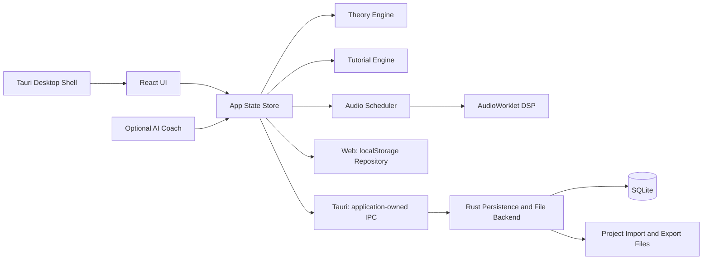

# Compose Tutor Studio 仕様書 v0.1.0

作成日: 2026-06-11


---

# 前提・仮定ログ

- 作成日: 2026-06-11
- 仕様バージョン: 0.1.0
- 仮称: Compose Tutor Studio
- 目的: Cubase Pro、Logic Pro、Ableton Live、FL Studio、Bitwig Studio などの強みを「教育統合型の作曲アプリ」として再設計する。
- 最重要方針: 初学者が 1 曲を完成させることを最優先にする。商用DAWの完全互換や全面的なプラグインホスト化は初期MVPから外す。
- 法務方針: 既存DAWの名称・UI・素材・プリセット・サンプル・マニュアル文言をコピーしない。機能アイデアを抽象化し、独自UI・独自チュートリアル・独自教材に落とし込む。
- 技術方針: MVP は Tauri + React + TypeScript + Web Audio / AudioWorklet を中心にし、低遅延・プラグインホスティング・高度なオーディオ編集は後続フェーズで JUCE / Rust native engine を検証する。
- AI方針: AIは「代作」ではなく、コード理論・作曲判断・練習問題・改善提案を説明するコーチとして扱う。
- 主要対象OS: Windows と macOS。Linux は将来対応候補。
- 主要成果物: 仕様書、AIコーディング指示ファイル、API/データモデル、ロードマップ、テスト計画、リスクメモ。


---

# 00. プロジェクトブリーフ

## 1. ゴール

Compose Tutor Studio は、作曲初心者が「DAWの操作」と「作曲理論」を同時に学びながら、短い曲を完成できるデスクトップアプリです。

一般的なDAWは高機能ですが、初心者にとっては以下が障壁になります。

- 何から始めればよいか分からない
- コード進行、スケール、メロディ、ベース、ドラムの関係が見えにくい
- 機能名は分かっても、作曲上の使いどころが分からない
- チュートリアルが操作説明に偏り、音楽的な判断理由まで教えてくれない

このアプリは、作曲ワークフローの中に教材を埋め込みます。ユーザーがノートを置く、コードを選ぶ、セクションを増やす、ミックスするたびに「なぜそうするのか」を短く説明し、必要な演習へ誘導します。

## 2. 主要コンセプト

| コンセプト | 内容 | 実装上の意味 |
|---|---|---|
| Guided DAW | 初心者を曲完成まで案内するDAW | 画面上に次の行動、理由、練習課題を表示する |
| Theory-aware Editor | 音楽理論を理解するエディタ | キー、スケール、コード、機能和声、テンション、ボイスリーディングを内部モデル化 |
| Action-based Tutorial | 操作に連動する教材 | ユーザーの編集内容からチュートリアル進行を判定 |
| Idea-to-Song | 断片を曲にする支援 | ループ、コード、ドラム、ベース、メロディをセクション構造へ展開 |
| Explainable AI Coach | 代作ではなく説明するAI | 提案の根拠、別案、練習問題を返す |

## 3. 競合DAWから抽象化して取り込む強み

| 参照DAW | 参考にする方向性 | 本アプリでの再設計 |
|---|---|---|
| Cubase Pro | Chord Track、Chord Pads、Scale Assistant、MixConsole | コード進行を中心に、初心者向けの和声説明を重ねる |
| Logic Pro | Chord ID、Chord Track、Session Players、Stem Splitter、Mastering Assistant、Step Sequencer、Live Loops | AI/自動支援の結果だけでなく、理由と編集ポイントを表示する |
| Ableton Live | Session/Arrangement 的な発想、MIDI Generators/Transformations、Keys and Scales | ループの試作から曲構成へ移行できる二段階ワークフロー |
| FL Studio | Pattern/Channel Rack 的なビート制作、Piano Roll、Loop Starter、Chord detection | パターン単位で始め、セクションへ展開する初心者導線 |
| Bitwig Studio | Automation Clips、Clip Aliases、Project-wide Key Signature、modulation | 反復構造と変化を初心者にも見える形で編集する |
| Studio One / Fender Studio Pro | テンプレート、単一画面ワークフロー、マスタリング導線 | 作曲開始テンプレートと完成チェックリストを強化する |

## 4. 成功指標

| 指標 | MVP目標 | 測定方法 |
|---|---:|---|
| 初回曲完成率 | 60%以上 | 初回起動から7日以内に8小節以上の曲を保存/書き出し |
| チュートリアル完了率 | 50%以上 | 基礎コース完了ユーザー割合 |
| 離脱ポイント | 重大離脱画面を3箇所以内に特定 | イベントログ分析 |
| 学習効果 | 事前/事後テストで20%以上改善 | コード/スケール理解テスト |
| 安定性 | クラッシュ率 1%未満 | ローカル診断ログ、クラッシュレポート |

## 5. 非ゴール

- Cubase Pro / Logic Pro / Ableton Live / FL Studio / Bitwig Studio のクローンを作ること
- 初期段階でプロ向け録音・ミキシング・マスタリング機能をすべて実装すること
- 既存曲を模倣する生成AI機能を売りにすること
- 商用サンプルやプリセットを無断同梱すること

## 6. MVPの一文定義

初心者が、テンポ・キー・コード進行・ドラム・ベース・メロディの関係を学びながら、8〜16小節のオリジナル曲を作成し、MIDI/WAVとして書き出せるデスクトップアプリ。


---

# 01. 製品要件定義 PRD

## 1. ペルソナ

### P1: 完全初心者

- DTMソフトを開いたことはあるが、何から始めるか分からない
- コード理論は断片的に知っている
- 目標は、SNSやYouTubeで使える短いBGMを作ること

必要な支援:

- 最短で音が出るテンプレート
- 次に何をすればよいかの表示
- 専門用語のインライン解説
- 「良い/悪い」ではなく「狙いに合っている/合っていない」という説明

### P2: ゲーム配信者・動画制作者

- 自分の動画・配信用にBGMやジングルを作りたい
- 既存BGMの権利問題を避けたい
- 完成までの速度を重視する

必要な支援:

- 15秒/30秒/60秒テンプレート
- ループ可能な構成
- 雰囲気プリセット: 明るい、緊張、チル、疾走感、レトロゲーム風など
- MIDI/WAV書き出し

### P3: 中級に進みたい学習者

- コード進行を使った作曲を学びたい
- メロディとコードの関係を理解したい
- 自分の作風を作りたい

必要な支援:

- 機能和声、借用和音、セカンダリードミナント等の段階的解説
- 自作進行の分析
- 代替コード提案
- メロディ添削

## 2. ユーザーストーリー

| ID | ユーザーストーリー | 優先度 | 受け入れ条件 |
|---|---|---:|---|
| US-001 | 初心者として、テンプレートから曲作りを始めたい | Must | 3クリック以内に音が鳴るプロジェクトを作れる |
| US-002 | 初心者として、コード進行を選ぶ理由を知りたい | Must | コード選択時に機能、響き、次の候補が表示される |
| US-003 | 初心者として、スケール外の音を避けたい | Must | ピアノロールでスケール内/外が視覚的に区別される |
| US-004 | 作曲者として、コードに合うベースを作りたい | Must | ルート/5度/経過音の候補を生成・説明できる |
| US-005 | 作曲者として、ドラムパターンを素早く作りたい | Must | 4/4基本パターンをステップシーケンサーで作れる |
| US-006 | 学習者として、課題を解く形で理論を覚えたい | Must | レッスン、演習、判定、解説、進捗保存ができる |
| US-007 | 動画制作者として、ループBGMを書き出したい | Must | MIDIとWAVをエクスポートできる |
| US-008 | 中級者として、借用和音を試したい | Should | モーダルインターチェンジ候補を提示できる |
| US-009 | ユーザーとして、AIに改善案を聞きたい | Should | プロジェクトのコード/メロディ情報から説明付き提案を返す |
| US-010 | 上級者として、外部VSTを使いたい | Could/Future | VST3 SDK/ライセンス確認後に実装判断 |

## 3. MVP機能範囲

### 3.1 Project

- 新規作成
- テンポ、キー、拍子、長さ
- ローカル保存/読み込み
- 自動保存
- プロジェクトテンプレート

### 3.2 Composition

- Chord Track: 小節単位のコードイベント
- Piano Roll: ノート入力、移動、長さ変更、ベロシティ
- Drum Step Sequencer: キック、スネア、ハイハット、クラップ等
- Bass Assistant: コードルート、5度、オクターブ、経過音候補
- Melody Assistant: コードトーン、アプローチノート、モチーフ反復の可視化
- Pattern/Clip: 1〜4小節単位の素材を組み合わせる

### 3.3 Learning

- 初回オンボーディング
- 基礎コース: 音名、半音/全音、メジャースケール、ダイアトニックコード
- 作曲コース: 8小節のコード進行、ドラム、ベース、メロディ、構成
- インライン解説
- 演習判定
- 復習キュー

### 3.4 Audio

- 内蔵シンプルシンセ
- 内蔵ドラム音源
- 音量、パン、ミュート、ソロ
- 簡易エフェクト: EQ/Filter、Delay、Reverb、Compressorの最小版
- WAVレンダリング

### 3.5 Export

- MIDI書き出し
- WAV書き出し
- `.ctsproj.json`プロジェクト書き出し。application-owned SQLite正本はrendererや交換形式へ公開しない

## 4. MVPから外す範囲

| 項目 | 理由 | 後続判断 |
|---|---|---|
| VST/AUホスト | SDK、ライセンス、安定性、クラッシュ分離が重い | v1.5以降で検証 |
| ASIO正式対応 | Windowsドライバ、SDK、ユーザー環境依存が大きい | 低遅延が必要になった段階で検証 |
| Stem separation 本実装 | MLモデル、処理速度、権利、品質評価が重い | 外部API/ローカルモデル比較後 |
| 自動マスタリング本実装 | 音質評価・責任範囲が大きい | まずはラウドネス/ピーク診断に限定 |
| 楽譜エディタ | 実装量が大きい | MIDI編集が安定後 |
| クラウド同期 | 個人情報・音源データ扱いが増える | ローカル完結後 |

## 5. 非機能要件

| 分類 | 要件 | MVP基準 |
|---|---|---|
| 性能 | 再生開始レスポンス | 100ms以内を目標。要実測 |
| 性能 | UI操作 | ノート移動/ズーム/スクロールで目視カクつきが少ない |
| 安定性 | 自動保存 | 編集後30秒以内。デスクトップ版は編集受付後1秒未満を目標にクラッシュ保護ACKを表示し、ACK済み内容をOS強制終了後に復元 |
| 互換性 | OS | Windows/macOS 優先 |
| アクセシビリティ | キーボード操作 | 主要操作はショートカット対応。単一文字キーは対応コントロールへのフォーカス中だけ有効にする |
| プライバシー | ローカル保存 | デフォルトではプロジェクトを外部送信しない |
| 検証性 | テスト | theory engine は単体テスト必須、UIは主要フローE2E |

## 6. 完了の定義

- 初回ユーザーがテンプレートから曲を作り、保存し、再起動後に読み込める
- 8小節のコード進行に対して、ドラム、ベース、メロディを作成できる
- レッスンの開始、判定、完了、進捗保存ができる
- MIDI/WAVを書き出せる
- 主要ロジックにテストがある
- 既存DAWのUIコピーではなく、独自デザインである


---

# 02. 機能仕様

## 1. 機能一覧

| モジュール | 機能 | MVP | 説明 |
|---|---|---:|---|
| Project | 新規作成/保存/読み込み | Yes | WebはlocalStorage repository、Tauriはapplication-owned SQLiteへ自動保存。Project集約をexact roundtripできる交換形式は`.ctsproj.json`だけ |
| Template | 作曲テンプレート | Yes | 8小節、16小節、BGM、ジングル等 |
| Chord Track | コードタイムライン | Yes | 小節単位でコードを置く。機能と候補を表示 |
| Chord Palette | コード候補 | Yes | ダイアトニック、代理、借用、セカンダリ候補 |
| Scale Assist | スケールガイド | Yes | スケール内外を可視化。スナップ可能 |
| Piano Roll | MIDI編集 | Yes | ノート作成、移動、複製、量子化、ベロシティ |
| Drum Sequencer | ステップ入力 | Yes | 16ステップ基本。後続で確率/スウィング |
| Clip Launcher | ループ試作 | Partial | MVPは簡易クリップ一覧。v1で非線形再生 |
| Arranger | セクション配置 | Yes | Intro/A/B/Chorus/Bridge/Outro ラベル |
| Mixer | 音量/パン/ミュート/ソロ | Yes | 各トラックに基本操作 |
| Effects | 基本エフェクト | Partial | Filter/Delay/Reverbを最小実装 |
| Tutorial | 操作・状態連動チュートリアル | Yes | 確定操作イベントと採用済みProject/UI状態を再照合して進行 |
| Exercise | 理論演習 | Yes | コード判定、スケール判定、メロディ添削 |
| AI Coach | 説明付き改善提案 | Optional | APIキー設定時のみ。MVPではモック可 |
| Export | MIDI/WAV | Yes | MIDIはFormat 1の正規化projection、WAVは簡易レンダー |
| Import | MIDI import | Yes | `.mid` / `.midi`を検証し、MTrkとchannelに応じた複数トラックを現在の曲へ追加する |
| Audio Track | Audio file配置 | Should | MVPでは再生のみ候補。編集は後続 |
| Stem Separation | パート分離 | Future | 外部API/ローカルモデル検証後 |
| Plugin Host | VST3/AU | Future | ライセンス/安定性確認後 |

## 2. Chord Track

### 2.1 目的

曲全体の和声設計を可視化し、初心者がコード進行を理解しながら編集できるようにする。

### 2.2 UI要素

- タイムライン上部にコードレーンを固定表示
- 各コードイベントは `小節範囲 / コード名 / 機能 / 色` を持つ
- クリック時に右パネルで以下を表示:
  - コード構成音
  - キー内での度数
  - 機能: Tonic / Subdominant / Dominant / Other
  - 次に進みやすい候補
  - 初心者向け説明

### 2.3 入力仕様

- コード名直接入力: `C`, `Am`, `Fmaj7`, `G7`, `Dm7/G` など
- パレット選択: I, ii, iii, IV, V, vi, viiø
- 候補生成: 現在キーと直前コードから候補表示
- 進行テンプレート: I-V-vi-IV、vi-IV-I-V、ii-V-I など
- コードグリッドは `←` / `→` / `Home` / `End` で小節を選び、`Enter` / `Space` でその小節に追加できる
- コードイベントはクリック・タップまたは `Enter` / `Space` / `F2` で編集できる
- 編集ポップオーバーで開始小節と長さを数値入力でき、ドラッグ・リサイズのキーボード代替とする
- `Escape` または外側操作で閉じられ、適用・閉じる後は起点のコードへフォーカスを戻す
- コード削除後は次、前、グリッドの優先順で論理的なフォーカス先を選ぶ

### 2.4 判定仕様

- コードの構成音をノート番号で管理
- キーに対する度数を算出
- ダイアトニック内/外を判定
- 借用和音・セカンダリードミナントはタグ付け
- 初心者モードでは複雑なタグを折りたたむ

### 2.5 受け入れ条件

- Cメジャーで `C - G - Am - F` を置いたとき、I - V - vi - IV と表示される
- `E7 -> Am` を置いたとき、Amに対するセカンダリードミナント候補として説明できる
- コード変更時、ベース/メロディガイドが更新される
- 8小節の各コードにポインターとキーボードの両方で到達でき、横ズーム時も選択小節が表示範囲に入る
- 不正なコード名は保存せず、入力と関連付けた回復可能なエラーとして読み上げる

## 3. Piano Roll

### 3.1 目的

MIDIノート編集と同時に、スケール・コード・メロディ作法を学べる画面にする。

### 3.2 表示

- 縦軸: ピッチ
- 固定編集音域: C2〜C6。importされた音域外ノートはprojectとexportに保持するが、Piano Rollのノート表示・選択・Velocity Lane編集の対象外とする
- 横軸: 拍/小節
- ノート: 長方形
- コードトーン: 強調表示
- スケール内音: 通常表示
- スケール外音: 薄色/警告表示
- 解決先候補: ホバー時に表示

### 3.3 操作

- ダブルクリックでノート追加
- ドラッグで移動
- 端をドラッグで長さ変更
- Alt/Option + ドラッグで複製
- 「選択ノートをクオンタイズ」ボタンにフォーカス中のQで量子化
- 「スケールスナップ」ボタンにフォーカス中のSで切替
- 「コードトーン」ボタンにフォーカス中のCでChord Tone Highlight切替
- ノート移動・長さ・ベロシティのドラッグ中はローカルプレビューだけを表示し、主ポインターの`pointerup`で最終値を1回だけ確定する。1ジェスチャーはUndo 1回で全体を戻せる
- クリップ右端への追加はノート全体が収まる最後の開始位置へ置き、量子化の最近傍グリッドが終端を越える場合は最後の有効グリッドへ戻す
- `pointercancel`または予期しないpointer capture喪失では、プレビューを破棄し、project・履歴・revision・保存・教材イベントを変更しない
- 複数ノート移動は掴んだノートを基準に共通デルタを使い、クリップ・音域境界でも相対タイミングを維持する
- Scale Snap有効時も、上下方向に次のスケール音がC2〜C6内にない操作と、時間方向だけを要求した移動・複製がclip境界でbeat delta 0になる操作はno-opにする。直交方向の音高補正だけを確定しない
- Alt/Option複製は3px以上移動し、最終位置または音高が変わった`pointerup`で初めてIDを生成する。未確定コピーは実ノートとは別のゴースト表示にする
- 固定編集音域内のノートはトグルボタンとして音名・開始・長さ・強さ・スケール内外・選択状態を読み上げ、そのうち1音だけをTab順に入れる。Home/EndとShift+PageUp/PageDownで前後の音へフォーカス移動する
- coarse pointerではノートのpointer hit targetを最低24×24 CSS pxにする。Velocity Laneは固定編集音域内のノートだけを描画し、値比例の可視高を保ったまま透明な44px以上のhit領域を持つ
- ノート上の矢印キーは選択群を移動し、Shift+左右矢印は長さ、PageUp/PageDownは強さを変更する。非repeatの1 keydownを1 batchとして確定し、Undo 1回で戻す
- Enterは単独選択、Spaceは選択切替、Cmd/Ctrl+Aは現在clipの固定編集音域C2〜C6全体（水平viewport外を含む）を選択し、importされた音域外ノートは対象外とする。Cmd/Ctrl+Dは1グリッド先へ複製してコピーへフォーカスし、Delete/Backspaceは削除して次・前・空グリッドへフォーカスを戻す
- 固定編集音域内にノートがない空グリッドでは、グリッド自体をTab順に入れ、矢印/Home/Endで入力位置を動かし、Enter/Spaceでノートを追加してその音へフォーカスする。coarse pointerの空グリッドはbrowser/WebViewのnative pan・scroll gestureを妨げない

### 3.4 学習連動

- スケール外音を置いた場合:
  - 初心者モード: 「これはキー外の音です。緊張感として使うか、近いスケール内音に移動できます。」と表示
  - 中級モード: アプローチノート、ブルーノート、クロマチック等の可能性を表示
- コードトーンに着地した場合:
  - 「安定した着地」として説明
- 連続跳躍が多い場合:
  - 「歌いやすさ」観点のアドバイスを表示

## 4. Drum Step Sequencer

### 4.1 目的

初学者がリズムの土台を早く作れるようにする。

### 4.2 MVP仕様

- 4/4、16ステップ
- レーン: Kick, Snare, Closed Hat, Open Hat, Clap, Perc
- ベロシティ: 3段階または0〜127
- Swing: 0〜100%（永続値0〜1）
- 全体probability: 0〜100%。DrumEventに個別probabilityがある場合はclip全体値より優先する
- velocity humanize: 0〜127。正のseedとevent identityから決定的に解決する
- Pattern length: 1/2/4小節
- clipが小節途中で終わる場合も`ceil(lengthBeats / beatsPerBar)`小節を表示する。最終partial barではstep開始beatがclip終端より前のcellだけを編集可能にし、終端以降はdisabledにする。clip長やeventを表示都合でpaddingしない
- Projectから作る再生用raw scheduleは、各hitにTrack / Clip / DrumEvent identity、元の`stepIndex`、clip終端、`stepsPerBar`、拍子由来の`beatsPerBar`、velocity、実効probability、swing、humanize、seedを自己完結して持つ。この値は再生開始時のProject snapshotから導出し、選択中clip、Drum Editorの表示有無、以前開いたprojectのUI状態へ依存しない
- ライブ再生とWAV書き出しは同じ純粋なoccurrence resolverを使う。swing対象はproject絶対beatではなくclip内の元step parityで決め、乱数saltはTrack / Clip / DrumEvent identityとunwrapped occurrence beatから作る。同じProject・seed・再生開始位置・loop regionなら、hitの採否、onset、velocityのevent planを再現できる
- resolverは、version tag、保存済みseed、Track / Clip / DrumEvent identity、lane、元step、1e-6 beatへ丸めたunwrapped raw occurrenceから32-bit `voiceSeed`を導出する。`voiceSeed`は再生用resolved payloadだけに持つ一時値で、Project / SQLite / project exportへ永続化しない
- swing後のonsetが、そのoccurrenceへ平行移動したclip終端以上ならhitを鳴らさない。no-loop schedulerはswing最大遅延分だけraw event探索を手前へ広げ、隣接するhalf-open window間で遅延hitを欠落・重複させない

### 4.3 テンプレート

- Four on the floor
- 8-beat pop
- Hip-hop basic
- Game loop basic
- Lo-fi basic

### 4.4 学習連動

- キック: 拍の重心
- スネア/クラップ: 2拍目/4拍目のバックビート
- ハイハット: 細かい時間感覚
- スウィング: 偶数ステップの遅れ

### 4.5 Loop / determinism境界

- drum `Clip.loop`はProjectへ保存されるが、現行のライブ再生、WAV、drum MIDI projectionではpatternを反復展開しない。反復が必要なdrum clipは、現時点では必要範囲のDrumEventを明示的に持つ
- transportの「ループ」を初めて有効にした時、0..0など無効なboundsは`0..songEnd`の全曲loopへ正規化する。`songEnd`は拍子分母を含むquarter-note beat長で計算し、現在位置は曲内へclampする。停止中のtoggleは再生を開始せず、starting / playing中のtoggleはrequest generationを更新して旧sessionを破棄し、新しいloop設定で同じ位置から開始し直す。Project / historyは変更しない
- 内蔵drum voiceは`Math.random`を使わない。versioned固定seedから同じsample rateのnoise bufferを生成し、`voiceSeed`とkick / snare / hat / clap burst別saltから整数sample-frameの再生offsetを決める。1つのAudioContext内ではnoise bufferを遅延生成して全drum Trackで共有する
- 同じapp build・同じWeb Audio engine/version・同じsample rateによる同一ProjectのWAV再書き出しは、pinned Chromium E2EでWAV全bytesの一致を必須とする。ライブAudioContextとoffline WAV、異なるbrowser / OS / WebView / sample rate間のPCM bit identityは保証しない

## 5. Bass Assistant

### 5.1 目的

コード進行からベースラインを作る導線を提供する。

### 5.2 生成ルール MVP

| モード | 内容 |
|---|---|
| Root Only | 各コードのルートを拍頭に配置 |
| Root + Fifth | 1拍目ルート、3拍目5度 |
| Walking Simple | ルート、コードトーン、次コードへの経過音 |
| Octave Pulse | ルートとオクターブ反復 |

### 5.3 説明

生成結果には「なぜその音を置いたか」をノート単位で表示する。

例:

- Cコードの拍頭にC: ルート音なので安定する
- Gへ向かう直前にF#を置く: 半音上行でGへ強く進む経過音

## 6. Melody Assistant

### 6.1 目的

コードに合うメロディを作るためのガイドを出す。

### 6.2 MVP仕様

- コードトーン着地ガイド
- スケール内ランダム生成
- 反復モチーフ作成
- コール&レスポンスのテンプレート
- 音域チェック

### 6.3 評価ロジック

| 観点 | 判定例 |
|---|---|
| コード適合 | 強拍にコードトーンがあるか |
| 歌いやすさ | 跳躍が多すぎないか |
| 反復 | 似たリズム/音型があるか |
| 変化 | 完全反復だけで単調になっていないか |
| 解決 | 緊張音が次に解決しているか |

## 7. Arranger

### 7.1 目的

ループを曲構造へ展開する。

### 7.2 セクション

- Intro
- A / Verse
- B / Pre-Chorus
- Chorus
- Bridge
- Outro

### 7.3 操作

- セクションテンプレート追加
- クリップの複製/エイリアス
- セクションごとの密度調整
- ミュート/アンミュートによる展開作成

独立複製はClipと全Note / DrumEventへ新しいIDを発行し、その後の編集を分離する。連動複製はMIDI / Drumだけを対象に、同じTrack・type・長さの正本Clipを`aliasOf`で直接参照する。素材payloadは正本だけが所有し、連動Clipは配置、長さ、loop、参照IDだけを持つ。自己参照、別Track / type、dangling、alias chain、payload重複は拒否する。連動Clipを編集した場合も1回のcommitで正本を書き換え、全配置の表示・ライブ再生・WAV・MIDIへ同じ内容を反映する。連動解除は現在の素材を新しいevent IDでatomicに複製し、Clip IDと配置を保ったまま独立化する。

ArrangerはTrack lane上のClipを選択し、開始位置と長さ、右隣への独立/連動複製、連動解除を操作できる。MIDI Clipには「素材をクリップ末尾まで繰り返す」checkboxを表示し、正本/aliasを問わず選択したtimeline instanceの`loop`だけを変更する。素材は正本と共有してもloop設定は各配置へ帰属し、Undo/Redoで往復できる。初期実装では連動Clipの長さは正本と一致し、正本に連動先がある間の単独resizeを拒否する。配置範囲はProject内のhalf-open区間に収め、重なりは既存の加算再生を維持する。

複製後に解決される保存済みNote / DrumEvent payloadが200,000件を越える場合、操作はProject / history / selectionを変えず拒否し、ノート・ドラム・コピーを減らす案内を表示する。この永続予算ではMIDI Clip loopの派生音を増やさない。ライブはMIDI Clip loopの展開後Noteと派生Chord noteを含む実効scheduleを20,000件以下、WAVは全曲を一括scheduleするため10,000件以下に制限する。両者とも展開後onsetの0.75拍rolling window内を256件以下に検査する。transport loopは反復後のsteady-state密度も同じ上限で再検査し、超過時はper-track Web Audio graph / event nodeを作らず型付きに拒否する。WAV超過時はOfflineAudioContextと部分fileを作らない。

### 7.4 学習連動

- Intro: 要素を少なく始める
- A: メロディ/モチーフを提示
- Chorus: 音域、密度、コード変化で盛り上げる
- Outro: 要素を減らして終える

## 8. Mixer

### 8.1 MVP仕様

- Track volume
- Pan
- Mute/Solo
- Meter
- Master volume（MVPで有効なMaster操作はこれだけ。0.0〜2.0）
- Basic effects slot

Masterの`pan` / `mute` / `solo`は将来互換用の予約フィールドであり、MVPでは音声へ適用せずUIにも表示しない。Master trackを持たないlegacy projectはunity gain（1.0）として再生・WAV書き出しし、Master volumeが非有限値なら音声境界でfail-silent（gain 0）にする。

ライブのTrack出力とWAV PCMは同じMaster gainをlimiter直前で一度だけ適用する。ライブ専用のメトロノームもMaster faderを通し、ライブのMaster meterはpost-fader信号を表示する。WAVにはメトロノームclickとUI meter / analyserを含めない。Trackのmute / solo、各Track volume、Master volumeは、再生開始時およびoffline renderではsample 0から確定値を使い、再生中に値を変更した場合だけ10msで平滑化する。

### 8.2 学習連動

- クリッピング時に警告
- ベースとキックの重なり説明
- リバーブ過多の警告
- 書き出し前チェックリスト

### 8.3 再生終端と自然テール

- 停止中に再生を要求した時、現在位置が有限かつ`0 <= positionBeat < songEnd`ならその位置を保つ。負値、非有限値、曲末と同じ位置、曲末より後では、拍子分母を含むquarter-note beat長から求めた`0`へ同じstate更新内で巻き戻してから再生を開始する。この補正はloop bounds、Project、Undo/Redo history、save stateを変更しない
- transport loopなしで曲末へ達した時は、transportをただちに停止して位置を0へ戻し、メトロノームと位置更新も止める。一方、最後の音、Filter / EQのIIR state、Delay / Reverb、Compressorのlook-aheadは、controllerが所有する1つだけのdraining sessionで自然に減衰させる。drain中もpost-fader Master meterは残響を表示する
- 最終50ms fadeはMaster limiterより前で完了し、その後もWeb Audio規格の固定6ms look-ahead分だけgraph / offline renderを保持する。40秒hard capはこの6msを含む出力全体へ適用し、短いtailでもfadeを曲本体へ食い込ませない
- 新しい再生、手動停止、Project切替、AudioContextの`suspended / interrupted / closed`は残っているdrainを即時に破棄する。破棄時は末尾fadeのMaster gain automationをcancelし、現在のMaster volumeを復元する。transport loopのwrapではdrainを開始しない
- 自然テールは`Clip.loop`の反復仕様とは別のone-shot終端契約であり、現行のdrum `Clip.loop`未展開を変更しない

## 9. AI Coach

### 9.1 目的

作曲・理論・操作の質問に答え、プロジェクトに即した改善案を返す。

### 9.2 MVP仕様

- API接続なしでも動くルールベース助言を先に実装
- LLM接続はオプション設定
- 送信内容をユーザーに明示
- 音声ファイル送信はデフォルトOFF

### 9.3 禁止/制限

- 既存アーティストや特定曲の模倣を目的にした生成を主要導線にしない
- 著作権のある音源を学習/分離/再利用する機能は注意喚起を表示
- ユーザーのプロジェクトデータを無断送信しない

## 10. Export

### 10.1 MIDI

- Standard MIDI File Format 1で出力する。先頭の単一conductor MTrkに曲名、tick 0のtempo 1件、tick 0のtime signature 1件、各コード開始tickのchord markerを置く
- export対象のinstrument / drum Trackごとに独立したpart MTrkを作る。各part MTrkの先頭eventはtick 0のFF 21 MIDI Portとし、その後にtick 0のtrack name、CC7 volume、CC10 panを置く。ProjectのTrack上限は128であり、128音楽トラックでもこの対応を変えない
- 0-based melodic index `i`には`port = floor(i / 15)`とchannel `[0..8, 10..15][i % 15]`、0-based drum index `j`には`port = j`とchannel 9（MIDI Channel 10）を割り当てる。Project上限まで全partの`port / channel` pairを一意にし、channel再利用時もCC7 / CC10を別destinationとして分離する
- 曲名・track name・markerはUTF-8の実byte列で各4,096 bytes以下とする。4,097 bytes以上は途中までのfileを返さずexport全体を拒否する
- authored note / realized chord / drumのpitchとvelocity、Track volume / pan、drum laneをSMF data byteへ変換する前に検証する。整数範囲外、非有限値、不明laneをclampや不正byteへ変換せず、部分fileを返さずexport全体を失敗にする
- MIDI Clipの`loop=true`はライブ/WAVと同じ共通projectionでbakeする。自然周期`P = max(note.startBeat + note.durationBeats)`を使い、`note.startBeat + kP < clip.lengthBeats`の各開始だけを出力する。最終partial noteはclip終端で短縮し、量子化後に正の1 tickをclip内へ収められない断片は越境させず省略する。aliasは正本notesとinstance側のstart / length / loopを組み合わせる
- 各part MTrkは量子化後の全authored / linked / loop-expanded / realized / drum noteを同一channel・pitchごとに検査する。前のNote Offより早い同pitch Note OnはMIDI上で終了対象を識別できないため、無警告で音価を変換せず`overlapping-note`として全体を拒否する。同じtickのNote Off→Note Onという隣接は許可し、UIは同じ音程の重なりを短くするか統合する案内を出す
- MIDIはpitch / start / duration / velocity、先頭volume / pan、初期tempo / meter、chord symbol markerを相互運用向けに正規化する形式である。audio / automation、clip境界、loop / alias、音源preset、effects、mute / solo、groove、section、chordの機能・構成音などProject固有の意味をexactには復元しない
- drum MIDIはライブ/WAVのoccurrence resolverを通さず、保存されたstep位置とvelocityをnormalized projectionとして1回出力する。swing、probability、humanize、seed、mute / soloを演奏結果としてbakeせず、drum `Clip.loop`も展開しない。実際に聞こえる演奏を共有する場合はWAVを使う

### 10.2 WAV

- MVPは44.1kHz stereo
- 16bit / 24bit は後続検討
- MVPは内部音源のみレンダー対象
- ライブ自然終了とWAVは、resolved eventから同じ`planAudioTail`を使う。instrumentはノート長とpreset ADSR、oscillator停止padを、drumはKick / Snare / Closed Hat / Open Hat / Clap / Percの実source停止時刻を使い、enabledなFilter / EQ / Delay / Reverb / Compressorと常設Master limiterのtail-timeを加える。可聴eventがないrenderにはeffectsやlimiterだけを理由とするtailを追加しない
- enabledなDelay / Reverbは振幅0.001（-60 dB）以上の最後の出力まで含め、exact thresholdも含む。Filterと3段EQはWeb Audio 1.1係数の最大pole半径から36dBのstate headroomを持って-60dB到達時刻を求め、無効・不安定な係数は1 stage最大2秒でfail-closedする。各Compressorは規格固定6ms look-aheadを直列加算し、Master limiter分は全体へ1回だけ加える
- 異常または多段のinsert chainはMaster limiter 6msを含むtail全体を40秒でhard capする。tailがある時はlimiter前のpost-effect出力を最後50msでfadeし、`fadeEndSeconds`から`totalSeconds`まではlimiter出力だけを保持する
- ブラウザ版は曲本体を5分までとし、tail込みの動的frame数と、stereo Float32 offline buffer + 16-bit PCMの推定bytesを`OfflineAudioContext`生成前に計算する。曲本体5分と最大40秒tailを192 MiB未満で許可し、上限超過はallocation前に初心者向けエラーを表示する
- drum hitの採否・onset・velocityと32-bit `voiceSeed`はライブ再生と同じProject由来resolverで決める。固定seed noise PCMとsample-frame offsetもライブ/WAVで同じ実装を使う。transport loopとメトロノームはWAVへ含めない
- テール長はPCMをsilence scanする値ではなく、source / effectパラメータから保守的に導出する。40秒capへ達する病的な多段insertは最後50msでfadeする。同じapp buildのpinned Chromiumでは同一Projectの再WAV書き出しを全bytes一致とし、seedだけ変えたfixtureではevent planを保ったままPCMが変わることを確認する。browser / OS / WebView / sample rateが異なるWeb Audio実装間のPCM bit identityは保証しない

### 10.3 Project Bundle（将来案、MVP未実装）

- 下記はasset対応後に検討する単一の研究案であり、現行MVPの保存・入出力形式ではない
- `project.sqlite`
- `assets/`
- `exports/`
- `metadata.json`

## 11. MIDI Import

### 11.1 加算読み込み

- Format 0 / 1を受け付け、現在のProjectを置換せず、noteを持つ各`MTrk index × channel`を1つの追加Track候補にする。noteのないconductor MTrkは候補へ含めない
- 候補順はMTrk index、同じMTrk内ではchannel番号の昇順とする。非blankな明示FF 03名は`Track N`も含めてそのまま基底名に使う。FF 03が欠落またはblankでparserが合成した`Track N`だけをfile stem由来名へfallbackし、複数channelの識別子と既存名を含む衝突時の`(2)`、`(3)`を決定的に付ける
- noteのpitch / start / duration / velocityを保持する。各channelのtick 0にあるCC7 `c`は`volume = 2c / 127`、CC10は`c = 64`をcenter 0、それ以外を`pan = 2c / 127 - 1`へ変換し、欠落時はunity / centerにする。同じcontrollerが複数ある場合は最後のtick 0値を使う
- 現在のBPM / time signature / key / scaleは変更しない。FF 59 key signatureを含むMIDIの初期値との差、途中または複数のtempo / meter / key signature、marker、Program / Bank、tick 0より後のvolume / pan / Program変更は、失われる内容と件数を区別したwarningとして通知する
- invalid UTF-8のtextは決定的な互換decodeへfallbackしてwarningを出す。duration 0のnote、未完了Note On、孤立Note Offは、usable noteが1音以上ある場合にだけ追加対象から除外し、種類別の件数をbounded summary warningで通知する。usable noteがない場合とその他の不正noteは全体を拒否する。C2〜C6外のnoteはProjectと再exportに保持し、Piano Rollで見えない件数をwarningに含める

### 11.2 Channel 10のdrum判定

channel 9の1候補は、全noteが次の条件をすべて満たす場合だけ16-step drum clipへ変換する。

- GM pitchがKick 36、Perc 37、Snare 38、Clap 39、Closed Hat 42、Open Hat 46の6種だけ
- durationが0.25 beatをsource PPQで表す位置から0.5 tick以内
- 現在拍子の1小節を16分割したstep位置からsource PPQで0.5 tick以内
- 同一lane / stepの重複がない

1音でも条件を外れる場合、その`MTrk index × channel`候補全体をpitch保持のinstrument MIDI Trackとして追加し、fallback warningを出す。変換可能な音だけを部分的にdrumへ移さない。

### 11.3 atomic commitと結果

- 全候補を1つのProject候補へ追加し、project codecで1回検証してから1回だけcommitする。既存Trackを含む128 Track上限、clip / event / timeline上限のいずれかを超えた場合は全体を拒否する
- browser file read、native picker / gateway、parse、map、codec validation、commitのどこで失敗または例外になっても、Project、history、revision、save queue、選択、active viewを読み込み開始前から変更しない。失敗表示には曲・選択・表示が不変である保証を必ず含める
- file read / native gateway / importのpending中はProject dialog全体をoperation lockし、rename、tab切替、新規作成、load / delete、再importと、X / Escape / backdropによるdismissをすべて無効にする。成功・失敗のsettle後に一括unlockする
- 成功時は`Nトラック・M音を追加しました`と複数形で件数を通知し、先頭の追加Track / Clipを選択する。先頭がdrumならDrum Editor、それ以外はPiano Rollへ移動する
- warningが1件以上ある成功ではProject dialogを自動で閉じず、件数と全warningをresult cardへ表示する。利用者が確認して「閉じて編集を続ける」を選ぶまでcardを保持する
- MIDIをexport後に再importして比較する対象は上記のnormalized projectionであり、Project全体のexact roundtripではない。exactな再編集には`.ctsproj.json`を使う

---

# 03. チュートリアル・学習仕様

## 1. 基本方針

チュートリアルは「ツールの使い方」だけではなく、「なぜその操作が作曲上有効なのか」を教える。

本アプリの教材は、以下の3層で構成する。

| 層 | 内容 | 例 |
|---|---|---|
| 操作 | DAWの使い方 | ノートを置く、コードを変更する、書き出す |
| 理論 | 音楽理論 | メジャースケール、ダイアトニックコード、コード機能 |
| 作曲判断 | 曲作りの判断 | なぜサビで音を増やすか、なぜ強拍にコードトーンを置くか |

## 2. 学習コース構成

### Course 0: 最初の1曲

目的: 理論を細かく理解する前に、1曲を完成させる。

| Lesson | タイトル | 成果物 |
|---|---|---|
| 0-1 | テンプレートから音を鳴らす | 4小節ループ再生 |
| 0-2 | コード進行を選ぶ | 4コード進行 |
| 0-3 | ドラムを足す | 16ステップドラム |
| 0-4 | ベースを足す | ルート中心のベース |
| 0-5 | メロディを足す | 4小節メロディ |
| 0-6 | 8小節に展開する | A/A' 構成 |
| 0-7 | 音量を整える | クリップなしのミックス |
| 0-8 | 書き出す | MIDI/WAV |

### Course 1: 音とスケール

| Lesson | 内容 | 演習 |
|---|---|---|
| 1-1 | 音名とピアノロール | C, D, E を置く |
| 1-2 | 半音と全音 | Cメジャースケールを作る |
| 1-3 | メジャー/マイナー | CメジャーとAマイナーを比較 |
| 1-4 | スケール内/外 | スケール外音を見つける |
| 1-5 | フレーズ | 2小節モチーフを作る |

### Course 2: コード理論

| Lesson | 内容 | 演習 |
|---|---|---|
| 2-1 | 三和音 | C, F, G, Am を作る |
| 2-2 | ダイアトニックコード | I〜viiø を並べる |
| 2-3 | トニック/サブドミナント/ドミナント | 機能を分類する |
| 2-4 | 定番進行 | I-V-vi-IV を使う |
| 2-5 | 7thコード | maj7, m7, 7 を比較 |
| 2-6 | セカンダリードミナント | E7 -> Am を試す |
| 2-7 | 借用和音 | iv, bVII を試す |

### Course 3: 作曲実践

| Lesson | 内容 | 演習 |
|---|---|---|
| 3-1 | ドラムの役割 | キック/スネア/ハットを分けて作る |
| 3-2 | ベースの役割 | ルートと5度で支える |
| 3-3 | メロディの着地 | 強拍にコードトーンを置く |
| 3-4 | 反復と変化 | 2小節モチーフを変形 |
| 3-5 | セクション構成 | A/B/Chorus を作る |
| 3-6 | 盛り上げ | 密度、音域、音色を変える |
| 3-7 | 仕上げ | 音量、パン、空間系を整える |

## 3. Lessonデータ仕様

```json
{
  "id": "course2_lesson4",
  "title": "定番進行 I-V-vi-IV",
  "level": "beginner",
  "estimatedMinutes": 8,
  "goals": [
    "I-V-vi-IV の度数を説明できる",
    "Cメジャーで C-G-Am-F を配置できる",
    "各コードの機能を確認できる"
  ],
  "prerequisites": ["course2_lesson2"],
  "steps": [
    {
      "type": "explain",
      "body": "I-V-vi-IV は安定感と展開感を作りやすい進行です。"
    },
    {
      "type": "task",
      "action": "place_chord_progression",
      "target": ["C", "G", "Am", "F"],
      "bars": 4
    },
    {
      "type": "check",
      "checker": "chord_progression_equals",
      "expected": ["I", "V", "vi", "IV"]
    }
  ]
}
```

## 4. Tutorial Engine

### 4.1 イベント駆動

レッスン目標は、確定操作を表すAppEventと、Storeへ採用済みのProject/UI状態の2経路で評価する。

| Event | Payload例 | 用途 |
|---|---|---|
| `project.created` | templateId, key, bpm | 初回導線 |
| `chord.added` | bar, chordSymbol, degree | コード課題判定 |
| `note.added` | pitch, startBeat, durationBeats, trackId | ピアノロール課題 |
| `scale_snap.enabled` | key, scale | 操作理解 |
| `clip.created` | type, bars, trackId | パターン作成課題 |
| `export.midi` / `export.wav` | format | 最終課題 |

プロジェクト編集を表すイベントは、候補が検証を通りStoreへ採用された後に、採用済みの値から発行する。対象が存在しない操作、同値変更、保存可能範囲を外れて拒否された候補では発行しない。生成IDを持つ`effect.added`等は、そのIDが採用済みProjectに実在することも確認する。これにより、画面に反映されなかった操作で教材だけが進む状態を禁止する。

状態を条件にする目標は、操作を見逃して到達不能にならないよう次の契約にする。

- `kind: "project"`はレッスン開始・再開、採用済みProject参照の更新（イベントを伴わない編集、Undo/Redo、Project切替・読込を含む）、および直前手順の完了直後に、最新の確定Projectで再照合する
- 1つの状態目標が成立したら、次も状態目標（Project predicateまたは現在有効な`scale_snap.enabled`）である間だけ同じ最新状態で順に再照合し、最初の未成立目標・通常イベント目標・演習目標で止める
- 同じ同期的なcommitでProject更新とpost-commit AppEventが生じる場合、そのEventは操作時点の手順にだけ適用し、直後の手順へ再利用しない。Project再照合は同一ターン内でまとめ、レッスンの中断・再開始時には古い予約を無効化する
- 状態再照合はAppEvent busへ人工イベントを再配信しない。成立して進んだ最終stepと進捗を即時反映・保存し、表示中だった前stepのhintを消去する
- 値を指定する目標は完全一致で判定する。Cメジャーの`scale_snap.enabled`は`key: "C"`かつ`scale: "major"`で、スナップが現在オンのときだけ成立する
- `noteCountAtLeast`と`drumLaneActive`は各timeline Clip instanceの解決済みpayloadを数える。正本と各valid direct aliasは配置ごとに1回数え、dangling/unresolved aliasは0件とする。`Clip.loop`の反復は教材上の編集event数を増やさない

### 4.2 判定DSL

- Project predicate: `chordCountAtLeast`、`progressionEquals`、`drumLaneActive`、`noteCountAtLeast`、`hasSection`、`bpmInRange`、`trackVolumeInRange`
- Event goal: `AppEventType`、任意の一致条件（`swingAtLeast`だけは下限判定）、必要event数
- Exercise goal: 選択、並べ替え、音名・コード等の回答を採点し、正解時だけ進行

### 4.3 フィードバック設計

フィードバックは3段階で返す。

1. 結果: 成功/惜しい/要修正
2. 理由: どの条件が満たされたか
3. 次の一手: 具体的な編集指示

例:

> 惜しいです。1小節目と3小節目はコードトーンに着地していますが、2小節目の強拍がスケール外音です。Gコード上では G/B/D のどれかに着地すると安定します。

## 5. 学習UI

### 5.1 Learn Panel

右サイドバーに常時表示できる。

- 現在のレッスン
- 目標
- 現在の達成状況
- 次に押すボタン/編集する場所
- 用語説明
- ヒント

### 5.2 Inline Hint

エディタ上の該当箇所に吹き出し表示。

- ノート
- コードイベント
- トラックヘッダー
- ミキサー

### 5.3 Theory Inspector

選択中の音楽要素を分析する。

- ノート: 音名、度数、コードトーンか
- コード: 構成音、機能、テンション
- フレーズ: 音域、跳躍、反復、着地点

## 6. 難易度調整

| モード | 表示内容 |
|---|---|
| Beginner | 専門用語を避け、操作と結果を説明 |
| Standard | 度数、コード機能、スケールを表示 |
| Advanced | テンション、借用、代理、ボイスリーディングを表示 |

## 7. 進捗保存

- lesson status: not_started / in_progress / completed / skipped
- step progress
- score
- attempts
- lastFeedback
- nextReviewAt

## 8. カリキュラム拡張案

- EDM基礎
- Lo-fi Hip Hop基礎
- ゲームBGM基礎
- ボカロ/歌もの基礎
- シティポップ風コード進行
- ブルース/ジャズ入門
- ミックス入門
- 耳コピ入門

---

# 04. UI/UX仕様

## 1. 情報設計

アプリは「作る」「学ぶ」「整える」を同じ画面内で切り替えられる構造にする。

```
┌──────────────────────────────────────────────────────────────┐
│ Top Bar: Project / BPM / Key / Scale / Transport / Export     │
├───────────────┬──────────────────────────────────┬───────────┤
│ Track List    │ Timeline + Chord Track            │ Learn     │
│               │                                  │ /Theory   │
├───────────────┼──────────────────────────────────┤ Panel     │
│ Browser       │ Editor: Piano Roll / Drum / Clip  │           │
└───────────────┴──────────────────────────────────┴───────────┘
```

## 2. 主要画面

### 2.1 Start Screen

目的: 最初の1分で迷わせない。

要素:

- 新規作成
- テンプレートから作る
- 前回の続き
- チュートリアル開始
- サンプルプロジェクト

テンプレート:

| テンプレート | 初期設定 |
|---|---|
| 8小節BGM | 120 BPM, C Major, 4/4 |
| Lo-fi Loop | 82 BPM, A Minor, 4/4 |
| Game Jingle | 140 BPM, C Major, 4/4 |
| Rock Sketch | 128 BPM, E Minor, 4/4 |
| Blank | ユーザー指定 |

### 2.2 Main Studio

要素:

- Top Bar
- Track List
- Timeline
- Chord Track
- Clip/Pattern Lane
- Editor Pane
- Learn Panel

### 2.3 Piano Roll Editor

表示切替:

- Scale Highlight
- Chord Tone Highlight
- Ghost Notes
- Velocity Lane
- Theory Overlay
- 固定編集音域はC2〜C6。importされた音域外ノートはprojectとexportに保持するが、ノート表示・選択・Velocity Laneには出さない

編集ジェスチャー:

- ノート移動・長さ変更・ベロシティ変更はドラッグ中にプレビューし、主ポインターを離した時だけ1操作として確定する
- クリップ右端のダブルクリックは、現在のグリッド長を収められる最後の位置へノートを追加する。末尾量子化も終端を越えず、最後の有効グリッドへ置く
- キャンセルまたはpointer capture喪失時は、表示を確定済み状態へ戻す。保存中表示や教材成功通知を出さない
- Alt/Optionドラッグ中の複製候補は破線ゴーストで示し、実ノートとして選択・件数計上しない。クリックだけ、3px未満、原点へ戻した操作では複製しない
- 複数選択移動は境界でノート同士を潰さず、選択内の相対タイミングを維持する
- Scale Snap有効時も、上下方向に次のスケール音がC2〜C6内にない操作と、時間方向だけの移動・複製がclip境界でbeat delta 0になる操作はno-opにし、音高だけを補正しない
- 固定編集音域内にノートがある場合はアクティブな1音だけをTab順へ入れ、選択の内側線とキーボードフォーカスの外側線を形で区別する。固定編集音域内にノートがない場合は入力グリッドをTab順へ入れる
- 読み上げ名には音名、開始、長さ、強さ、スケール内外、選択状態を含め、キー操作の結果だけをpolite live statusで通知する
- coarse pointerではノートのpointer hit targetを最低24×24 CSS pxにする。Velocity Laneは固定編集音域内のノートだけを表示し、ベロシティの可視高を値どおりに保ったまま透明hit領域だけを44px以上へ広げる
- 固定編集音域内にノートがない空グリッドは、coarse pointerのnative pan・scroll gestureを妨げない
- キーボード操作は矢印=移動、Shift+左右=長さ、PageUp/PageDown=強さ、Shift+PageUp/PageDown=前後の音へフォーカス、Enter/Space=選択、Cmd/Ctrl+A=現在clipの固定編集音域C2〜C6全体（水平viewport外を含み、importされた音域外ノートは除く）を選択、Cmd/Ctrl+D=複製、Delete=削除、Escape=入力位置へ戻る

#### 2.3.1 Arranger Clip編集

- 選択Clipの開始・長さ、独立コピー、連動コピー、連動解除を1つの編集panelへまとめ、操作結果または拒否理由を`status` / `alert`で通知する
- MIDI Clipだけに「素材をクリップ末尾まで繰り返す」checkboxを表示する。native checkboxのchecked状態をProjectの`loop`と一致させ、キーボード・読み上げ操作を保つ
- 連動コピーでもcheckboxは選択instanceだけを変更する。「このクリップだけ」と明示し、正本の素材や別配置のloopまで変わったと誤解させない。変更はUndo/Redo可能にする
- 独立/連動コピーまたは連動解除をkeyboardで実行して起点buttonが消える場合は、成功後の対象Clip buttonへフォーカスを移す。loop checkboxはSpace操作後もフォーカスを保ち、transportのSpace shortcutを起動しない
- 成功`status`は採用済みProject上の対象Clip IDと期待状態へ結び付ける。UndoやProject切替で成立しなくなった通知は除去し、後のRedoで古い成功通知を再表示・再読み上げしない
- Drum Clipには同checkboxを表示しない。drum `Clip.loop`は現行再生で未展開のため、利用できない操作を示唆しない

#### 2.3.2 Section編集

- Section blockは`aria-expanded`と、開いている編集regionへの`aria-controls`を持つdisclosureにする
- keyboardで開いた直後は「セクション名」へフォーカスし、種類、開始、長さ、削除、閉じるの順にTabだけで到達できるようにする
- 閉じる場合は起点Sectionへ戻す。削除した場合は次、前、「＋ セクションを追加」の優先順で、DOMに残る操作へフォーカスを移す

#### 2.3.3 Drum Grid

- 6 lane×1小節のstep matrixは`grid` / `row` / `rowheader` / `gridcell`で行列関係を公開し、編集buttonは常に有効cell 1件だけをTab順へ入れる
- 矢印キーで前後step / lane、Home / Endで表示中小節の先頭 / 末尾へ移り、Enter / Spaceで強→中→弱→オフを切り替える。partial最終小節では無効cellへ移動しない
- 小節切替buttonは`aria-pressed`を持ち、gridと各cellの読み上げ名に現在小節を含める。同じlane / stepでも小節1と小節2を区別できるようにする

### 2.4 Chord Palette

タブ:

- Basic
- Diatonic
- Common Progressions
- Borrowed
- Dominant Motion
- Custom

### 2.5 Learn Mode

画面の主導権を教材が持つモード。

- 次の操作対象をハイライト
- 関係ない機能を薄くする Focus Mode
- 成功時に短い音/視覚フィードバック
- スキップ可能

### 2.6 Mixer / Master

- Mixerは常時操作可能なdisclosureを持ち、buttonの`aria-expanded` / `aria-controls`と実際の表示状態を一致させる。展開・収納後もbuttonへkeyboard focusを保持する
- desktop幅（901px以上）かつ高さ700px以下では、Tauri最小windowでも中央編集面を残すためMixerを初期収納する。利用者が操作するまではviewport変化へ追従し、手動操作後はその選択をsession中保持する
- 低いdesktop windowでMixerを展開した場合は高さを160px以下に抑え、Mixer内部をscroll可能にする。Piano Roll本体は編集領域内で最低240pxのcontent heightを保ち、狭い残り領域ではEditor側をscrollして入力面を0pxにしない
- Track ListとMixerはTrackのvolume / pan / mute / soloについて同じproject stateを読み書きし、片方の変更をもう片方へ即時反映する
- Track ListとMixerのM/Sボタンは可視文字だけをaccessible nameにせず、`${Track名} ミュート` / `${Track名} ソロ`を持つtoggle buttonにする。`aria-pressed`を両surfaceで同じ状態へ同期し、Masterには表示しない
- 同じ種類のinsert effectを複数追加した場合はTrack名・効果名・同種内の連番をgroup、parameter、削除buttonのaccessible nameへ含め、各controlを一意にする
- MasterでMVP中に表示・操作するのは0.0〜2.0のvolumeだけとし、将来互換用のMaster `pan` / `mute` / `solo`はUIへ表示しない
- Master trackを持たないlegacy projectはvolume 1.0として扱う。非有限のMaster volumeを検出した場合は音を出さず、破損値を有効な音量として表示しない
- メトロノームはMaster volumeに追従し、Master meterはpost-faderの実出力レベルを表示する

### 2.7 Project / MIDI交換

- Project menuでは、`.ctsproj.json`を「曲をexactに再編集する形式」、MIDIを「他アプリとの音符中心の交換形式」と説明する。MIDIへclip / loop / alias / preset / effects / mute / solo / groove / section / chord semanticsの完全復元を示唆しない
- MIDI書き出しで量子化後の同一Track・同一音程が重なる場合はfile dialog / browser downloadへ進まず、「同じ音程のノートが重なっているためMIDIを書き出せません。重なりを短くするか、1つのノートにまとめてください。」とerror alertで案内する
- MIDI importは現在の曲へ加算し、BPM / 拍子 / key / scaleを変更しない。完了statusは単数のTrack名ではなく、`Nトラック・M音を追加しました`を読み上げる
- 成功後は先頭の追加Track / Clipを選択し、drumならDrum Editor、instrumentならPiano Rollを表示する。C2〜C6外のnoteは保持するが画面外であることを件数付きで知らせる
- browserのfile readまたはnative picker / gatewayからimport完了までProject dialogを`aria-busy`にし、内部fieldsetをdisabledにする。rename、tab切替、新規作成、load / delete、再importを含む全Project操作と、閉じるbutton、Escape、backdropのdismiss経路を同時に無効化し、resolve / reject後に同時unlockする
- warningはtempo / meter / FF 59 key / scale差と途中変化、marker、Program / Bank、後続automation、drum fallback、invalid UTF-8、duration 0、未完了Note On、孤立Note Off、画面外noteを区別する。toastには概要と残件数を出し、warningがある成功ではdialogを開いたまま、件数・全warning・明示的な「閉じて編集を続ける」をresult cardへ表示する。raw eventを無制限に列挙しない
- file read、gateway、parse、mapping、validation、commitのいずれが失敗・例外になっても追加件数を成功通知せず、読み込み前の曲・選択・Editor表示を保つ。errorには`MIDI読み込みによる曲・選択・表示の変更はありません。`を必ず1回だけ付け、再試行可能な原因を続ける

### 2.8 Drum Editor

- 選択したdrum Clipを優先して表示し、選択がない場合だけ先頭のdrum Clipへfallbackする
- 表示小節数は`max(1, ceil(clip.lengthBeats / beatsPerBar))`とする。小節途中で終わるimported clipでも最終partial barを表示し、step開始beatがclip終端より前のcellだけを編集可能にする。終端と同じまたは後のcellはdisabledにして範囲外と読み上げる
- 表示のためにclip length、stepsPerBar、DrumEventをpaddingまたは丸めない

## 3. ナビゲーション

| ショートカット | 状態 | 動作 |
|---|---|---|
| Space | 実装済み | 再生/停止（input・button・ローカル操作要素にフォーカスがある場合を除く） |
| C | 実装済み | コードトーンボタンにフォーカス中、表示を切替 |
| S | 実装済み | スケールスナップボタンにフォーカス中、切替 |
| Q | 実装済み | クオンタイズボタンにフォーカス中、選択ノートを量子化 |
| Cmd/Ctrl+S | 実装済み | 保存 |
| R | 現行未実装（予約） | 録音/入力開始 |
| B | 現行未実装（予定） | Browser表示切替 |
| L | 現行未実装（予定） | Learn Panel表示切替 |
| T | 現行未実装（予定） | Theory Inspector表示切替 |
| Cmd/Ctrl+E | 現行未実装（予定） | Export |

Chord Track のコンテキスト内操作:

| ショートカット | 動作 |
|---|---|
| ← / → / Home / End | 追加対象の小節を移動 |
| Enter / Space（グリッド） | 選択中の小節にコードを追加 |
| Enter / Space / F2（コード） | コード編集を開く |
| Escape | コード編集を閉じて起点へ戻る |

## 4. 初回導線

1. 起動
2. 「最初の1曲」テンプレートを選択
3. 再生ボタンを押す
4. コード進行を選ぶ
5. ドラムをオンにする
6. ベース生成を試す
7. メロディを2小節入力
8. 8小節に複製
9. 音量を整える
10. 書き出す

## 5. エラー/警告

| 状況 | 表示 |
|---|---|
| 音が出ない | Audio device、mute、master volume を順に確認するチェックリスト |
| 保存失敗 | pathは表示せず、権限・空き容量・再試行/別名保存を確認する初心者向け案内を表示 |
| Native編集の保護中 | `未保存の変更を保護中です。`。まだ強制終了耐性を約束しない |
| Native編集の保護済み | 現在revisionのSQLite commit receiptを照合した場合だけ`未保存の変更は保護済みです。自動保存を待っています。` |
| Native編集の保護失敗 | assertive statusで、強制終了から保護できないことと、再試行または緊急書き出しを案内する |
| 緊急バックアップ | canonical codecで再読込可能と検証できたprojectだけを`.ctsproj.json`として出す。nativeはOS pickerの保存結果、Webはdownload開始だけを通知し、invalid/cancel/失敗を成功と表示しない |
| MIDI読み込み中 | Project dialogをbusyにし、内部の全Project操作とX / Escape / backdropをdisabledにする。file read / native gateway / importの完了前に別project操作や背後の編集へ戻れないようにする |
| MIDI読み込み成功 | `Nトラック・M音を追加しました`。warningがあればdialog内のresult cardへ種類別の概要、件数、全warning、確認後に閉じる導線を続ける |
| MIDI読み込みの一部非対応 | 現在のBPM / 拍子 / key / scaleを維持したこと、FF 59を含む差異・除外・fallback・保持内容を件数category付きwarningにし、Project全体をexactに戻すには`.ctsproj.json`を案内する |
| MIDI読み込み失敗 | 全failure pathで`MIDI読み込みによる曲・選択・表示の変更はありません。`を一度だけ伝え、上限、破損、対応形式、再試行を初心者向けに案内する |
| スケール外音 | 学習モードでは警告、通常モードでは情報表示 |
| クリッピング | Master meterを赤表示。下げる候補を提示 |
| LLM送信 | 送信されるデータを表示し、明示的同意を取る |

## 6. デザイン原則

- DAWらしい複雑さを一度に出さない
- 初心者モードでは1画面1目的にする
- 音楽理論は操作に紐づけて説明する
- 「正解」より「狙いに対する効果」を説明する
- 既存DAWのUI配置やアイコンをそのまま模倣しない

## 7. アクセシビリティ

- 主要操作にキーボードショートカット
- 色だけで状態を伝えない
- コード/スケールの色にはテキストラベルも付ける
- フォントサイズは設定可能
- チュートリアル音声読み上げ用テキストを保持
- 中央編集面は`main`、Mixerは名前付き`region`として公開し、ページに重複する`contentinfo` landmarkを作らない
- Track選択、ベース生成mode、小節切替は`aria-pressed`、現在読み込まれている保存Projectは`aria-current`で、見た目と同じ選択状態を公開する

### 7.1 スケールスナップ

- 新規プロジェクトではオフを初期値にし、利用者が明示的に有効化する
- コントロール名は教材と同じ「スケールスナップ」に統一する
- オンの場合は、オンにした後に追加（複製を含む）または移動した音だけを現在のキー／スケール内へ補正する。既存の音を一括変更しない
- 上下方向に次のスケール音が固定編集音域C2〜C6内にない場合は逆方向へ移動せずno-opにする。時間方向だけの移動・複製がclip境界でbeat delta 0になる場合も、音高だけを補正せずno-opにする
- トグルは `aria-pressed` と `aria-keyshortcuts="S"` を持ち、オン／オフと効果を読み上げ可能な状態テキストで通知する
- 単一文字ショートカットは対応コントロールへフォーカスがある間だけ有効にする。無効化・再割当なしで画面全体へ適用しない
- `Cmd/Ctrl+S` の保存操作と混同せず、スケールスナップへフォーカス中の修飾キーなし `S` だけを切替に使う

---

# 05. 技術アーキテクチャ

## 1. 推奨スタック

| 層 | MVP推奨 | 理由 | 代替 |
|---|---|---|---|
| Desktop Shell | Tauri 2 | 軽量、Rust連携、Windows/macOS対応 | Electron |
| UI | React 19 + TypeScript + Vite | AIコーディングで扱いやすい | Svelte, Vue |
| State | Zustand or Redux Toolkit | MIDI/編集状態を明示管理 | Jotai |
| Audio MVP | Web Audio API + AudioWorklet | MVPの音源/エフェクト実装が速い | Tone.js, Rust audio |
| Native Backend | Rust | Tauriとの親和性、ファイル/SQLite/レンダー処理 | Node sidecar |
| DB | SQLite | ローカル保存、移行管理、検索 | JSON only |
| Theory Engine | TypeScript package | UIと共有しやすい、単体テスト容易 | Rust crate |
| Rendering | Canvas 2D / WebGL | Piano Roll/Timelineに必要 | SVG |
| Test | Vitest + Playwright + Rust tests | ロジック/UI/Backendの分離検証 | Jest |

## 2. 構成案

```
compose-tutor-studio/
  apps/
    studio/                  # React + Vite renderer（Web/Tauri共通）
    desktop/                 # Tauri shell（UIを複製しない）
      src-tauri/
        src/
        capabilities/
        icons/
  packages/
    theory-engine/            # 音楽理論ロジック
    project-model/            # Project schema / validation
    midi-io/                  # MIDI import/export
    tutorial-engine/          # Lesson DSL / checker
    ui-kit/                   # 共通UI
  docs/
  tests/
```

## 3. アーキテクチャ図



## 4. パッケージ責務

### 4.1 theory-engine

責務:

- 音名とMIDI note変換
- スケール生成
- コード解析
- 度数判定
- コード機能判定
- 候補コード生成
- メロディ分析

非責務:

- UI描画
- 音声再生
- 保存形式

### 4.2 tutorial-engine

責務:

- Lesson DSL読み込み
- ユーザーイベントの受信
- Step達成判定と現在Project/UI状態の再照合
- Feedback生成
- 進捗保存用データ作成

Studio bridgeは採用済みProject参照を購読し、eventless編集、Undo/Redo、Project切替・読込をmicrotask単位でまとめて`TutorialEngine.reconcileProject`へ渡す。同期commit後のdomain AppEventを次stepへ再利用しない順序を保ち、lesson世代が変わった予約は無効化する。連続するstate-backed goalだけを最新状態で進め、最終stepの進捗を保存し、前stepのhintを消去する。

### 4.3 project-model

責務:

- Project schema定義
- Track/Clip/Note/Chord/Event型
- バージョン移行
- バリデーション

### 4.4 audio

責務:

- Transport
- Clock
- MIDI note scheduling
- Built-in synth/drum playback
- Basic effects
- Offline render

## 5. データフロー

### 5.1 ノート追加

1. UIでノート追加
2. Storeで編集候補を作成
3. project-model/codecで保存可能な候補か検証
4. 検証成功時だけprojectへ採用し、Autosave queueへ追加
5. theory-engineで採用済みノートのスケール/コード関係を分析
6. 採用済みの値から `note.added` を発行し、tutorial-engineへ送信
7. Audio schedulerとUIに採用済みprojectを反映

対象なし、同値変更、検証拒否ではproject/history/revisionを変えず、教材イベントも発行しない。`note.moved`はpitchまたはstartが実際に変わった確定編集だけに使い、velocity/lengthだけの変更では発行しない。

Piano Rollの固定編集音域はMIDI 36〜84（C2〜C6）とする。現在clip内のこの音域にある全ノートを、水平viewport位置にかかわらずノートDOM・選択・Velocity Laneの共通入力集合にする。importされた音域外ノートはprojectとexportに保持するが、この集合には含めない。

### 5.1.1 Piano Roll gesture transaction

1. `pointerdown`で主ポインターID、対象clip、選択ノートの完全スナップショット、zoom/grid/scale設定を固定する
2. `pointermove`はReactのローカルプレビューだけを更新し、Store mutationを呼ばない
3. 複数移動は掴んだノートを基準に共通beat deltaとscale補正前の共通pitch deltaを算出し、グループ全体の開始・終了・音域境界でdeltaを制限する。Scale Snap有効時は最終音を個別にスケール内へ補正し、元の音程間隔維持よりスケール内化を優先する
4. 一致する`pointerup`で最終座標を再計算し、`commitNoteUpdates`または`duplicateNotesAt`を1回だけ呼ぶ
5. batch actionは全候補を先に検証し、1回のproject commitで履歴・revision・autosaveを進め、採用済み最終値のイベントだけを発行する
6. `pointercancel`、予期しない`lostpointercapture`、clip切替ではプレビューを捨てる。補償commitは行わない

Alt/Option複製は移動閾値と最終配置差分を満たすまで永続IDを作らない。ベロシティと長さだけの確定は`note.moved`を発行しない。

右端のダブルクリック追加は`clip.lengthBeats - durationBeats`を最大startとしてclampする。量子化の最近傍グリッドがこの最大startを越える場合は、その手前の最後の有効グリッドを採用し、batch全体を無効化しない。

キーボード編集も同じbatch actionを使う。非repeatのArrow/Shift+Arrow/PageUp/PageDownごとに候補を純粋計算し、`commitNoteUpdates`を最大1回呼ぶ。選択群の時間・音高・長さ・強さは共通deltaを境界内へ制限し、同値ならcommitしない。Scale Snapの上下移動は入力と同じ方向だけで次のスケール音を探索し、C2〜C6境界までに候補がなければ逆方向へ移動せずno-opにする。時間方向だけを要求した移動またはCmd/Ctrl+Dの共通beat deltaがclip境界で0になる場合は、Scale Snapによる音高差だけを生成せず、commit・ID生成とも行わない。Cmd/Ctrl+Aは現在clipの固定編集音域C2〜C6全体を水平viewport位置にかかわらず選択し、importされた音域外ノートは対象外とする。Cmd/Ctrl+Dは全配置検証後の`duplicateNotesAt`でIDを生成する。

`(any-pointer: coarse)`では、hybrid端末を含めてノートのpointer hit targetを最低24×24 CSS pxにする。固定編集音域内にノートがない空グリッドはpointer captureや`touch-action: none`でbrowser/WebViewのnative pan・scroll gestureを奪わない。Velocity Laneには固定編集音域内のノートだけを渡し、可視バーの値比例高を維持しながら透明な疑似要素だけを44px以上のhit領域にする。

ノートDOMは直接フォーカスするroving tabindex方式とし、常に固定編集音域内の実ノート1音だけを`tabIndex=0`にする。削除・複製後はpending focusをReact stateに保持し、ref mapで対象DOMを解決して`useLayoutEffect`で描画直後に次の音またはグリッドへフォーカスする。TransportのUndo/Redoボタンをクリックした場合、フォーカスはクリックしたボタンへ移り、Piano Rollはノートへ勝手に引き戻さない。無効になったroving IDだけを描画時に固定編集音域内の安全な音へフォールバックする。

### 5.2 コード変更

1. Chord Trackでコード変更
2. Chord parserで解析
3. 度数/機能/構成音を算出
4. Piano Roll overlay更新
5. Bass/Melody suggestions再計算
6. Lesson判定

### 5.3 MIDI import transaction

1. file sizeとSMF headerを検証し、Format 0 / 1をbounded parserで`ParsedMidiFile`へ変換する
2. noteを持つ`MTrk index × channel`を、MTrk index→channel昇順でgroup化する。noteのないconductor MTrkは除外する。parserの`hasExplicitName` provenanceを使い、非blankな明示FF 03名は`Track N`も保持し、欠落・blankで合成した名前だけをfile stem由来名へfallbackする
3. pitch / start / duration / velocityとtick 0のCC7 / CC10をProject候補へ写す。FF 59 key signatureもbounded IRへ収集するが、現在のBPM / meter / key / scaleは候補へ上書きせず、初期差と途中・複数変化を件数category付きwarningへ集約する
4. channel 9 groupは、全noteが対応GM 6 pitch、duration 0.25 beatと現在拍子の16 steps/bar位置からsource PPQで0.5 tick以内、lane / step重複なしを満たす時だけdrumへ変換する。1件でも0.5 tickを超えるか他条件を外れればgroup全体をinstrument noteへfallbackする
5. 全groupを既存Projectへ加えた単一候補を作り、project codecで1回だけvalidationする。成功した候補だけを`applyProjectChange`で1回commitする
6. commit成功後に限り、先頭の追加Track / Clipを選択し、Track種別に応じてPiano RollまたはDrum Editorへ移す。warningがあれば全件を返し、Project dialog内のresult cardを確認するまで自動dismissしない

parserはCPU / memory / event countを上限内に保ち、invalid UTF-8 fallback、duration 0、未完了Note On、孤立Note Offをraw event列ではなく種類別のbounded countとして返す。usable noteがある場合は該当eventを候補から除外してwarningを出し、usable noteがない場合は失敗にする。Program / Bank、marker、variable tempo / meter / key signature、初期key差、tick 0より後のchannel automation、C2〜C6外noteも明示的なwarning分類を持つ。

Project dialogはbrowser file readまたはnative picker / gateway開始からimport完了までbusy ownershipを持つ。`closeDisabled`で閉じるbutton / Escape / backdropを遮断し、dialog contentをdisabled fieldsetで包んでrename / tab / create / load / delete / importを同じ期間すべて停止する。resolve / rejectの`finally`で両lockを一括解放する。transaction開始時のproject ID / activationを固定し、file read / gateway例外、parse中のproject切替、codec拒否、Track上限を含むmapping拒否、commit拒否の全failure pathでMIDI transactionはProject / history / revision / autosave queue / selection / active viewを変更しない。UI errorは共通helperで曲・選択・表示が不変という保証をちょうど1回付ける。成功結果だけが`trackCount`、`noteCount`、全warningを返す。

drum Clipの表示小節数はdomain値を変更せず`max(1, ceil(lengthBeats / beatsPerBar))`で導出する。cellは`stepIndex * (beatsPerBar / stepsPerBar) < lengthBeats`を満たす時だけ編集可能にし、partial final barのclip終端以降をdisabledにする。表示のためにClip / DrumEventをpaddingしない。

### 5.4 MIDI export projection

- writerはStandard MIDI File Format 1を生成する。単一conductor MTrkにはtrack name、tick 0のtempo 1件とmeter 1件、chord開始tickのmarkerを置き、各instrument / drum Trackは独立MTrkへ出す
- 各part MTrkの最初のeventはtick 0のFF 21 MIDI Portとする。0-based melodic index `i`は`port=floor(i/15)`とchannel `[0..8, 10..15][i%15]`、0-based drum index `j`は`port=j`とchannel 9を使い、Project上限まで`port/channel` pairを一意に保つ。その後にtrack nameとCC7 / CC10をtick 0へ置く
- Projectの128 Track上限まで扱い、曲名・Track名・markerはUTF-8の実byte長4,096以下を必須とする。event budget、tick範囲、4,097 bytes以上のtextなどを検出した場合、部分的なSMFをcallerへ公開しない。MIDI note occurrenceの量子化可否を調べるallocation-free workもexport全体で累積し、event上限の半数を越える前に型付きで拒否する
- authored / realized note pitchは整数0〜127、note / drum velocityは整数1〜127、Track volumeは有限0〜2、panは有限-1〜1、drum laneは既知6種であることをwriter境界でも検証する。runtimeで壊れたProjectをclampせず、1件でも不正ならSMF全体を`invalid-project`として失敗にする
- chord realizationとport allocationの前に、Clip `trackId`と包含Track IDの一致、instrument↔MIDI / drum↔drum / audio↔audioの型対応、`notes` / `drumEvents` / `drum settings` / `audioAssetId`のpayload exclusivityを検証する。正しいautomation Clipとaudio Trackはlossy projectionとして許可するが、part MTrk / eventへ出力しない
- MIDI Clip noteはproject-modelの共通occurrence projectorを使う。`loop=true`では自然周期`max(start + duration)`、half-open clip終端、最終partial duration短縮をライブ/WAV/MIDIで共有する。MIDI writerは各occurrenceの絶対beatを個別にtickへ丸め、clip終端tickへ収まる正durationを表現できない断片を省略する。aliasはsource notesとinstance start / length / loopを組み合わせる
- part MTrkの全messageを組み立てた後、serialization前にNote Offを同tickのNote Onより先に並べる同じ規則でboundaryを走査する。channel/pitchがactiveな間の次Note OnはMIDI Note Offの対象instanceが曖昧なため`overlapping-note`でfail closedする。authored notesだけでなくlinked/loop occurrence、realized chord、drumを同じ検査へ通し、別part destinationとexact adjacencyは許可する
- MIDI codecの契約はnormalized projectionである。clip / loop / alias / preset / effects / mute / solo / groove / section / chord semanticsを含むProject集約のexact roundtripはproject-model codecと`.ctsproj.json`だけが担う
- drum MIDI writerはaudio occurrence resolverを呼ばず、保存済みstep / velocityを1回だけSMFへ写す。swing、probability、humanize、seed、mute / soloをbakeせず、drum `Clip.loop`も展開しない。このlossy境界はWAVおよびexactな`.ctsproj.json`と区別する

## 6. Audio実装方針

### 6.1 MVP

- Web Audio APIのAudioContextを使用
- AudioWorkletで簡易シンセ/ドラムサンプラー/エフェクトを処理
- サンプルはライセンスクリアな最小セットのみ同梱
- 正確なスケジューリングは lookahead scheduler で実装
- transportは`stopped / starting / playing`を分離し、単調なrequest IDで非同期開始の世代を識別する。`playing`とチュートリアルの`transport.played`は、AudioContextが`running`かつscheduler開始済みの一致世代だけ確定する
- scheduler、track/effect graph、voice、メトロノームclick、position timerは1つの再生sessionが所有する。停止・失敗・中断は同じsessionを一括破棄する。自然終了だけはtransport-owned controlを先に止め、controllerが1つだけ所有するdraining sessionへgraphを一時移管する。古いPromiseやcallbackは現世代を変更できない
- 各Synth voiceは全oscillator、layer gain、filter、最終gainを、各Drum subvoiceはsourceと専用filter / gainを排他的に所有する。全sourceの`ended`後にhandlerを解除して各nodeをexactly onceでdisconnectし、共有Track input / noise buffer / Masterは切断しない。停止・中断・render失敗ではmanager `dispose`が`ended`を待たず同期解放し、以後のstale triggerを無視する
- Synthの同時発音queueと未解放voice集合は分離する。未来のschedule時刻によるqueueのreapはnodeを切断せず、実AudioContext時刻がsource stopを越えた場合だけ未配信`ended`のfallback cleanupを行う。これにより`currentTime=0`で全曲を先行予約するOfflineAudioContextを途中で無音化しない
- voice / subvoice生成はsource作成直後からtransactionとして所有し、途中のallocation / connect / start / stop失敗では同じnote / hitの全branchをrollbackする。初回schedule失敗は起動errorとして返し、interval中の失敗はschedulerを先に停止して1回だけsession interruptionへ渡すため、同じwindowを再試行しない
- Synthのvoice stealは既存の早いsource stopを遅いstopで置換せず、`cancelAndHoldAtTime`で予約済みADSR値を保持してから短くfadeする。未対応実装では保存したADSR curveから同時刻の値を補間し、`AudioParam.value`を未来時刻の正本にしない
- AudioContextの生成とmaster graph公開はトランザクション化し、`resume()`はsingle-flightとする。`suspended / interrupted / closed`は再生中断としてUIへ戻し、次のユーザー操作で安全に再試行する

### 6.1.1 Master / fader契約

- MVPで有効なMasterパラメータは`volume`だけとし、有限値を0.0〜2.0へ制限する。Master trackが複数あるprojectでは`project.tracks`配列の先頭にあるMasterだけを有効とし、後続Masterは音声へ影響させない。Master trackがないlegacy projectは1.0、`NaN` / `Infinity`など有効Masterの非有限値はfail-silentの0として解決する
- Masterの`pan` / `mute` / `solo`はschema互換用に保持しても音声処理へ接続せず、MVP UIにも公開しない
- ライブ再生とOfflineAudioContextによるWAV renderが共有する可聴処理topologyは、Track出力→Master gain→limiterだけとする。ライブだけがメトロノームをMaster入力へ加え、Master gain直後へpost-fader UI meterを接続する。offline WAVにはメトロノームclickとUI meter / analyserを作らず、両経路は同じMaster gain resolverを使って別経路でgainを重ねない
- graph初期化時とoffline renderでは、Trackのmute / solo、各Track volumeおよび有効Master volumeをsample 0から確定gainへ設定し、既定gain 1.0の漏れを許さない。10ms平滑化は、再生中にTrack volume / mute / soloまたは有効Master volumeを更新した時だけ使う

### 6.1.2 Live meter ownership / offline export

- per-track UI analyserとmeter registry entryはlive TrackGraph / accepted sessionが所有し、live TrackGraph構築時に登録する。構築が途中で失敗した時とgraph破棄時は、registryが同じanalyser identityを保持している場合だけcleanupする。古いgraphのcleanupは後から登録されたentryを削除しない
- Master UI analyserとmeter registry entryはsessionではなく、live AudioEngineのmaster bus / sourceとそのAudioContextが所有する。同じmaster sourceを使うaccepted session間では同一analyser / entryを再利用し、accepted sessionの置換だけでは削除しない。master source / contextの退役時に、registryが同じanalyser identityを保持する場合だけ削除する
- offline WAVはTrack→Master→limiterの可聴処理topologyを共有するが、per-track / MasterいずれのUI analyserやmeter registry entryも作成・登録・置換・削除しない。成功・失敗を問わずlive analyserのidentity、meter更新、transport state、再生sessionを変更しない
- 各offline renderは独立したSynth / Drum manager、TrackGraph、Master gain、limiterを所有し、WAV生成成功時も、render / encodeが失敗した時も、voice manager→TrackGraph→Masterの同じcleanup境界で全nodeと参照を一度だけ解放する

### 6.1.3 Shared drum realization plan

- Project flattenerは各raw drum eventのpayloadへ`trackId / clipId / eventId / lane / velocity / sourceStepIndex / clipEndBeat / stepsPerBar / beatsPerBar / probability / swing / humanizeVelocity / seed`を格納する。これらは再生開始時のProject snapshotだけから導出し、選択中clipやDrum Editor mountを介するmodule-global runtimeを正本にしない
- `probability`はDrumEvent値を優先し、未指定ならclip groove値、さらに未指定なら1を使う。`swing`とprobabilityは0〜1、`humanizeVelocity`は整数0〜127、seedは正のsafe integerとして解決する
- ライブschedulerとoffline WAV builderは同じ純粋な`resolveDrumOccurrence`境界を使う。swingは`sourceStepIndex`のclip-local parityから計算し、同時刻・同laneでも独立させるため、決定的saltへTrack / Clip / DrumEvent identityを含める。transport反復ではunwrapped `playheadBeat`もsaltへ含め、passごとに変化し得るが同じ開始条件では同じsequenceを返す
- resolverは`cts-drum-voice-v1` domain、保存済みseed、Track / Clip / DrumEvent identity、lane、source step、1e-6 beatへ丸めたunwrapped raw occurrenceから32-bit `voiceSeed`を作り、resolved payloadへだけ付与する。raw Project scheduleと永続schemaは`voiceSeed`を正本にせず、legacy payloadにも固定domainから決定的fallbackを補う
- drum sourceはversioned固定seed LCGで同じsample rateのnoise PCMを作る。`voiceSeed`とsubvoice saltを32-bit mixし、noise buffer末尾0.4秒を保護する整数sample-frame offsetへ変換する。clapの3 burstは個別saltを持ち、発音順に依存するPRNG stateを共有しない。ライブsession / offline renderはAudioContextごとにbufferを遅延1回生成し、複数drum Trackへ共有する
- raw eventの`event.beat`に対して、反復後のclip終端は`clipEndBeat + (playheadBeat - event.beat)`で平行移動する。resolved onsetがこの終端以上ならdropし、partial clipやproject末尾のWAV tailへclip外hitを漏らさない
- MIDI Clip noteのschedule生成は、保存notesを直接1回だけ平坦化せず、project-modelのbounded visitorを使う。loop展開件数を`O(保存note数)`で飽和計数し、全体・密度preflight成功後だけoccurrenceを生成する。小数周期はscale-awareなhalf-open比較でclip終端上のghost onsetを除外する
- 再生開始時にraw scheduleをsnapshotし、各eventの`raw beat + deterministic swing delay`と元配列ordinalをimmutable beat indexへ1回だけ格納する。no-loop windowは実効onsetの2回のlower-boundと該当range走査だけを行い、resolver後の厳密なhalf-open guardを正本にする。これにより、前windowのraw位置から遅延したswing hitを1回だけ拾い、範囲外eventへのhash / PRNG / object生成を避ける
- transport loop indexは実効onsetをloop phaseへ正規化し、swingが越えた周期数を`passShift`として保持する。各unwrapped cycleで交差するphase rangeだけを二分探索し、浮動小数点のcycle-offset減算に対して検索境界だけを数ULP広げ、最終resolverで厳密に絞る。同一onsetは元ordinal順、`DueEvent.beat`はsource beatのままにする。現行のdrum `Clip.loop`自体はこのplanで反復展開しない。transport loopを有効化した時は、0..0、逆転、非有限など無効なboundsを`0..projectLengthBeats`へfallbackし、有限なboundsは曲内へclampする。starting / playing中のtoggleは新request generationへ移り、旧sessionをdisposeする

### 6.1.4 Shared resolved-event audio tail plan

- `planAudioTail(Project snapshot, resolvedEvents, startBeat, endBeat, sampleRate)`はライブ自然終了とWAV allocationの共通pure boundaryである。raw drum eventを再解決せず、すでにprobability / swing / range filterを適用した可聴occurrenceだけからTrack別の最終source endを求める。WAVは44,100Hz、ライブは実AudioContextのsample rateを渡す。WAVはsnapshotのmute / soloを正本とし、ライブはsession中に一度でもgraphへ入力したTrackを保守的に可聴扱いにする
- instrument source endは`onset + max(noteDurationSeconds, attack + decay) + release + 0.02s oscillator stop pad`とする。drum source stopはKick 0.35s、Snare 0.25s、Closed Hat 0.095s、Open Hat 0.37s、Clap 0.144s、Perc 0.28sをlaneごとに使う。runtime voiceとplannerは、各subvoice stopからlane最長寿命を導出する同じimmutable `voiceTiming`定数を参照し、可聴resolved eventが0件ならenabled effectsがあってもtail / fadeを作らない
- enabledなDelayはwet echoの振幅が0.001（-60 dB）以上である最後のechoまで含め、浮動小数点誤差があるexact thresholdも含める。enabledなReverbはruntime impulseと共有する固定peak 0.35、wet gain、squared decay envelopeの上限が同じthresholdへ達するまでを解析的に見積もる。連続insertのimpulse tailは保守的に加算する
- enabledなFilter / EQはruntime nodeへ設定する同じtype / frequency / Q / gainを共有resolverから得る。Web Audio 1.1のbiquad係数から最大pole半径を求め、36dBのstate headroomが振幅0.001へ減衰するframe数を算出する。neutral 0dB EQ stageは0、無効・非有限・不安定なstageは最大2秒でfail-closedし、Filter 1段とEQ 3段をinsert順に加算する。synth内部filterは後段ADSR Gainが0になるため別tailを加えない
- Web Audio 1.1 `DynamicsCompressorNode`は内部の固定0.006秒DelayNodeによるtail-timeを持つ。enabledなinsert Compressorはstageごとに6msを直列加算し、常設Master limiterの6msはTrack統合後に1回だけ加える
- source endとinsert tail、Master limiterから曲本体を超える`uncappedTailSeconds`を求め、0より大きい時だけ`50ms fade + 6ms limiter`以上を確保する。製品安全上の40秒hard capはlimiter込み出力へ適用する。WAVはTrack effects後のrender-owned output bus、liveはdrain generationだけがautomationを所有するengine Master gainを使い、`fadeEndSeconds = totalSeconds - 0.006`でfadeを終えてからlimiter outputだけをcleanup deadlineまで保持する。これはPCM silence scanではなく解析的な上限である
- WAVは`ceil(totalSeconds * 44,100)`の動的frame数と、`frames * 2ch * (Float32 4 bytes + PCM16 2 bytes)`の推定memoryを先に計算する。曲本体は最大300秒、tail込み推定memoryは192 MiB以下を必須とし、OfflineAudioContextより前に拒否する。300秒の曲本体と40秒tailはこのbudget内である
- schedule生成前の共通preflightはchecked/saturating加算を使う。`resolved-stored` projectionはlinked正本の保存payloadをinstanceごとに数え、MIDI Clip loopの派生音を増やさない。`audible` projectionは各MIDI instanceのloop展開後Note、linked Drum payload、派生Chord noteを数える。ライブは全体20,000件、全曲のnodeを一括所有するWAVは10,000件を上限とし、両者ともMIDI loop展開後・drum swing解決後onsetの任意0.75拍rolling windowを256件以下にする。transport loopはindex構築後・per-track Web Audio graph構築前に、完全周期数×phase件数と余り区間のcircular two-pointer scanからsteady-state最大密度を展開せず求め、同じ256件上限を適用する。超過は型付きに失敗し、UIはノート・ドラム・連動コピーを減らす案内を出す。WAVはOfflineAudioContextと部分fileを作らない
- Project走査から得るraw scheduleの順序は正本としない。ライブは各due windowを時刻順に処理し、WAVは確率・swing解決後の全eventをonset昇順でstable sortしてからvoiceを割り当てる。同一onsetの元順序を保ち、後位置の正本が先に格納されたlinked Clipや未整列Noteでも、未来のvoiceを先にsteal / stopしない
- live schedulerは開始時にindexを`O(N log N)`で1回構築し、no-loop tickを`O(log N + D)`、loop tickを`O(C log M + D)`で処理する（Dは候補件数、Cは交差周期数、Mはloop内event数）。20,000件fixtureの0.6拍×1,707 queryで候補走査合計20,000、lower-bound比較54,624以下を決定論的gateとし、production Chromiumでも100 linked instance由来20,000 eventの開始・位置更新・停止応答を検査する。上限引き上げには主要WebViewのCPU / GC / audio-dropout benchmarkを別途必須とする
- timer throttling、main-thread stall、端末sleep復帰で現在playheadがschedule frontierを追い越した場合、過去時刻の未schedule note / drum / metronomeを現在へ再演せずdropし、`max(frontier, current playhead)..lookahead horizon`だけを再開する。non-loopで曲末を飛び越えた時はmissed eventを鳴らさず、通常の1回だけの`onEnd`へ進む
- MIDI `Clip.loop`はschedule生成時にすでに共通note occurrenceへ展開され、このtail planは受け取った展開後durationを使う。drum `Clip.loop`は別の未展開契約である。同じapp build・同じWeb Audio engine/version・同じsample rateでは固定noise/offsetを含む同一Projectの再WAVを全bytes一致とするが、browser / OS / WebView / sample rateをまたぐWeb Audio DSPのbit identityは保証しない

### 6.1.5 Live natural-drain / play-at-end ownership

- non-loop schedulerの`onEnd`ではstoreをただちに`stopped`、`isPlaying=false`、`positionBeat=0`へ進める。同時にscheduler、position timer、metronome clickを停止するが、TrackGraph、voice、Master busとpost-fader Master analyserは、絶対project-end時刻にtail秒を加えたdeadlineまで接続したままにする。transport loop schedulerはwrap時に`onEnd`を持たず、drainを開始しない
- `PlaybackController`はactive sessionをちょうど1つのdraining slotへ移し、同期的な`finish()`が発生させるreentrant `stopped`通知をgenerationと1回限りのguardで識別する。drain完了callbackはslot identityが一致する場合だけdisposeし、古いcallbackはreplacement sessionへ作用しない
- drain末尾fadeは共有Master fader値を上書きせず、absolute cleanup deadlineの6ms前をfade endとしてautomationする。callbackがfade endより遅れた場合はMasterを即時0にし、cleanup deadlineより遅れた場合はtimerなしで完了する。いずれも現在時刻からtailを延長しない。新しい再生、手動停止、Project activation、context interruption、controller / bridge disposeはtimerとgraphを即時破棄し、pending fadeをcancelして現在ProjectのMaster gainを即時復元する
- 停止状態からの`play()`は、拍子分母を含む`projectLengthBeats`に対し現在位置が有限かつ`0 <= positionBeat < songEnd`なら保持し、負値、非有限、曲末以上、または利用不能な曲長では0へ正規化する。位置補正、`starting`への遷移、request ID増加、audio issue解除を1つのstore更新で行い、loop bounds、Project identity、history、save stateは変更しない。曲末startが失敗しても、次のplayは新generationで再び0から開始できる

### 6.2 v1以降

- Rust native audio engine検証
- CPAL等で低レイヤーI/O検証
- JUCE採用の比較検討
- プラグインホストはクラッシュ分離・ライセンス・署名が課題

## 7. 保存形式

### 7.1 現在の実装

- Project schemaのcurrent versionは2。v1の`aliasOf`はruntime上の意味を持たず各Clip自身のpayloadが再生されていたため、v1→v2 migrationでは`aliasOf`だけを削除して独立Clipとして保持する。これにより既存曲の音を変えない。v2で初めてMIDI / Drumの直接・同一Track/type参照として検証し、TypeScript codecとRust native境界の両方でpayload重複、dangling、chainを拒否する。
- linked Clipのconsumerは共有`resolveClipContent`を使い、instanceのID / start / length / loopとsourceのnotes / drum payloadを合成する。編集はsourceへ、ライブ/WAV/MIDIの配置とdrum乱数identityはinstanceへ帰属させる。
- codec / Rust保存境界は、非Master Clipの保存済みNote / DrumEventをlinked instance解決後に数える`resolved-stored` projectionを200,000件以下に制限する。これは従来の200,000 raw-item envelopeを狭めない互換上限であり、v1はinertな`aliasOf`を辿らず各Clip自身のpayloadを数え、派生Chord noteは含めない。複製候補もcommit前に同じ上限を検査する。

- Web版とTauri版は同じ`ProjectRepository`境界を使う。
- Web版はlocalStorage repository。generation/head/recovery journalとWeb Locksで破損・競合時にfail closedする。
- Tauri版はRust所有のSQLite repository。`BEGIN IMMEDIATE`、stable operation ID、expected-head CAS、immutable canonical JSON generation、sticky tombstone、最低3 canonical世代で保存する。通常保存の2秒idle debounceとは別に、受理した最新revisionを即時のcrash draft transactionへstageする。
- crash draft receiptはSQLiteの`WAL` + `synchronous=FULL` transactionがcommitし、project/activation/revision/write IDとpayload bytesをrendererが照合した後だけ「保護済み」と表示する。起動時は因果関係が単一ならcanonical headへ復旧し、比較不能または複数activationなら`interrupted-save` branchとして全候補を残す。
- native pagehideはSQLite headを同期更新せず、WebView localStorageの専用emergency journalへ退避する。次回起動時に単一の因果候補だけをSQLiteへ再生し、比較不能なactivationは全て分岐として残す。
- async flushはcanonical保存後の一覧`list()` IPCを待った後、最新のactivation / revision / persistedRevision / coordinator dirty状態を再検証する。その待機中に次の編集が入った古いflushは成功を返さず、native closeは最新snapshotの検証済み同期recovery receiptを得た場合だけ終了へ進む。recoveryはcanonical `clean`とは区別したまま保護revisionを更新する。
- native closeは最初の非同期処理より前にStoreのproject mutation fenceを取得する。可逆なauthorization / flush / recovery失敗ではfenceとlifecycle ownershipを解放し、限定close command dispatch後は応答不明でも解放しない。
- repository初期化失敗は失敗したsingle-flight Promiseだけを解除し、保存の「再試行」から同一processで初期化を再実行する。失敗中にrevision 1以上の編集が作られた場合、再初期化で古い保存projectをactiveへ上書きせず、現在snapshotを保存して既存projectも保持する。
- 旧localStorageはexact raw snapshotをSQLiteへ先にbackupし、候補をstagingした後、source再検証と単一transactionで公開する。移行元bytesは自動削除しない。

### 7.2 デスクトップ永続化

MVPの正本はapp data directory内の`projects-v1.sqlite3`。Project集約はUI都合の正規化tableへ分解せず、`project-model` codecが生成したversioned canonical JSON snapshotとして保持する。ユーザーが持ち運ぶ交換形式は、codecで再検証する単一の`.ctsproj.json`ファイルであり、正本DBそのものやOS pathはrendererへ公開しない。

audio assetをプロジェクトへ追加する将来版では、application-owned SQLiteとassets directoryの組合せを別schema versionとして設計する。下記のper-song bundle案は未実装であり、MVPの入出力形式ではない。

```text
MySong.ctsproj/       # future proposal
  project.sqlite
  assets/
  exports/
  metadata.json
```

### 7.3 互換性

- `schema_version` を持つ
- migrationを `src-tauri/migrations` に保存
- 新バージョンで開いた後も、必要なら旧形式エクスポートを提供

## 8. AI接続

### 8.1 AI Coachに送るデータ

デフォルト送信可能:

- BPM、キー、拍子
- コード進行
- MIDIノートの抽象情報
- ユーザー質問

デフォルト送信しない:

- 音声ファイル
- プロジェクト全体
- 個人名/パス情報
- 未公開作品の生音源

### 8.2 プロンプト方針

- 既存曲に似せる依頼は避ける
- 提案には理由を付ける
- 初心者モードでは専門用語を段階的に出す
- 出力はJSON schemaで受け、UI側で表示

## 9. セキュリティ

- production capabilityは`main`だけを明示選択し、application-owned persistence/file/close commands、端末全消去に必要なWebView browsing-data cleanup、close-event listen/unlistenだけを許可する。汎用fs/dialog/shell/opener権限は与えない
- `withGlobalTauri: false`、asset protocol無効、unused Tauri commands削除
- bundled originと固定Vite開発origin以外へのnavigation、新規WebViewをRustで拒否
- production CSPからlocalhost WebSocketを除外し、Vite HMRだけdev CSPで許可
- protected tag preflightはproduction / development security object、`main` capability全件、window / build / package identity、root / Studio / Desktopの全scripts・build tool依存・pnpm overrides、内部package manifest / export、Tauri bundle全体をexact allowlistで固定する。production commandはpackage名filterではなくworkspace実pathを使う。isolation patternを含む未知security key、重複workspace package、platform Tauri override / repository Cargo config、npmrc / pnpmfile、Studioからrepo rootまでにある自動探索PostCSS configを禁止し、`pnpm-workspace.yaml` / `pnpm-lock.yaml` / `vite.config.ts` / `build.rs`はregular fileかつ改行正規化SHA-256一致、`public/`はexact `_redirects`だけを許可する。依存installはlifecycle scriptを無効化し、各署名OS jobがsecret読込前にclean worktreeとrelease policyを再検証する
- 依存install後のrelease policy testは正規TOML parse結果からCargoのfeature・dependency・target・build targetをexact比較し、Studio / packagesのTS/JS source graph、relative import / export / require / dynamic importのroot境界、Vite config、単一source entry、Rustのsource graph / FFI / network APIを実repository上で検査する。`fetch` / XHR / WebSocket / EventSource / beacon / WebRTC / WebTransport / Worker、HTTP/STUN/TURN、protocol-relative URL / meta refresh、未許可Cargo target、source-root外`#[path]` / `include!`を拒否する
- Vite build直後は最終`dist`を明示的な`production` / `e2e` profileで再検査する。productionはHTMLを`index.html`と`index-<hash>.js`の1組だけ、E2Eは`index.html` / fatal fixtureと`app-<hash>.js` / `fatal-boundary-<hash>.js`の2組だけに限定し、参照entryの実在、exact `_redirects`、許可済みCSS / HTML / JS以外の出力、symlink / size境界、RTC・socket系primitive、protocol-relative / 未許可remote URLを検査する。通常Web build、Desktop smoke / bundle、3OS CI、signed macOS / Windows / Linux buildの各platform-specific出力で実行する
- bundle identifier `com.composetutor.studio` と `useHttpsScheme: true` はpackage/app data/origin互換性のため初回release前から固定
- 任意ファイルアクセスを制限
- 外部URL通信は明示的な設定時のみ
- LLM APIキーはOS Keychain相当へ保存
- プロジェクト内スクリプト実行は原則しない

## 10. CI/CD

- Web: typecheck、unit/integration、production build、Playwright Chromium E2E
- Desktop 3OS: rustfmt、clippy `-D warnings`、Rust test、unsigned production bundle（Linux AppImage / macOS app / Windows NSIS）build
- Desktop 3OS: test専用embedded WebDriverによる実WebView smoke
- Supply chain: pnpm audit、Linux RustSec audit、npm/Cargo/GitHub Actionsのweekly Dependabot更新
- Linux release: GStreamerを含むAppImageをbundleし、生成物の起動・音声smokeをrelease workflowで検証する
- stableなaggregate `test` jobだけをbranch protection/auto-mergeのrequired statusにする
- native-testは別target directoryへ生成し、production artifact pathを上書きしない
- schema migration test
- PR: OS/CPU別production executable size上限
- signed release: installer/package size上限

## 11. 技術的な未確定点

| 項目 | 状態 | 確認方法 |
|---|---|---|
| Web Audioのみで十分な遅延か | 要検証 | 主要OS/ブラウザWebViewで実測 |
| Tauri WebViewのWeb Audio差異 | macOS基本transport確認済み | Windows WebView2/Linux WebKitGTKは3OS CI、音質は実機release checklist |
| Drum event planのlive/WAV parity | 共通resolver実装済み | multi-clip、UI未mount、partial clip、loop occurrenceの回帰テスト |
| Drum PCM bit決定性 | source決定性・pinned Chromium再WAV全bytes一致を実装済み | 同一build/engine/sample rateの回帰E2Eを維持し、cross-engineは音響比較基準を別途定義 |
| Drum `Clip.loop` | 未展開 | drum pattern periodを仕様化してlive / WAV / MIDIの期待回数をE2E検証 |
| Transport loop generation | 全曲fallbackとactive restart実装済み | 0..0、song end、6/8、starting / playing切替、旧session cleanupを回帰テスト |
| Natural tail analytic ceiling | source/Filter/EQ/Delay/Reverb/Compressor/Master limiter共通plan・40秒cap実装済み | Chromium実DSPで80Hz/Q18 ringingが解析上限内、Compressorが6msである回帰を維持し、他engineでも測定 |
| Web Audio PCM bit identity | 未保証 | source PRNGのseed化とは別に、browser / WebView engine差を許容する音響比較基準を定義 |
| VST3 host | 将来検証 | SDKライセンス、クラッシュ分離、サンドボックス調査 |
| Stem separation | 将来検証 | ローカル/クラウドモデルの速度・品質・権利評価 |

デスクトップシェル、test隔離、署名前条件の詳細は`docs/12_desktop_shell.md`を参照する。

---

# 06. データモデル

## 1. エンティティ概要

| Entity | 説明 |
|---|---|
| Project | 曲全体 |
| Track | MIDI/Drum/Audio/Bus/Master |
| Clip | タイムライン上の素材 |
| NoteEvent | MIDIノート |
| DrumEvent | ドラムステップ |
| ChordEvent | コードトラック上のコード |
| AutomationEvent | 音量/パン/パラメータ変化 |
| Lesson | 教材 |
| LessonStep | 教材の各ステップ |
| UserProgress | 学習進捗 |
| ExerciseAttempt | 演習履歴 |
| Asset | サンプル/音声/MIDI素材 |
| AppSetting | 設定 |

## 2. TypeScript型案

```ts
export type Project = {
  id: string;
  schemaVersion: number;
  title: string;
  bpm: number;
  timeSignature: [number, number];
  key: MusicalKey;
  scale: ScaleName;
  lengthBars: number;
  tracks: Track[];
  chordTrack: ChordEvent[];
  sections: Section[];
  createdAt: string;
  updatedAt: string;
};

export type Track = {
  id: string;
  name: string;
  type: 'instrument' | 'drum' | 'audio' | 'bus' | 'master';
  color?: string;
  clips: Clip[];
  volume: number;
  pan: number;
  mute: boolean;
  solo: boolean;
  instrument?: InstrumentConfig;
  effects: EffectConfig[];
};

export type Clip = {
  id: string;
  trackId: string;
  type: 'midi' | 'drum' | 'audio' | 'automation';
  startBeat: number;
  lengthBeats: number;
  loop: boolean;
  aliasOf?: string;
  notes?: NoteEvent[];
  drumEvents?: DrumEvent[];
  stepsPerBar?: number;
  drumGroove?: DrumGrooveSettings;
  audioAssetId?: string;
};

export type DrumEvent = {
  id: string;
  lane: DrumLane;
  stepIndex: number;
  velocity: number;
  probability?: number;
};

export type DrumGrooveSettings = {
  swing: number;
  probability: number;
  humanizeVelocity: number;
  seed: number;
};

export type NoteEvent = {
  id: string;
  pitch: number;
  startBeat: number;
  durationBeats: number;
  velocity: number;
};

export type ChordEvent = {
  id: string;
  startBeat: number;
  durationBeats: number;
  symbol: string;
  root: string;
  quality: string;
  notes: number[];
  degree?: string;
  function?: 'T' | 'SD' | 'D' | 'Other';
  tags?: string[];
};
```

### 2.1 Project schema v2: linked Clip

- `schemaVersion`のcurrent valueは`2`。
- v2の`aliasOf`はMIDI / Drum Clipだけが持てる。同じTrack・同じtype・同じ`lengthBeats`の非alias正本Clipを直接参照し、自己参照、dangling、別Track/type、chain/cycleを禁止する。
- 正本だけが`notes`または`drumEvents` / `stepsPerBar` / `drumGroove`を所有する。aliasはこれらと`audioAssetId`を省略し、`id` / `trackId` / `type` / `startBeat` / `lengthBeats` / `loop` / `aliasOf`だけを保存する。
- 独立複製と連動解除では全Note / DrumEvent IDを新規発行する。連動中の編集は正本へ1 commitで適用する。
- v1では`aliasOf`が保存されてもruntimeで参照されず、各Clip自身のpayloadが鳴っていた。v1→v2は音を変えないため全legacy `aliasOf`を削除し、独立Clipとして移行する。
- 永続境界の`resolved-stored`予算は、非Master Clipごとに正本の保存済みNote / DrumEvent件数をinstance回数ぶん数え、200,000件以下を必須とする。v1は互換性のため各Clip自身のpayloadを数え、派生Chord noteは含めない。連動/独立複製がこの上限を越える候補はProject、履歴、選択を変えずatomicに拒否する。

`Section`の時間境界はproject全体との相関制約として扱う。`startBar`は0以上、`lengthBars`は1以上の整数で、常に`startBar + lengthBars <= Project.lengthBars`を満たす。編集UIは数値入力の途中状態をlocal draftとして保持し、Enterまたはフォーカス移動でこの相関制約へclampしてからproject候補を作る。

永続化境界では、track colorをhex CSS色に限定し、project timelineを最大8192四分音符拍に制限し、clip/chord/noteをその範囲内へ収め、正のdurationを最低1/960拍とする。`notes`はMIDI clip、`drumEvents`/`stepsPerBar`/`drumGroove`はdrum clip、`audioAssetId`はaudio clipだけに格納する。

ライブ再生とWAVは、schedule配列を作る前に`audible`予算を検査する。これは各MIDI Clip instanceの`loop`展開後Noteと派生Chord noteを数え、ライブ全体20,000件、全曲を一括scheduleするWAV 10,000件、さらにMIDI展開後・drum swing後onsetの0.75拍rolling window内256件以下に制限するruntime専用上限である。永続`resolved-stored`予算はloop派生音を増やさず、保存payload数との互換性を保つ。transport loopはschedule index構築後・per-track Web Audio graph構築前に、loop反復後のsteady-state 0.75拍密度も256件以下か再検査する。超過は型付きエラーで拒否し、event node、OfflineAudioContext、WAV部分fileを作らない。

MIDI Clipの`loop`は保存notesから導出するtransient occurrence projectionである。自然周期を`P = max(note.startBeat + note.durationBeats)`とし、各noteについて`note.startBeat + kP < Clip.lengthBeats`を満たす`k >= 0`だけを生成する。最終partial occurrenceのdurationはClip終端までに短縮し、終端と等しいonsetは生成しない。aliasはsourceのnotesとinstanceの`startBeat` / `lengthBeats` / `loop`を合成する。drum `Clip.loop`はこの契約の対象外である。

Project走査順のraw scheduleは一時projectionであり、時間順を保証しない。WAV projectionはdrum occurrence解決後にonset昇順へstable sortし、同一onsetの順序を保持したままvoiceへ渡す。これにより、後位置の正本より前位置のlinked instanceが後から走査される場合も、voice reaping / stealingが未来の音を先に停止しない。

### 2.2 Project aggregateとMIDI projection

`.ctsproj.json`はversioned project-model codecが扱うProject集約そのものであり、MVPでexact roundtripを保証する唯一の交換形式である。MIDIはProjectの別schemaではなく、他アプリとの相互運用に使うlossyなnormalized projectionとして扱う。

| MIDI source / output | Projectへの対応 | exactに扱う範囲 |
|---|---|---|
| `MTrk index × channel` | 1 Track + 1 Clip | import順はMTrk index、次にchannel昇順。noteなしconductorは作らない |
| Note On / Off pair | NoteEvent | pitch / startBeat / durationBeats / velocity |
| tick 0 CC7 / CC10 | Track volume / pan | 最後のtick 0値。CC7 `c`は`2c/127`、CC10は64なら0、その他は`2c/127-1`。欠落時はunity / center |
| channel 9 exact drum group | 16 `stepsPerBar`のDrumEvent | GM 36 / 37 / 38 / 39 / 42 / 46、duration 0.25とstep位置がsource PPQで0.5 tick以内、lane / step一意をgroup全件が満たす場合だけ |
| tempo / meter / FF 59 key signature | import warning comparison | 初期差と途中・複数変化を件数category化し、現Projectの`bpm` / `timeSignature` / `key` / `scale`は変更しない |
| Project→MIDI | Format 1 MTrk列 | 単一conductorとTrackごとのpart MTrk。各part先頭にFF 21、続いてname / CC7 / CC10。melodic `i`はport `floor(i/15)`と非drum channel、drum `j`はport `j` / channel 9。MIDI Clip loopは展開後Noteとしてbakeする |

一時IRの`hasExplicitName`で名前provenanceを区別する。非blankな明示FF 03名は`Track N`も文字列どおりTrack名の基底にし、FF 03欠落またはblankで合成した`Track N`だけをfile stem由来名へfallbackする。その後mixed channel識別子と既存名衝突suffixを決定的に付ける。provenance自体はProjectへ保存しない。

全groupを1つのProject候補へ写し、128 Track、clip / event、timelineなど既存のProject validationを1回通した後だけ1回commitする。browser file read、native picker / gateway、parse、mapping、validation、commitのどこで失敗・例外になっても候補を破棄し、Project / history / revision / save queue / selection / active viewは変えない。failure resultは曲・選択・表示が不変という共通assuranceをUIで1回付与できる形にする。

Program / Bank、marker、variable tempo / meter / key signature、initial key差、tick 0より後のchannel automationはProjectへ暗黙変換せず件数category付きwarning summaryへ残す。invalid UTF-8 fallback、duration 0、未完了Note On、孤立Note Offは種類別のbounded countを持ち、usable noteがある場合にだけ不完全eventを除外して続行する。C2〜C6外のNoteEventはProjectとMIDI再exportに残るがPiano Rollの表示集合には入らない。

成功resultは`trackCount`、`noteCount`、省略なしの`warnings[]`を持つ。warningがあればUIはこの配列全件をresult cardへ表示し、確認前にProject dialogを自動dismissしない。

drum Clipの表示小節数は永続fieldではなく`max(1, ceil(Clip.lengthBeats / beatsPerBar(Project.timeSignature)))`で導出する。各cellは`stepIndex * (beatsPerBar / stepsPerBar) < Clip.lengthBeats`の場合だけ編集可能とし、partial final barのclip終端以降はdisabledにする。Clip length、stepsPerBar、DrumEventをpaddingしない。

MIDI writerはProject上限まで各partのFF 21 `port/channel` pairを一意にする。chord realizationとdestination allocationの前にClip `trackId`、包含Trackとのtype対応、payload exclusivityを検証する。authored / realized pitch、note / drum velocity、export対象Track volume / pan、DrumEvent laneもdata byte生成前に全件検証し、量子化で省略されるnoteを含め、整数範囲外、非有限値、不明laneの1件でもあれば部分SMFを返さず全体を`invalid-project`にする。MIDI Clip noteはライブ/WAVと同じbeat-domain occurrenceをabsolute beatから個別に量子化し、final note-offをclip終端tick以下へclampする。start tickがclip終端tickと同じになり正durationを内部へ収められないsub-tick partialは省略する。量子化可否を数えるallocation-free occurrence workは各Clipではなくexport全体で累積し、最大event数の半数をhard capにする。各part内で量子化後の同一channel/pitch intervalが重なる場合、Note Offから元instanceを識別できずnormalized durationを保てないため`overlapping-note`として拒否する。exact adjacencyと別part destinationは許可する。正しいautomation Clipとaudio Trackは有効なlossy入力として受理するが、MIDI event / part MTrkには投影しない。

MIDIからはclip境界、loop / alias、instrument preset、effects、mute / solo、groove、section、chordの機能・構成音をexactに復元しない。Project→MIDI→Projectの比較は上表のnormalized projectionだけを対象とする。

### 2.3 Drum playback projection

`DrumEvent`と`DrumGrooveSettings`が永続正本であり、再生用scheduleはProjectから毎回導出するtransient projectionである。Project schemaへruntime stateを追加せず、各raw hitだけがTrack / Clip / DrumEvent identity、`sourceStepIndex`、`clipEndBeat`、`stepsPerBar`、拍子由来の`beatsPerBar`、velocity、実効probability、swing、humanize、seedを自己完結して持つ。選択中clipやEditor mount状態はprojection入力に含めない。

raw onsetは`Clip.startBeat + DrumEvent.stepIndex * (beatsPerBar / stepsPerBar)`、source clip終端は`Clip.startBeat + Clip.lengthBeats`である。実効probabilityはDrumEvent値をclip値より優先する。swingは絶対timelineのstepではなく`sourceStepIndex`のclip-local parityに適用し、humanize幅は0〜127とする。決定的saltはTrack / Clip / DrumEvent identityとunwrapped occurrence beatから作るため、同じProject・seed・開始条件ではhit採否、onset、velocityのsequenceが一致する。

transport反復時のclip終端は`source clip end + (playheadBeat - raw event beat)`へ平行移動する。resolved onsetがこの値以上ならdropする。no-loop schedulerはswing遅延分をlookbackしてraw eventを選ぶため、隣接half-open windowをまたぐhitを欠落・重複させない。

現行のdrum `Clip.loop`はライブ、WAV、drum MIDIで反復展開しない。MIDI normalized projectionはaudio resolverを通さず、swing / probability / humanize / seed / mute / soloをbakeしない。transport loopの無効boundsは、拍子分母を含むProject曲長から導出した`0..songEnd`へ正規化し、active playback中の切替はProject / historyを変えず新しいrequest generationへ移る。audio resolverはversion tag、保存済みseed、Track / Clip / DrumEvent identity、lane、source step、丸めたunwrapped occurrenceから32-bit `voiceSeed`を導出する。`voiceSeed`はresolved payloadだけの一時値であり、Project codec / SQLite / `.ctsproj.json`へ保存しない。

### 2.4 Transient audio tail / transport end projection

自然テールはProjectへ保存するfieldではなく、Project snapshot、共有resolved-event schedule、AudioContext sample rateから再生ごとに導出する`AudioTailPlan`である。`uncappedTailSeconds`、40秒cap後の`tailSeconds`、start beatからの`totalSeconds`、Master limiterがfade後に保持する`postLimiterTailSeconds`、tailがある場合だけの`fadeStartSeconds / fadeEndSeconds`、`capped`を一時値として持つ。WAVの`frames`と推定bytesもこのplanから導出し、codec / SQLite / `.ctsproj.json`へ書き込まない。

Track別のsource endは可聴resolved eventだけから求める。instrumentは`onset + max(note duration, attack + decay) + release + 0.02s`、drumはKick 0.35s、Snare 0.25s、Closed Hat 0.095s、Open Hat 0.37s、Clap 0.144s、Perc 0.28sを使う。runtimeとplannerはsynth stop pad、drum各subvoice stop、Reverb impulse peak 0.35、Compressor look-ahead 0.006sを同じimmutable timing契約から参照する。enabledなDelay / Reverbは振幅0.001（-60 dB）まで、Filter / 3-stage EQはsample rate別Web Audio biquad poleから36dB headroom付きで解析し、insert順に加算する。insert Compressorは各6ms、Master limiterは全体へ1回6msを加える。resolved eventがなければeffects / limiterだけからtailを生成しない。

live drainの所有権はProject schemaではなく`PlaybackController`のtransient `active / draining` slotと単調request IDにある。曲末でtransportを即時停止して位置を0へ戻しても、1つのdraining sessionが絶対project-end deadlineまでgraphとMaster post-fader meterを保持できる。Masterの50ms fadeはdeadlineの6ms前に完了し、残りはlimiter look-ahead出力だけを保持する。新play、手動stop、Project activation、context interruptionはdrainを破棄し、古いcallbackはslot identity不一致として無視する。loop wrapはdrainを作らない。

停止中のplay位置は`0 <= positionBeat < projectLengthBeats`の有限値だけを保持し、それ以外を同じtransport更新内で0へ補正する。projectLengthは拍子分母を含むquarter-note beatで求める。このruntime補正はloop bounds、Project、history、revision、save stateへ永続差分を作らない。drum `Clip.loop`の未展開とbrowser / OS / WebView / sample rateが異なるWeb Audio engine間のPCM差は、このtransient契約とは別の既知制約である。同じapp build・engine/version・sample rateの再WAVは固定noise PCMとsample-frame offsetを共有し、全bytes一致を回帰条件にする。

## 3. SQLite v2スキーマ

SQLiteは編集用domain modelを別表へ再解釈せず、`project-model` codecのcanonical JSONをimmutable aggregate snapshotとして保存する。これによりWeb/nativeで同じschema migration・validationを使い、track/clip表とJSON codecの二重正本を作らない。

主要table:

- `project_generations`: save/delete operation、親head version、activation/revision、canonical JSON bytes、payload/record checksum、明示branch sourceを保持するSTRICT table。
- `project_heads`: projectごとの唯一のcommitted generation pointer。head checksumとdeleted flagを持つ。
- `project_crash_drafts`: 通常保存のdebounce前に保護するcanonical JSON。`(project_id, activation_id)`ごとに最新revisionを1件だけ保持し、stable write ID、base head、predecessor、payload/record checksumを持つSTRICT table。
- `legacy_migration_snapshots` / `legacy_migration_records`: 旧localStorageのsorted exact key/value backup。
- `legacy_project_staging`: migration versionごとのhead/branch/diagnostic候補。UIから即公開しない。
- `legacy_migration_runs`: staging集合を単一transactionで適用した完了marker。

不変条件:

- `PRAGMA application_id = 0x43545331`（CTS1）、`user_version = 2`。既存v1 databaseは`0002_crash_drafts.sql`で前進migrationする。
- WAL、`synchronous=FULL`、`foreign_keys=ON`、`trusted_schema=OFF`、5秒busy timeout。
- 通常save/removeは`BEGIN IMMEDIATE`でexpected headをCASし、stable write/delete IDで冪等化する。
- crash draftも`BEGIN IMMEDIATE`でcommitし、同じactivationではrevisionを後退させない。同revisionでwrite ID、base head、predecessor、payloadまで一致するexact logical requestの再試行だけが冪等成功する。同revisionのcausal metadata/payload違いと古いrevisionはconflictである。全体を64件/64 MiB以内に制限する。
- canonical saveは同activationのcommit済みrevision以下だけを消す。同時にstageされた次revisionは消さない。削除tombstone、project remove、端末全消去は該当するdraftを再出現させない。
- canonical historyはheadを含め最低3世代。明示branchは別countで、通常saveの保持数を水増ししない。
- checksum済みdeleted headはpointed tombstone payloadが壊れてもstickyで、古いsaveを復活させない。
- migrationはraw backup、candidate provenance検証、source再capture、atomic applyの順。completed migration versionが無いstagingはcanonical/listへ見せない。

Lesson/progress/assetsはまだSQLite正本へ含めない。追加時は独立migrationとrepository境界を設ける。

### 3.1 プロジェクト削除と端末全消去

通常のプロジェクト削除は、削除tombstoneを新しいgenerationとしてcommitする**論理削除**である。古いgenerationをbest effortで整理しても、次のデータまで単一project IDから安全に物理削除できるとは限らない。

- 旧localStorageのexact migration snapshotは、複数project・診断・互換性未知recordを1つのchecksum付き集合として保存する。
- recovery branchや中断generationは、別activationの編集を失わないためcanonical headと独立して保持する。
- SQLiteのWAL/SHMなどはdatabase全体のtransaction補助ファイルで、特定projectだけの所有物ではない。

exact snapshotから特定projectらしいbytesだけを抜くと、snapshot checksumと将来decoderでの再評価可能性を壊し、未知recordを誤って消すおそれがある。このため「プロジェクトを削除」は保存一覧からの削除であり、archiveを含む物理消去とは表示しない。

デスクトップ版の「この端末のデータをすべて消去」はproject単位のpurgeではなく、Compose Tutor Studioが管理するapp data全体を境界にする。project database本体・WAL/SHM/journalを含むdatabase family、exact migration archive、全generation/branch/diagnostic、rendererの緊急復旧・tutorial/onboarding・WebView storage/cacheを一括処理する。外部へ書き出したproject/MIDI/WAVはapp dataの外なので対象外である。

## 4. バージョニング

- `schema_version` を必ず持つ
- 破壊的変更は migration を書く
- Lesson DSL も `lesson_schema_version` を持つ
- Export時に `app_version` と `created_with` を記録する

## 5. Validationルール

| 対象 | ルール |
|---|---|
| bpm | 20〜300 |
| time signature | 分母は 2/4/8/16 のいずれか |
| time signature numerator | 1〜32 |
| project length | 1〜256小節 |
| tracks | 128以下 |
| clips | 1トラックあたり1,024以下 |
| note/drum events | 1クリップあたり20,000以下 |
| drum resolution | 1〜128 steps/bar |
| drum swing / probability | 0.0〜1.0 |
| drum humanize velocity | 整数0〜127 |
| drum groove seed | 正のsafe integer |
| pitch | 0〜127 |
| velocity | 1〜127 |
| pan | -1.0〜1.0 |
| volume | 0.0〜2.0 |
| chord duration | 0より大きい |
| clip start | 0以上 |

## 6. Theory Engine入出力

### chord analyze

Input:

```json
{ "symbol": "G7", "key": "C", "scale": "major" }
```

Output:

```json
{
  "symbol": "G7",
  "root": "G",
  "quality": "dominant7",
  "notes": ["G", "B", "D", "F"],
  "degree": "V7",
  "function": "D",
  "explanation": "CメジャーではG7はV7で、Cへ解決しやすいドミナントです。"
}
```

### melody analysis

Input:

```json
{
  "key": "C",
  "scale": "major",
  "chords": [{"symbol": "C", "startBeat": 0, "durationBeats": 4}],
  "notes": [{"pitch": 64, "startBeat": 0, "durationBeats": 1}]
}
```

Output:

```json
{
  "score": 0.82,
  "findings": [
    {"type": "chord_tone", "severity": "info", "message": "1拍目のEはCコードの3度で安定します。"}
  ]
}
```

---

# 07. 開発計画とタスク分解

## 1. 開発フェーズ

| Phase | 目標 | 成果物 |
|---|---|---|
| P0: Prototype | 技術検証 | Tauri起動、音が鳴る、ノート表示 |
| P1: MVP Core | 曲作成の骨格 | Project、Chord Track、Piano Roll、Drum、保存 |
| P2: Learning MVP | 教材統合 | Lesson DSL、判定、Learn Panel |
| P3: Export MVP | 完成導線 | MIDI/WAV export、完成チェック |
| P4: Alpha | ユーザーテスト | 10名程度で初回曲完成率を計測 |
| P5: Beta | 安定化 | クラッシュ修正、UX改善、教材増加 |

## 2. 実装順序

### Milestone 0: リポジトリ作成

- Tauri + React + TypeScript scaffold
- pnpm workspace
- packages構成
- lint/typecheck/test
- CI設定
- CLAUDE.md / AGENTS.md配置

受け入れ条件:

- `pnpm install`
- `pnpm test`
- `pnpm dev`
- デスクトップ画面が起動する

### Milestone 1: Theory Engine

- note name parser
- scale builder
- chord parser
- chord degree analyzer
- chord suggestion MVP
- melody note relation analyzer

受け入れ条件:

- C major / A minor の基本テストが通る
- C, Dm, G7, Am, Fmaj7 の解析が通る
- I-V-vi-IV を度数表示できる

### Milestone 2: Project Model

- Project schema
- Track/Clip/Note/Chord types
- JSON validation
- SQLite migration
- save/load
- autosave queue

受け入れ条件:

- 保存→再起動→読み込みで同じプロジェクトになる
- schema migration testが通る

### Milestone 3: Timeline + Chord Track

- timeline grid
- chord event create/edit/delete
- chord palette
- theory inspector
- chord explanations

受け入れ条件:

- 4小節進行を作れる
- コード変更で度数/機能が更新される

### Milestone 4: Piano Roll

- grid rendering
- note create/move/resize/delete
- velocity lane
- scale highlight
- chord tone highlight
- quantize

受け入れ条件:

- 4小節メロディを入力できる
- scale snapが効く
- chord tone overlayが表示される

### Milestone 5: Audio Playback

- transport
- scheduler
- basic synth
- drum sampler
- metronome
- mixer volume/pan/mute/solo

受け入れ条件:

- コード、ベース、メロディ、ドラムを再生できる
- 再生位置カーソルが音と同期する

### Milestone 6: Tutorial Engine

- Lesson DSL
- event bus
- checker functions
- feedback renderer
- progress persistence
- Learn Panel

受け入れ条件:

- Course 0の8レッスンを完了できる
- 操作に応じてチェックが進む

### Milestone 7: Export

- MIDI writer
- WAV offline render
- export dialog
- export history

受け入れ条件:

- MIDIを他DAWで読み込める
- WAVを書き出して再生できる

## 3. タスクID体系

- `ARCH-xxx`: アーキテクチャ
- `THEORY-xxx`: 音楽理論
- `PROJECT-xxx`: 保存/モデル
- `UI-xxx`: UI
- `AUDIO-xxx`: 音声
- `LEARN-xxx`: 教材
- `EXPORT-xxx`: 書き出し
- `QA-xxx`: テスト
- `LEGAL-xxx`: 法務/ライセンス

## 4. 初回タスク例

| ID | タイトル | 依存 | 完了条件 |
|---|---|---|---|
| ARCH-001 | pnpm workspace作成 | none | apps/packages構成ができる |
| ARCH-002 | Tauri desktop scaffold | ARCH-001 | 画面起動 |
| THEORY-001 | pitch/note utility | ARCH-001 | note parser tests pass |
| THEORY-002 | scale builder | THEORY-001 | major/minor scale tests pass |
| THEORY-003 | chord parser | THEORY-001 | triad/seventh tests pass |
| PROJECT-001 | project schema | ARCH-001 | zod or equivalent validation tests pass |
| UI-001 | main layout | ARCH-002 | top/left/center/right layout |
| AUDIO-001 | transport store | ARCH-002 | play/stop state works |

## 5. Claude Code / Codex 分担案

| 作業 | 向くツール | 理由 |
|---|---|---|
| 仕様からコード骨格生成 | Claude Code / Codex | 大きな文脈を使った初期設計 |
| 小さな関数のTDD | Codex | テスト生成と修正ループ |
| 複数ファイルのリファクタ | Claude Code | コードベース全体の把握 |
| UI実装の差分レビュー | Codex | AGENTS.mdで規約を固定しやすい |
| ドキュメント更新 | Claude Code | CLAUDE.mdと仕様の整合確認 |

## 6. 開発ルール

- 変更前に必ず関連テストを確認
- theory-engine はTDD優先
- UIは状態と描画を分離
- 音声処理はリアルタイムスレッドに重い処理を入れない
- LLM接続はインターフェースを抽象化し、モックでテストできるようにする
- 生成AIに一度に巨大実装を依頼しない。1タスク1成果物に分ける

## 7. 最初の10プロンプト

1. `prompts/01_scaffold_repo.md`
2. `prompts/02_theory_engine.md`
3. `prompts/03_project_model.md`
4. `prompts/04_main_layout.md`
5. `prompts/05_chord_track.md`
6. `prompts/06_piano_roll.md`
7. `prompts/07_audio_mvp.md`
8. `prompts/08_tutorial_engine.md`
9. `prompts/09_export_midi_wav.md`
10. `prompts/10_test_and_refactor.md`


---

# 08. QA・テスト計画

## 1. テスト方針

音楽アプリは、一般的なUIバグに加えて、音楽理論・タイミング・保存互換性・音声出力の検証が必要です。

| 領域 | テスト種別 | 目的 |
|---|---|---|
| theory-engine | unit | コード/スケール/度数判定の正確性 |
| tutorial-engine | unit/integration | レッスン判定の再現性 |
| project-model | unit/migration | 保存/読み込み/移行の安全性 |
| UI | component/e2e | 主要操作フロー |
| audio | integration/golden | 再生イベント、レンダー結果 |
| midi-io | unit/integration | Format 0 / 1 import、Format 1 export、lossy境界、攻撃的fileの上限制御 |
| export | integration | MIDI/WAVの独立playerでの読み出し可能性 |

## 2. Theory Engine テスト例

```ts
describe('analyzeChord', () => {
  it('analyzes G7 in C major as V7 dominant', () => {
    const result = analyzeChord({ symbol: 'G7', key: 'C', scale: 'major' });
    expect(result.degree).toBe('V7');
    expect(result.function).toBe('D');
    expect(result.notes).toEqual(['G', 'B', 'D', 'F']);
  });
});
```

## 3. Tutorial Engine テスト例

```ts
it('completes I-V-vi-IV lesson when user places C-G-Am-F in C major', () => {
  const lesson = loadLesson('course2_lesson4');
  const engine = createTutorialEngine(lesson);
  engine.dispatch(chordAdded('C', 0));
  engine.dispatch(chordAdded('G', 4));
  engine.dispatch(chordAdded('Am', 8));
  engine.dispatch(chordAdded('F', 12));
  expect(engine.currentStep.status).toBe('completed');
});
```

## 4. E2Eシナリオ

### E2E-001: 最初の1曲

1. アプリ起動
2. テンプレート「8小節BGM」選択
3. 再生
4. コード進行追加
5. ドラムパターン追加
6. ベース生成
7. メロディ入力
8. 保存
9. 再起動
10. 読み込み
11. MIDI export
12. WAV export

期待結果:

- エラーなし
- 書き出しファイルが存在
- プロジェクトのノート/コード数が保存前後で一致

## 5. 音声テスト

| テスト | 内容 |
|---|---|
| scheduler drift | 120 BPMで小節境界が期待値からズレないか |
| note on/off | note duration通りにoffされるか |
| drum Project isolation | 保存済みgrooveを持つProjectをDrum Editor未表示のまま再生しても、選択clipや以前のprojectのUI状態に依存せずprobability / swing / humanize / seedが効くか |
| drum live/WAV parity | 異なる`stepsPerBar`、groove、event probability、seedを持つ複数clip / Trackで、ライブとWAVのhit数・onset・velocityが一致するか |
| clip-local swing | 非0またはoff-gridのclip startでもsource step 0はstraight、source step 1はswingし、project絶対gridのparityへ反転・無効化されないか |
| drum deterministic occurrence | identityが異なる同時hitは乱数系列を共有せず、同じseed / identity / unwrapped playhead sequenceでは同じ結果になり、transport pass間では決定的に変化し得るか |
| drum deterministic source | 固定seed noise PCMが同じsample rateで完全一致し、resolved `voiceSeed`とsubvoice saltがboundedな整数sample-frame offsetを再現するか。`Math.random`をthrowしても全laneを生成でき、clap各burstが独立するか |
| drum clip-end drop | partial clip途中とproject末尾の両方で、nominalには有効な最終stepがswing後にtranslated clip end以上ならライブ / WAVともdropするか |
| scheduler indexed swing | raw beatが直前windowでもswing後onsetが現windowなら1回だけ発火し、実効onset indexの範囲外eventへfull resolverを実行しないか。小数loopの初回・late cycle境界も欠落しないか |
| loop-expanded density | 0.25拍loop・0.75拍windowで同時85件→255件を受理し、86件→258件をper-track Web Audio graph生成前の型付き失敗にするか。clip終端外へswingした恒久drop hitは数えないか |
| delayed scheduler recovery | timerを複数拍ぶん飛ばしても過去のnote / loop pass / metronome clickをburst再演せず、現在playhead以後のlookaheadだけを発火するか。曲末超過ではmissed noteなしで`onEnd`が1回だけか |
| transport loop fallback | 初回0..0を全曲boundsへ直し、6/8を含む曲長・song end位置を安全に扱うか。starting / playing中のtoggleは旧sessionを破棄して新generationを開始し、停止中は再生を始めずProject / historyも変えないか |
| play at / beyond end | 曲末と同じ位置、曲末超過、負値、非有限位置を同じstore更新で0へ巻き戻して新generationを開始するか。6/8の曲長判定、valid位置保持、loop bounds / Project / history / save不変、失敗後の再試行も確認する |
| source tail model | instrumentのnote duration対attack+decay、release、0.02s oscillator padと、6 drum laneの0.35 / 0.25 / 0.095 / 0.37 / 0.144 / 0.28秒が共有`voiceTiming`からruntime / plannerへ一致して導出されるか。Reverb peak 0.35も共有し、可聴eventなしではtail 0か |
| source graph cleanup | Synthは全oscillatorの`ended`後、Drumは各subvoiceの`ended`後にsource / layer gain / filter / gainをexactly onceでdisconnectするか。停止・中断・WAV成功/失敗ではmanagerが同期disposeし、共有Track output / noise buffer / Masterを切らず、stale callback / triggerもnodeを再生成・再解放しないか |
| voice scheduling failure | source/layer/filter/gainの各allocation・connect・start・stop失敗で部分graphと同じcompound hitの先行branchを全rollbackするか。初回failureはstart失敗、interval中はscheduler停止→session中断を各1回だけ行い、同じdue batchを再試行しないか。voice stealは予約済みADSR値をholdして早いstopを遅らせないか |
| effect tail threshold | Delayの最後のwet echoとReverbのsquared impulse envelopeを振幅0.001（-60 dB）まで含めるか。exact thresholdの浮動小数点境界は含み、直下、disabled、wet 0は含めないか。Filter/EQは共有runtime係数のpole半径からsample rate別に-60dB到達frameを保守的に求めるか |
| bounded tail / WAV preflight | Filter/EQ/Delay/Reverb/Compressorのsequential insertsとMaster limiterを加算し、limiter込み40秒cap、limiter前50ms fade、fade後6ms保持を適用するか。動的frames / 推定bytesをallocation前に計算し、5分body + 40秒tailを192 MiB未満で受理するか |
| live natural drain | non-loop曲末でtransport / metronome / position更新を即時停止・位置0にしながら、graphとpost-fader Master meterを絶対deadlineまで1つのcontroller-owned drainとして保持するか。Master fadeはdeadlineの6ms前に終わるか |
| drain cancellation / stale callback | 新play、手動stop、Project切替、context interruption、controller disposeでdrainを同期破棄し、Master fade automationをcancelしてgainを復元するか。reentrant stopped guardとstale completionが現sessionを破棄しないか |
| loop wrap ownership | transport loopのwrapでは自然終了callbackやdrainを開始せず、同じloop sessionを継続するか |
| mute/solo | 初期muteはsample 0から漏れ0、初期soloは対象Trackだけが鳴るか。offlineも同じで、再生中の変更だけ10msで平滑化されるか |
| Master 0 | ライブのTrack音とメトロノーム、WAV PCMがsample 0から完全に無音か。ライブmeterはpost-fader 0で、offlineにはclick / UI meter / analyserがないか |
| Master 0.5 | limiterが作動しないfixtureで、ライブのTrack音とメトロノーム、WAV PCMがそれぞれunity時の0.5倍になり、offline PCMにclickがなく、Master gainの未適用・二重適用がないか |
| Master fallback | Masterなしlegacy projectがunity、非有限Master volumeがfail-silent、予約pan/mute/soloが出力へ影響しないか |
| multiple Master | 異なるvolumeのMasterを2件置いた時、`project.tracks`配列で先頭のMasterだけがライブとWAVへ効き、順序を入れ替えると有効volumeも入れ替わるか |
| initial fader | 初期Track volumeと初期Master volumeがライブとofflineのsample 0から反映され、既定gain 1.0や10ms rampの過渡音が漏れないか |
| Mixer surface parity | Track ListとMixerのvolume / pan / mute / soloが同一状態を表示・更新し、操作順にかかわらず可聴結果も一致するか |
| minimum window layout | production rendererを1440×900からTauri最小1024×640へresizeした時、Mixerが自動収納され、Piano Roll入力面が0pxにならず、document横overflowとwindow下端超過がないか。keyboardで再展開してもfocus・ARIA・内部scrollが保たれるか |
| per-track meter ownership | live TrackGraph構築時にentryを登録し、構築失敗・graph破棄では一致identityだけをcleanupして、古いgraphが新しいentryを削除しないか |
| Master meter ownership | 同じmaster source / contextのaccepted session間でMaster analyser identityを再利用し、session置換では削除せず、source / context退役時だけownership guard付きで削除するか |
| live export isolation | live再生中のWAV export成功後も同じtransport session、per-track analyser、Master analyserが継続し、meter値が更新されるか。render / encode失敗時も同じか |
| offline meter ownership | unit / integrationでoffline WAVがclickやUI meterを生成せず、per-track / MasterどちらのUI analyserやmeter registry entryも作成・登録・置換・削除せず、既存live entryのidentityを変えないか |
| offline graph cleanup | unit / integrationでWAV成功・失敗の両経路が各offline TrackGraph、Master gain、limiterを一度だけ解放し、live graphは解放しないか |
| clipping warning | Masterが0dBFS超過時に警告するか |
| offline render | 同じProjectとresolved event planから同じ動的frame数・tail plan・WAV formatが出るか。同じapp buildのpinned Chromiumで同一Projectを2回UI exportしWAV全bytesが一致し、seedだけ変えるとevent planを保ったままPCM dataが変わるか。cross-engine bit identityは合否条件にしない |
| start failure | AudioContext生成/resume拒否で停止へ戻り、再試行案内・未処理Promiseなし・教程イベント0件になるか |
| async generation race | A開始→停止→B開始を両解決順で完了しても、Bのsessionだけが残るか |
| context interruption | suspended/interrupted/closedでsession資源を破棄し、編集を保持した中断案内へ戻るか |
| session cleanup | lookahead済みのnote/drum/metronomeを含め、停止後に旧sessionの音が新sessionへ重ならないか |

## 6. パフォーマンステスト

- 1-oscillator Synth voice 10,000件とClosed Hat subvoice 10,000件を順次自然終了させ、全source / layer gain / filter / gainのdisconnectが各1回、共有outputが0回で、最後のmanager disposeが追加disconnectを発生させないこと

| 条件 | 目標 |
|---|---|
| 16 tracks / 64 clips | UI操作が実用範囲 |
| 10,000 MIDI notes | Piano Rollのズーム/スクロールが破綻しない |
| 20,000-event indexed sweep | 0.6拍×1,707 queryで候補走査合計20,000、lower-bound比較54,624以下、最大候補256を満たし、全schedule×query回数の走査へ戻らない |
| production Chromium 20,000 events | 200ノート×100 linked instanceをproduction buildへ読み込み、再生開始、3回以上の位置更新、停止応答、runtime errorなしを満たす |
| 30分プロジェクト | 保存/読み込みが実用範囲 |
| レッスン100件 | Learn Panel検索が実用範囲 |

## 7. 回帰テスト対象

### 7.1 MIDI / Project交換契約

| テスト | 必須検証 |
|---|---|
| Project exact roundtrip | `.ctsproj.json`をcanonical codecでencode→decodeし、Track / Clip / loop / alias / preset / effects / mute / solo / groove / section / chord semanticsを含むProject集約がexactに一致する |
| Project schema v1→v2 migration | own payloadを持つv1 Clipへlegacy `aliasOf`を設定したfixtureをTypeScript codecとRust native migrationへ通し、v2では`aliasOf`だけが削除され、Clip / Note / DrumEvent ID、payload、配置、順序が一致する。移行元のexact raw snapshotとprovenanceを保持し、再encode→decodeしてもschema v2から変化しない |
| valid v2 linked persistence | MIDI / Drumそれぞれで同一Track・type・lengthの正本とpayloadlessな直接aliasを作り、canonical codec、SQLite save/reload、`.ctsproj.json` export/importを通してexact roundtripする。aliasのID / start / loop / `aliasOf`と正本だけのpayload ownershipを保持し、TypeScript / Rustの両境界で受理される |
| linked effective-event budgets | 少数eventの正本を多数のaliasから参照し、resolved-stored 200,000超をTypeScript / Rust保存境界と複製操作がatomicに拒否する。MIDI Clip loop派生音はresolved-storedへ加えず、audibleだけへinstanceごとに加える。100,000超の非alias v1＋空Chord metadataは移行・保存できる。ライブ20,000、WAV 10,000、展開後timelineの任意0.75拍window 256超はschedule / OfflineAudioContext生成前、transport loop反復後の同window 256超はper-track Web Audio graph生成前の型付き失敗となり、部分WAVとProject / history / selection差分がない |
| WAV schedule ordering | 16声を超えるNoteを持つ正本を後位置、linked instanceを前位置に置き、正本を先に格納する。WAVのresolved scheduleがonset非減少かつ同一onsetで元順序を保ち、未来のvoiceを先にsteal / stopしない |
| Format 1 Track境界 | instrumentだけの1 / 15 / 16 / 128 Track fixtureをexportし、`1 conductor + N part MTrk`を保つ。各partの最初のeventがtick 0のFF 21 1件で、その後にchannel eventが始まることを検査する |
| MIDI port isolation | 0-based melodic `i`がport `floor(i/15)`とchannel `[0..8, 10..15][i%15]`、0-based drum `j`がport `j`とchannel 9になる。melodic 16本目の競合CC7 / CC10、複数drum、mixed instrument / drum、128 Trackで全`port:channel` pairが一意かつpayloadが混線しない |
| conductor MTrk | tempoとmeterがそれぞれ1件だけtick 0にあり、chord markerが同じMTrkの各chord開始tickにある。音楽MTrkにはtick 0のtrack name / CC7 / CC10が1組ある |
| UTF-8 text限界 | ASCIIと多byte Unicodeの両方で実encode長4,096 bytesを受理し、4,097 bytesをexport全体の失敗にする。UTF-16 code unit数で判定せず、部分fileを返さない |
| Format 0 / 1 mixed channels | Format 0の1 MTrk内とFormat 1の複数MTrk内に複数channelを混在させ、`MTrk index → channel昇順`のTrack順になる。noteなしconductorは追加数へ含めない |
| note / CC projection | pitch / start / duration / velocityが一致する。CC7とCC10は各0〜127の全値をtable-drivenで検査し、同controllerのtick 0イベントは最後の値がTrack volume / panへ写る。欠落時はunity / centerになる |
| MIDI Clip loop parity | period 1 / length 4のexact multiple、length 3.5のfinal partial、0.3 / 0.9のdecimal境界、空Clip、project末尾、source loop off＋alias loop onと逆方向を作る。ライブscheduleとWAV scheduleのbeat/duration、parse後MIDIのtick/durationが共通occurrenceと一致し、clip終端onsetとdecimal ghostを出さない。1 tick未満のMIDI partialは越境せず省略するが、不正pitch/velocity検証を省略しない。低PPQで全noteが省略される多数Clipでも累積projection work上限で同期処理を止める |
| ambiguous same-pitch overlap | 同一part/channel/pitchのnested・crossing interval、linked/独立Clip間、loop pattern内、realized chord、同drum laneを量子化後に検査し、`overlapping-note`でbytesなしの全体失敗にする。同pitch adjacency、別pitch、別Project Trackは成功する。beat上は隣接でも低PPQの最低1 tick化で重なるfixtureも拒否し、browser E2Eでdownload 0件と具体的な修正案内を確認する |
| additive metadata | FF 59を初期・途中・複数位置でparseし、import前後で現在のBPM / meter / key / scaleがexactに不変になる。初期値の差、variable tempo / meter / key signature、marker、Program / Bank、tick 0より後のvolume / pan / Program変更ごとに件数category付きwarningが出る |
| Track名 provenance | 明示FF 03の`Track 1` / `Track 2`と前後spaceを持つ非blank名を文字どおり保持する。FF 03欠落・blankでparserが合成した`Track N`だけがfile stem由来名になり、mixed channel識別子と衝突時`(2)`、`(3)`が決定的に付く |
| Channel 10 exact drum | GM pitch 36 / 37 / 38 / 39 / 42 / 46、duration 0.25と現在拍子の16 steps/bar位置がsource PPQで0.5 tick以内、lane / step重複なしを満たすgroup全体だけがdrumになる。5/8・PPQ 100など非整数step tickも含める |
| Channel 10 fallback | 非対応pitch、duration差、0.5 source tickを超えるoff-grid、lane / step重複を1条件ずつ与え、各fixtureでgroup全体がpitch保持のinstrument noteになりwarningが出る。0.5 tick以内は受理し、境界外との間で部分drum変換は0件である |
| partial final drum bar | 4/4・16 steps/barで`lengthBeats=4`は1 bar、`4.25`は2 barを表示する。2 bar目のstep 16は編集可能、clip終端と同じbeatのstep 17以降はdisabledかつ範囲外と読み上げ、表示前後でclip length / stepsPerBar / DrumEventが不変である |
| damaged event summary | usable noteとduration 0、未完了Note On、孤立Note Off、invalid UTF-8 textを混在させ、対象eventだけを除外し、種類別件数のbounded warningを返す。usable noteが0件なら拒否する |
| offscreen note | C2〜C6外のnoteをProjectと再exportに保持し、Piano Roll対象外の件数warningを返す |
| Track / event cap | 現Projectとの合計が128 Trackちょうどなら受理し、129 Track相当、1 clipのevent上限、timeline上限を1つでも超えれば全候補を拒否する |
| malformed export input | authored / realized pitchの負値・128・小数・NaN、note / drum velocityの0・128・小数・NaN、Track volume / panの範囲外・NaN・Infinity、不明drum laneを各fixtureで与え、`invalid-project`になり成功bytesや不正data byteを返さない |
| malformed export shape / valid omission | instrument Track＋drum Clip、drum Track＋MIDI Clip、競合payload、Clip `trackId`不一致をchord realization / port allocation前に拒否する。正しいautomation Clip / audio Trackを加えたfixtureは成功し、SMFをparseして対応MTrk / eventが増えていないことを確認する |
| atomic commit拒否 | multi-Track importでcodec拒否と`applyProjectChange`拒否を注入し、Project、history、revision、save queue、selection、active viewの開始前fingerprintが全て一致し、部分Track / IDが見えない。成功時はcommit / history / revision / save予約が各1回だけ進む |
| normalized roundtrip | Project→MIDI export→同じ初期tempo / meterの新規Projectへのimportで、MIDI Clip loopをbakeした展開後noteを含むexport対象Track順、pitch / start / duration / velocity、CC7 / CC10という共通projectionを比較する。conductorのtempo / meterは検出して現在値を維持し、markerはwarning対象でChordへ復元しない。clip / loop / alias / preset / effects / mute / solo / groove / section / chord semanticsのexact一致は期待しない |
| delayed operation lock | browser `File.arrayBuffer()`とnative picker / gatewayをそれぞれdeferし、pending中のrename、tab、新規作成、load / delete、再import、X、Escape、backdropがdisabledでProject dialogが`aria-busy`であることを検査する。resolve / reject後に全操作が同時に戻る |
| every failure unchanged | file read / gateway throw、parse、mapping cap、codec、commitの各失敗でsong / selection / active view fingerprintが一致し、errorに共通assuranceが重複なく1回含まれる |
| plural UI / warning card | 1 Trackと複数Trackの両方で`Nトラック・M音を追加しました`の値が一致し、先頭Track / Clipと適切なEditorへfocusする。warning成功はdialogを自動dismissせず、result cardの件数・全warning・「閉じて編集を続ける」が結果と一致する。raw eventを無制限に列挙しない |

### 7.2 Drum live / WAV realization contract

| テスト | 必須検証 |
|---|---|
| self-contained raw payload | Project→scheduleで各hitがTrack / Clip / DrumEvent identity、source step、clip end、steps / meter、実効probability、swing、humanize、seedを持つ。event probabilityがclip probabilityをoverrideし、未指定値はneutral defaultになる |
| no-UI persisted groove | Drum Editorを一度もmountせず、保存済み`probability=0`がライブ / WAVとも0 hit、保存済みswingが同じonsetになる。project切替や選択clip変更でも結果が変わらない |
| multi-clip isolation | probability 0のclip、event override 1のhit、異なるswing / humanize / seed / stepsを持つ別clipを同時に置き、ライブとWAVのhit数・lane・onset・velocityが完全一致する |
| meter and clip start | 4/4と6/8で`beatsPerBar / stepsPerBar`を使い、非0 clip startへ正しく加算する。clip-local step 0 / 1のswing parityは絶対beat位置に依存しない |
| probability / identity / humanize | probability 0 / 1のedgeを守り、humanize 127が±32へ縮小されない。同lane・同beatでもidentityが異なる複数eventは独立し、同じ入力の再解決は一致する |
| transport occurrence salt | 同じsource hitを明示loop regionで3 pass以上反復し、unwrapped occurrenceごとに値が変化し得る一方、同じ開始条件の再実行ではsequence全体が一致する |
| resolved voice identity | version tag、保存済みseed、Track / Clip / DrumEvent identity、lane、source step、unwrapped raw occurrenceの各要素を1つずつ変えると32-bit `voiceSeed`が変わる。同じ入力は一致し、loopの0..12一括windowと0..4 / 4..8 / 8..12分割windowでseed列が一致する |
| deterministic noise / offset | 同じfixed seedとsample rateのnoise Float32列が完全一致し、異seedでは変わる。offsetはnoise末尾0.4秒を保護する範囲内のsample-frame境界で、同じvoice/saltは一致し、異なるvoice/saltとclap burstは独立する。複数drum Trackは同じContextのbufferを共有する |
| deterministic WAV E2E | 1小節のkick / snare / closed/open hat / clap ProjectをUIから2回WAV exportし、RIFF/chunk/非無音とWAV全bytes一致を確認する。probability 1 / swing 0 / humanize 0のままseedだけ変え、PCM dataが変わることも確認する |
| translated clip end | source clip途中とproject末尾のpartial clipで、swing後onsetが`clipEnd + (playhead - sourceBeat)`以上の全passをdropする。内側のonsetは各passで維持する |
| adjacent no-loop windows | swing前raw beatを含むwindowではまだ発火せず、swing後onsetを含む次のhalf-open windowで1回だけ発火し、その後windowでは重複しない |
| transport toggle generation | stoppedでは0..0を全曲boundsへ直しても再生開始・request増加がなく、starting / playingではrequest IDが1増え`starting`となる。controllerが旧sessionをdisposeして新sessionを開始し、位置をsong end以下へclampする。6/8曲長とProject / history不変も検証する |
| explicit loss boundaries | drum `Clip.loop=true/false`が現行audio / drum MIDIで同じ1回projectionであることを既知制約として固定する。MIDIはgroove / mute / soloをbakeしない。同じbuild/engine/sample rateの再WAVはbit一致を必須とするが、live対offlineおよびcross-browser / OS / WebView / sample rateのbit一致は要求しない |

### 7.3 Natural tail / transport end contract

| テスト | 必須検証 |
|---|---|
| instrument source end | Soft Padの最終noteで`max(durationSeconds, attack + decay) + release + 0.02s`をonsetへ加え、期待するsource end / tail / fade startと一致する |
| six drum source ends | Kick 0.35s、Snare 0.25s、Closed Hat 0.095s、Open Hat 0.37s、Clap 0.144s、Perc 0.28sのlane mapを個別に確認し、代表する最終open hatでは曲末超過分だけをtailにする |
| no-event / audibility | resolved event 0件ではDelay / Reverbがあってもtail / fade 0である。WAV snapshotのmute / soloで非可聴eventを除き、liveはsession中に一度でも可聴だったTrackを過小評価しない |
| Delay exact -60 dB | 最大feedbackのecho列と、数学的にexact thresholdへ置いたmixを使い、0.001以上のechoを含めて直下を除く。log計算の丸めで1 echo欠落しない |
| Reverb analytic bound | wet gain、fixed impulse peak、squared decay envelopeからthreshold時刻を算出し、wet 0 / disabledは0になる |
| Biquad coefficient bound | Filterのcutoff / resonanceをruntimeと同じlowpass frequency / Q dBへ解決し、高Qほどtailが単調増加する。EQのlow shelf / peaking / high shelfを3段加算し、neutral 0dBは0、invalid / unstableは1 stage 2秒以内でfail-closedする |
| real DSP tail | pinned ChromiumのOfflineAudioContextで80Hz/Q18 Filterを励振し、source停止後0.1秒超の実ringingが解析上限内に収まる。impulseを通したDynamicsCompressor出力が規格6ms frame付近に現れる |
| compressor / limiter ownership | enabledなinsert Compressorを1段6msで直列加算し、Master limiterは全体へ1回だけ加える。synth filterは後段ADSR Gainが0になるため追加tailを持たない |
| sequential inserts / cap | Filter / EQ / Delay / Reverb / Compressorを順序どおり保守的に加算し、通常chainは40秒未満、病的な複数insertはMaster limiter込み40秒capになる。50ms fadeは`fadeEndSeconds`で終わり、`totalSeconds`まで6msだけlimiter outputを保持する |
| WAV dynamic allocation | `ceil(totalSeconds * 44,100)` framesとstereo `frames * (Float32 4 + PCM16 2)` bytesが一致する。5分body + 40秒tailを192 MiB未満で受理し、body / memory、audible 10,000件、0.75拍window 256件のいずれかの超過をOfflineAudioContext生成前に拒否する |
| immediate finish / one drain | natural endでtransportを即時`stopped`、位置0にしてreentrant stopped通知を1回だけguardし、scheduler / metronome / position timerを止める。drain完了までgraphとpost-fader Master meterを保持し、disposeは1回だけである |
| absolute deadline / late callback | cleanupを`projectEndTime + tailSeconds`へ固定し、fade endをその6ms前へ置く。callbackがfade中まで遅れたら残時間だけrampし、limiter保持区間なら即時0、deadline経過済みならtimerなしで完了する。いずれも現在時刻からtailを延ばさない |
| cancellation / Master restore | 新play、手動stop、Project activation、context interruption、bridge disposeでtimer / graphを即時破棄し、pending fade automationをcancelして現在Master gainを復元する |
| stale drain callback | replacement開始前に旧drainをdisposeし、旧completionを後から呼んでも新しいactive / draining sessionとtransportへ作用しない。重複completionもdisposeを増やさない |
| loop wrap | loop schedulerのwrapで`onEnd` / drainを発火せず、通常sessionとmeterを継続する |
| play-at-end rewind | 4/4のexact end / beyond、負値、NaNと、6/8のdenominator-aware endを0へ補正する。valid位置、loop bounds、Project identity、past / future、save stateを保持し、endからの開始失敗後も新request IDで0から再試行・confirmできる |
| explicit determinism limits | tailはPCM silence scanではなく解析値で、40秒capへ達する病的insertはfadeされる。drum source noise / offsetは決定的でもWeb Audio engine間bit identityは別保証であり、別契約のdrum `Clip.loop`未展開とも混同しない |

- 既存プロジェクト読み込み
- Lesson DSL schema
- Chord parser
- MIDI export
- Autosave recovery
- AI Coach mock response parsing
- Arranger sectionの`start + length <= project length`相関境界。数値の選択→削除→再入力中は保存候補を作らず、確定後の保存・再起動でも値を保持する
- ArrangerのMIDI loop checkboxはchecked状態と選択instanceの`loop`が一致し、linked aliasだけをオンにしても正本はオフのままであること。Undo/Redo各1回で往復し、Drum Clipには表示せず、native checkboxとして読み上げ可能であること
- Arrangerの独立/連動コピーと連動解除をEnterで実行すると、消えたaction buttonから成功後の対象Clip buttonへフォーカスが移ること。loop checkboxはSpace後もfocusを保ち、transportを再生しないこと
- Section disclosureは`aria-expanded` / `aria-controls`を同期し、開くと最初の名前入力へ移ること。通常のTab順だけで種類→開始→長さ→削除→閉じるへ到達し、閉じると起点、削除すると次→前→追加buttonへ戻ること
- Drum matrixは1 `grid` / 6 `row` / 6 `rowheader` / 96 `gridcell`を公開し、有効buttonの`tabIndex=0`が常に1件であること。矢印 / Home / End / Enter / Spaceがtransportへ漏れず、partial小節境界を越えず、小節切替後はgrid / cell名と`aria-pressed`が新しい小節へ変わること
- Arrangerのduplicate / unlink / resize / loop成功`status`は、UndoやProject切替で期待状態が失われると消え、Redoしても古い通知を再表示・再読み上げしないこと
- codecが採用前のproject候補を拒否した場合、現在のproject/history/save stateを変更せず、拒否理由だけを通知する
- `note.added` / `note.moved` は採用済みprojectを購読側が読める時点でのみ発行する。対象なし、同値変更、範囲外で拒否された追加・移動はrevisionも教材進捗も変えず、velocity/lengthだけの変更を移動として数えない
- `effect.added`は生成effect IDが採用済みProjectに存在する場合だけ発行する。Track上限64件の状態で65件目を追加してcodec拒否された場合、Project / history / effect数を変えず、compose-plus-4をクイズstepへ進めず、成功toastを出さない
- `TutorialEngine.reconcileProject`はidle/completed、非Project goal、未成立predicateでno-opになり、成立中のProject goalだけを1 step進めること
- Project goalは開始・再開、eventlessなArranger section種類変更、Undo/Redo、Project読込、直前stepからの遷移で成立できること。codec拒否候補はProject identityも教材進捗も変えないこと
- 連続するstate-backed goalは最新確定状態で順に進むこと。compose-5ではchorus成立後、既定Melody volumeが成立済みなら再操作なしで再生stepへ到達し、最終進捗だけを保存すること
- 同じ編集がProject goal成立と同期post-commit AppEventを伴っても、そのEventを直後のevent goalへ再利用しないこと。同一ターンの複数更新は最新状態で1回にまとめ、中断・再開始後に古い予約callbackが別lessonを進めないこと
- step進行/完了時は前stepの表示中hintを必ずclearし、次stepの「ヒントを見る」前に古い操作案内を表示しないこと
- `noteCountAtLeast`は2-note正本＋linked aliasを4件、dangling aliasを0件として扱うこと。`drumLaneActive`も同一drum track内で2-hit正本＋linked aliasを4件として扱い、MIDI/Drum `Clip.loop`反復では教材上の編集event数を増やさないこと
- compose-5実E2Eで「アレンジ」→「＋ セクションを追加」→「セクション種類」=「サビ」と教材hint/進行が一致し、既定音量の自動再照合後に旧hintが消え、page errorがないこと
- スケールスナップ教材はCメジャーだけで進み、誤ったキーまたはスケールでは進まないこと。有効中に設定を修正した場合は再トグルなしで進むこと
- スケールスナップの同値設定、無効化、確定に失敗した変更では教材イベントを発行せず、二重進行や二重通知がないこと
- スケールスナップは初期オフで、ボタンへフォーカス中の修飾キーなし`S`だけが同じ切替経路を使い、`aria-pressed`、可視のオン／オフ表示、読み上げ状態が実状態に一致すること。画面全体の単一文字キーや`Ctrl/Cmd/Shift+S`では切り替わらないこと
- スケールスナップをオンにしても既存音は変わらず、その後の追加・移動・Alt+ドラッグ複製は実ピッチがスケール内になり、複製音だけがドラッグ先へ移動すること
- Piano Rollの多段`pointermove`中はproject/history/revision/save/eventが変わらないこと。`pointerup`後の履歴・revision・save予約は1回だけ進み、`note.moved`はpitchまたはstartが実際に変わった確定ノートごとに最終値を1件発行し、長さ・ベロシティだけの変更では0件であること。単一・複数移動、長さ、ベロシティはUndo/Redo各1回でジェスチャー全体を往復できること
- `pointercancel`と予期しない`lostpointercapture`では移動・長さ・ベロシティ・Alt複製のプレビューが破棄され、異なるpointer IDのmove/up/cancelも無視されること
- 複数ノートを時間・clip境界へ移動しても相対タイミングを維持し、個別clampで同じ開始位置へ潰れないこと。音域境界までは共通pitch deltaで移動し、Scale Snap有効時は音程間隔維持より各最終音のスケール内化を優先すること。ただし上下方向に次のスケール音がC2〜C6内にない場合と、時間方向だけの移動・複製がclip境界でbeat delta 0になる場合はno-opで、音高だけの変更・commit・ID生成がないこと
- Alt/Optionはクリック、3px未満、ドラッグ後の原点復帰では複製せず、完了ドラッグ中も実ノート件数へゴーストを含めないこと。完了時だけ1 batchで追加し、Undo 1回でコピー全体を除去すること
- Piano Rollの固定編集音域内に20音以上あっても実ノートの`tabIndex=0`は常に1件で、各音がトグルボタン、非空の読み上げ名、選択状態、キー説明、可視フォーカスを持つこと。選択線とフォーカス線を形で判別できること
- Arrow移動、Shift+Arrow長さ、PageUp/PageDown強さ、Cmd/Ctrl+D複製は各1 batchで、Undo/Redo各1回で往復すること。キーリピート、範囲端、同値では履歴・revision・save・eventを増やさないこと
- クリップ右端のダブルクリックは最後の有効開始位置へ追加し、終端を越える最近傍量子化は手前の有効グリッドへ置くこと。`(any-pointer: coarse)`ではhybrid端末を含め、ノートのpointer hit targetが最低24×24 CSS pxあり、低ベロシティの可視高と44px以上の透明hit領域が両立すること
- project-modelで有効な音域外MIDIノートをimportしてもprojectとexportで保持される一方、Piano RollのノートDOM・選択・Velocity Laneには含まれないこと。固定編集音域内にノートがないグリッドは唯一のPiano Roll tab stopになり、coarse pointerのnative pan・scroll gestureを妨げないこと
- Spaceの選択切替でtransportを再生せず、Cmd/Ctrl+Sとフォーカス中だけのQ/S/Cを奪わないこと。Cmd/Ctrl+Aは現在clipの固定編集音域C2〜C6全体を水平viewport位置にかかわらず選択し、importされた音域外ノートは対象外であること
- Shift+PageUp/PageDownとHome/Endで全ノートへ到達でき、選択を勝手に変えないこと。削除後は次、なければ前、全削除なら入力グリッドへフォーカスし、複製後は最初のコピーへフォーカスすること
- 空クリップではグリッドがTab順に入り、矢印/Home/EndとEnter/Spaceだけで追加でき、作成音へフォーカスすること。Scale Snapの上下移動は入力方向だけで次のスケール音を探索し、音域境界では逆方向へ移動しないこと
- 選択ノートのQ量子化は1 batchで確定し、開始位置が変わった各ノートの確定後最終値を`note.moved`として1件だけ発行すること。focused Qは確定件数、no-opは既にgrid上である旨をpolite live statusへ通知すること
- Master volume 0.0 / 0.5 / 1.0 / 2.0で、ライブのTrack音とライブ専用メトロノーム、およびWAV PCMが同じgainをlimiter前に一度だけ適用すること。ライブmeterはpost-faderを観測し、offline WAVにはメトロノームclickとUI meter / analyserがないこと。Masterなしはunity、非有限値はfail-silent、Master pan / mute / soloはMVP出力とUIへ影響しないこと。異なるvolumeのMasterが複数ある場合は`project.tracks`配列の先頭だけが有効で、順序変更に追従すること
- Track List / Mixerの全M/S buttonは`M` / `S`だけでなく`${Track名} ミュート` / `${Track名} ソロ`をcomputed accessible nameに持ち、Masterには存在しないこと。keyboard Spaceでfocusを保ったまま`aria-pressed`と両surfaceの状態が同期すること
- production browserの1440×900ではMixerを初期展開してPiano Roll viewportを150px以上保つこと。1024×640へresizeすると未操作のMixerを自動収納し、document横overflowなし、中央編集面500px以上、active Editor 260px以上、Piano Roll viewport 96px以上、Mixer 56px以下でshell下端がviewport内に収まること
- 1024×640でMixer disclosureをkeyboard Enterにより再展開でき、focusを同buttonへ保持し、`aria-expanded`とcontentの表示状態が一致すること。展開時もMixerを160px以下、Piano Roll viewportを80px以上に保ち、Mixer内部で残りのcontrolへscrollできること
- Track、ベース生成mode、小節buttonの選択は`aria-pressed`、保存一覧のactive Projectは`aria-current`と一致すること。中央は1つの`main`、Mixerは名前付き`region`で、不要な`contentinfo`がないこと
- 同じTrackへ同種effectを2件追加しても、group、各slider、削除buttonがTrack名・効果名・連番を含む一意なcomputed nameを持ち、2件目のkeyboard削除後も1件目を同じ名前で操作できること
- graph初期化直後とoffline renderの初期Track volume、初期Master volume、初期mute / soloはsample 0から即時反映され、10ms平滑化は再生中更新だけに使われること。Track ListとMixerのvolume / pan / mute / soloは同じstateと可聴結果を保つこと
- live TrackGraphを構築するunit / integrationではper-track analyser entryを登録し、構築失敗・置換・破棄では一致identityだけをcleanupして、古いgraphが後から登録されたentryを消さないこと。同じmaster source / contextを使うaccepted sessionの置換ではMaster analyser identityを再利用し、source / context退役時だけ一致identityを削除すること
- live再生中にWAV exportを成功させた後も、開始前と同じtransport session、per-track analyser、Master analyser、各meter registry entryが残り、meter更新と再生が継続すること。renderまたはencodeを失敗させた場合も同じで、offline処理はper-track / Master analyserの作成・登録・置換・削除を一度も行わないこと
- unit / integrationの両層で、offline WAVの成功・失敗ごとに独立TrackGraph、Master gain、limiterが一度だけ解放され、live所有のTrackGraph / master source / analyser / transportは解放・置換されないこと

## 8. 手動QAチェックリスト

- 初心者が説明なしでStart Screenから再生まで到達できる
- Learn Panelを閉じても作業できる
- スケール外音の警告が邪魔すぎない
- 既存DAWのUI模倣に見えない
- 音が鳴らない時の原因表示が分かりやすい
- 書き出し前チェックリストが役に立つ
- 予期しない起動・描画エラーで空画面にならず、キーボードで再読み込みと診断情報の明示コピーができる
- 診断情報に曲名、project bytes、取り込みfile名、端末path、raw error message/stackが入らず、自動送信も行われない

### 8.1 Native release candidate（macOS / Windows / Linux共通）

各OSのunsigned release bundleから起動し、開発serverやtest WebDriverを使わずに確認する。pickerで選んだ絶対pathや保存先pathは画面、console、IPC responseへ表示しない。

- `.ctsproj.json`をnative pickerで開き、曲名・BPM・ノート・コードが一致する
- 不正JSON、future schema、16 MiB超過projectを拒否し、元プロジェクトを変更しない
- `.mid` / `.midi`をnative pickerで開き、Format 0 / 1のmixed channelが複数Trackとして順序どおり追加される。無効header、8 MiB超過、128 Track超過、commit拒否は元Project・選択・表示を変更せず拒否する
- invalid UTF-8、duration 0、未完了Note On、孤立Note Off、画面外note、drum fallback、非対応metadataの複数warningを発生させ、成功件数とwarning詳細をキーボードとscreen readerで確認できる
- native picker応答とimport commitを意図的に遅延し、処理中のProject dialogで全Project操作とX / Escape / backdropがdisabledになり、warning成功後はunlockされた全warning result cardを確認してから閉じられる
- project / MIDI / WAVを書き出し、既存fileへの上書き確認、cancel、権限拒否、空き容量不足を初心者向けに処理する
- 書き出したprojectを再読込し、書き出したMIDI/WAVをOS標準または独立playerで開ける
- pickerと保存dialogへ提示する候補名が240 UTF-8 bytes以内で、予約名・区切り文字・末尾dot/spaceを安全化する
- 編集直後にwindow closeを要求し、保存完了後だけ終了する。保存失敗時はwindowが残り、再試行できる
- canonical保存後の一覧`list()`を保留し、その間に次revisionを受理した通常flushが`true`を返さないこと。同期recoveryは最新project / activation / revision / write IDを照合し、canonical `clean=false`のままclose-safeな保護成功を返し、次回loadで最新revisionを復元すること
- native closeは最初のawait前にproject mutation fenceを取り、claim / flush / recovery中の編集を採用しないこと。限定close dispatch前の失敗ではfenceを解放して再編集・再close可能にし、dispatch後の結果不明では解放しないこと
- repository初期化を1回失敗・2回目成功にし、同一processで再試行され保存済みprojectを復元できること。失敗後に編集してから保存を再試行した場合は現在projectを古い保存内容で置換せず、両方を保持して現在revisionを保存すること
- processを完全終了して再起動し、SQLiteの最新確定projectを復元する
- 予測不能な曲名へ編集し、1秒未満で現在revisionの`保護済み`表示を確認した直後に、harnessが直接所有するexact child PIDへ`SIGKILL`する。同じ隔離SQLiteで再起動し、その曲名がexact復元されること、新しい編集を保存できること、さらに再起動して保存一覧が1件かつ回復branchが無いことを確認する
- crash draftのACK前、stage失敗、同revision別bytes、古いrevision、canonical Nのcommit中にN+1をstageする競合を検査し、未保護を保護済みと表示しないことと、N+1を誤って消さないことを確認する
- native wrapperはdelegate対応時だけcrash protection capabilityを公開し、migration ready前とclose開始後のstageを拒否する。受理済みstage中のcloseは物理I/O完了を待ち、close失敗後は再stage可能であることを確認する
- 保存失敗時の緊急バックアップはcanonical codecを通る再読込可能なbytesだけを書き出す。nativeはOS picker/result契約、Webはdownload開始通知を使い、invalid project・cancel・権限/容量失敗を成功と表示しない
- native版でproject・未保存分岐・旧版archive・緊急復旧・tutorial/onboarding進捗を用意し、「この端末のデータをすべて消去」後の再起動で再出現しないことを確認する。外部へ書き出したproject/MIDI/WAVは残ることも確認する
- marker作成後、SQLite family削除途中、WebView cleanup前後でprocessを強制終了し、次回起動がeditorを出さず同じ消去を再開することを確認する
- process lockの非empty file・symlink/reparse・hardlinkと、SQLite familyのhardlinkを用意し、消去がmarkerを保持してfail closedし、どの別名のbytesも変更しないことを確認する
- 通常window closeと全消去をほぼ同時に操作し、どちらか一方だけが開始され、消去を受理したのに未消去データが再表示される状態がないことを確認する
- Linux AppImageでは同梱GStreamerで再生とWAV書き出しを確認する
- release bundleに`native-test` WebDriver、汎用fs/dialog/shell/opener permission、global Tauri APIが含まれない
- release security policyはproduction `connect-src`への`https:`追加、`core:default` permission、remote capability、global API、asset protocol、isolation pattern、updater/plugin、remote `frontendDist`、任意build hook / runner / feature、platform override、duplicate package名、`prebuild` / `postbuild`、Vite / Tauri CLI差替え、root pnpm override、workspace / lock / pnpmfile / auto-loaded PostCSS config変更、内部package export変更、Tauri `signCommand` / installer hook / `externalBin` / resources、repository Cargo configをexact差分として拒否する。Vite config / `build.rs`の変更・symlink、`_redirects`変更、source-root外relative import / `import.meta.glob`、executable SVG、protocol-relative URL / meta refresh、WebRTC + STUN/TURN、Cargo詳細dependency table / target path、Rust crate alias / libc grouped import / source-root外`#[path]` / `cfg_attr(path)` / `include!`のmutationを拒否する
- production / E2E Vite buildと各3OS Tauri buildの直後にprofile指定付き最終renderer asset scanを実行する。productionへのextra / mixed-case HTML、E2E entry混入、E2E fixture欠落、参照entry欠落、変更済み `_redirects`、extensionless / 未許可extension、symlink / size超過、RTC・socket primitive、protocol-relative / 未許可remote URLを署名・bundle検証前に拒否する。各署名OS jobはinstall lifecycleを無効化し、install後・secret読込前のclean worktreeとrelease policy再実行も必須とする

自動native E2Eは、実WebViewで保存・process再起動復元を行った後、予測不能な曲名への最新編集について現在revisionの`保護済み`表示と1秒未満の実測を確認する。その直後に、親harnessが直接spawnしたexact child PIDだけへ`SIGKILL`を送り、同じ隔離SQLiteからその曲名をexact復元する。復旧後のunique titleを通常保存し、二度目の再起動でもそのtitle、保存一覧1件、回復branchなしを検査する。別シナリオでは`native-test`限定の外部token要求から実`window.close()` / `CloseRequested`を発行し、renderer claim、durable flush、Rust repository close、process終了後の再起動で最新編集が復元し、さらに再保存できることを検査する。続けてUIへ確認語句を入力して全消去を実行する。現在のWebViewへ置いたonboarding、tutorial、native recovery namespace、local/session storageのsentinelが空になること、SQLite familyとmarkerが消えること、app data外のsentinelが変わらないこと、native close handoffでtest serverが停止することを検査する。さらに正しいchecksumのmarkerへ、保存済みSQLite database一式または単独sidecarを外部から組み合わせ、WebDriverを登録しない実binaryが起動時に再開・終了することと、最後の再起動で旧title・保存一覧が戻らないことを検査する。

ただし自動testのWebViewはproduction profileを汚さないincognito data storeである。production profileのcache/cookie残存、複雑なfuture/unreadable/archive/branch全組合せ、外部export実fileは、上記3OS release candidate手動QAを省略できない。

---

# 09. リスク・法務・ライセンスメモ

## 1. 重要リスク一覧

| リスク | 重大度 | 内容 | 対策 |
|---|---:|---|---|
| 既存DAWのUIコピー | High | Cubase/Logic等の画面配置・アイコン・文言を模倣すると法務リスク | 機能概念のみ参考にし、独自UI/文言にする |
| 商標の扱い | Medium | DAW名は商標である可能性が高い | 比較・調査文脈に限定し、製品内で優劣表示に使わない |
| サンプル音源ライセンス | High | 同梱音源の権利処理が必要 | CC0/自作/明示ライセンスのみ同梱 |
| VST/AUホスト | High | SDKライセンス、署名、クラッシュ分離が必要 | MVPでは外す。法務確認後に実装 |
| ASIO | Medium | SDK・配布条件・環境依存 | MVPでは標準オーディオAPI中心 |
| 生成AIと著作権 | High | 特定曲風・特定アーティスト風の模倣誘導 | UI/プロンプトで制限し、説明型コーチに寄せる |
| ユーザー音源の外部送信 | High | 未公開音源・個人情報の漏えい | デフォルト送信OFF、送信前プレビュー、同意必須 |
| Stem separation | Medium/High | 分離対象音源の権利問題 | 教育用/自作音源前提、注意文を表示 |
| 音声処理の性能 | Medium | Web Audioのみで遅延/負荷問題が出る可能性 | MVP後にRust/JUCE native engineを検証 |

## 2. 法務方針

- 既存DAW名は「参考調査」文脈でのみ使用する
- UI・アイコン・配色・マニュアル文言・プリセット名はコピーしない
- チュートリアル文は独自に作成する
- 同梱サンプルは自作またはライセンス明確な素材のみ
- AI生成物の利用条件を利用規約に明記する
- ユーザーがアップロード/読み込みした音源の権利はユーザー責任としつつ、アプリ側にも適切な注意喚起を入れる

## 3. プラグイン対応の判断基準

VST3/AU対応は魅力的だが、MVPでは外す。

実装前に確認すること:

- SDKライセンス
- 配布条件
- クラッシュ時のホスト保護
- プラグインスキャンの安全性
- サンドボックス化
- UI埋め込み
- ユーザーサポート負荷

## 4. AI機能の安全設計

### 許可する方向

- コード進行の一般理論説明
- ユーザー自身のプロジェクト改善案
- 初心者向け課題の生成
- 音楽用語の説明
- オリジナル曲の構成案

### 避ける方向

- 特定アーティスト/既存曲の模倣を主要機能にする
- 著作権のある音源からの再利用を促す
- ユーザーの未公開音源を無断送信する
- AI提案を「権利的に安全」と断定する

## 5. 表示すべき注意文案

### AI Coach送信前

> AI Coachに送信されるのは、現在のキー、BPM、コード進行、MIDIノート情報、あなたの質問です。音声ファイルは送信されません。送信内容を確認してから続行してください。

### Stem separation系機能追加時

> 分離・抽出した音源の利用には、元音源の権利が関係します。自作音源または利用許諾のある音源で使用してください。

### Export時

> 書き出した楽曲の権利確認はユーザー自身で行ってください。同梱素材を使う場合は、各素材のライセンス条件を確認してください。


---

# 10. 参考調査メモ

## 1. Claude Code 概要

- URL: https://code.claude.com/docs/ja/overview
- 仕様への反映: Claude Code はコードベース読解、ファイル編集、コマンド実行、開発ツール連携を行う agentic coding ツール。

## 2. Claude Code Memory / CLAUDE.md

- URL: https://code.claude.com/docs/ja/memory
- 仕様への反映: CLAUDE.md はプロジェクト等の永続指示として各セッション開始時に読まれる。

## 3. Codex AGENTS.md

- URL: https://developers.openai.com/codex/guides/agents-md
- 仕様への反映: Codex は作業前に AGENTS.md を読み、グローバル指示とプロジェクト固有指示を重ねられる。

## 4. Codex Best Practices

- URL: https://developers.openai.com/codex/learn/best-practices
- 仕様への反映: AGENTS.md が肥大化する場合は、タスク別 Markdown に分けることが推奨される。

## 5. Steinberg Cubase Pro 15 New Features

- URL: https://www.steinberg.help/r/cubase-pro/15.0/en/cubase_nuendo/topics/new_features/new_features.html
- 仕様への反映: Chord Track、Chord Pads、Scale Assistant、Sample Editor、VariAudio、MixConsole 等を参考機能として確認。

## 6. Apple Logic Pro

- URL: https://www.apple.com/logic-pro/
- 仕様への反映: Stem Splitter、Mastering Assistant、Chord ID、Chord Track、Session Players、Step Sequencer、Live Loops 等を参考機能として確認。

## 7. Ableton Live 12 All New Features

- URL: https://www.ableton.com/en/live/all-new-features/
- 仕様への反映: Stem Separation、MIDI Transformations、MIDI Generators、Keys and Scales、Link Audio 等を参考機能として確認。

## 8. Ableton Live 12 MIDI Tools Manual

- URL: https://www.ableton.com/en/live-manual/12/midi-tools/
- 仕様への反映: MIDI Tools は Transform / Generate パネルから使用し、scale-aware な生成・変換ができる。

## 9. Image-Line FL Studio 2026 Beta What's New

- URL: https://www.image-line.com/fl-studio-learning/fl-studio-beta-online-manual/html/basics_new.htm
- 仕様への反映: Remix a song、Chord detection、Audio Logger、Playlist audio clip controls 等を参考機能として確認。

## 10. Image-Line FL Studio 2025.2 News

- URL: https://www.image-line.com/news/fl-studio-2025-2
- 仕様への反映: Loop Starter、Fruity Slicer 2、Lifetime Free Updates 等を参考機能として確認。

## 11. Bitwig Studio 6

- URL: https://www.bitwig.com/stories/on-another-level-bitwig-studio-6-is-out-now-416/
- 仕様への反映: Automation Clips、Clip Aliases、Project-wide Key Signature、Note FX follows key 等を参考機能として確認。

## 12. Tauri 2.0 Stable Release

- URL: https://v2.tauri.app/blog/tauri-20/
- 仕様への反映: Tauri は Windows/macOS/Linux/モバイル向けの小型・高速なバイナリを作るフレームワーク。

## 13. React Versions

- URL: https://react.dev/versions
- 仕様への反映: React docs は最新メジャーバージョンのドキュメントを提供し、最新バージョンとして 19.2 を示していた。

## 14. MDN Web Audio API

- URL: https://developer.mozilla.org/en-US/docs/Web/API/Web_Audio_API
- 仕様への反映: Web Audio API は音源、エフェクト、可視化、空間効果等を扱うシステムを提供する。

## 15. MDN AudioWorklet

- URL: https://developer.mozilla.org/ja/docs/Web/API/AudioWorklet
- 仕様への反映: AudioWorklet は別スレッドでカスタム音声処理を実行し、低遅延処理に使える。

## 16. JUCE

- URL: https://juce.com/
- 仕様への反映: JUCE はクロスプラットフォームのオーディオアプリ/プラグイン開発フレームワーク。
## 調査からの設計判断

- Claude Code には `CLAUDE.md` を、Codex には `AGENTS.md` を用意する。どちらも仕様・開発ルール・テスト方針を短く保ち、詳細は `docs/` に分割する。
- 既存DAWの強みは「機能カテゴリ」として抽象化し、UIや文言は独自設計にする。
- Cubase/Logic/Ableton/FL/Bitwig の近年の方向性として、コード/スケール支援、MIDI生成/変換、ステム分離、AI/アシスタント、オートメーションやクリップ再利用の高度化が目立つ。ただしMVPでは実装負荷が小さく教育価値が高いコード/スケール/チュートリアルを優先する。
- Tauri + React + TypeScript はAIコーディングで分割実装しやすい。音声品質・遅延に問題が出た場合は、AudioWorkletからRust/JUCE系への移行を検討する。
